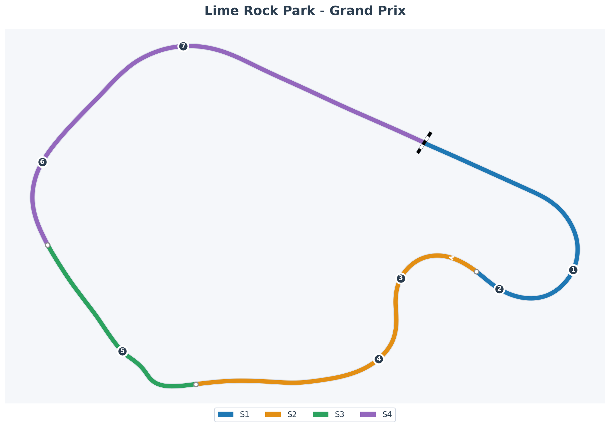

# Lime Rock Park – The Bullring

**Character**: High-Commitment Momentum Gym

## Background

Lime Rock Park is a deceptive little beast. On paper, it looks simple: 1.5 miles, 7 corners, mostly right-handers. In reality, it is one of the most intense, high-commitment tracks in North America. There are no "rest" zones here. The straights are short, the corners are fast, and the walls are close. It is often described as a "Bullring" for road racers—short, loud, and requiring constant aggression.

Uniquely, it has no long braking zones. This means passing is difficult and usually requires forcing an error or executing a brave move into Big Bend. For the FF1600, this track is a momentum test. Scrub too much speed in Big Bend or the Uphill, and you will be punished all the way to the next corner.

## Track Map

## Corner Reference

| Turn      | Name                       | Notes                                                          |
| :-------- | :------------------------- | :------------------------------------------------------------- |
| **T1-T2** | Big Bend                   | Long double-apex right. Momentum critical.                     |
| **T3-T4** | The Esses                  | Left-Right complex. Precision required.                        |
| **T5**    | The Uphill                 | Fast right with a crest. "The Launchpad".                      |
| **T6**    | West Bend                  | Fast right. Setting up the back section.                       |
| **T7**    | The Downhill (Diving Turn) | Fast right leading to main straight. Exit speed is everything. |

## Sector Definitions (iRacing)

| Sector | Approx Time  | Corners                              | Key Challenge                        |
| ------ | ------------ | ------------------------------------ | ------------------------------------ |
| **S1** | ~14s (24%)   | Start/Finish → Big Bend (T1-T2)      | Brake timing & momentum preservation |
| **S2** | ~14.5s (25%) | The Esses (T3-T4) → No Name Straight | Precision & exit speed               |
| **S3** | ~9s (15%)    | The Uphill (T5)                      | Car placement & bravery (crest!)     |
| **S4** | ~20s (36%)   | West Bend (T6) → Diving Turn (T7)    | Flow & setup for the main straight   |

> **Note:** S1 (Big Bend) sets the tone. S3 (Uphill) requires trust. S4 (Downhill/Diving Turn) defines your top speed.

## Character Notes

- **The Rhythm**: Lime Rock has a heartbeat. It's fast-fast-fast. There is no "stop-and-go" rhythm here.
- **The Crests**: The Uphill is famous for launching cars. In the FF1600, you might not catch air, but the suspension unloads significantly.
- **The "No Name" Straight**: It has no name, but it determines if you can attack into the Uphill.
- **Right-Hand Bias**: It's almost entirely right turns. Left-side tires will cool down; right-side tires will scream.

## Ray FF1600 at Lime Rock

- **Momentum is King**: With low horsepower, every km/h scrubbed in Big Bend is lost forever.
- **Big Bend Strategy**: It's a double-apex (or late apex) corner. Don't rush the entry. Let the car roll.
- **The Uphill**: In the Ray, you can often take more speed than you think. Trust the downforce (what little there is) and the mechanical grip.
- **The Downhill (Diving Turn)**: Crucial for the run to the line. A poor exit here costs you time for the entire length of the Sam Posey Straight.

## Practice Cues for the Week

1.  **T1 "Stab & Steer"**: Stop dragging the brake in Big Bend. Brake later, brake shorter (quick scrub), and get back on 10-20% throttle immediately to settle the rear. No coasting!
2.  **T3 Precision (The Esses)**: "Hug the Left." You are missing the T3 apex and sawing the wheel. Sacrifice entry speed to paint the left curb. This sets up T4 and the No Name Straight. One smooth steering input only.
3.  **T5 "Trust the Compression"**: NO BRAKES at the Uphill entry. You are panic-braking (80%) where you should be flying. Lift only, turn in, and let the hill scrub the speed. Power up before the crest. The compression gives you super-grip—use it!
4.  **T6 "Brush & Go"**: West Bend is a momentum corner, not a stopping corner. Drive deeper, brush the brake (max 10% pressure just to shift weight), and get back on power. You are braking 25% and killing the run to the Downhill.
5.  **T7 "Exit is Everything"**: The Downhill sets up the main straight. Sacrifice entry to be 100% throttle BEFORE the compression apex. Look at the Start/Finish line, not the exit curb. Your late throttle is costing 8 km/h down the straight.

## Personal Notes

> _"It's not a crash, it's just aggressive landscaping."_

### Week 04 – January 2026 (Season 01)

**First Discovery:** "The Tale of Two Halves." I am slow in the easy bits (Big Bend) and fast in the scary bits (Uphill).

**The Feel:** Frantic. 12 incidents in the baseline session. The car feels unsettled over the crests.

**Specific Challenge:** **Big Bend (T1)**. I am over-slowing and killing momentum. Losing -14.5 km/h on the main straight due to poor T7 exit.

**The Breakthrough:** (Pending - Need to fix T7 Exit and T1 Entry).

### Overtaking

- **Big Bend (T1) Inside**: The classic spot. Requires a good run out of the Downhill.
- **The Uphill (T5)**: Only for the brave. Not recommended in Rookies.
- **West Bend**: Possible if the car ahead makes a mistake in the Uphill.

> _"You have the bravery (fast in the scary bits). You lack the discipline (slow in the easy bits)."_ — Little Wan
