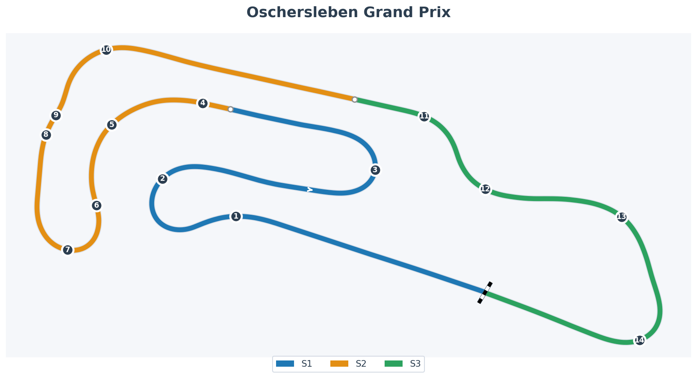

# Motorsport Arena Oschersleben – Precision on the Plain

When Motorsport Arena Oschersleben opened in 1997, it was Germany’s first purpose-built permanent circuit since the Nürburgring/Hockenheim era, planted out on the flat Magdeburg plain with big grandstands and short walks between fan zones.<a href="https://en.wikipedia.org/wiki/Motorsport_Arena_Oschersleben">Motorsport Arena Oschersleben — Wikipedia</a> DTM, FIA GT and WTCC all moved in quickly, and the place developed a reputation: if there was going to be a touring car pile-up, chances were good it was happening at Turn 1.

The layout looks straightforward: no wild elevation changes, no Spa-style compressions. But the devil here is in the way slow 1st/2nd-gear corners bookend long, loaded sequences, and in the infamous McDonald’s chicane—short, sharp and edged with curbs that have ended more race weekends than any single German sausage. It’s a track where John Cleland’s famous “who designed this in a dark room?” rant about Turn 1 still feels painfully accurate to anyone who’s been tagged under braking.<a href="https://en.wikipedia.org/wiki/Motorsport_Arena_Oschersleben#The_circuit">Motorsport Arena Oschersleben — The circuit</a>

---

## Track Map

---

## Sector Definitions (iRacing)

| Sector | Approx Time | % of Lap | Corners                      | Key Challenge                          |
| :----- | :---------- | :------- | :--------------------------- | :------------------------------------- |
| **S1** | ~34.5s      | 36%      | T1-T3 (Hotel → Hasseroeder)  | Heavy braking into T1, technical flow  |
| **S2** | ~32.9s      | 36%      | T4-T10 (Triple → McDonald's) | Chicane precision, exit speed          |
| **S3** | ~26.4s      | 28%      | T11-T14 (Shell → Zeppelin)   | Fast flowing rhythm, final corner exit |

> **Note:** S1 contains the chaos magnet (T1 Hotel). Make it boring on purpose. S2 has the signature McDonald's chicane—boring tidy = fast.

---

## Corner Reference (14-Turn Layout)

| #      | Track % | Name           | Notes                                              |
| :----- | :------ | :------------- | :------------------------------------------------- |
| **1**  | 10-14%  | Hotel Entry    | Chaos magnet. Heavy braking on curved approach. 🔥 |
| **2**  | 15-21%  | Hotel Exit     | Rotation point, sets up run to T3                  |
| **3**  | 25-32%  | Hasseroeder    | Second corner complex                              |
| **4**  | 36-40%  | Triple 1       | First of three-corner complex                      |
| **5**  | 41-44%  | Triple 2       | Middle of complex, momentum critical               |
| **6**  | 45-48%  | Triple 3       | Exit of complex                                    |
| **7**  | 49-53%  | Hairpin        | Tight left, sets up chicane run                    |
| **8**  | 54-56%  | Schikane Entry | Lead-in to McDonald's                              |
| **9**  | 57-59%  | Schikane Exit  | Square it for T10                                  |
| **10** | 60-63%  | McDonald's     | THE signature corner. Square it.                   |
| **11** | 73-77%  | Shell Kurve    | Fast left, starts S3                               |
| **12** | 78-81%  | Amman Kurve    | Flow right                                         |
| **13** | 84-88%  | Bauer Kurve    | Tighter right                                      |
| **14** | 90-95%  | Zeppelin Kurve | Final corner onto straight 🔥                      |

---

## Character Notes

- **Flat but never simple** – With almost no elevation change, you don’t get the usual “gravity hints”. Every brake point, every rotation is about markers, curbs and memory, not feeling the car fall into a valley.
- **Hairpins + flows** – Hotel and the final corner are classic touring-car hairpins. Everything in between is surprisingly fluid: fast kinks, double-apex sweepers, and that chicane that forces you to think about how you _arrive_ and how you _leave_, not just how much curb you dare.
- **Turn 1 court case** – The opening right-hander is a magnet for chaos. Slightly kinked approach, heavy braking, cold tyres, and a pack all aiming for the same apex. Good Oschersleben drivers are the ones who make Turn 1 boring on purpose.
- **Reference-point circuit** – No trees on crests or dramatic skyline changes here. Your landmarks are brake boards, marshal posts, fencing and the way the painted curb begins or ends. It’s a circuit that rewards people who like the feeling of “I hit my mark” more than “I sent it”.

---

## Ray FF1600 at Oschersleben

In the Ray FF1600, Oschersleben turns into a **discipline exam**. You don't have the power to recover from sloppy exits, so all the little 2–3 km/h mistakes stack up.

**Setup Reference:**

- **Brake Bias**: 57% (coach baseline)

---

## Coaching Notes EXPERT (1:31.295)

> _Corner-by-corner breakdown from coach. The golden rule: "It's not about how MUCH you slow down, it's about HOW you get to minimum speed."_

### T1-T2: Hotel Complex ⚠️ CRITICAL

**The longest braking zone of the entire lap (5-6 seconds!).**

| Phase               | Action                                                                           |
| ------------------- | -------------------------------------------------------------------------------- |
| **Pre-brake**       | Turn FIRST, brake SECOND. Start turning 2-3 car lengths BEFORE the access road.  |
| **Initial brake**   | Just past access road end. Only 25-30% pressure! Don't overdo it.                |
| **T1 kink**         | Release to ~10% brake through the kink. Car stability is everything.             |
| **Gears**           | Stay in 4th gear! NO downshifts until between T1 and T2.                         |
| **Stability trick** | Overlap throttle with brakes, especially during downshifts. Plants the rear.     |
| **T2 entry**        | Downshift to 1st by T2 apex. A tight entry is FINE—it naturally pushes you wide. |
| **Sweet spot**      | Get within 0.5m of the pit exit button light between T2 apexes.                  |
| **Throttle**        | 100% throttle exactly halfway between T2 apexes.                                 |
| **Exit**            | DON'T touch inside curb (wheel spin). Light steering = better acceleration.      |

> **Master Lonn's Problem:** You're braking too hard too early. Reserve the BULK of braking for the straighter section between T1 and T2. Slow and gradual = optimal. Quick decel = losing lap time.

---

### T3: Hasseroeder

| Element          | Note                                                                    |
| ---------------- | ----------------------------------------------------------------------- |
| **Brake point**  | Full car length PAST the tiled gutter on outside                        |
| **Turn-in**      | Early! As soon as grass ends. Get to the banking ASAP.                  |
| **Banking trap** | Front grips up more than rear = snap oversteer risk. Light trail brake! |
| **Gears**        | One downshift to 2nd                                                    |
| **Apex**         | VERY late—near end of red/white curb                                    |
| **Throttle**     | Full throttle BEFORE apex                                               |
| **Curb**         | Don't touch it (wheel spin + pushes wide)                               |

---

### T4-5-6: Triple Complex

| Element        | Note                                                       |
| -------------- | ---------------------------------------------------------- |
| **T4 entry**   | Stay flat! Miss first apex by ~0.5m to set up perfect line |
| **Lift point** | Back off at start of green paint inside                    |
| **Gears**      | Down to 3rd—NO brakes needed, just coast                   |
| **Rotation**   | Coasting + downshift gives enough rotation                 |
| **Throttle**   | Smooth reapply before T5 apex, 100% well before T6         |
| **Curbs**      | Fully mount T5 and T6 curbs, avoid red sausage             |

---

### T7: Hairpin

| Element         | Note                                                                               |
| --------------- | ---------------------------------------------------------------------------------- |
| **Brake point** | Just past the previous corner's apex curb—EARLY! Easy to outbrake.                 |
| **Approach**    | Perfectly straight line down to apex                                               |
| **Gears**       | One downshift to 2nd                                                               |
| **THE TRICK**   | Banking is on INSIDE half. Stay within 1.5m of white line! (Tighter than expected) |
| **Throttle**    | Halfway between apexes                                                             |
| **Apex**        | Where curb ends / green begins                                                     |
| **Exit**        | Use lots of runoff                                                                 |

---

### T8-T9: Chicane (Setup for T10!)

| Element              | Note                                                                                                                                       |
| -------------------- | ------------------------------------------------------------------------------------------------------------------------------------------ |
| **T8**               | Stay FLAT, use all curb, avoid red sausage                                                                                                 |
| **Direction change** | Gradually lift through it (DON'T stay flat—compromises T10)                                                                                |
| **T9 cut**           | Maximum cut without touching bollards (off-track / suspension damage)                                                                      |
| **⚠️ CRITICAL**      | Keep SOME throttle at T9 apex! Dip causes rotation + bottoming if off-throttle. Off-throttle = car wants to turn LEFT when you need RIGHT. |

---

### T10: McDonald's ⚠️ CRITICAL

**One of the most important corners of the lap!**

| Element         | Note                                                                               |
| --------------- | ---------------------------------------------------------------------------------- |
| **Turn-in**     | EARLY—car feels sluggish through direction change. Anticipate understeer.          |
| **Braking**     | Very light brush. Only enough to rotate, then release. Coasting is OK.             |
| **Apex**        | Fully mount the curb                                                               |
| **⚠️ Throttle** | BE PATIENT! Don't focus on where you START throttle—focus on where you reach 100%. |
| **Trap**        | Throttle too early = massive exit understeer                                       |
| **Exit**        | Use ALL runoff (close to dirt edge)                                                |

---

### T11-T12: Shell/Amman Chicane

| Element           | Note                                                                |
| ----------------- | ------------------------------------------------------------------- |
| **Brake point**   | At rubber marks (or halfway between 100m board and overhead gantry) |
| **Initial brake** | Straight line, but turn in EARLY to carry momentum                  |
| **Gears**         | One downshift to 3rd                                                |
| **Line between**  | Stay within 1 car width of outside white line (don't go too left!)  |
| **T12 throttle**  | 100% at or before apex                                              |
| **Track limits**  | Outer edge of curb is limit—can push wider than you think           |

---

### T13: Bauer Kurve

| Element      | Note                                         |
| ------------ | -------------------------------------------- |
| **Turn-in**  | BEFORE any braking—very early                |
| **Braking**  | Light brush only, stay in 3rd (no downshift) |
| **Curb**     | Use it, avoid anti-cut                       |
| **Throttle** | 100% at or before apex                       |
| **Exit**     | Lots of runoff available                     |

---

### T14: Zeppelin (Final Corner)

| Element         | Note                                                       |
| --------------- | ---------------------------------------------------------- |
| **Approach**    | Stay wide, but not fully on green paint                    |
| **Brake point** | ~1 car length before first safety car light (pit entrance) |
| **Gears**       | One downshift to 2nd                                       |
| **⚠️ Turn-in**  | DON'T RUSH! Turn LATE to exaggerate late apex.             |
| **Apex**        | Very late—near end of red anti-cut curb                    |
| **Why late?**   | Straighter exit = less understeer + less wheel spin        |
| **Curb**        | Don't fully mount (wheel spin trap)                        |
| **Exit**        | Use curb, but not all the way to gravel (tire scrub)       |

---

## Quick Reference Card

| Corner | Gear | Key Point                                                              |
| ------ | ---- | ---------------------------------------------------------------------- |
| T1-T2  | 4→1  | Turn BEFORE brake. 25-30% initial. Reserve braking for T1-T2 straight. |
| T3     | 2    | Early turn-in for banking. Late apex.                                  |
| T4-6   | 3    | Miss T4 by 0.5m. Coast, no brakes. Mount T5-T6 curbs.                  |
| T7     | 2    | Tighter than expected! Stay within 1.5m of inside.                     |
| T8-9   | 3    | Lift for T10 setup. KEEP throttle at T9 dip!                           |
| T10    | 2    | Early turn-in. PATIENT throttle. All runoff.                           |
| T11-12 | 3    | Early turn-in. Stay right between corners.                             |
| T13    | 3    | Turn before brake. 100% at apex.                                       |
| T14    | 2    | LATE turn-in. LATE apex. Don't mount curb fully.                       |

---

## Practice Cues for the Week

Let Oschersleben be your **“hit the same mark ten times”** track.

- **Chicane accuracy drill**  
  Run a session where your only goal is to drive the McDonald’s chicane the same way ten laps in a row. Forget lap time. Focus on: same brake marker, same line across the first curb, same steering release before the second. Any “hero curb” attempt that sends you wide counts as a mental penalty.

- **Turn 1 survival script**  
  In race practice (AI or officials), give yourself a Turn 1 rule: no lunges from more than one car length back. Instead, practice lifting a fraction earlier, straightening the car, and aiming for a later apex that leaves you room to either cut back or simply drive off the corner while others are still sorting themselves out.

- **Long runs for rhythm**  
  Do at least one longer stint (20+ minutes) in race fuel. Pay attention to how your braking references shift as tyres and fuel change, and how your mind wanders once the layout feels “solved”. Oschersleben is where loss of focus shows up as “just a bit deep” into a hairpin rather than a dramatic off—those are the habits you want to catch.

If you can make Oschersleben feel clinically precise rather than stressful, the Ray starts to reward you with that smug touring-car satisfaction: you didn’t do one spectacular thing, you just did fifty small things right in a row.

---

## Personal Notes

> _Track evolution and learnings. Worth revisiting next time I'm here._

### Week 05 – January 2026 (Season 01)

**First Discovery:** GR86 muscle memory from S4 2025 provided instant layout familiarity. Knew WHERE corners were within a few laps. But the FF1600 brakes and rotates completely differently.

**The Feel:** Flat. No elevation hints. Every brake point is pure marker discipline. The track rewards "I hit my mark" more than "I sent it".

**T1 (Hotel) Entry:** Baseline showed -17 km/h loss vs Gong at T1 entry. Braking ~50m earlier than alien. GR86 instincts say brake early; FF1600 says brake late. This is Problem Child #1.

**The Telemetry Truth:** Max lateral G is identical to Gong (2.28G vs 2.27G). The gap isn't cornering ability—it's deployment. Brake later, throttle earlier, trust the car.

**Key Numbers (Baseline):**

- Best Lap: 1:33.818 (Gap to Gong: 2.422s)
- Braking % of lap: 17.6% (Gong: 14.5%) → braking 3.1% MORE
- Full throttle %: 62.7% (Gong: 67.4%) → 4.7% LESS time on power
- Gap to theoretical optimal: 0.037s (sectors not synced yet)

**Focus Areas Identified:**

1. T1 Hotel entry - brake later (50m to find)
2. Zeppelin entry - less brake pressure, more roll speed
3. General - get on throttle earlier everywhere

> _"The GR86 muscle memory is telling you to brake early. The FF1600 is begging you to brake late."_

---

## References

- [Motorsport Arena Oschersleben — Wikipedia](https://en.wikipedia.org/wiki/Motorsport_Arena_Oschersleben)
- [Motorsport Arena Oschersleben — iRacing.com](https://www.iracing.com/tracks/motorsport-arena-oschersleben/)
