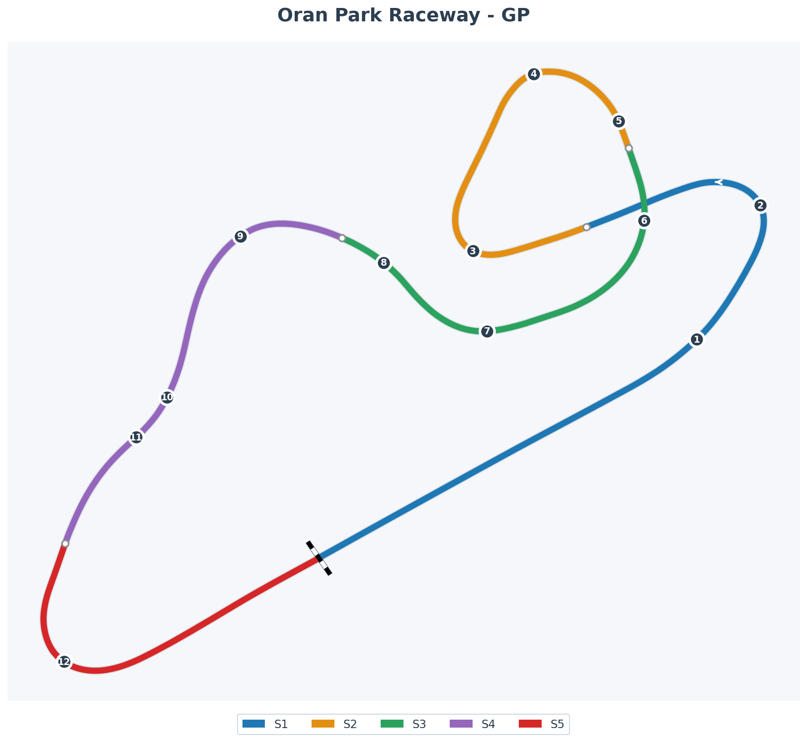

# Oran Park Raceway – Suburban Fever Dream

Oran Park was Sydney's suburban coliseum: carved out of Dan Cleary's farmland in 1962, slowly expanded with extra loops, and crowned in the 1970s with that wonderfully odd figure-eight bridge.<a href="https://en.wikipedia.org/wiki/Oran_Park_Raceway">Oran Park Raceway — Wikipedia</a> By the time the bulldozers came for housing in 2010, it had seen Tasman Series heroes, thundering Formula 5000s, two Australian Grands Prix, endless touring-car wars and the final fireworks of the V8 Supercars Championship.

Fans loved it because you could see almost everything from one grassy bank: cars diving off the front straight into Pits Bend, threading back under and over the bridge, and arcing through Suttons while cockatoos complained overhead. It felt more backyard festival than corporate motorsport.

The Grand Prix loop was a kind of low-rise rollercoaster: not much raw elevation, but constant camber tricks, bumps and direction changes. Pits Bend dropped away just as you wanted to brake, Coca-Cola corner pinched tighter than it looked, the run to the bridge was a rhythm test, and crossing over your own previous braking line at full chat never stopped feeling slightly surreal. The final double-apex at Suttons was all or nothing: nail the inner ripple strip and the car fired onto the short straight; miss your line and you'd bog down before the start/finish kink.

_S4 2025 Rookies on Oran Park by MidfieldRacing219_

---

## Track Map

### Corner Reference (12 Turns)

| #   | Name                 | Apex % | Notes                                   |
| --- | -------------------- | ------ | --------------------------------------- |
| 1   | The Sweeper          | 17%    | Fast right-hander entry to infield      |
| 2   | Coca-Cola Corner     | 23%    | Tight right, pinches on exit            |
| 3   | Shell Corner         | 35%    | Left-hander, entry to technical section |
| 4   | Champion Curve Entry | 43%    | Blind entry, climbing                   |
| 5   | Champion Curve Exit  | 47%    | Tightening radius, downhill             |
| 6   | Yokohama Bridge      | 51%    | Over the bridge, figure-8 crossing      |
| 7   | Foster's Dip Entry   | 59%    | Compression through the dip             |
| 8   | Foster's Dip Exit    | 64%    | Exit onto back section                  |
| 9   | Momo Corner          | 70%    | Fast left-hander                        |
| 10  | O'Brien Entry        | 77%    | Quick right into dogleg                 |
| 11  | O'Brien Dogleg       | 79%    | Quick left, flat-out in FF1600          |
| 12  | Recaro Corner        | 89%    | Final corner onto main straight         |

---

## Character Notes

- **Figure-eight weirdness** – There aren't many circuits where you literally drive over your own approach line. That bridge makes Oran Park feel like a grown-up kart track that someone dropped into suburbia.
- **Bumps with stories** – Decades of patching left little quirks in braking zones and corner entries. Local knowledge was a competitive advantage: "avoid the shiny tar at X, commit hard at Y."
- **No real straights, just chances to breathe** – With only short chutes between corners, there's nowhere to hide bad exits. Every missed apex shows up in the next two sectors.
- **Crowd energy baked in** – The compact layout meant the crowd was always close. In your head, every off at Castrol or Suttons happens in front of _everyone_.

---

## Ray FF1600 at Oran Park (EXPERT Technique Guide)

For the Ray FF1600, Oran Park is basically fan-service. It's a **momentum playground** where bravery is less important than staying light on your hands and honest with your exits.

---

### T1-T2: The Sweeper to Coca-Cola (THE KEY ZONE)

**The Problem**: This braking zone is tricky because it's curved. Make it straighter.

**T1 (The Sweeper)**:
- Turn in at **end of pit wall** (painted green)
- **GRADUAL throttle lift** halfway to T1 apex — NOT braking, NOT abrupt!
- Abrupt lift = unsettled rear = oversteer
- The lift rotates the car before T1, making the T2 brake zone straighter

**T2 (Coca-Cola Corner)**:
- Point car outwards as you brake — use concrete strip for extra width
- **Turn in EARLY** — low-speed, long-duration corner. Distance > speed.
- **Double-apex** corner — hit both apexes
- Trail brake aggressively all the way to apex
- **Can overlap throttle with brakes** to stabilize rear on downshifts
- Full throttle by second apex, use exit curb

---

### T3: Shell Corner (Hairpin)

- Brake at **car length past concrete strip** start
- Keep it on pavement (concrete = grip loss = lockup)
- **Turn in early** (cuts distance)
- Downshift to **1st gear**
- Use only lower half of apex curb
- Full throttle just past apex

---

### T4-T5: Champion Curve (THE TRAP)

⚠️ **Warning**: Massive **DIP** between turn-in and apex causes snap oversteer!

1. Brake ~2 car lengths before green tire stack
2. Turn in simultaneously (early turn-in)
3. **BE LIGHT with steering through the dip** — snap oversteer zone!
4. Once past dip → massive compression at apex = tons of grip
5. NOW you can add aggressive steering (rear is planted)
6. Stay in **2nd gear** (no downshift)
7. Full throttle just past apex
8. **White line is your limit** — don't use full track width

---

### T6: Yokohama Bridge (Blind Corner)

- Turn in **4-5 car lengths before bridge**
- Stay **FLAT** deep into corner
- Lift throttle as you reach the bridge
- Back to full throttle BY the apex
- **GO UP TO 3RD GEAR** before corner — more stable, less understeer
- Use thin concrete strip on exit

---

### T7-T8: Foster's Dip (Chicane)

- Brake ~2 car lengths before red/yellow painted curb
- **Only ~20% brake pressure** — very light!
- Brake and turn in simultaneously
- Leave margin from inside curb (bottoms out)
- Full throttle past T7 apex
- **Stay flat through T8**

---

### T9: Momo Corner (Compression Corner)

- Brake late — just before entry curb
- Light brake pressure (compression + uphill slows you)
- **Stay in 3RD GEAR** — more stable
- Apex on white rumble strip only (concrete = bottoming out)
- **Gradual throttle** — track drops away and goes off-camber

---

### T10-T11: O'Brien Dogleg (Flat Out)

- Bring car to **middle of road** before T10
- **100% throttle** through both corners
- T11 is blind — **turn when T10 curb ends**

---

### T12: Recaro Corner (Compression + Oversteer Trap)

- Brake late — **3-4 car lengths before the dip**
- Turn at compression apex (bottom of dip)
- ⚠️ **DANGER**: Too much front grip = OVERSTEER
- **Feed steering in SLOWLY** — rear snaps if aggressive
- Downshift to **2nd gear**
- Apex where **rubber marks begin**
- **Gradual throttle** — easy wheel spin

---

## Practice Cues for the Week

Use Oran Park as your **"old-school flow" lab**.

- **20-lap rhythm runs**  
  Open the week with longer stints where you don't chase lap time at all. Focus on keeping the same rhythm from Pits Bend through Coca-Cola to the bridge: braking at the same points, turning with the same steering rate, and noticing when you start to rush.

- **Bridge & Suttons focus**  
  Dedicate one session purely to the bridge sequence and the final corner. Your goal: arrive calm, leave fast. If you can exit Suttons with the same gear, same revs and same steering angle five laps in a row, you're ahead of most of the split.

- **Traffic rehearsal**  
  Oran Park gets tight fast. Run AI or ghost races where you practice making passes only on the run into Suttons or out of Coca-Cola, never with desperation moves mid-bridge. That trains you to think a couple of corners ahead in a car that really cannot afford divebomb repairs.

Drive it right in the Ray, and Oran Park feels like a slightly chaotic backyard party you've somehow been invited to headline: short, intense, a bit rowdy—and over way too soon.

---

## References

- [Oran Park Raceway — Wikipedia](https://en.wikipedia.org/wiki/Oran_Park_Raceway)
- [Oran Park Raceway — iRacing.com](https://www.iracing.com/tracks/oran-park-raceway/)
