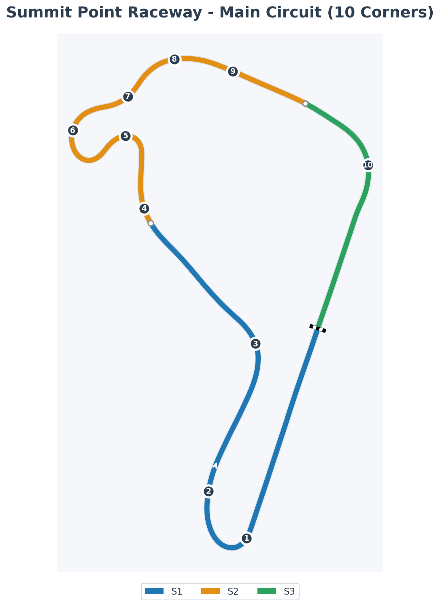

# Summit Point Raceway – Main Circuit, Main Character

Summit Point’s Main Circuit is the original heartbeat of the complex. Pat Goodman cut the 2.0-mile layout out of farmland in 1969 as a home for SCCA club racing and federal driver training, back when there was no Jefferson, no Shenandoah—just one fast, simple loop through the trees.<a href="https://en.wikipedia.org/wiki/Summit_Point_Motorsports_Park">Summit Point Motorsports Park — Wikipedia</a>

In the early ’70s the Carousel complex was grafted on, turning the original eight-turn layout into the flowing 10-corner lap we know now. IMSA GT, Can-Am and Trans-Am all thundered around here; these days the Jefferson 500 and other vintage events keep that old-school club-racing vibe alive, with cars threading the same guardrail-lined ribbons that their predecessors did decades ago.

Main looks modest on the map. In the car, it’s more serious: downhill braking zones, commitment kinks and a mid-lap Carousel that quietly asks “do you actually trust your own trail-braking?”

---

## Track Map

**Layout**: 3.2km (2.0 miles), **10 corners**, 3 sectors

**Complete Corner Guide:**
1. **Turn 1** @ 16.5% lap - Right-hander after start/finish
2. **Turn 2** @ 23% lap - Second right, continuing the complex
3. **Turn 3 "Wagon Bend"** @ 35% lap - Medium-speed right-hander
4. **Turn 4 "The Chute"** @ 48% lap - Fast commitment kink before Carousel
5. **Turn 5 "The Carousel" (Entry)** @ 54% lap - First apex of the long sweeper
6. **Turn 6 "The Carousel" (Exit)** @ 60% lap - Second apex, technical gatekeeper
7. **Turn 7 "The Esses" (Entry)** @ 65% lap - First part of flowing S-curves
8. **Turn 8 "The Esses" (Middle)** @ 70% lap - Middle section
9. **Turn 9 "The Esses Exit / The Bridge"** @ 75% lap - Final Esses section
10. **Turn 10 "The Paddock"** @ 87% lap - Final corner, downhill braking zone

**Sector Splits:**
- **S1 ends** @ 46.7% lap (just before The Chute)
- **S2 ends** @ 80.4% lap (after The Esses, before The Paddock)
- **S3** = Final sector onto main straight

---

## Character Notes

- **Old-school club racer** – Trees, guardrails, modest runoff. No endless tarmac lakes here—if you miss your mark, you _feel_ it.
- **Deceptively quick** – The corners are mostly medium-speed and the straights aren’t huge, but the way T1, T2, and the Esses link together means your average lap speed is higher than you expect.
- **Carousel as gatekeeper** – The double-apex left is the lap’s personality test. Attack it like two separate corners and it’ll feel awkward; treat it as one long shape and the whole middle sector unlocks.
- **“Locals lap” energy** – Main has that grassroots atmosphere: it feels like a place where people learn to race, crash, rebuild and come back, not just a backdrop for TV.

---

## Ray FF1600 at Summit Main

In the Ray FF1600, Summit Point Main is a **momentum track with teeth**. There’s enough speed to hurt you if you’re lazy, and enough flow to feel brilliant when you get it right.

- **Turn 1 + Turn 2**  
  You arrive downhill into T1, which tightens more than your first walk-around suggests. In the Ray, a controlled brush of brake and an early, assertive turn-in in third or fourth (depending on gearing choice) works better than a big, late stop. Aim for a late apex and be ready to let the car run out to the exit curb. T2 is essentially a flat-out kink when you’ve done T1 properly; if you’re lifting hard in T2, you probably compromised the previous corner.

- **Turn 3–4–5 to Carousel entry**  
  This sequence is about setting tone for the Carousel, not about heroics. Use T3 and T4 to get the Ray stable and pointed; a small lift and a patient line are faster than trying to “win” time here. You want to arrive at the Carousel entry with a calm platform and your eyes already looking into the first apex, not still fixing the car.

- **Carousel (T6/T7)**  
  The heart of the lap. In the Ray, drop into third, brake in a straight line, then ease off the pedal as you guide the nose to the first apex. From there, think “long, tightening arc” rather than “turn, straighten, turn again.” A whisper of throttle mid-corner keeps the rear planted, then you let the car drift out before bending back towards the second apex. If you find yourself adding steering lock near the second apex, you either turned in too early or came in too fast.

- **The Esses**  
  Once you exit the Carousel well, the Esses feel like a reward. In the FF1600 they’re almost flat with a confident line. The key is a single, smooth steering input and tiny throttle breaths. Any sawing at the wheel turns them from “free time” into an opportunity to scrub speed and get unsettled before Turn 10.

- **Turn 10 and front straight**  
  T10 is the big stop at the end of the lap. The approach is slightly downhill, and the corner tightens more than your first instinct admits. In the Ray, brake in a straight line, get most of your speed off early, and then trail just enough to help the car rotate. Second gear is your friend here, but the real time is in the exit: you want to be freeing the car and feeding throttle as soon as you pass the apex, letting it run out to the exit curb to maximise speed onto the front straight.

- **Brake bias behaviour**  
  Early in the week, a slightly front-leaning bias—around the low-50s—helps keep the rear happy into T1 and T10. As you get more comfortable with your references and load transfer, easing the bias back a notch gives you more rotation into the Carousel and T10, without making the car too sketchy into the downhill zones.

---

## Practice Cues for the Week

Use Summit Main as your **“carousel & commitments”** lab in the Ray.

- **T1–T2 entry discipline**  
  Start with stints where your sole focus is T1 and T2. Work on braking the same amount at the same marker each lap, and see how early you can get back to throttle in T1 without needing a correction. When T2 becomes comfortably flat or near-flat, you know the front of the lap is coming together.

- **Carousel-only mindsets**  
  Run sessions where you mentally declare the Carousel “the only corner that matters.” Enter at 90% pace and experiment with different brake-release shapes and throttle pick-up points. Notice which laps give you a calm exit and strong drive to the Esses, and which ones leave you adjusting mid-corner.

- **Esses into T10 racecraft**  
  In longer runs with AI or online fields, treat the Esses as your setup tool and Turn 10 as your main passing zone. Focus on exits out of the Carousel and through the Esses that put you in position to either defend the inside into T10 or launch a clean, early move under braking. Avoid last-second dives; Summit will happily punish those with shared trips into the grass.

Get Summit Main right in the Ray, and it feels like you’ve been allowed into a slightly scruffy but very real club where everyone learns the same lessons: respect the downhill, don’t cheat the Carousel, and let the car flow more than your fear thinks is reasonable.

---

## EXPERT Coach Lap Guide - Corner-by-Corner Breakdown

*Expert-level analysis from EXPERT coaching, mapped to our 10-corner system.*

### Turn 1 (16.5% lap) - Opening Right-Hander

**Key Points:**
- Brake VERY late and deep into the corner (halfway between 3 cones and 2 cones)
- Late turn-in to justify the late braking
- **Geometric brake release** - slow, gradual to keep weight on nose for rotation
- Downshift: 3 total (down to 1st gear)
- Apex: Touch the white line (avoid curb)
- Exit: NEVER use more than half track width (scrubs speed + covers more distance)
- Back to 100% throttle at apex

**The Why:** How late you brake shapes the entire corner. Brake too early = apex early = run wide. Brake late = apex late = tight exit line.

---

### Turn 2 (23% lap) - Second Right

*EXPERT guide treats T1-T2 as one complex. See T1 notes above.*

---

### Turn 3 "Wagon Bend" (35% lap) - High-Speed Commitment Corner

**Key Points:**
- Start braking gently at start of grass on outside
- Downshift once to 3rd - **DON'T downshift immediately** (wait a second for stability)
- Already at 100% throttle AT the apex (sometimes 1-2 car lengths BEFORE!)
- **Trust the grip** - uphill at apex = plenty of grip available
- Avoid inside curb (aim for white line only)
- Use all exit curbing (avoid gravel trap)

**The Why:** Track goes uphill through and after the corner. More grip than you think. Be aggressive with throttle - there's lap time here.

---

### Turn 4 "The Chute" (48% lap) - Setup Corner for Carousel

**Key Points:**
- This is a SETUP corner for T5 braking zone (not the main event)
- Keep car far RIGHT on exit (don't use full track width)
- Partial throttle lift only (40-50% max)
- Apex late to stay right
- Don't touch curb
- Briefly reach full throttle before T5 braking

**The Why:** You COULD go flat, but you sacrifice it to set up proper positioning for the critical Carousel entry.

---

### Turn 5 "The Carousel Entry" (54% lap) - THE OVERSTEERING CORNER ⚠️

**CRITICAL INSIGHTS:**

**Key Points:**
- Start braking near middle of road, point car OUT as you decelerate (get within 1m of white line)
- Downshift to 1st gear - **DELAY the final downshift!**
- Low grip + banking = front has WAY more grip than rear = snappy oversteer
- **NO TRAIL BRAKING** - break the muscle memory! Just COAST to throttle application
- Throttle application: Just before apex (not AT apex like usual)
- Apex: Late, stay off curb
- Exit: **Use only HALF track width** (sacrifice to get left for T6)

**The Why:** This is the most oversteering corner of the lap. Banking + low grip + aggressive downshifts = rear unloading. If you trail brake (normal habit), you'll get tons of snappy oversteer. Coast instead.

**EXPERT Quote:** *"If you just insist on trailing the brakes for the sake of doing it, you're gonna place too much weight over the front end of the car and you're gonna unload the rears excessively, and that's just gonna give you a ton of very snappy oversteer."*

---

### Turn 6 "The Carousel Exit" (60% lap) - SETS UP LONGEST ACCEL 🔑

**CRITICAL INSIGHTS:**

**Key Points:**
- Turn in just before gap between two tire stacks
- Very gentle brake brush as you reach the gap
- Keep car in 1st gear (don't upshift between T5-T6)
- **Carry GOOD momentum** into T6 (don't slow too much)
- Don't touch inside curb
- **Gradual and LATE throttle application** (on purpose!)
- Don't run wide on exit

**The Why:** T6 sets up the LONGEST stretch of acceleration of entire lap (flat through T7-T8-T9 to T10). If you slow too much on entry, you'll want to get on throttle too soon = understeer = offline for rest of sequence. Carry entry speed to justify later throttle = less understeer.

**EXPERT Quote:** *"This is one of the more important corners of the entire lap, believe it or not."*

---

### Turn 7-8-9 "The Esses" (65-75% lap) - Flat-Out Momentum Section

**Key Points:**
- All flat out (after first 1-2 laps when tires are up to temp)
- **Minimize tire scrub** and **minimize sliding** (these kill momentum)
- Be precise with lines
- **Avoid ALL apex curbs** if possible

**Line Details:**
- **T7:** Drive slightly past dotted white center line (all 4 wheels left of it), barely miss apex curb
- **T8:** Apex very late (as curb ends), stay far left for easier T10 approach
- **T9:** Stay on leftmost lane, anticipate turn-in (car reluctant to respond at high speed)
- Unwind wheel quickly, light grip on steering for smoothness

**The Why:** This is a LONG flat-out section setting up T10. Any scrub or sliding costs you momentum into the final corner and down the main straight.

---

### Turn 10 "The Paddock" (87% lap) - Final Corner, Unique Technique

**Key Points:**
- Brake and turn SIMULTANEOUSLY (1 car length before patchy grass section on outside)
- **Very early turn-in** (unusual!)
- Downshift once to 3rd - delay downshift for momentum, blip throttle for rear stability
- **Minimum speed is MORE important than typical** (car won't accelerate well on exit)
- Already at 100% throttle AT apex
- **Gradual throttle application** - not for traction, but to **minimize understeer**
- Use all exit curbing (avoid gravel trap)

**The Why:** High-speed 3rd gear corner = traction is easy, understeer is the problem. Focus on carrying high minimum speed (entry matters more than exit here) and gradual throttle to manage understeer, not wheelspin.

---

## Key EXPERT Themes for Ray FF1600 at Summit Point

### 1. **The Carousel (T5-T6) is THE Critical Section**
- T5 = most oversteering corner (requires special technique)
- T6 = sets up longest acceleration zone
- Get these right = entire back half of lap works

### 2. **Brake Release Philosophy Varies by Corner**
- T1: Geometric/gradual (for rotation)
- T3: Full throttle early (trust uphill grip)
- T5: NO trail braking (coast to avoid oversteer)
- T6: Gentle brush only (carry momentum)
- T10: Gradual for understeer management

### 3. **Downshifting Discipline**
- Don't downshift immediately when braking (wait for stability)
- T5 especially: DELAY final downshift to 1st
- T10: Blip throttle on downshift for rear stability

### 4. **Track Width Strategy**
- T1 exit: Max half width only
- T5 exit: Max half width only (need to get left for T6)
- T7-T10: Use as needed, but precision > width in Esses

### 5. **The "Anti-Muscle Memory" Corners**
- T5: DON'T trail brake (breaks normal habit)
- T10: Gradual throttle for understeer (not traction)

---

## References

- [Summit Point Motorsports Park — Wikipedia](https://en.wikipedia.org/wiki/Summit_Point_Motorsports_Park)
- [Summit Point Raceway — iRacing.com](https://www.iracing.com/tracks/summit-point-raceway/)
- [Summit Point Circuit — Main Circuit](https://summitpointmp.com/summit-point-circuit/)
