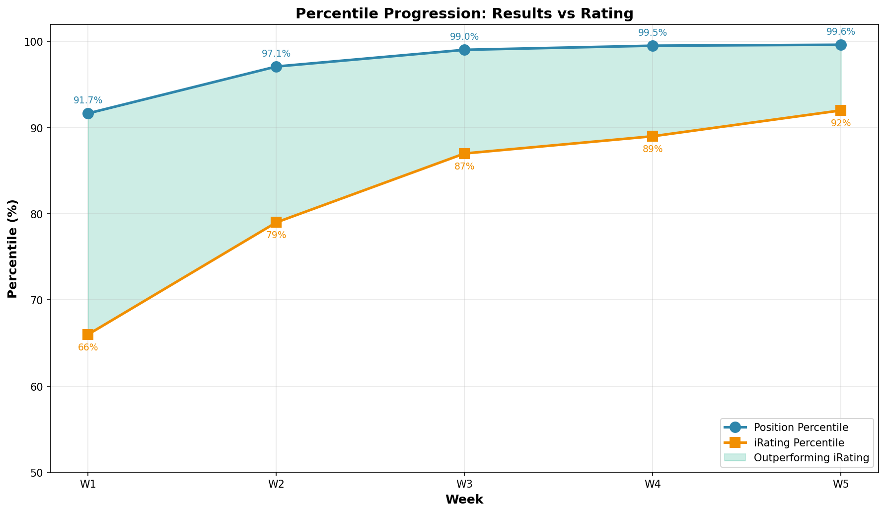

# Season Progression Report (Week 01 → Week 06)

**Generated:** 2026-01-21 09:30 (Updated with Week 06 final data)
**Weeks Analyzed:** 6

---

## 📈 Progression Summary

### iRating Journey

- **Starting iRating:** 1238 (Season 01 2026 start)
- **Current iRating:** 1703 (Week 06 final)
- **Total Gain:** +465 points
- **Average per Week:** +77.5 points

### Position Climb

- **Starting Position:** 749
- **Current Position:** 137
- **Positions Gained:** +612

### Percentile Rankings

Track your standing across multiple metrics week-over-week.

---

## 📊 Week-by-Week Breakdown

### Week 01

- **Position:** 749 / 8,977
- **iRating:** 1377
- **Points:** 80.0
- **Wins:** 1
- **Starts:** 2
- **Incidents/Race:** 3.50

### Week 02

- **Position:** 459 / 15,787
- **iRating:** 1455
- **Points:** 148.0
- **Wins:** 1
- **Starts:** 6
- **Incidents/Race:** 2.67

### Week 03

- **Position:** 209 / 21,567
- **iRating:** 1601
- **Points:** 235.0
- **Wins:** 2
- **Starts:** 8
- **Incidents/Race:** 2.00

### Week 04

- **Position:** 383 / 10,096
- **iRating:** 1672
- **Points:** 94.0
- **Wins:** 0
- **Starts:** 1
- **Incidents/Race:** 0.00

### Week 05

- **Position:** 137 / 30,481
- **iRating:** 1738
- **Points:** 397.0
- **Wins:** 2
- **Starts:** 11
- **Incidents/Race:** 1.91

### Week 06

- **Position:** TBD / ~30,000+
- **iRating:** 1703
- **Points:** 67.0 (championship points)
- **Wins:** 0
- **Starts:** 4 official races (+ 2 AI races)
- **Incidents/Race:** ~2.5

**Note:** Week 06 was about learning "Know When To Stop" - strategic racing over pure speed chasing. Championship points secured (67), iRating sacrificed (-35) for learning. The lesson was worth more than the rating.

---

**Note:** These visualizations help identify trends and patterns in your season progression. Use them to:
- Spot momentum shifts (accelerating or plateauing improvement)
- Identify metrics that need focus (lagging percentiles)
- Track consistency (smooth progression vs volatile swings)
- Set realistic goals based on your actual trajectory
