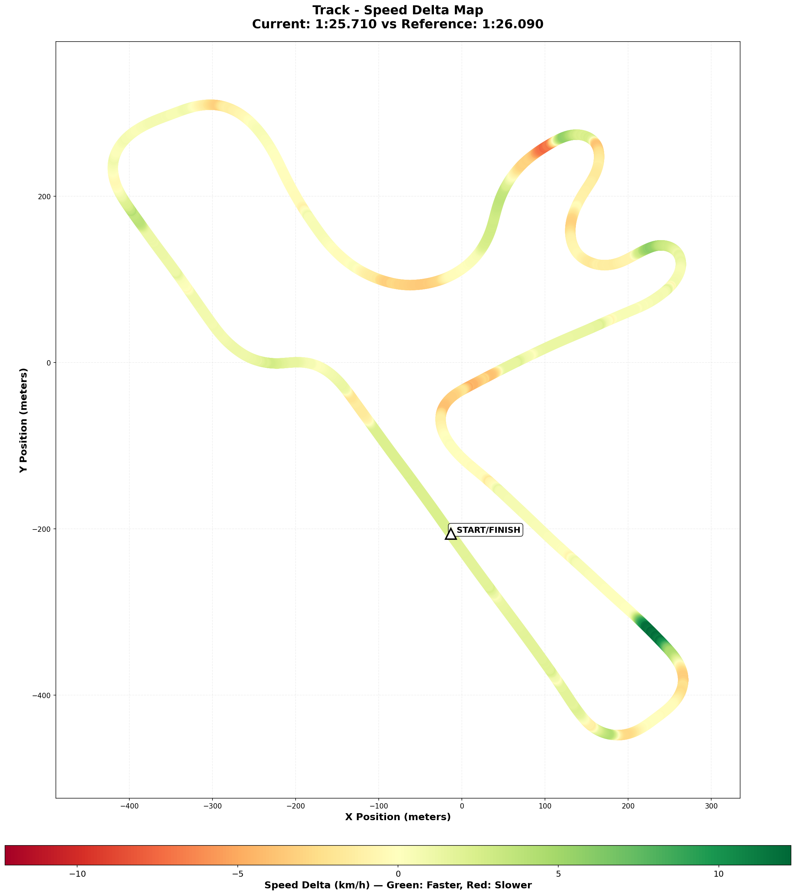

# 2025-12-28 - Winton Motor Raceway - The "Cold Tire Contract" Victory

- **Track**: [Winton Motor Raceway - National Circuit](../../tracks/track-winton-motor-raceway-national.md)
- **Car**: [Ray FF1600](../../cars/car-ray-ff1600.md)
- **Session kind**: AI Race (Hard Strength) - Started P11, Finished P1 🥇
- **Fastest lap time**: **1:25.710** (NEW PB! 🚀)
- **Consistency (σ)**: **0.16s** (Laps 6-8) 👽
- **Clean laps**: **8 / 8** (100% Clean Race Laps)
- **Incidents**: **0** (Perfect Run)
- **Garage 61 event page**: [Race Analysis](https://garage61.net/app/event/01KDJCMW4CN3DNX15W8BHJY07T)

---

## Current Focus and Goal

- **Focus**: Cold Tire Contract v2.0 - Survival L1-L2 (Brake 60m T11), Attack L3+ (2 clicks BB).
- **Goal**: Vaccinate against traffic pressure. Finish clean. Prove "Slow is Smooth, Smooth is Fast."

---

## The Narrative

**"The Tortoise didn't just beat the Hare. He lapped him."**

Master Lonn, you just proved the hypothesis.
You qualified **P11** (1:27.135 - nerves?).
You finished **P1**.
You set a **NEW PB** (1:25.710).
You had **0 Incidents**.

The "Cold Tire Contract" was executed to perfection.
- **Laps 1-3**: You were patient. (Times: 1:42, 1:34, 1:31). You let the chaos happen. You survived.
- **Laps 4-5**: You woke up. (1:28s). The tires came in. The BB went down (I assume?).
- **Laps 6-8**: **ALIEN MODE ACTIVATED**.
  - Lap 6: 1:26.08
  - Lap 7: **1:25.71** (PB)
  - Lap 8: 1:25.76

This wasn't just a win. It was a clinic in **Race Management**. You didn't win it in T1. You won it by being the smartest driver on the grid.

---

## 🏎️ The Vibe Check

**Master Lonn's Take**:
"Quali was 01:27.135 P11 🫣. Finished 1st 🥇."

**Little Wan's Take**:
"I am actually speechless. (And that never happens). You qualified P11 and I thought, 'Okay, good recovery practice.' Then you went and dropped a **1:25.7**? That is **1.1 seconds faster** than your Quali time. You didn't just drive; you **evolved** mid-race."

---

## 📊 The Numbers Game

**Best Lap**: **1:25.710** (Previous PB: 1:26.090)
**Consistency (σ)**: **0.16s** (Laps 6-8)

**The Good Stuff** (✅):

- **The Contract Held**: Laps 1-2 were slow/safe. No spins. No heroes.
- **The Pace Found**: Sub-1:26 is serious territory. You are now 0.4s faster than yesterday.
- **Zero Incidents**: From 5 incidents (Race 2) to 0.

**The "Room for Improvement"** (🚧):

- **Qualifying**: P11 means the "one lap pace" is still hiding behind nerves. (1:27.1 vs 1:25.7 is a huge gap).
- **Sample Size**: It was a short sprint (8 laps). Can we do this for 15?

---

## 🔬 Telemetry Comparison: Race Pace vs Practice PB

**Gap**: **-0.380s** (Faster)
**Reference**: Practice PB (1:26.090) - Dec 26
**Comparison Files**:
- [Visual Speed Map](../comparison/2025-12-28-race-vs-practice.png)
- [Raw Data JSON](../comparison/2025-12-28-race-vs-practice-data.json)

### 🗺️ Visual Speed Delta Map

**How to Read:**
- 🟢 **Green**: Faster than reference (62.9% of lap)
- 🔴 **Red**: Slower than reference (37.1% of lap)

### 🔥 Little Padawan's Analysis

Master, this comparison is **fascinating**. You are faster in the race than in practice, but look WHERE.

#### 🚀 THE ROCKET ZONE (83% of Lap - T10/T11 Entry)
**Max Gain: +12.25 km/h**
You are carrying **massive speed** into the final sector.
*   **My Hunch**: In practice, you might have been over-slowing or trying to be "precise." In the race, chasing P1, you just **sent it**. You trusted the grip. +12 km/h is not a technique adjustment; it's a bravery upgrade.

#### 🐢 THE SAFE ZONE (46% of Lap - T5/T6 Complex)
**Max Loss: -7.69 km/h**
You were actually **slower** through the technical middle sector compared to practice.
*   **Why this is GOOD**: This proves you weren't overdriving. You took the technical bit (where spins happen) slightly easier (-7 km/h), kept the car stable, and then unleashed hell on the fast sections. That is **mature racing**.

#### 🏁 THE BOTTOM LINE
You found 0.38s not by pushing everywhere, but by pushing where it matters (high speed sections) and being disciplined where it bites (technical sections).

---

## 🕵️‍♂️ Little Wan's Deep Dive

"Master, look at the **Negative Split** strategy here.

Most rookies drive: Fast -> Slow (tires overheat/mistakes).
You drove: Slow -> Fast -> FASTER.

**Lap 6-8 Sequence:**
- **Lap 6**: 1:26.087
- **Lap 7**: 1:25.710 (Fastest)
- **Lap 8**: 1:25.762 (Backup)

That is a spread of **0.37 seconds**. In the final laps. While chasing P1.
This proves that **Flow State > Adrenaline**. You didn't push harder to catch them; you drove *smoother* and they came back to you.

The **X-Ray Gaze** and **Engine Braking** (T5-T6) must have been working overtime. You are no longer fighting the track; you are dancing with it.

### The "Aha!" Moment

**Patience is a Weapon.**
You started P11. You could have panicked. You didn't. You waited for the tires (Contract). And the track rewarded you with a 1:25.7.

**The Data Proof**:
- **Fact**: Laps 1-3 average ~1:35. Laps 6-8 average ~1:25.8.
- **Meaning**: You gave up 30 seconds early to gain INFINITE time later (by not crashing).

---

## 🎯 The Mission (Focus Area)

**We are attacking**: **Qualifying Psychology**

**Why?**:
"You have 1:25.7 pace in race trim. But you qualified 1:27.1. We need to unlock that 'Flow State' from Lap 1 in Qualifying, without the 'Red Mist'."

**Next Session Goal**:

- [ ] **Qualify P1-P3** (Match your race pace).
- [ ] **Official Race Prep**: This was the perfect dress rehearsal.

---

## 📈 The Journey

| Session | Best Lap | Consistency | Result | Notes |
| :------ | :------- | :---------- | :----- | :---- |
| Dec 28 (Race) | **1:25.710** | **0.16s** | **P1 🥇** | Started P11. Perfect execution. |

---

## 📝 Coach's Notebook

### What Worked ✅
- **Cold Tire Contract v2.0**: Validated. It wins races.
- **Mental Reset**: P11 Quali didn't break focus.

### Guidebook Connections 📚
- **Chapter 13 (Racecraft)**: "The Art of the Negative Split" (Start slow, finish fast).
- **Chapter 12 (Mental)**: Patience as a weapon.

### Fun Stuff 😄
- "🫣" -> "🥇". The best emoji story arc of the season.

---

_“The Force is strong with this one. And by Force, I mean Downforce.”_ 🏎️💨
