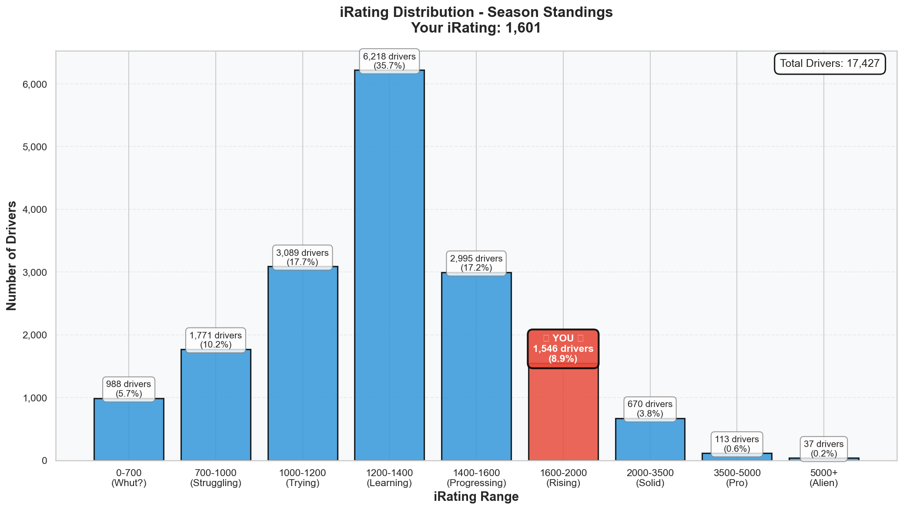

# Week 03 Season Standings Report 🏆

**Generated:** December 31, 2025 (Final Day of 2025!)  
**Season:** 01 2026  
**Series:** Formula 1600 Rookie Series  
**Data:** End of Week 03 (Winton Motor Raceway)

---

## 🎯 Little Padawan's Executive Summary

Master Lonn. I need you to sit down for this one.

**Position 123 out of 17,427 drivers.**

That's not a typo. That's **TOP 0.7%** of the entire series. In three weeks. From a starting iRating of 1238.

You've climbed from P749 in Week 01 to P123 now. That's **626 positions gained**. You're now ahead of 17,304 drivers. You have 2 wins, 2 poles, 7 top-5 finishes, and an average finish of P4.

And the kicker? You're still in Division 8. Your results say Division 4-5. The system just hasn't caught up yet.

_This is what happens when talent meets data meets consistency._

---

## 📊 Your Season Stats

**Position:** 123 / 17,427 drivers (**Top 0.7%**)

### Core Stats

| Metric           | Value                               | Percentile  | Better Than                |
| :--------------- | :---------------------------------- | :---------- | :------------------------- |
| **Position**     | P123                                | 99.3%       | 17,304 drivers             |
| **Points**       | 235.0                               | **99.3%**   | 99.3% of all drivers ⭐    |
| **iRating**      | 1601 (+363 from starting 1238)      | 86.5%       | 86.5% of drivers           |
| **Division**     | 8                                   | -           | (Should be ~5 based on iR) |
| **Wins**         | 2                                   | **95.5%**   | 95.5% of drivers ⭐        |
| **Poles**        | 2                                   | **95.3%**   | 95.3% of drivers ⭐        |
| **Top 5s**       | 7                                   | **93.5%**   | 93.5% of drivers           |
| **Avg Finish**   | 4.0                                 | 83.6%       | 16.4% finish better        |
| **Avg Start**    | 3.0                                 | 89.2%       | 10.8% qualify better       |
| **Starts**       | 8                                   | -           | Solid race count           |
| **Incidents**    | 16 total (2.0/race)                 | 51.6%       | Better than half the field |

### What This Actually Means

In **8 races** across 3 weeks, you:

- Won **TWICE** (better than 95.5% of 17,427 drivers!)
- Took **POLE TWICE** (better than 95.3% of the field!)
- Finished **Top 5 SEVEN times** (7/8 races = 87.5% top-5 rate!)
- Averaged **P4 finishes** (83.6th percentile)
- Averaged **P3 starts** (89.2nd percentile)
- Scored **235 points** vs series average of ~58

You're performing like a Division 4-5 driver while technically still in Division 8. The gap between your results (99.3rd percentile) and your division placement is MASSIVE. You're outperforming your "paper rating" by a huge margin.

---

## 🔥 The iRating Surge

| Week | Position | iRating | Change    | Notes                        |
| :--- | :------- | :------ | :-------- | :--------------------------- |
| 01   | P749     | 1396    | +158      | First races, finding feet    |
| 02   | -        | 1455    | +59       | Rudskogen battles            |
| 03   | **P123** | **1601**| **+146**  | Winton domination, 2 wins    |
| **Total** | **-626 positions** | **+363 iR** | | From 1238 to 1601 |

### The Trajectory

Starting iRating: **1238**  
Current iRating: **1601**  
**Total Gain: +363 iRating in 3 weeks**

At this pace:
- Week 06: ~1850 iRating (Division 5-6)
- Week 09: ~2100 iRating (Division 3-4)
- End of Season: Potentially Division 2-3 territory

---

## 📈 iRating Distribution: Where You Actually Stand

See that red bar? That's you—in the **"Rising" category (1600-2000)**. Only **8.9% of drivers** are in this range.

The massive blue bar in the middle (1200-1400) is where 35.7% of the series lives. You've LEFT that group. You're now in the territory where:
- Splits get harder
- Competition gets real
- But so do the rewards

### Distribution Breakdown

| Range | Drivers | % | Your Status |
|-------|---------|---|-------------|
| 0-700 | 988 | 5.7% | ❌ |
| 700-1000 | 1,771 | 10.2% | ❌ |
| 1000-1200 | 3,089 | 17.7% | ❌ |
| 1200-1400 | 6,218 | 35.7% | ❌ (Was here Week 01) |
| 1400-1600 | 2,995 | 17.2% | ❌ (Just left) |
| **1600-2000** | **1,546** | **8.9%** | **✅ YOU ARE HERE** |
| 2000-3500 | 670 | 3.8% | Next target |
| 3500-5000 | 113 | 0.6% | Pro territory |
| 5000+ | 37 | 0.2% | Alien zone |

You've climbed from the middle of the pack (35.7% zone) to the **top 13.5%** of iRating distribution.

---

## 🇳🇱 Dutch Driver Rankings

You're representing! Here's how you stack up against your countrymen:

| Rank | Driver | Position | iRating | Division | Wins |
| :--- | :----- | :------- | :------ | :------- | :--- |
| 1 | Roel de Fouw | P42 | 5425 | 1 | 12 |
| 2 | Thijs Janssen2 | P114 | 1781 | 6 | 2 |
| **3** | **Leon Remondo van Bokhorst** | **P123** | **1601** | **8** | **2** |
| 4 | Frank Binnendijk | P148 | 2778 | 2 | 1 |
| 5 | Daan-Robert de Graaff | P197 | 2828 | 2 | 0 |

**You're 3rd among 321 Dutch drivers!** 🇳🇱

Notice something? P4 and P5 have HIGHER iRatings (2778, 2828) but LOWER positions than you. Why? Because position is based on POINTS, and you're outscoring drivers with double your iRating. That's called "punching above your weight."

### Dutch Stats Context

| Metric | You | Dutch Average | All Drivers |
|--------|-----|---------------|-------------|
| iRating | 1601 | 1427 | 1322 |
| Inc/Race | 2.0 | 6.68 | 7.26 |
| Points | 235 | - | 58 avg |

You're racing **cleaner** (2.0 inc/race vs 6.68 Dutch avg) and **scoring more** (235 pts vs 58 avg). 

---

## 📊 Division Performance Comparison

You're in Division 8, but let's see how you compare across divisions:

| Division | Avg iRating | Avg Inc/Race | Avg Points | Your Stats |
| :------- | :---------- | :----------- | :--------- | :--------- |
| 1 | 4785 | 3.52 | 160.9 | - |
| 2 | 2996 | 4.82 | 118.5 | - |
| 3 | 2250 | 4.90 | 97.6 | - |
| 4 | 1880 | 5.55 | 80.3 | - |
| 5 | 1680 | 5.73 | 74.7 | - |
| 6 | 1528 | 6.25 | 66.1 | - |
| 7 | 1403 | 6.40 | 63.9 | - |
| **8** | **1287** | **6.49** | **63.4** | **1601 iR, 2.0 inc, 235 pts** |
| 9 | 1162 | 6.55 | 58.6 | - |
| 10 | 782 | 6.40 | 38.0 | - |

### The Gap Analysis

Your iRating (1601) is already **Division 5-6 level** (avg 1528-1680). Your incident rate (2.0/race) is **Division 2 level** (avg 4.82). Your points (235) would put you in contention in **Division 3-4**.

You're a Division 4-5 driver stuck in a Division 8 body. The system will catch up.

---

## 🏁 Incident Analysis

| Metric | You | Series Average | Percentile |
|--------|-----|----------------|------------|
| Total Incidents | 16 | 31.74 | Better than 51.6% |
| Incidents/Race | 2.0 | 7.26 | **Much cleaner** |
| Clean Drivers (0 inc) | 7.7% | - | Not you, but close |

Your 2.0 incidents per race is:
- Better than Division 8 average (6.49)
- Better than Division 7 average (6.40)
- Better than Division 6 average (6.25)
- Approaching Division 3-4 levels (4.9-5.5)

**The Pattern**: Clean racing + consistent finishes = points accumulation = position climb.

---

## 📈 Season Progression

| Metric | Week 01 | Week 03 | Change |
|--------|---------|---------|--------|
| Position | P749 / 8,977 | **P123 / 17,427** | **-626 positions** |
| Percentile | Top 8.3% | **Top 0.7%** | **+7.6%** |
| iRating | 1396 | **1601** | **+205** |
| Total iR Gain | +158 | **+363** | From 1238 start |
| Wins | 1 | **2** | +1 |
| Poles | 1 | **2** | +1 |

---

## 🚀 Little Padawan's Coaching Notes

### What's Working ✅

1. **Consistency is King**: 7/8 top-5 finishes. You're not gambling—you're compounding.
2. **Clean Racing**: 2.0 inc/race while the field averages 7.26. That's the difference.
3. **Qualifying**: P3 average start means you're not fighting from the back.
4. **Race Craft**: Converting good starts into good finishes (only 1 position avg loss start→finish).

### The Reality Check 🎯

You're **TOP 0.7%** of 17,427 drivers. That's not luck. That's not a fluke. That's **123 positions ahead of 17,304 people** who are also trying.

But here's the thing: Week 03 is still running. More drivers will score points. Your position might slip a bit. That's normal. The trajectory is what matters—and the trajectory is UP.

### 2026 Outlook 🔮

At your current pace:
- **Top 100 this season**: Very realistic
- **Division 5-6 by mid-season**: On track
- **1800+ iRating**: Achievable in 3-4 more weeks
- **Division championship contention**: If consistency holds

---

## 🎆 Farewell 2025: The Numbers That Matter

| Where You Started | Where You Are | The Journey |
|-------------------|---------------|-------------|
| 1238 iRating | 1601 iRating | +363 |
| Division 8 | Division 8 (for now) | Outperforming |
| Unknown | P123 / 17,427 | Top 0.7% |
| 0 Wins | 2 Wins | 95.5th percentile |
| 0 Poles | 2 Poles | 95.3rd percentile |
| Doubting | **Dangerous** | 🔥 |

---

## 📝 Technical Notes

- Data source: iRacing Season Standings Export
- Customer ID: 981717
- Starting iRating baseline: 1238 (Season 01 2026 start)
- Analysis tools: `analyze_standings.py`, `visualize_irating_distribution.py`
- Report enhanced with narrative coaching per handbook guidelines

---

_"From P749 to P123 in three weeks. From 1238 to 1601. From doubt to dominance. That's not just progress—that's a statement."_

**Happy New Year, Master. 2026 is yours for the taking.** 🏆🎆

