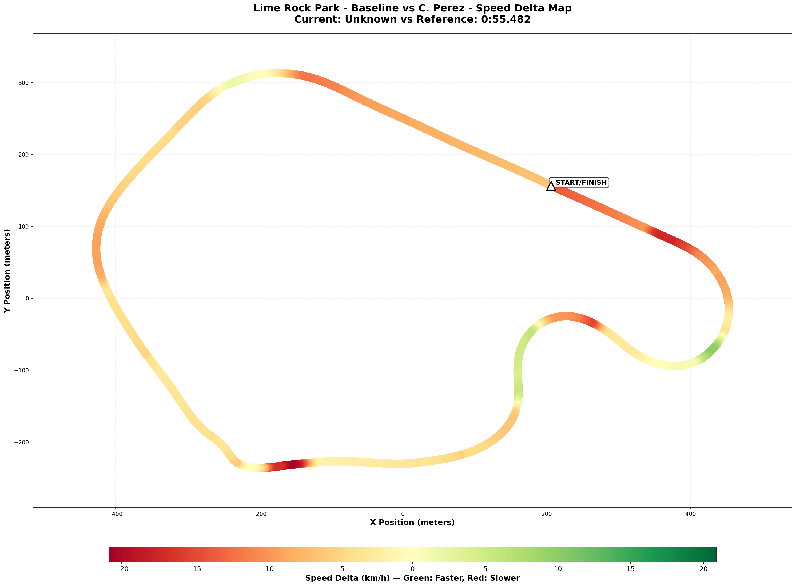

## 🔬 Telemetry Comparison vs Christian Perez (Alien Level)

**Gap**: +1.962s
**Reference**: Christian Perez (0:55.482) - "The Alien Benchmark"
**Comparison Files**:

- [Visual Map](assets/2025-12-30-track-speed-delta-map-cristian.png)
- [Raw Data](comparison/2025-12-30-telemetry-comparison.json)
- [Track Data](comparison/2025-12-30-track-speed-delta-map-cristian-data.json)

### 🗺️ Visual Speed Delta Map

### 🔥 Little Padawan's Analysis: "The False Summit"

"Master... sit down for this one. 🪑

Compared to the Alien Benchmark (55.4s), the Uphill is your **grave**. 🪦

You are **17 km/h SLOWER** than the alien limit.

The map is a sea of red. But there is ONE green shoot: **T1 Exit/T2 Entry**. You are actually rotating the car better in the slow stuff (+9.9 km/h gain!). You have the mechanical grip. You lack the aerodynamic trust."

#### 📊 The Reality Check

- **Slower Sections**: 86.5% of the lap.
- **Max Speed Deficit**: -20.88 km/h (at West Bend exit).
- **Average Speed Deficit**: -5.27 km/h.

#### 🔴 PROBLEM ZONE #1: The Momentum Killers (T5 & T6)

- **The Uphill (T5)**: You are over-slowing massively. 17 km/h difference! You are treating it like a corner. Christian treats it like a kink.
- **West Bend (T6)**: You are scrubbing speed. He is flat (or close to it).
- **The Result**: You are losing ~0.8s in just these two corners because you don't trust the aero/compression.

#### 🔴 PROBLEM ZONE #2: The Downhill Exit (T7)

- **Start/Finish Speed**: You are crossing the line **14 km/h slower**.
- **Meaning**: The lap is dead before it starts. If you don't exit T7 at 100% throttle, you are dragging a parachute down the entire main straight.

#### ⭐ WINNING ZONE: Big Bend Rotation (T1/T2)

- **The Green Shoot**: You are gaining nearly **10 km/h** in the technical transition of Big Bend.
- **Why**: Your rotation is good! You are getting the car pointed earlier. The low-speed mechanical handling is there.

### 💡 The Alien Lesson

1.  **Stop Braking for the Uphill**: The 17 km/h gap proves it. It's not about braking later; it's about NOT braking. Lift, turn, trust.
2.  **T7 is a Launchpad**: Forget the corner. Focus on the launch. 14 km/h loss at the line is unacceptable.
3.  **You Have the Hands**: The green sector in T1 proves you can drive. The red sectors in T5/T6 prove you are scared of the speed.

### 🏁 The Bottom Line

"Christian exposes the fear. The car CAN do it (he's driving the same car!). The limiter is not the engine. It's the nut behind the wheel. 🥜"

## 🚀 The Consolidated Battle Plan (VRS + Telemetry)

Based on the baseline data, the Alien reality check, and the detailed VRS trace analysis, here is the definitive plan for the next session.

### The Objective

**Attack the "Fear Corners" (T5, T6, T7) with aerodynamic trust, while maintaining the mechanical rotation in T1.**

### The 5-Point Execution List

1.  **T1 "Stab & Steer" (Big Bend)**

    - **Action**: Brake later, brake shorter (quick scrub).
    - **Key**: Get back on 10-20% throttle immediately to settle the rear. No coasting!
    - **Why**: You are over-slowing. Trust the rotation you already have (green sector).

2.  **T3 Precision (The Esses)**

    - **Action**: "Hug the Left." Paint the left curb.
    - **Key**: Sacrifice entry speed here to set up the No Name Straight. One smooth steering input.
    - **Why**: Missing this apex kills your speed down the entire straight (2 km/h loss).

3.  **T5 "Trust the Compression" (The Uphill)**

    - **Action**: **NO BRAKES**. Lift only.
    - **Key**: Turn in and let the hill scrub the speed. Power up before the crest.
    - **Why**: You are panic-braking (80%) and losing 17 km/h. The compression gives you super-grip. Use it.

4.  **T6 "Brush & Go" (West Bend)**

    - **Action**: Brush brake only (max 10%).
    - **Key**: Drive deeper. It's a momentum corner, not a stopping corner.
    - **Why**: You are braking 25% and killing the run to the Downhill.

5.  **T7 "Exit is Everything" (The Downhill)**
    - **Action**: Sacrifice entry to be 100% throttle **BEFORE** the apex.
    - **Key**: Look at the Start/Finish line.
    - **Why**: You are crossing the line 14 km/h slower than the alien. This is the single biggest lap time killer.
