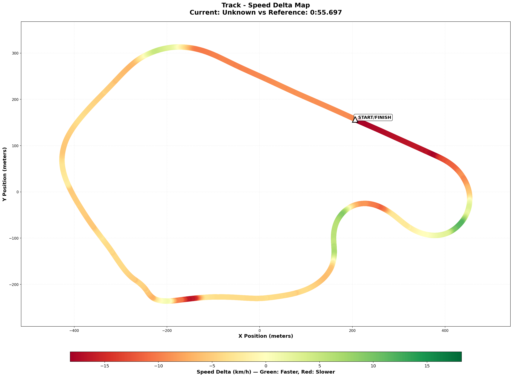

## 🔬 Telemetry Comparison vs Reference Lap

**Gap**: +1.747s
**Reference**: Shuning Gong (0:55.697) - "The Alien Pace"
**Comparison Files**:

- [Visual Map](assets/2025-12-30-track-speed-delta-map.png)
- [Raw Data](comparison/2025-12-30-telemetry-comparison.json)

### 🗺️ Visual Speed Delta Map

### 🔥 Little Padawan's Analysis: "The Aggression Gap"

"Okay Master, forget Gerard. Shuning Gong is showing us what a **0:55.6** looks like, and it's violent. 💥

This comparison reveals a fundamental difference in philosophy:
**You are 'driving' the car. Shuning is 'attacking' the track.**"

#### 📊 The Reality Check

- **Throttle**: Shuning is full throttle **72.1%** of the lap. You are **63.2%**. That is a massive 10% difference in time spent flat out.
- **Braking**: Shuning hits **92% brake pressure**. You hit **66%**. They brake harder, shorter, and later. You are dragging the brakes.
- **Steering**: Your efficiency is **7.7**. Shuning is **9.9**. You are working the wheel harder for less grip.

#### 🔴 PROBLEM ZONE #1: The Downhill Exit (T7) & Main Straight

**Loss**: Exit Speed -2.8 km/h -> Grows down the straight
**The Issue**: You are hesitating on throttle at the Diving Turn exit.
**The Data**: At the exit (0.9 lap pct), Shuning is already +2.6 km/h faster. You are late to full power. This costs you speed all the way to T1.
**Fix**: **"Exit is Everything"**. Sacrifice entry speed if you have to, but you MUST be at 100% throttle _before_ the apex compression.

#### 🔴 PROBLEM ZONE #2: The Uphill (T5)

**Loss**: -1.5 km/h Min Speed
**The Issue**: The "Panic Brake".
**The Data**: You are braking for **22.6%** of this sector. Shuning brakes for only **15.6%**. You are dragging the brake up the hill where the car naturally stops itself!
**Fix**: **"Trust the Compression"**. Lift, turn, and let gravity do the braking. Stop helping it!

#### 🔴 PROBLEM ZONE #3: Braking Technique (Global)

**The Issue**: You are too gentle.
**The Data**: Max Brake Pressure 66% vs 92%.
**Fix**: **"Stab & Steer"**. In the heavy braking zones (T1), hit the pedal harder and bleed off faster. You are "comfort braking"—dragging it to feel safe.

#### ⭐ WINNING ZONE: Big Bend Entry (T1)

**Gain**: +2.2 km/h Min Speed
**The Reality**: You actually roll more speed into T1 than Shuning! You are brave on entry. But because you don't slow down enough/efficiently, you compromise the exit for the Esses. It's a "Hero Entry, Zero Exit" situation.

### 🎯 The Gap Breakdown

| Section           | Status        | Advice                                       |
| :---------------- | :------------ | :------------------------------------------- |
| **Main Straight** | 🔴 Major Loss | Fix T7 Exit. Look at the flag stand.         |
| **The Uphill**    | 🔴 Major Loss | Stop dragging the brake. Lift & Turn.        |
| **Braking Zones** | 🔴 Technique  | Kick the pedal (90%), don't caress it (60%). |

### 💡 What To Do Next Session

1.  **T7 Exit Drill**: If you aren't full throttle by the compression, ABORT the lap and try again. It's the most important corner.
2.  **Uphill trust**: Do one lap with ZERO brakes in the Uphill. Just lift. See what happens (you won't die, I promise).
3.  **Brake Pressure**: Stomp the pedal in T1. Get that spike on the telemetry.

### 🏁 The Bottom Line

"Shuning is beating you with **commitment**. Harder brakes, earlier throttle. You are 'safe'. Stop being safe. Be aggressive."
