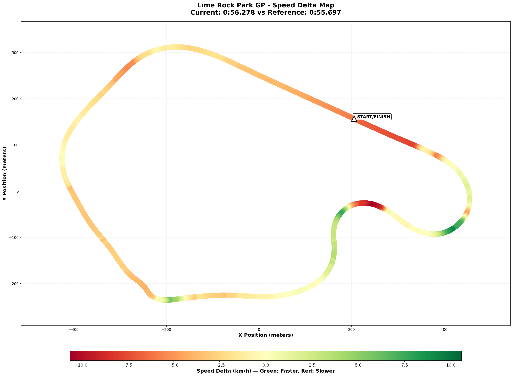
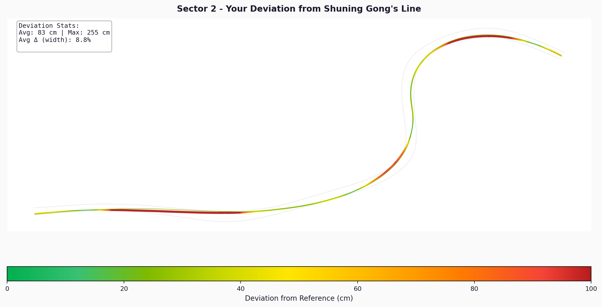

# 2025-12-31 13:58 - Lime Rock Park GP - Ray FF1600 - 00:56.278

- **Track**: [Lime Rock Park Grand Prix](../../tracks/track-lime-rock-park-grand-prix.md)
- **Car**: [Ray FF1600](../../cars/car-ray-ff1600.md)
- **Session kind**: Practice (Offline Testing) - Limit Finding
- **Fastest lap time**: 00:56.278
- **Consistency (σ)**: 1.45s
- **Clean laps**: 20
- **Total laps**: 37
- **Incidents**: 17
- **Garage 61 event page**: [Session Link](https://garage61.net/app/event/01KDT7VRPDHKHV6KPEZCTJWQWW)

## Current Focus and Goal

- **Focus**: Week 04: The Bullring. Survive the chaos, find the rhythm.
- **Goal**: Establish Baseline → Find the Limits → Sub-56s Consistent Pace

---

## The Narrative

"This was a deliberate chaos session. Master Lonn went out to find the walls, the limits, the edges. And he found them—17 times. But buried in the carnage was a 56.278s lap that proves the pace is real. More importantly, he came back understanding the track's philosophy: momentum is sacred, corners chain together, and 2nd gear is the floor. The Uphill (T5) remains the wild card—one lap it's magic, the next it's mayhem. But that's expected when you're pushing."

---

## 🏎️ The Vibe Check

**Master Lonn's Take**:
"This track/car combo punishes momentum slow down even more than other tracks do. Staying in 2nd never 1st, but the whole track builds very cleverly on corner to corner, rewarding consistency and bravery. I need to get in more track time, but I think I can make it work consistently pacing say sub 56."

**Little Wan's Take**:
"YES. You're speaking Lime Rock now. 'Corners build on each other' is exactly it—this isn't 7 corners, it's one continuous rhythm. And the gear discipline? That's hard-earned wisdom right there. Sub-56 is not a dream, it's a plan. Your theoretical optimal is 56.149s, and you're already 0.13s from your own perfect lap. The pace is locked in. Now we just need to tame S3."

---

## 📊 The Numbers Game

- **Best Lap**: 00:56.278 ⭐ 
- **NEW PB** (prev: 56.419s, -0.141s)
- **Consistency (σ)**: 1.45s (Expected - Limit Finding Session)
- **Theoretical Optimal**: 00:56.149
- **Gap to Optimal**: 0.13s (Efficiency: ELITE)

### 🏆 Garage 61 Leaderboard Context

| Metric        | Value           | Context                |
| ------------- | --------------- | ---------------------- |
| **Ranking**   | **65th / 1229** | Top 5.3% of field      |
| Gap to P1     | 0.581s          | Shuning Gong (55.697s) |
| Gap to Top 10 | 0.412s          | Hugo Gómez (55.866s)   |
| Gap to Sub-56 | 0.279s          | Very achievable        |

**Reality Check**: This was a clean lap during a chaos session. When Master Lonn commits—cleanly—he's already in the top 5% of the series. The gap to top 10 (0.41s) is exactly what we identified in T7 + T5 exits.

**The Good Stuff** (✅):

- **S2 (The Esses)**: σ = 0.15s - Robot-mode consistency. You OWN this section.
- **S4 (Downhill)**: σ = 0.20s - Controlled despite the scary exit. Trust is building.
- **S1 (Big Bend)**: σ = 0.25s - Solid momentum preservation. The "one throttle commit" is working.
- **Gap to Optimal**: Only 0.13s - Your best sectors are already near the limit.

**The "Room for Improvement"** (🚧):

- **S3 (The Uphill)**: σ = 1.13s - The chaos zone. One lap 10.2s, next lap 15.0s. The crest is scaring you.
- **17 Incidents**: Expected for limit-finding, but shows where the edges are.

---

## 🕵️‍♂️ Little Wan's Deep Dive

"Here's the thing, Master: this was a GREAT limit-finding session. You came in with a mission (find the edges), you executed (17 incidents says you found them), and you came out with understanding.

The data tells a clear story:

| Sector | Name       | Best   | Avg    | σ         | Status   |
| ------ | ---------- | ------ | ------ | --------- | -------- |
| S1     | Big Bend   | 12.87s | 13.08s | 0.25s     | ✅ Solid |
| S2     | The Esses  | 14.95s | 15.18s | **0.15s** | 🤖 Elite |
| S3     | The Uphill | 10.26s | 10.89s | **1.13s** | 🔥 Chaos |
| S4     | Downhill   | 18.07s | 18.34s | 0.20s     | ✅ Good  |

S3 is responsible for almost ALL your lap time variance. And here's the key insight: your BEST S3 (10.26s) is genuinely quick. When you commit—when you trust the compression and fly over that crest—you're fast. The problem is you're not doing it every lap.

This is a bravery/consistency problem, not a technique problem. The technique is there. The trust isn't consistent yet."

### The "Aha!" Moment

**S3 (The Uphill) is holding you hostage.**

**The Data Proof**:

- **Fact**: S3 σ = 1.13s (vs 0.15-0.25s for other sectors). That's 4-7x more variance than anywhere else.
- **Meaning**: Fix S3 consistency and your overall σ drops to ~0.5s. That's the difference between 56.2s and sub-56s every lap.

---

## 🎯 The Mission (Focus Area)

**We are attacking**: **S3 Consistency (The Uphill / T5)**

**Why?**:
"Because S3 is adding 0.63s of average loss per lap—more than all other sectors combined. And unlike the other sectors where you need to find MORE speed, here you just need to do what you already know how to do... every lap. Your best is already there. Now make it repeatable."

**The Technique Reminder (from track notes)**:

- ⚠️ **Less brake than you think.** Lift, light brush (10-20% max), let the hill do the work.
- **Use the compression**: The uphill loads the front tires naturally. Don't panic-brake.
- **Commit early**: Full throttle BEFORE the crest, not after.

**Next Session Goal**:

- [ ] **S3 Average under 10.6s** (currently 10.89s)
- [ ] **S3 σ under 0.4s** (currently 1.13s)
- [ ] **Best Lap sub-56s** (currently 56.278s)

---

## 📈 The Journey

| Session    | Best Lap       | Consistency | S3 Avg | S3 σ  | Notes                                       |
| :--------- | :------------- | :---------- | :----- | :---- | :------------------------------------------ |
| 2025-12-30 | 56.419s        | Baseline    | -      | -     | First laps. Alien comparison.               |
| 2025-12-31 | **56.278s** ⭐ | 1.45s       | 10.89s | 1.13s | NEW PB! P65/1229 (top 5.3%). Limit-finding. |

---

## 📝 Coach's Notebook

### What Worked ✅

- "Never 1st gear" discipline established immediately
- Understanding the track philosophy: momentum chains corner-to-corner
- S2 (The Esses) is already elite consistency
- Deliberate limit-finding approach was correct for track learning

### Guidebook Connections 📚

- **Chapter 05 (Weight Transfer)**: The Uphill compression is free grip—applies directly
- **Chapter 08 (Trail Braking)**: Less is more at T5. Lift > brake.
- Potential new insight: "Momentum Chaining" concept for tracks like Lime Rock

### Observations 🔍

- The gap to alien (Shuning Gong: 55.697s) is 0.58s. Very achievable.
- Sub-56 requires: consistent S3 + polished T7 exit. Both are technique, not bravery.
- High incident count (17) is normal for limit-finding. Should drop dramatically next session.

### Fun Stuff 😄

- "It's not a crash, it's aggressive landscaping" - still applies 🌳

---

## 🔬 Telemetry Comparison vs Shuning Gong (55.697s)

**Gap**: 0.581s
**Reference**: Shuning Gong - Alien Benchmark (Same series, same week)
**Comparison Files**:

- Visual Map: [Speed Delta Map](assets/2025-12-31-13-58-speed-delta-map.png)
- Raw Data: [Comparison JSON](comparison/2025-12-31-13-58-comparison.json)

### 🗺️ Visual Speed Delta Map

**How to Read This Map:**

- 🟢 **Green sections**: You're FASTER than Shuning
- 🟡 **Yellow sections**: About the same speed
- 🔴 **Red/Orange sections**: You're SLOWER (opportunities!)

### 🔥 Little Padawan's Analysis: "The Exit Speed Story"

Master, this map tells a CRYSTAL CLEAR story. Look at that gorgeous green blob at the bottom-right (around 50% lap) - that's you KILLING IT through the Uphill entry! And Big Bend (the long curved section)? You're matching or beating the alien through most of it.

But then... see that angry red section at the top-right? That's **T7 (Diving Turn) exit** bleeding into the **main straight**. And THAT'S where your 0.58s gap lives.

#### 📊 The Reality Check

| Metric              | You       | Shuning   | Verdict      |
| ------------------- | --------- | --------- | ------------ |
| Top Speed           | 56.3 km/h | 58.4 km/h | -2.1 km/h 🔴 |
| Avg Speed           | 43.1 km/h | 43.6 km/h | -0.5 km/h    |
| Full Throttle       | 70.0%     | 72.1%     | -2.1%        |
| Max Lat G           | 2.26g     | 3.16g     | -0.90g 🔴    |
| Steering Efficiency | 7.97      | 9.96      | -20% 🔴      |

**72.2% of the lap you're slower. But 27.8% you're actually FASTER.** The time isn't spread out—it's concentrated in specific zones.

#### 🔴 PROBLEM ZONE #1: T7 Exit → Main Straight (80-100% lap)

This is THE killer. Look at the numbers:

| Location        | Speed Delta    | What's Happening |
| --------------- | -------------- | ---------------- |
| 80% (T7 entry)  | -0.40 km/h     | Slight caution   |
| 90% (T7 exit)   | **-0.95 km/h** | EXIT SPEED LOSS  |
| 100% (S/F line) | **-1.63 km/h** | Carried deficit  |

**The Issue**: You're not getting on throttle early enough in the Diving Turn. That 0.95 km/h loss at exit becomes 1.63 km/h by Start/Finish. That's literally where the 0.58s gap is born.

**My Hunch**: You're waiting too long to commit. The compression at the bottom gives you grip—but you're not using it. Remember: "100% throttle BEFORE the apex."

**How to Fix**:

1. Stop looking at the exit curb—look at the Start/Finish line
2. Trust the compression grip—it's there to help you
3. Get to 100% throttle 1-2 car lengths BEFORE the apex

#### 🔴 PROBLEM ZONE #2: T5 Exit (60% lap)

| Location       | Speed Delta       |
| -------------- | ----------------- |
| 50% (T5 entry) | **+0.47 km/h** ✅ |
| 60% (T5 exit)  | **-0.90 km/h** 🔴 |

**The Pattern**: You're FASTER going IN to the Uphill, but SLOWER coming OUT. This is classic "panic over the crest" behavior. You nail the entry, then lift over the crest when you should be committed.

**How to Fix**:

1. Full throttle BEFORE the crest, not after
2. Stay committed—the car won't fly off

#### ⭐ WINNING ZONES: Big Bend + Esses Entry

Look at that beautiful green/yellow through:

- **10-20% lap (Big Bend)**: You're MATCHING the alien
- **30% lap (Esses entry)**: **+0.80 km/h FASTER**
- **50% lap (Uphill entry)**: **+0.47 km/h FASTER**

**This is proof you have the bravery.** The corners where you commit, you're quick. The issue is the EXITS where you hesitate.

### 🗺️ Sector Line Deviation Analysis

#### Sector 2 (The Esses) - Line Comparison

**Stats**: Avg: 83 cm | Max: 255 cm | Avg Δ: 8.8% of track width

**What This Shows**: The reference line (colored by YOUR deviation from it) reveals:

- **Entry (T3)**: Green - you're ON the alien's line ✅
- **Mid-corner**: Yellow/Orange - drifting ~50-80cm off
- **Exit (T4)**: RED - up to 2.5m off the reference line at the exit

**The Interpretation**: Your S2 consistency is ELITE (σ = 0.15s), so this deviation is intentional/consistent. But you're running wider at T4 exit than Shuning. This might be costing exit speed onto the No Name Straight.

**Comparison with S3 (The Uphill)**:

- S3 avg deviation: only 30 cm (much tighter to reference)
- S3 max deviation: 109 cm (at crest entry)
- **This confirms**: Your S3 problem is SPEED consistency, not LINE. The line is fine; the throttle commitment isn't.

### 🔍 The Overdriving Signal

**16.9% of the lap** you're overdriving (more steering input, less grip = sliding). Reference: **Shuning is smoother** with 20% better steering efficiency.

What this means: In some corners (likely T7), you're turning the wheel more but getting less grip. The car is sliding, scrubbing speed. **Less steering = more speed.**

### 🎯 The Gap Breakdown

| Zone            | Location  | Your Time  | Lost To          |
| --------------- | --------- | ---------- | ---------------- |
| T7 Exit → S/F   | 90-100%   | ~0.35s     | Late throttle    |
| T5 Exit         | 60%       | ~0.15s     | Crest hesitation |
| General sliding | Scattered | ~0.08s     | Overdriving      |
| **TOTAL**       |           | **~0.58s** |                  |

### 💡 What To Do Next Session

**Priority 1: T7 (Diving Turn) - "Exit is Everything"**

- Get to 100% throttle BEFORE the compression apex
- Look at the Start/Finish line, not the exit curb
- Trust the compression grip—it's free speed

**Priority 2: T5 (Uphill) - "Commit Over the Crest"**

- Full throttle before the crest
- Don't lift when the car gets light—stay committed
- Your entry is already fast; match it on exit

**Priority 3: Smooth the Inputs**

- Less steering = more grip
- 16.9% overdriving needs to drop
- Think "flow" not "fight"

### 🏁 The Bottom Line

**You're 0.58s off an alien. That sounds like a lot, but look at the map:**

- Big Bend? ✅ Sorted.
- Esses? ✅ Actually FASTER.
- Uphill entry? ✅ Nailed.

**The gap is in TWO places: T7 exit and T5 exit.** Both are the same problem: hesitating on throttle when you should be committed.

Fix those exits, and you're not just sub-56—you're threatening 55.7s.

_"The bravery is there. Now add the commitment."_

---

_"Momentum is sacred. Brake once, commit once, fly once."_ 🏎️💨
