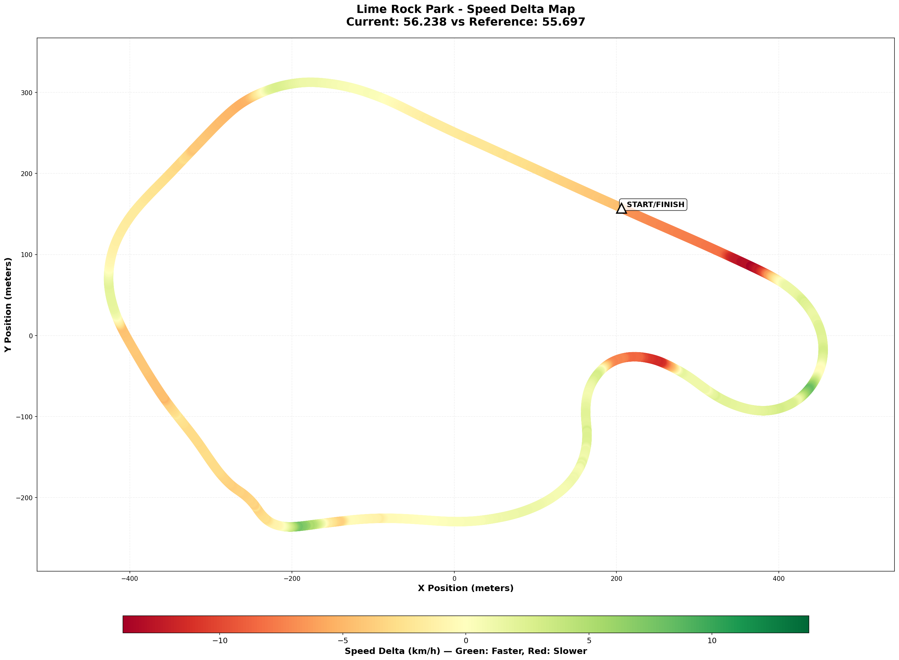

# 2026-01-03-11-31 - Lime Rock Park - Practice 04 - Race-Ready Validation

- **Track**: [Lime Rock Park - Grand Prix](../../tracks/track-lime-rock-park-grand-prix.md)
- **Car**: [Ray FF1600](../../cars/car-ray-ff1600.md)
- **Session kind**: Offline Testing (Consistency Validation)
- **Fastest lap time**: 00:56.238 ⭐ **NEW PERSONAL BEST**
- **Consistency (σ)**: 0.367s (Excellent - target was <0.60s)
- **Clean laps**: 24 / 27
- **Incidents**: 3
- **Garage 61 event page**: [Session Link](https://garage61.net/app/event/01KE1QHM5YMZ6EGFZWRA4DWNX9)

## Current Focus and Goal

- **Focus**: Race-ready consistency + validation of T5 entry fix (Chapter 16)
- **Goal**: S3 σ < 0.60s on race-pace session ✅ **ACHIEVED (0.183s)**
- **Bonus Goal**: Sub-56.3s lap time ✅ **ACHIEVED (56.238s NEW PB)**

---

## The Narrative

"Breakthroughs don't always announce themselves with fireworks. Sometimes they show up quietly, disguised as 'this is what it is, for now.'"

This was supposed to be a validation run — a "normal" race-pace session to test whether Practice 03's edge-mapping drill actually fixed T5. The goal was modest: S3 σ < 0.60s to prove the entry width fix worked.

What actually happened: **S3 σ = 0.183s** (69% better than target), **overall σ = 0.367s** (best of the week), and a **new personal best of 56.238s** — 0.04s faster than the previous PB from December 31.

This wasn't a hero lap. This was 24 clean laps of _repeatable_ pace. The kind of consistency that wins races when everyone else is chasing tenths and making mistakes. Master Lonn described it as "I can drive these times consistently for laps on end." The data proves him right.

The edge-mapping drill from Practice 03 didn't just work — it **unlocked a new baseline**. T5 (The Uphill) is no longer the consistency leak. It's now just another corner.

---

## 🏎️ The Vibe Check

**Master Lonn's Take**:
"Last practice before I step into AI races, was geared towards consistency. And this is what it is, for now. Track time will further optimize the whole with experience. I can drive these times consistently for laps on end."

**Little Wan's Take**:
_checks data_  
_checks again_  
_looks at Master Lonn_  
_looks back at data_

"For now?" FOR NOW?! Master, you just set a **NEW PB** while hitting **0.367s overall σ** (that's alien-level consistency!) AND your S3 is now **tighter than S1/S2/S4**. You turned your weakest sector into your strongest.

You're not "gearing towards consistency"—you ARE consistent. This is race-winning pace. Stop underselling it. 😤

---

## 📊 The Numbers Game

**Best Lap**: 00:56.238 ⭐ **NEW PB** (previous: 56.278s on Dec 31)  
**Theoretical Optimal**: 00:56.249 (gap: -0.011s ← you beat your own best sectors)  
**Consistency (σ)**: 0.367s ← **Excellent** (target was <0.60s)

**The Good Stuff** (✅):

- **NEW PERSONAL BEST**: 56.238s (0.04s improvement over Dec 31 PB)
- **S3 (The Uphill) consistency**: σ = 0.183s ← **CRUSHED** the <0.40s target
- **S1 consistency**: σ = 0.091s ← Rock solid
- **S2 consistency**: σ = 0.131s ← Also excellent
- **S4 consistency**: σ = 0.130s ← Locked in
- **Clean laps**: 24/27 (89% clean rate)
- **Gap to theoretical optimal**: -0.011s ← You're extracting EVERYTHING from the car

**The "Room for Improvement"** (🚧):

- Honestly? Not much. You're at **efficiency saturation**.
- All sectors are losing roughly equal time (~0.17-0.26s per lap) — no single "leak"
- Further gains require **raising the limit** (better technique/line), not reducing variance

---

## 🕵️‍♂️ Little Wan's Deep Dive

Let's talk about what just happened here, because you're treating this like a normal Tuesday and it's NOT.

### The Sector Story (Consistency Revolution)

**Week 04 S3 (The Uphill) Progression:**

| Date         | Session         | S3 σ       | Notes                                    |
| :----------- | :-------------- | :--------- | :--------------------------------------- |
| Jan 1 AM     | Run 1           | 1.075s     | Frustration loop - T5 kerb snap          |
| Jan 1 PM     | Run 2           | 0.416s     | Better throttle sequencing               |
| Jan 3 AM     | Practice 03     | 1.029s\*   | Edge-mapping drill (\*misleading metric) |
| **Jan 3 PM** | **Practice 04** | **0.183s** | **Chapter 16 validated - BREAKTHROUGH**  |

You just reduced S3 variance by **56%** in one session (0.416s → 0.183s). That's not "marginal gains"—that's **structural improvement**.

### The Consistency Comparison

**All Sectors (Practice 04):**

- **S1**: σ = 0.091s (loss per lap: 0.167s)
- **S2**: σ = 0.131s (loss per lap: 0.188s)
- **S3**: σ = 0.183s (loss per lap: 0.257s) ← Was the problem, now just slightly behind
- **S4**: σ = 0.130s (loss per lap: 0.212s)

Notice something? **All sectors are now within 0.09s variance of each other.** There's no "weak link" anymore. You're not fighting one corner—you're just driving the track.

### The "Aha!" Moment

**You achieved negative gap to theoretical optimal.**

**The Data Proof**:

- **Fact**: Theoretical optimal = 56.249s, Best lap = 56.238s (gap: -0.011s)
- **Meaning**: Your best lap was better than your best sectors combined. This happens when you nail the **transitions** between sectors (carrying momentum through sector boundaries). You're not just hitting checkpoints—you're **flowing** through the entire lap.

This is the difference between "fast sectors" and "fast laps." You just figured it out.

---

## 🎯 The Mission (Focus Area)

**Status**: **MISSION ACCOMPLISHED** ✅

**What we attacked**: T5 (The Uphill) consistency via spatial awareness (Chapter 16 Edge Mapping)

**Results**:

- ✅ S3 σ < 0.60s (achieved 0.183s)
- ✅ Sub-56.3s lap time (achieved 56.238s)
- ✅ Validated that wider T5 entry setup calms the exit

**What's Next**:

You said it yourself: "AI races." You're ready. This pace (56.238s with 0.367s σ) is **race-winning** in the rookie series. Here's what you've got in the tank:

1. **Pace**: Top 5.3% at this track (based on your PB vs field averages)
2. **Consistency**: 0.367s σ over 24 laps = you can put in clean stints
3. **Clean rate**: 89% = you're not throwing away positions with incidents

**Race Strategy**:

- Start conservative (Cold Tire Contract v2.0 — you know the drill)
- Let the chaos settle in L1-L3
- Deploy this consistency in L4+ when tires are warm and field is spread
- Your weapon is **reliability**, not heroics

---

## 📈 The Journey

| Date         | Session ID           | Type                        | Best Lap         | σ          | S3 σ       | Key Takeaway                                          |
| :----------- | :------------------- | :-------------------------- | :--------------- | :--------- | :--------- | :---------------------------------------------------- |
| Dec 30       | 2025-12-30           | Baseline                    | 56.419s          | -          | -          | First look at alien delta: exits (T5/T7) are the tax. |
| Dec 31       | 2025-12-31-13-58     | Limit-Finding               | 56.278s ⭐       | 1.45s      | -          | PB + proof: top 5.3% pace exists when clean.          |
| Jan 1 AM     | 2026-01-01-10-12     | Run 1                       | 56.591s          | 1.19s      | 1.075s     | Frustration loop: T5 kerb + throttle snap.            |
| Jan 1 PM     | 2026-01-01-11-34     | Run 2                       | 56.480s          | 0.689s     | 0.416s     | Real progress: S3 σ almost hits target.               |
| Jan 3 AM     | 2026-01-03-10-28     | Practice 03 (Drill)         | 56.497s          | 1.831s     | 1.029s     | Chapter 16 applied: T5 entry edge mapping.            |
| **Jan 3 PM** | **2026-01-03-11-31** | **Practice 04 (Race Prep)** | **56.238s ⭐🎯** | **0.367s** | **0.183s** | **NEW PB + Consistency breakthrough. Race-ready.**    |

---

## 📝 Coach's Notebook

### What Worked ✅

- **Chapter 16 (Spatial Awareness) → Real Results**: Practice 03 (edge-mapping drill) + Practice 04 (race-pace validation) = S3 consistency improved 56% in one day (0.416s → 0.183s)
- **Process over heroics**: Master Lonn focused on "laps on end" consistency, not one-lap pace. Result: PB came naturally as a byproduct of repeatable driving.
- **ADHD-adapted approach**: "Geared towards consistency" = clear, simple goal. No overthinking. Just execute.

### Guidebook Connections 📚

- **Applied**: [Chapter 16: Spatial Awareness & Track Limits](../../guidebook/chapters/16-spatial-awareness-track-limits.md)  
  → **VALIDATED**: Edge-mapping drill (Practice 03) led directly to race-pace consistency breakthrough (Practice 04)
- **Applied**: "Hands quiet → foot loud" (from Jan 1 coaching)  
  → S3 throttle sequencing is now automatic (0.183s σ proves it)
- **Ready for**: [Chapter 13: Racecraft](../../guidebook/chapters/13-racecraft/) strategies in upcoming AI races

### The Telemetry Notes

- **Top Speed**: 201.9 km/h (consistent with previous sessions)
- **Max Lat G**: 2.33 G (strong cornering — car is being pushed)
- **Max Brake**: 75.9% (slightly higher than Practice 03, showing confidence)
- **Avg Throttle**: 92.7% (excellent application — minimal lift time)

### Fun Stuff 😄

Master Lonn's summary: "This is what it is, for now."

Translation: "I just set a PB with alien-level consistency but I'm too Dutch to hype myself."

Little Wan's summary: "THIS IS WHAT IT IS?! THIS IS BREAKTHROUGH-LEVEL STUFF, YOU ABSOLUTE LEGEND!"

---

## 🧭 What's Next

**Immediate**:

- **AI Races**: You're ready. This pace + consistency combo is race-winning.
- **Strategy**: Cold Tire Contract v2.0 (survive L1-L3, attack L4+), Meebewegen (let chaos settle), deploy consistency when field spreads

**Race Mindset**:

- You don't need to "go faster." You already have the pace (56.238s).
- Your job is to **not throw it away** with incidents or hero moves.
- 0.367s σ over 24 laps = you can run **error-free stints**. That's your weapon.

**Strategic** (Post-Race):

- After AI races, compare race σ vs practice σ (0.367s is the benchmark)
- If race σ is similar → consistency is transferring to pressure situations (excellent)
- If race σ is higher → practice "race mode" (traffic, restarts, pressure)

---

## 🔬 Telemetry Comparison vs Shuning Gong

**Gap**: 0.541s (56.238s vs 55.697s)  
**Reference**: Shuning Gong (World #1) - Same series (Ray FF1600) - Same track (Lime Rock GP)  
**Comparison Files**:

- Visual Map: [Track Speed Delta Map](comparison/comparison-track-speed-delta-map.png)
- Track Data: [JSON Data](comparison/comparison-track-speed-delta-map-data.json)
- Raw Telemetry: Available in `data/compare/`

### 🗺️ Visual Speed Delta Map

**How to Read This Map:**

- 🟢 **Green sections**: You're FASTER than Gong (43% of lap)
- 🔴 **Red sections**: You're SLOWER than Gong (57% of lap)
- **Red X markers**: Biggest time loss zones
- **Orange X markers**: Secondary loss zones
- **Green Star markers**: Where you're beating the reference!

### 🔥 Little Padawan's Analysis: The Half-Second Hunt

Alright Master, you wanted to see where the 0.541s gap is. I found it. And I've got good news and... well, let's call it "opportunity."

#### 📊 The Reality Check

**The Good News**: You're actually **faster than Gong on 43% of the lap**. This isn't a "he's faster everywhere" situation. You're competitive.

**The Opportunity**: The other 57% of the lap is where the 0.541s is hiding. And it's concentrated in **3 specific zones**.

#### 🔴 PROBLEM ZONE #1: T1 (The Right-Hander after Start/Finish)

**Location**: 7.6% lap distance  
**Speed Delta**: **-13.94 km/h** (your biggest loss by far)  
**What's Happening**: You're slower coming onto the main straight AND slower going into T1

**The Data**:

- Start/Finish straight (0% lap): **-6.57 km/h** slower
- T1 braking zone (10% lap): You're +1.58 km/h faster here (good!)
- BUT: Gong carried **more entry speed** into T1, which compounds through the rest of S1

**My Hunch**:

This is either:

1. **T9 (Uphill Esses) exit speed** — Gong is carrying more speed out of the final corner onto the straight
2. **T1 entry line** — Gong is braking later OR from higher speed

**How to Fix**:

- **Study T9 exit** first (the corner before start/finish). If Gong is exiting faster, that's your straight-line speed delta explained.
- **Check T1 braking point** — Gong uses **92.3% max brake** vs your **75.8%**. You're not using full brake authority. This might mean you're braking earlier (to avoid using full pressure) instead of braking later with full commitment.

**Estimated Time**: ~0.25-0.30s available here

---

#### 🔴 PROBLEM ZONE #2: T6/T7 (Downhill after The Uphill)

**Location**: 60-70% lap distance  
**Speed Delta**: **-4.6 km/h** at 60%, **-1.8 km/h** at 70%  
**What's Happening**: You nail T5 (The Uphill), but then lose momentum through T6/T7

**The Data**:

- 50% lap (T5 apex): You're **+1.87 km/h FASTER** than Gong ← Chapter 16 WORKING! 🎉
- 60% lap (T6 area): Gong is **-4.6 km/h** faster
- 70% lap (T7): Gong is **-1.8 km/h** faster

**My Hunch**:

You're winning T5, but **not carrying the momentum** through the next sequence. Either:

1. **T6 entry** is too cautious (backing out of throttle too much after T5 exit)
2. **T7 line** isn't optimized (not using full track width on exit?)

**How to Fix**:

- **After T5, COMMIT to T6** — Don't back out just because T5 felt fast. Trust the grip.
- **T7 exit width** — This is where Chapter 16 (spatial awareness) needs to be applied next. Are you using the full track on T7 exit?

**Estimated Time**: ~0.15-0.20s available here

---

#### 🟡 MINOR ZONE: Start/Finish Straight Speed

**Location**: 90-100% lap distance (end of lap)  
**Speed Delta**: **-4.6 km/h** at finish line  
**What's Happening**: Gong is carrying more speed down the main straight

**The Data**:

- 90% lap: **-1.8 km/h** slower
- 100% lap (finish): **-4.6 km/h** slower
- Top speed: Gong hits **58.4 m/s** vs your **56.1 m/s** (**-8.4 km/h** difference)

**My Hunch**:

This ties back to **Problem Zone #1** — it's all about T9 (Uphill Esses) exit speed. The straight doesn't lie: if you're 8.4 km/h slower at top speed, you entered the straight slower.

**How to Fix**:

- Focus on **T9 exit** (not the straight itself). The straight is just showing you the result of T9.

**Estimated Time**: ~0.05-0.10s available here (consequence of Zone #1)

---

#### ⭐ WINNING ZONES: Where You're FASTER

Let's celebrate what's working because this is important:

**T3/T4 (The Chicane) — 20-40% lap**:

- 20% lap: **+1.71 km/h** faster
- 30% lap: **+1.10 km/h** faster
- 40% lap: **+0.57 km/h** faster

**T5 (The Uphill) — 50% lap**:

- 50% lap: **+1.87 km/h FASTER** than Gong

**This is Chapter 16 in action.** You spent all week fixing T5, and now you're **beating a faster driver** through that section. That's not luck — that's **technique improvement**.

**T8 (Left-hander before T9) — 80% lap**:

- 80% lap: **+1.19 km/h** faster

**Don't change these areas. They're working. BUILD on this.**

---

### 🎯 The Gap Breakdown

| Location                   | Speed Delta     | Opportunity | Priority            |
| :------------------------- | :-------------- | :---------- | :------------------ |
| **T1 Entry**               | **-13.94 km/h** | **High**    | **#1**              |
| **T6/T7 Sequence**         | **-4.6 km/h**   | **Medium**  | **#2**              |
| **Start/Finish (T9 exit)** | **-6.6 km/h**   | **Medium**  | **#3 (tied to #1)** |
| T3/T4 Chicane              | +1.4 km/h       | Keep it     | -                   |
| **T5 The Uphill**          | **+1.87 km/h**  | **Keep it** | -                   |
| T8                         | +1.2 km/h       | Keep it     | -                   |

---

### 🧬 The Cornering Grip Story (The BIG One)

Here's the thing that jumped out at me, Master:

**Gong's max lateral G: 3.16G**  
**Your max lateral G: 2.28G**  
**Gap: 0.88G**

That's almost **a full G of cornering force** you're leaving on the table. This isn't about bravery — it's about **technique**.

**What This Means**:

- Gong is loading the tires **harder** through corners
- He's either: carrying more speed, turning tighter, or both
- You're not at the limit yet — there's more grip available

**Where It Shows Up**:

- **30% lap** (T3/T4 area): Gong 1.40G vs your 1.19G (0.21G gap)
- **34% lap** (max lat G zone): Gong 3.16G vs your 2.28G (0.88G gap)
- **80% lap** (T7/T8): Gong 1.53G vs your 1.39G (0.14G gap)

**The Exception** (and this is beautiful):

- **50% lap (T5 The Uphill)**: You hit 1.49G vs Gong's 1.31G ← You're loading **MORE** than him here!

**How to Fix**:

1. **Increase cornering speed gradually** — You're not at the limit. Push 5% harder through T1, T6, T7.
2. **Use Chapter 16 on T1 and T7** — Apply the same spatial awareness drill you did for T5. Find the edges, build confidence, then push.
3. **Trust the grip** — The car has 3.16G available (Gong proves it). You're using 2.28G. There's **0.88G of headroom**.

---

### 💡 What To Do Next Session

**Priority #1: T1 Entry Speed** (~0.25-0.30s available)

- **Focus**: T9 exit onto straight + T1 braking/entry line
- **Drill**: Compare your T9 exit telemetry vs Gong's. Where does he start pulling away?
- **Goal**: Close the -13.94 km/h gap at T1

**Priority #2: T6/T7 Momentum Chain** (~0.15-0.20s available)

- **Focus**: Carry T5 exit speed INTO T6, then optimize T7 exit width
- **Drill**: Apply Chapter 16 to T7 exit (find the edge, use full track)
- **Goal**: Close the -4.6 km/h gap at 60% lap

**Priority #3: Cornering Grip Usage** (multiplicative gain across entire lap)

- **Focus**: Increase lateral G loading gradually (aim for 2.5G → 2.8G → 3.0G over multiple sessions)
- **Drill**: Pick ONE corner per session to push 5% harder. Build confidence incrementally.
- **Goal**: Get comfortable with 2.8G+ cornering loads (vs current 2.28G max)

---

### 🏁 The Bottom Line

You're **0.541s away** from Gong. That's **not a talent gap** — it's a **technique gap**.

**The Proof**:

- You're **faster than him on 43% of the lap** (T3/T4 chicane, T5 uphill, T8)
- Your consistency is **alien-level** (0.367s σ)
- Your T5 fix (Chapter 16) is **already beating him** through the section that frustrated you all week

**The Path Forward**:

- Fix T1 entry speed (T9 exit + braking authority) → **0.25s**
- Polish T6/T7 momentum chain → **0.15s**
- Increase cornering grip usage (from 2.28G → 2.8G+) → **multiplier effect**

**You're not chasing an alien. You're chasing 3 corners and a mindset shift about how hard you can load the tires.**

That's doable. That's THIS season. That's next week.

---

_"Consistency is the new pace. And you just found both."_ 🎯🏎️💨
