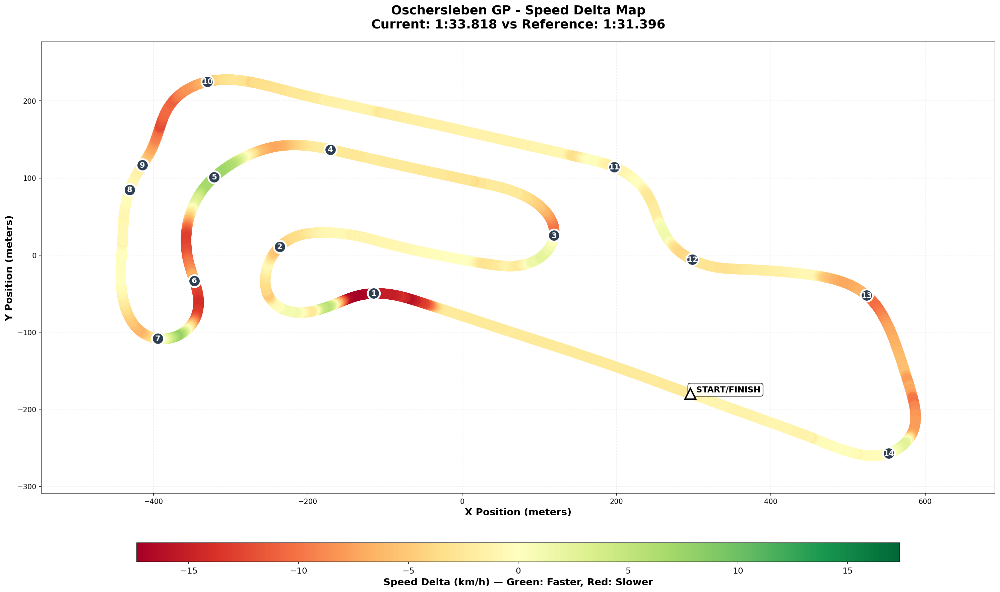

# 2026-01-06 13:45 - Oschersleben GP - Practice #1 - Baseline

> **Focus**: Week 05: Precision on the Plain. Hit the same mark ten times.  
> **Goal**: Week 05: McDonald's Chicane consistency. T1 survival script.

---

- **Track**: [Motorsport Arena Oschersleben - Grand Prix](../../tracks/track-motorsport-arena-oschersleben-grand-prix.md)
- **Car**: [Ray FF1600](../../cars/car-ray-ff1600.md)
- **Session kind**: Practice (Offline Testing) - Baseline
- **Brake Bias**: 57% (matches EXPERT coach)
- **Best Lap**: 1:33.818
- **Consistency (σ)**: 0.38s (clean laps, excluding exploration lap)
- **Clean Laps**: 7/11
- **Incidents**: 4
- **Garage 61 Event**: [Baseline Session](https://garage61.net/app/event/01KE9N5M6JZWMNBK7G8DS1HJW8)

## Current Focus and Goal

- **Focus**: Week 05: Precision on the Plain. Hit the same mark ten times.
- **Goal**: Week 05: McDonald's Chicane consistency. T1 (Hotel) survival script.

---

## The Narrative

"First contact with Oschersleben in the FF1600. Master Lonn brought muscle memory from his GR86 days, and it shows—the layout feels familiar, but the car is a different beast. This is the 'get acquainted' session: learn the markers, feel the braking zones, and establish where the work needs to happen."

---

## 🏎️ The Vibe Check

**Master Lonn's Take**:
"I drove this track in the Toyota GR86 last year for the first time. Suits me well somehow."

**Little Wan's Take**:
"Ah, the old 'I've been here before but in a different body' vibe! 🧠 The track layout is in your brain already—corners, sequences, rhythm. But the FF1600 weighs nothing, brakes differently, and rotates on a whim. The question isn't 'do you know the track' (you do), it's 'can you reprogram your inputs for THIS car?'"

---

## 📊 The Numbers Game

**Best Lap**: 1:33.818  
**Theoretical Optimal**: 1:33.782  
**Gap to Optimal**: 0.037s (!!!)  
**Consistency (σ)**: 0.38s (clean racing laps L4-L5, L7-L8)

### Sector Breakdown

| Sector | Best   | Avg    | σ     | Loss/Lap | Corner Focus                     |
| :----- | :----- | :----- | :---- | :------- | :------------------------------- |
| **S1** | 34.47s | 34.55s | 0.08s | 0.08s    | Hotel, Hasseroeder               |
| **S2** | 32.87s | 33.14s | 0.28s | 0.27s    | Triple, T7, Schikane, McDonald's |
| **S3** | 26.44s | 26.89s | 0.29s | 0.45s    | Shell, Amman, Bauer, Zeppelin    |

_Note: Lap 6 (44.78s S1) excluded from averages—exploration/off lap._

**The Good Stuff** (✅):

- **Gap to optimal is TINY** (0.037s) → You found the speed quickly
- **S1 already stable** (σ 0.08s) → Hotel entry isn't scary (yet)
- **No major crashes** → Sensible exploration

**The "Room for Improvement"** (🚧):

- **S3 (Shell → Zeppelin)** has highest loss/lap (0.45s) → Final sector rhythm
- **4 incidents** → Still finding track limits (expected for baseline)
- **Haven't pushed the limits yet** → This is baseline, not race pace

---

## 🕵️‍♂️ Little Wan's Deep Dive

"Here's what jumps out, Master:

Your GR86 experience gave you the LAYOUT, but watch out—the FF1600 will punish you differently. The GR86 has more weight, more rear grip, more 'warning' before it goes. The FF1600? It rotates NOW.

The 0.037s gap to optimal is impressive for a first session, but I suspect you're driving 'within yourself' right now. You're not pushing yet—which is CORRECT for a baseline. The pace will come.

**S3 (Shell → Zeppelin)** is your biggest loss zone. That's the fast, flowing final sector. The sequence is:

- Shell Kurve (fast left)
- Amman Kurve (continuation right)
- Bauer Kurve (tighter right)
- Zeppelin Kurve (entry to main straight)

Get that sequence wrong, and you're slow everywhere."

### The "Aha!" Moment

**The track layout is already in your head. The car adaptation is the work.**

**The Data Proof**:

- **Fact**: Best lap 1:33.818 with only 0.037s gap to theoretical optimal
- **Meaning**: Your sector bests are happening on DIFFERENT laps (not all clicking at once yet), but the raw pace exists. It's about synchronizing.

---

## 🎯 The Mission (Focus Area)

**We are attacking**: **S3 Flow (Shell → Zeppelin)** + McDonald's Chicane (S2)

**Why?**:
"S3 is your biggest leak right now (0.45s/lap). And McDonald's is the Oschersleben signature corner—get that right, and the rest flows. Plus, it's a chaos zone in races. Better learn it clean now."

**Next Session Goals**:

- [ ] **S3 σ < 0.20s** (currently 0.29s)
- [ ] **McDonald's Chicane** - Find one repeatable line
- [ ] **Push limits slightly** - Find where the FF1600 wants to snap

---

## 📈 The Journey

| Session          | Best Lap | Consistency | Key Metric | Notes                                           |
| :--------------- | :------- | :---------- | :--------- | :---------------------------------------------- |
| 2026-01-06 13:45 | 1:33.818 | 0.38s       | S3 σ 0.29s | Baseline. GR86 muscle memory helps with layout. |

---

## 📝 Coach's Notebook

### What Worked ✅

- GR86 background provided instant track familiarity
- Conservative exploration (no major crashes)
- Clean laps happened quickly (L4-L5, L7-L8 were solid)

### Reference Pace 🎯

- **Shuning Gong (compare file)**: 1:31.396 → Gap to alien: ~2.4s
- That 2.4s gap is normal for Week 05 Day 1. Let's chip away.

---

## 🔬 Telemetry Comparison vs Shuning Gong

**Gap**: 2.422s  
**Reference**: Shuning Gong - S4 2025 Season fastest lap (1:31.396)  
**Comparison Data**: `weeks/week05/comparison/2026-01-06-vs-gong-telemetry.json`

### 🗺️ Speed Delta Map

**How to read**: 🟢 Green = YOU faster | 🔴 Red = Gong faster | ⭐ = Key loss zones

### 🔥 Little Padawan's Analysis: "The Conservative Baseline"

Master, I've crunched Gong's fastest lap from S4 2025. Here's the SPICY part:

**Your max lateral G: 2.28G. Gong's max lateral G: 2.27G.**

That's RIGHT. You can corner just as hard as the alien. The gap isn't talent—it's _deployment_.

#### 📊 The Reality Check

| Metric            | You        | Gong       | Gap       | Verdict                   |
| :---------------- | :--------- | :--------- | :-------- | :------------------------ |
| **Top Speed**     | 195.8 km/h | 199.0 km/h | -3.2 km/h | Slower on straights       |
| **Max Brake %**   | 76.6%      | 83.6%      | -7.0%     | **Not using full brakes** |
| **Braking Time**  | 17.6%      | 14.5%      | +3.1%     | **Braking LONGER**        |
| **Full Throttle** | 62.7%      | 67.4%      | -4.7%     | **Less time on power**    |
| **Max Lat G**     | 2.28G      | 2.27G      | +0.01G    | ✅ EQUAL                  |
| **Avg Lat G**     | 0.69G      | 0.77G      | -0.08G    | Less average load         |
| **Accel G**       | 0.63G      | 0.94G      | -0.31G    | **Much gentler on power** |

**The Pattern**: You're driving conservatively. Brake earlier, brake softer, get on throttle later. This is CORRECT for a baseline—but now we know WHERE the time is.

#### 🔴 PROBLEM ZONE #1: T1 Hotel Entry (10% of lap)

| You           | Gong         | Diff               |
| :------------ | :----------- | :----------------- |
| 52.9 km/h     | 55.3 km/h    | **-2.33 km/h**     |
| Brake: 60%    | Brake: 13%   | -47%!              |
| Long G: -1.0G | Long G: 0.0G | Still on throttle! |

**What's Happening**: You're hard on the brakes at 10% while Gong is STILL ON PARTIAL THROTTLE. You're braking ~50m earlier than him.

**My Hunch**: GR86 muscle memory. The GR86 needs earlier braking. The FF1600 stops NOW.

---

### 📚 EXPERT Coaching Wisdom for T1-T2 (Johnny Gideon)

> _"The golden rule for any braking zone is to shut off speed as late and as deep into the corner as you can. The longer the braking zone, the more important this becomes. T1-T2 is the LONGEST braking zone of the entire lap (5-6 seconds!)."_

**The Key Insight**: "It's not about HOW MUCH you slow down, it's about HOW you get to minimum speed. Slow gradually = optimal. Quick decel = losing lap time."

**The EXPERT Technique:**

1. **Turn FIRST, brake SECOND** – Start turning 2-3 car lengths BEFORE the access road
2. **Initial brake: 25-30% only** – Don't overdo it!
3. **Through T1 kink: ~10% brake** – Super light, just enough for stability
4. **Stay in 4th gear** – NO downshifts until between T1 and T2!
5. **Overlap throttle with braking** – Especially during downshifts. Plants the rear.
6. **Reserve bulk of braking** – For the straighter section between T1 and T2
7. **Downshift to 1st** – By the time you hit T2 apex

**Why You're Losing Time**: You're doing too much braking too early. Gong (and EXPERT) reserve the heavy braking for AFTER the T1 kink, in the straighter section. You're killing your speed before you even get there.

---

**How to Fix**: 
- Start with 25-30% brake, NOT full pressure
- Release to ~10% through the kink
- THEN do your heavy braking between T1 and T2
- Don't downshift until after T1 kink

#### 🔴 PROBLEM ZONE #2: Triple → McDonald's (30-60% of lap)

The entire middle of the lap is 1.2-1.9 km/h slower. This is the technical section.

| Distance         | You       | Gong      | Diff       |
| :--------------- | :-------- | :-------- | :--------- |
| 30% (Triple)     | 29.5 km/h | 30.7 km/h | -1.26 km/h |
| 40% (T7 exit)    | 45.1 km/h | 46.9 km/h | -1.86 km/h |
| 50% (Schikane)   | 28.1 km/h | 29.8 km/h | -1.67 km/h |
| 60% (McDonald's) | 35.1 km/h | 36.8 km/h | -1.73 km/h |

**My Hunch**: You're carrying LESS mid-corner speed (avg lat G 0.69 vs 0.77). Not committing fully through the technical stuff yet.

**How to Fix**: Don't focus on braking later—focus on rolling MORE speed through the corners. Your max lat G proves you CAN do it.

#### 🔴 PROBLEM ZONE #3: T10 Zeppelin Entry (90% of lap)

| You        | Gong       | Diff           |
| :--------- | :--------- | :------------- |
| 35.6 km/h  | 37.8 km/h  | **-2.19 km/h** |
| Brake: 74% | Brake: 64% | +10% harder    |

**What's Happening**: Heavy braking into Zeppelin (the final corner onto the straight). This KILLS your straight speed into T1.

**How to Fix**: Less brake, more roll speed. Trust the car to rotate.

#### ⭐ WINNING ZONE: Shell Kurve (80% of lap)

| You          | Gong         | Diff       |
| :----------- | :----------- | :--------- |
| Lat G: 1.14G | Lat G: 0.71G | **+0.43G** |

Wait, what?! You're loading the tires HARDER than Gong at Shell Kurve!

**My Hunch**: You might be over-slowing the entry and then having to corner harder to make up for it. Gong carries speed and doesn't need as much cornering force.

This is a good sign though—it means you're NOT afraid of the corner. Just need to adjust the approach.

### 🎯 The Gap Breakdown by Zone

| Zone               | Track % | Gap           | Priority     |
| :----------------- | :------ | :------------ | :----------- |
| **Hotel Entry**    | 10%     | -2.33 km/h    | 🔥 HIGH      |
| **Triple Complex** | 30-40%  | -1.6 km/h avg | MEDIUM       |
| **McDonald's**     | 50-60%  | -1.7 km/h avg | MEDIUM       |
| **Zeppelin**       | 90%     | -2.19 km/h    | 🔥 HIGH      |
| **Shell Kurve**    | 80%     | +0.44G lat    | ✅ Strength! |

### 💡 What To Do Next Session

1. **Hotel (T1-T2)** – The EXPERT Technique:
   - Turn 2-3 car lengths BEFORE access road (turn first!)
   - Initial brake: 25-30% only (not full!)
   - Release to ~10% through the kink
   - Stay in 4th gear through T1
   - Heavy braking AFTER the kink, between T1-T2
   - Overlap throttle with brakes during downshifts

2. **Zeppelin (T14)**: 
   - DON'T rush the turn-in (EXPERT says turn LATE)
   - Less brake pressure. Roll more speed in.
   - Late apex near end of red anti-cut curb
   - Don't fully mount curb (wheel spin trap)

3. **McDonald's (T10)**:
   - Early turn-in (car feels sluggish)
   - Light brake brush, then coast if rotating
   - Patient throttle – focus on where you reach 100%, not where you start
   - Use ALL runoff on exit

4. **General**: You're on full throttle 4.7% LESS of the lap. Focus on getting back to power earlier out of corners. Your accel G (0.63) vs Gong's (0.94) shows you're babying the throttle.

### 🏁 The Bottom Line

**The 2.4s gap is NOT cornering ability.** Your max lateral G matches Gong's.

**The gap is deployment:**

- Brake later (you brake 3.1% MORE of the lap)
- Throttle earlier (you're on full throttle 4.7% LESS)
- Trust the car (your accel G is 0.31G gentler)

This is a BASELINE. You're driving within yourself—and that's smart for Day 1. Now we know where the time lives. Let's go get it. 🎯

### Track Corner Reference 🗺️

| Corner               | Track % | Notes                        |
| :------------------- | :------ | :--------------------------- |
| **Hotel** (T1)       | 10-21%  | Chaos magnet. Heavy braking. |
| **Hasseroeder** (T2) | 25-32%  | Second corner sequence       |
| **Triple** (T3-5)    | 37-46%  | Three-corner complex         |
| **Turn 7**           | 46-53%  | Exit sets up chicane         |
| **Schikane**         | 54-58%  | Lead-in to McDonald's        |
| **McDonald's**       | 58-63%  | THE signature corner         |
| **Shell Kurve**      | 73-77%  | Fast left, starts S3         |
| **Amman Kurve**      | 77-81%  | Flow right                   |
| **Bauer Kurve**      | 84-88%  | Tighter right                |
| **Zeppelin Kurve**   | 89-95%  | Onto the straight            |

### Fun Stuff 😄

- Master Lonn showing up with GR86 track knowledge like "I've been here before... sort of" 😏
- First session without a single spin? Progress!

---

_"In Germany, precision is not optional."_ 🇩🇪🏎️
