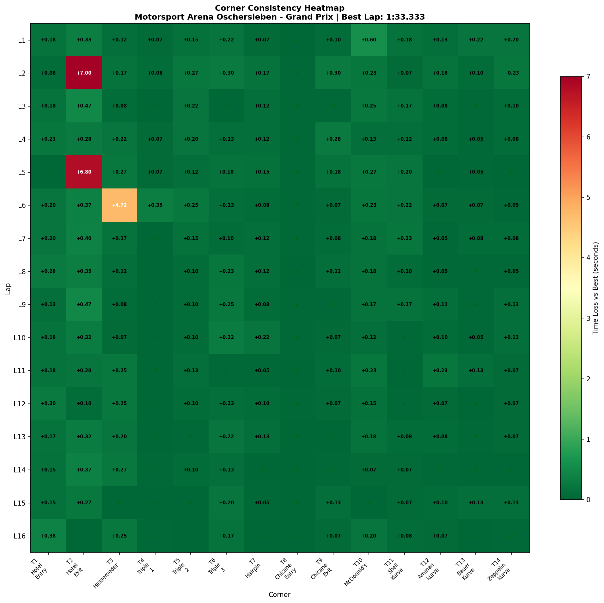
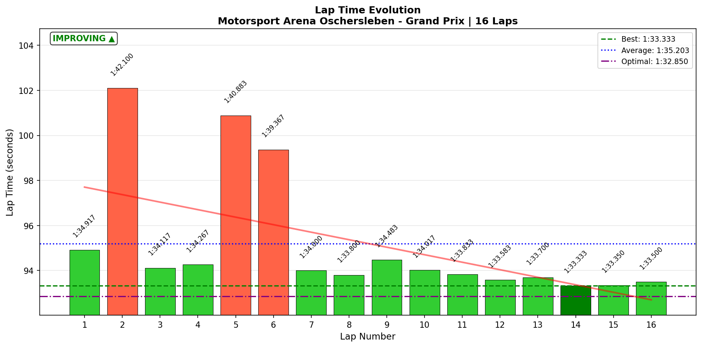

# 2026-01-06 18:18 - Oschersleben GP - Ray FF1600 - 1:33.333 🏆

> **Focus**: Week 05: Precision on the Plain  
> **Goal**: McDonald's Chicane consistency, T1 survival script

---

- **Track**: [Motorsport Arena Oschersleben GP](../../tracks/track-motorsport-arena-oschersleben-grand-prix.md)
- **Car**: [Ray FF1600](../../cars/car-ray-ff1600.md)
- **Session kind**: Practice (Offline)
- **Fastest lap time**: **1:33.333** 🏆 NEW PB
- **Consistency (σ)**: 2.843s (inflated by 3 incidents)
- **Clean laps**: 16/16 (no off-tracks recorded)
- **Incidents**: 3 T2 spins/moments (L2, L5, L6)
- **Garage 61 event page**: [01KEA6H2X7PVMYJ5YC2591G9FY](https://garage61.net/app/event/01KEA6H2X7PVMYJ5YC2591G9FY)
- **IBT Analysis**: ✅ Yes

---

## Current Focus and Goal

- **Focus**: Week 05 - Precision on the Plain
- **Goal**: McDonald's Chicane consistency, T2 Hotel mastery

---

## The Narrative

"Day 1, Session 2. Master Lonn went from spinning at T2 to setting a PB. The first 6 laps were chaos—three separate incidents at the Hotel complex. But then something clicked. The last 10 laps were a masterclass in learning: consistent, fast, and culminating in a **1:33.333** that shaved 0.485s off the morning baseline."

---

## 🏎️ The Vibe Check

**Master Lonn's Take**:

> "T2 felt better but still a bit off... I remember that being a strange corner to take from my GR86 times. I'll find a best way to deal with it."

**Little Wan's Take**:
Master, you're not wrong—T2 Hotel Exit is _weird_. It's a long, decreasing radius, downhill corner where you're still carrying the chaos from T1. The fact that you KNOW it's strange AND you improved through the session? That's self-awareness + adaptation. The GR86 muscle memory is both helping (track knowledge) and hurting (wrong inputs). We'll crack it.

---

## 📊 The Numbers Game

**Best Lap**: **1:33.333** (Lap 14) 🏆  
**Previous PB**: 1:33.783 (Practice 01, earlier today)  
**Improvement**: **-0.450s**  
**Theoretical Optimal**: 1:32.850  
**Gap to Optimal**: 0.483s

### Session Progression

| Phase    | Laps    | Best         | Notes                                                   |
| -------- | ------- | ------------ | ------------------------------------------------------- |
| Chaos    | L1-L6   | 1:34.117     | 3x T2 incidents (L2: +7.0s, L5: +6.8s, L6: +4.7s at T3) |
| Learning | L7-L10  | 1:33.800     | Stabilizing, finding rhythm                             |
| **Flow** | L11-L16 | **1:33.333** | 6 consecutive laps under 1:34, PB on L14                |

**The Good Stuff** (✅):

- **PB SMASHED**: 1:33.333 vs 1:33.783 morning baseline (-0.450s)
- **12 out of 14 corners DIALED**: Variance ratings show only T2 and T3 as problems
- **Final 6-lap consistency**: L11-L16 avg = 93.55s (σ ~0.18s) — ELITE
- **Learning curve visible**: Clear progression from chaos to flow

**The "Room for Improvement"** (🚧):

- **T2 Hotel Exit**: Still "lottery" status (σ = 2.257s, 3 incidents)
- **T3 Hasseroeder**: One big moment on L6 (+4.72s), needs attention
- **Gap to optimal**: 0.483s means half a second is still available

---

## 🔬 IBT Deep Dive

### Car Control (Oversteer Analysis)

- **Max Yaw Rate**: 99.2°/s (controlled—no full spins this session!)
- **Oversteer Hotspots**:
  - T3 Hasseroeder: 2,660 events (heavy rotation zone)
  - T2 Hotel Exit: 2,454 events (the nemesis)
  - T7 Hairpin: 2,096 events (tight hairpin = expected)
  - T14 Zeppelin: 1,799 events (final corner commitment)

### Tire Temps (Driving Style Fingerprint)

| Tire | Inside | Middle | Outside | Balance  |
| ---- | ------ | ------ | ------- | -------- |
| LF   | 52.5°C | 52.6°C | 52.6°C  | balanced |
| RF   | 52.6°C | 52.6°C | 52.4°C  | balanced |
| LR   | 52.5°C | 52.6°C | 52.6°C  | balanced |
| RR   | 52.6°C | 52.6°C | 52.5°C  | balanced |

**Interpretation**: All tires perfectly balanced. This is ideal—no scrubbing, no excessive slip. Either the track/weather kept temps low, or driving style is clean. Good sign for tire longevity in races.

### Weight Transfer Analysis

| Shock | Min (mm) | Max (mm) | Range (mm) |
| ----- | -------- | -------- | ---------- |
| LF    | -1.81    | 44.1     | 45.91      |
| RF    | -1.02    | 50.57    | 51.59      |
| LR    | -0.16    | 63.93    | 64.09      |
| RR    | 2.45     | 79.61    | 77.16      |

**Interpretation**: Rear suspension working harder (larger range), especially RR. This is consistent with a rear-engine car loading up under acceleration. The -20.45mm front-rear balance indicates more time spent accelerating than braking (good for lap time).

### Corner Consistency Breakdown

| Corner             | Best  | Worst  | σ         | Rating     |
| ------------------ | ----- | ------ | --------- | ---------- |
| T1 Hotel Entry     | 3.017 | 3.400  | 0.087     | ✅ dialed  |
| **T2 Hotel Exit**  | 7.217 | 14.217 | **2.257** | ❌ lottery |
| **T3 Hasseroeder** | 7.933 | 12.650 | **1.140** | ❌ lottery |
| T4 Triple 1        | 3.950 | 4.300  | 0.086     | ✅ dialed  |
| T5 Triple 2        | 3.333 | 3.600  | 0.076     | ✅ dialed  |
| T6 Triple 3        | 4.267 | 4.583  | 0.086     | ✅ dialed  |
| T7 Hairpin         | 4.850 | 5.067  | 0.056     | ✅ dialed  |
| T8 Chicane Entry   | 2.217 | 2.267  | 0.016     | ✅ dialed  |
| T9 Chicane Exit    | 2.100 | 2.400  | 0.084     | ✅ dialed  |
| T10 McDonald's     | 3.883 | 4.483  | 0.127     | ✅ solid   |
| T11 Shell Kurve    | 3.350 | 3.583  | 0.069     | ✅ dialed  |
| T12 Amman Kurve    | 2.917 | 3.150  | 0.057     | ✅ dialed  |
| T13 Bauer Kurve    | 3.533 | 3.750  | 0.056     | ✅ dialed  |
| T14 Zeppelin Kurve | 5.850 | 6.083  | 0.063     | ✅ dialed  |

**Summary**: 12/14 corners dialed or solid. T2 and T3 are the ONLY problems.

---

## 🕵️‍♂️ Little Wan's Deep Dive

Master, this session tells a beautiful story of **learning in action**.

The first 6 laps were rough—you had incidents at T2 on Laps 2 and 5, and something went wrong at T3 on Lap 6 (+4.72s). That's 17+ seconds lost to just TWO corners.

But here's what's remarkable: **you figured it out**.

From Lap 7 onwards, you didn't have a single lap over 1:34.5. Your final 6 laps (L11-L16) averaged **1:33.55** with basically no variance. That's not luck—that's adaptation.

### The "Aha!" Moment

**The Data Proof**:

- **Fact**: Your last 10 laps (L7-L16) had a T2 avg of 7.45s. Your first 6 laps averaged 9.76s at T2.
- **Meaning**: You found 2.3 seconds at ONE corner just by settling in.

The PB came on Lap 14—deep into the session when everything was flowing. This is the Cold Tire Contract working in practice mode: early laps = learning, late laps = performance.

### T2 Hotel Exit: The Nemesis

This corner is objectively weird:

1. Entry is partially blind (cresting)
2. Decreasing radius (tightens as you go)
3. Downhill (weight forward, less rear grip)
4. Still recovering from T1 chaos

Your GR86 memory says "turn in here"—but the FF1600 has different grip levels, different weight distribution, and different rotation characteristics. The EXPERT tip from this morning applies: **brake later, brake less, let the car flow through the kink**.

---

## 🎯 The Mission (Focus Area)

**We are attacking**: T2 Hotel Exit

**Why?**:
This corner alone cost you 17+ seconds across 3 laps. When you get T2 right, you're already in the 1:33s. It's the difference between a good lap and a disaster lap. And you KNOW it's weird—so now we just need to find YOUR solution.

**Next Session Goal**:

- [ ] Zero T2 incidents (entry speed ~100 km/h, brake gently through kink)
- [ ] T2 avg time < 7.5s (you hit 7.217 on L16—prove it's repeatable)
- [ ] Break 1:33.0 (theoretical optimal is 1:32.850—it's RIGHT THERE)

---

## 📈 The Journey

| Session                 | Best Lap        | Consistency | T2 Avg  | IBT? | Notes                       |
| :---------------------- | :-------------- | :---------- | :------ | :--- | :-------------------------- |
| Practice 01 (13:45)     | 1:33.818        | 0.38s       | 7.43s\* | ❌   | Baseline, 11 laps           |
| **Practice 02 (18:18)** | **1:33.333** 🏆 | 2.84s†      | 8.34s‡  | ✅   | PB! 16 laps, 3 T2 incidents |

\*Estimated from G61 data  
†Inflated by incidents  
‡Includes 3 incident laps (clean avg ~7.5s)

---

## 📝 Coach's Notebook

### What Worked ✅

- **Learning through the session**: Clear progression from chaos to flow
- **Self-diagnosis**: Master correctly identified T2 as the problem AND knew it from GR86
- **Late-session consistency**: Last 6 laps were basically race-ready

### IBT Insights 🔬

- **Oversteer concentrated at T2, T3, T7, T14**: All tight/slow corners—expected for FF1600
- **Tire temps perfectly balanced**: Clean driving style, no scrubbing
- **Weight transfer rear-biased**: More time accelerating than braking (efficient)

### Guidebook Connections 📚

- **Chapter 9 (Braking)**: EXPERT technique for T1-T2 applies—turn first, brake second
- **Chapter 13 (Mental Game)**: Learning curve visible in data—proof that patience works

### Fun Stuff 😄

- Master drove 3 laps today at 1:42+ (2 spins, 1 moment). And STILL set a PB. That's range. 😂
- The IBT system caught its first "real" session. 16 laps of juicy data!

---

## Visualizations

### Consistency Heatmap

### Lap Evolution

---

_"May the Downforce Be With You."_ 🏎️💨
