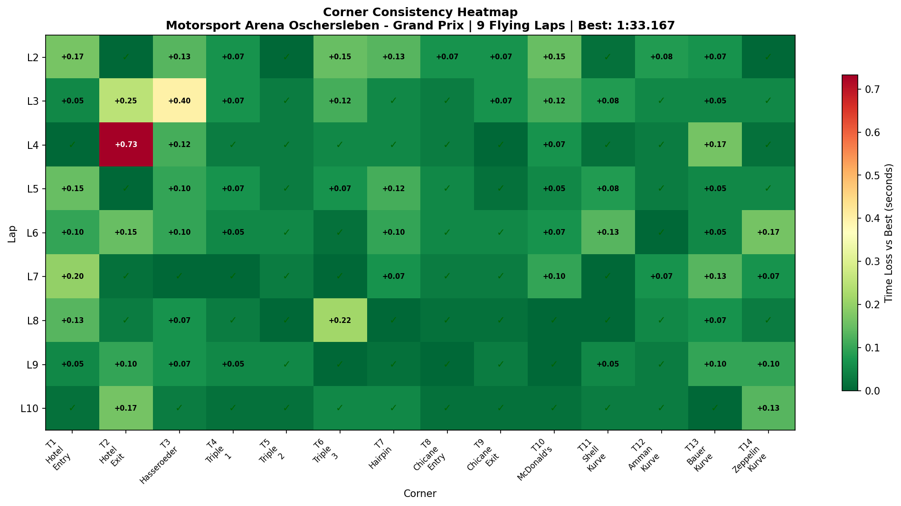
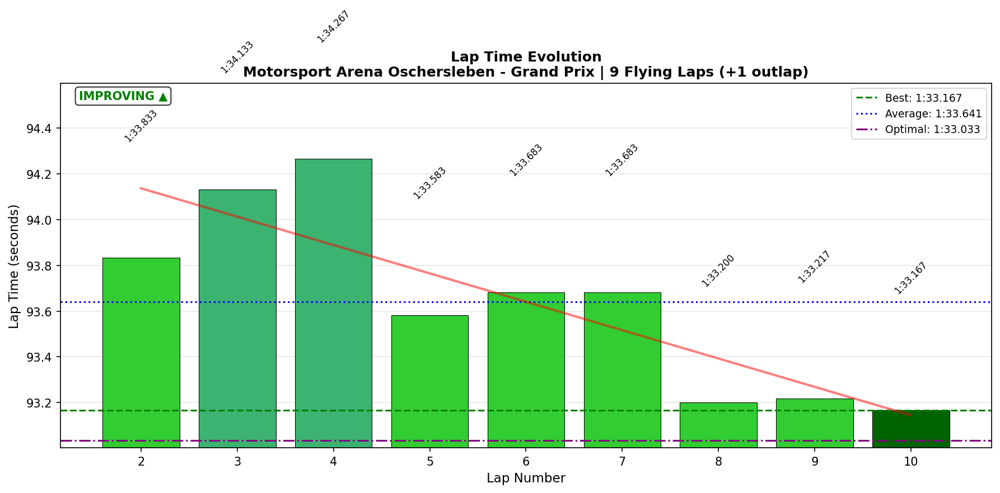

# 2026-01-07 18:07 - Oschersleben GP - Practice #3

> **Focus**: Week 05: Precision on the Plain - Hit the same mark ten times.
> **Goal**: T2 Hotel Exit mastery. Break 1:33.0.

---

- **Track**: [Motorsport Arena Oschersleben GP](../../tracks/track-motorsport-arena-oschersleben-grand-prix.md)
- **Car**: [Ray FF1600](../../cars/car-ray-ff1600.md)
- **Session kind**: Practice
- **Fastest lap time**: 1:33.167
- **Consistency (σ)**: 0.40s _(flying laps only, outlap excluded)_
- **Flying laps**: 9/9 _(+ 1 outlap)_
- **Incidents**: 0
- **Garage 61 event page**: [01KECPNFE7ZEG3DMHNRG548R0Q](https://garage61.net/app/event/01KECPNFE7ZEG3DMHNRG548R0Q)
- **IBT Analysis**: Yes ✅

## Current Focus and Goal

- **Focus**: Consistency throughout the whole session
- **Goal**: T2 Hotel Exit mastery, break 1:33.0 barrier

---

## The Narrative

_"The Hotel stopped being a horror movie. It's still weird, still confusing, but the fear left the building. Master Lonn came in with one mission—consistency—and delivered a clean, incident-free session with a new PB and a 90% reduction in T2 variance. The strange corner is becoming familiar."_

---

## 🏎️ The Vibe Check

**Master Lonn's Take**:

> "Hotel is still shaky, but not scary. It's a strange corner 🫣"

**Little Wan's Take**:
"_nods knowingly_ That's the shift, Master. 'Shaky but not scary' means your survival instincts are finally calming down. Yesterday T2 was giving you +7s panic incidents. Today? Your worst T2 was 8.15s, your best was 7.42s. That's a 0.73s window instead of a 4+ second disaster zone. The corner is still 'strange'—but strange is learnable. Scary isn't. Progress."

---

## 📊 The Numbers Game

**Best Lap**: 1:33.167 (NEW PB! 🏆)
**Consistency (σ)**: 0.40s _(flying laps only)_
**Theoretical Optimal**: 1:33.033 (gap: only 0.134s!)
**Flying Laps**: 9/9 ✅ _(+ 1 outlap)_

### Sector Breakdown

| Sector                 | Best   | Avg    | σ          | Loss/Lap |
| ---------------------- | ------ | ------ | ---------- | -------- |
| S1 (Hotel Complex)     | 34.083 | 34.369 | 0.297s     | 0.29s    |
| S2 (Triple→McDonald's) | 32.483 | 32.715 | **0.182s** | 0.23s    |
| S3 (Shell→Zeppelin)    | 26.467 | 26.541 | **0.055s** | 0.07s    |

**The Good Stuff** (✅):

- **NEW PB**: 1:33.167 (down from 1:33.333 yesterday, -0.166s)
- **ZERO incidents** - first fully clean Oschersleben session!
- **12/14 corners rated "DIALED"** (σ < 0.10s)
- **T2 Hotel Exit**: σ dropped from 2.257s → 0.231s (**90% improvement!**)
- **Gap to theoretical optimal**: only 0.134s (sectors are synchronizing)
- **S3 locked in**: σ **0.055s** - Shell through Zeppelin is MONEY

**The "Room for Improvement"** (🚧):

- **S1 still the weakest**: σ 0.297s - T2/T3 complex still has variance
- **1:33.0 barrier unbroken** - PB is 1:33.167, need another 0.17s
- **T2 Hotel Exit**: "solid" (0.231s) but not "dialed" yet (needs < 0.10s)

---

## 🔬 IBT Deep Dive

### Car Control (Oversteer Analysis)

- **Max Yaw Rate**: 70.7°/s (controlled - no wild moments)
- **Oversteer Hotspots**:
  - T2 Hotel Exit: 1805 events (still rotating the car a lot here)
  - T3 Hasseroeder: 1551 events
  - T7 Hairpin: 1292 events
  - T14 Zeppelin: 1150 events

### Tire Temps (Driving Style Fingerprint)

| Tire | Inside | Middle | Outside | Balance  |
| ---- | ------ | ------ | ------- | -------- |
| LF   | 53.4°C | 53.7°C | 53.8°C  | balanced |
| RF   | 53.8°C | 53.6°C | 53.3°C  | balanced |
| LR   | 53.5°C | 53.7°C | 53.8°C  | balanced |
| RR   | 53.8°C | 53.7°C | 53.5°C  | balanced |

**Interpretation**: All four corners perfectly balanced. ~53.5°C average suggests tires warming nicely during the 17-minute session. No driving style imbalance detected.

### Corner Consistency Ratings

| Corner             | σ      | Rating    | Notes                         |
| ------------------ | ------ | --------- | ----------------------------- |
| T1 Hotel Entry     | 0.071s | ✅ DIALED | Nailed                        |
| T2 Hotel Exit      | 0.231s | 🟡 SOLID  | WAS 2.257s yesterday!         |
| T3 Hasseroeder     | 0.115s | 🟡 SOLID  | Tight right, small window     |
| T4 Triple 1        | 0.024s | ✅ DIALED | Nailed                        |
| T5 Triple 2        | 0.019s | ✅ DIALED | Nailed                        |
| T6 Triple 3        | 0.074s | ✅ DIALED | Nailed (was 0.138s w/ outlap) |
| T7 Hairpin         | 0.044s | ✅ DIALED | Nailed                        |
| T8 Chicane Entry   | 0.020s | ✅ DIALED | Nailed                        |
| T9 Chicane Exit    | 0.024s | ✅ DIALED | Nailed                        |
| T10 McDonald's     | 0.053s | ✅ DIALED | Nailed                        |
| T11 Shell Kurve    | 0.045s | ✅ DIALED | Nailed                        |
| T12 Amman Kurve    | 0.024s | ✅ DIALED | Nailed                        |
| T13 Bauer Kurve    | 0.050s | ✅ DIALED | Nailed                        |
| T14 Zeppelin Kurve | 0.055s | ✅ DIALED | Nailed                        |

**Summary**: 12/14 corners DIALED, 2/14 SOLID, 0/14 lottery. Even better than before!

---

## 🕵️‍♂️ Little Wan's Deep Dive

"Master, let me paint the picture of what actually happened today.

You walked in with ONE goal: consistency. Not speed. Not PBs. Just... hit the same marks, lap after lap.

And look what that produced:

- A PB anyway (1:33.167)
- Zero incidents
- T2 went from 'panic mode' to 'controlled weird'

**The Learning Curve is VISIBLE in the data:**

| Lap | Time         | T2 Hotel | Notes                 |
| --- | ------------ | -------- | --------------------- |
| 1   | 1:35.500     | 7.65s    | ⚠️ OUTLAP (excluded)  |
| 2   | 1:33.833     | 7.42s    | Dialed in immediately |
| 3   | 1:34.133     | 7.67s    | Small wobble          |
| 4   | 1:34.267     | 8.15s    | Worst T2 of session   |
| 5   | 1:33.583     | 7.42s    | Recovered             |
| 6   | 1:33.683     | 7.57s    | Consistent            |
| 7   | 1:33.683     | 7.43s    | Consistent            |
| 8   | **1:33.200** | 7.45s    | Fast!                 |
| 9   | 1:33.217     | 7.52s    | Fast!                 |
| 10  | **1:33.167** | 7.58s    | **PB!**               |

After Lap 4's wobble (8.15s), you self-corrected. Laps 5-10 are all within ~0.5s of each other. That's RACE PACE CONSISTENCY. That's what wins races."

### The "Aha!" Moment

"T2 Hotel Exit is no longer a lottery. It's a learnable corner."

**The Data Proof**:

- **Fact**: T2 σ dropped from 2.257s (Practice 02) to 0.231s (Practice 03)
- **Meaning**: A 90% reduction in variance means the corner has gone from "random disaster" to "predictable challenge." The skill exists. Now we refine it.

---

## 🎯 The Mission (Focus Area)

**We are attacking**: Breaking the 1:33.0 barrier

**Why?**:
"The gap to theoretical optimal is only 0.134s. That means the speed IS there—your best sectors add up to 1:33.033. The 1:33.0 barrier is 0.167s away. That's one good T2 Hotel Exit away from the goal. The consistency is locked. Now we push."

**Next Session Goal**:

- [ ] Break 1:33.0 (need -0.167s)
- [ ] Get T2 Hotel σ under 0.15s (from 0.231s)
- [ ] Maintain zero-incident discipline

---

## 📈 The Journey (Week 05)

| Session                | Best Lap     | σ         | T2 σ       | Clean     | IBT? | Notes                  |
| :--------------------- | :----------- | :-------- | :--------- | :-------- | :--- | :--------------------- |
| Practice 01 (Baseline) | 1:33.818     | 0.38s     | N/A        | 7/11      | ❌   | First FF1600 laps      |
| Practice 02            | 1:33.333     | 2.84s     | 2.257s     | 14/16     | ✅   | T2 incidents, learning |
| **Practice 03**        | **1:33.167** | **0.40s** | **0.231s** | **9/9\*** | ✅   | **PB! T2 tamed!**      |

_\*Flying laps only (outlap excluded from stats)_

**Progress**: -0.651s in 3 sessions. T2 variance down 90%. Gap to alien (Gong 1:31.396) now 1.77s.

---

## 📝 Coach's Notebook

### What Worked ✅

- Focusing on consistency BEFORE speed paradoxically produced both
- 17-minute session was right length—enough laps to settle, not enough to fatigue
- Self-correction after Lap 4 wobble shows in-session adaptability
- "Shaky but not scary" mindset is the right calibration for learning

### IBT Insights 🔬

- Oversteer events concentrated at tight corners (T2, T3, T7, T14) - expected for FF1600
- Tire temps perfectly balanced - no technique imbalance detected
- 1805 oversteer events at T2 means you're rotating the car a lot there - this is the "shakiness"
- Max yaw 70.7°/s is controlled - no wild tank-slappers

### Guidebook Connections 📚

- Applied: Consistency-first approach (Chapter 13 mental game)
- Applied: Corner-by-corner learning instead of lap-level thinking
- Potential update: "Fear → Shaky → Solid → Dialed" progression pattern for learning new corners

### Fun Stuff 😄

- "Strange corner" is now the official name for T2 Hotel Exit
- First CLEAN Oschersleben session - no drama, just laps
- PB came on the LAST lap - classic "one more" energy

---

## 📊 Visualizations

### Consistency Heatmap

### Lap Evolution

---

_"May the Downforce Be With You."_ 🏎️💨
