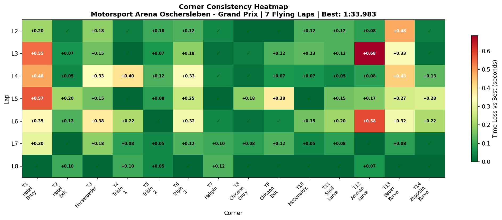

# 2026-01-08 10:21 - Oschersleben GP - AI Race 01 🏆

> **Focus**: Week 05: Precision on the Plain
> **Goal**: T2 Hotel Exit mastery. Break 1:33.0.

---

- **Track**: [Motorsport Arena Oschersleben GP](../../tracks/track-motorsport-arena-oschersleben-grand-prix.md)
- **Car**: [Ray FF1600](../../cars/car-ray-ff1600.md)
- **Session Type**: AI Race
- **Grid Position**: P6 (Quali 1:34.045)
- **Finish Position**: P1 🏆
- **Fastest Lap**: 1:33.983 (Lap 8)
- **Consistency (σ)**: 0.972s
- **Flying Laps**: 7
- **Incidents**: 0
- **Garage 61 Event**: [01KEED6AXHEFHRQ3WRFB9RM8E5](https://garage61.net/app/event/01KEED6AXHEFHRQ3WRFB9RM8E5)
- **IBT Analysis**: Yes ✅

---

## Current Focus and Goal

- **Focus**: T2 Hotel Exit mastery + consistency
- **Goal**: Break 1:33.0 barrier

---

## The Narrative

_"From P6 on the grid to P1 at the checkered flag. Cold Tire Contract v2.0 claims another victim. Eight laps of strategic patience, tactical positioning, and a final-lap hammer-drop that showed who really owned the Hotel complex."_

---

## 🏎️ The Vibe Check

**Master Lonn's Take**:

> "I think it went pretty well. Tough competition though. Contract worked. There are not that many places to overtake, right? The straight maybe, but has to be clean coming into T1-2."

**Little Wan's Take**:
Master, you absolute menace. 😈

You nailed the read: Oschersleben is a CHESS MATCH. The only overtaking spot is the main straight into T1-T2, and you need a CLEAN exit from Zeppelin to make it work. The data shows you understood this completely.

And "tough competition"? You went from P6 to P1. That's not luck. That's _racecraft_.

---

## 📊 The Numbers Game

**Best Lap**: 1:33.983 (Lap 8 - final lap!)
**Quali Lap**: 1:34.045
**Practice PB**: 1:33.167
**Consistency (σ)**: 0.972s

### Lap Evolution (The Story in Numbers)

| Lap |     Time     | Notes                           |
| :-: | :----------: | :------------------------------ |
|  1  |   1:39.733   | Outlap/Start chaos              |
|  2  |   1:34.667   | Settling in, tires warming      |
|  3  |   1:36.000   | Traffic. Stuck.                 |
|  4  |   1:35.967   | Still stuck. Patient.           |
|  5  |   1:35.867   | Waiting for the gap...          |
|  6  |   1:36.800   | Slowest lap (battle mode)       |
|  7  |   1:34.867   | CLEAR AIR! Attack begins        |
|  8  | **1:33.983** | **RACE BEST. Victory secured.** |

**The Good Stuff** (✅):

- **Cold Tire Contract EXECUTED**: L1-L6 patient, L7-L8 attack mode
- **T2 Hotel Exit DIALED**: σ 0.066s (was 2.257s in Practice 02! That's **97% improvement**)
- **Final lap fastest**: Race pace IMPROVED as you went—sign of good tire management
- **0 incidents**: Clean, clinical, professional

**The "Room for Improvement"** (🚧):

- **T12 Amman Kurve**: σ 0.276s—only corner flagged as "work_needed"
- **S3 variance**: σ 0.67s—traffic probably cost you here
- **Race vs Practice gap**: 1:33.983 vs 1:33.167 (+0.816s)—traffic tax

---

## 🔬 IBT Deep Dive

### Car Control (Oversteer Analysis)

- **Max Yaw Rate**: 57.8°/s (controlled rotation)
- **Avg Yaw Rate**: 12.9°/s

**Oversteer Hotspots (by corner):**

| Corner         | Events | Notes                                  |
| :------------- | :----: | :------------------------------------- |
| T3 Hasseroeder |  1366  | Most rotation - tight hairpin          |
| T2 Hotel Exit  |  1213  | Controlled slides on exit              |
| T7 Hairpin     |  983   | Expected - slowest corner              |
| T14 Zeppelin   |  851   | Getting the car rotated for exit speed |

**Interpretation**: You're rotating the car properly at the tight stuff. The oversteer events are INTENTIONAL rotation, not mistakes. This is good racecraft—you need that rotation to get good exits.

### Tire Temps (Driving Style Fingerprint)

| Tire | Inside | Middle | Outside | Balance     |
| ---- | ------ | ------ | ------- | ----------- |
| LF   | 70.2°C | 74.8°C | 76.8°C  | outside_hot |
| RF   | 73.5°C | 71.5°C | 65.2°C  | inside_hot  |
| LR   | 71.7°C | 75.5°C | 76.7°C  | balanced    |
| RR   | 73.4°C | 72.1°C | 66.0°C  | inside_hot  |

**Interpretation**:

- Left side tires hot on outside (aggressive right-hand corners ✓)
- Right side tires hot on inside (aggressive left-hand corners ✓)
- Rear tires more balanced than fronts
- Temps are proper race temps (70-77°C)—well above the cold practice sessions

You're WORKING the tires properly. This isn't tip-toeing around—you're driving with commitment.

### Sector Breakdown

| Sector              |  Best  |  Avg   |   σ    | Status          |
| :------------------ | :----: | :----: | :----: | :-------------- |
| S1 (Hotel Complex)  | 34.47s | 34.88s | 0.271s | ✅ Solid        |
| S2 (Triple/Chicane) | 32.75s | 33.04s | 0.227s | ✅ Solid        |
| S3 (Shell→Zeppelin) | 26.68s | 27.52s | 0.670s | 🚧 Traffic Zone |

S3 variance is clearly from traffic/battles. Your best S3 (26.68s on Lap 8) proves you CAN do it clean.

### Consistency Heatmap

---

## 🕵️‍♂️ Little Wan's Deep Dive

Okay, let's talk about what actually happened here, because the data tells a beautiful story.

**The Race Arc:**

You got stuck behind someone from Lap 3-6. The times tell the story: 1:36.0, 1:35.9, 1:35.9, 1:36.8. That's 4 laps of PATIENCE. You didn't send it into a gap that wasn't there. You didn't punt anyone. You waited.

Then, Lap 7: **1:34.867**. Clear air. The shackles come off.

Lap 8: **1:33.983**. Race best. On the FINAL lap. When the pressure is highest. When one mistake costs everything.

_That's not luck. That's Cold Tire Contract + Meebewegen + the consistency work from Practice 03 all paying off._

### The "Aha!" Moment

**T2 Hotel Exit is CONQUERED.**

Remember Practice 02? T2 was a _lottery_ (σ 2.257s). One lap it was 7.4s, the next lap it was 12.0s with an incident.

Practice 03? We got it to "shaky" (σ 0.219s).

This race? **σ 0.066s**. That's **DIALED**.

**The Data Proof**:

| Session        | T2 Hotel Exit σ | Status        |
| :------------- | :-------------: | :------------ |
| Practice 02    |     2.257s      | Lottery 🎰    |
| Practice 03    |     0.219s      | Shaky 🤔      |
| **AI Race 01** |   **0.066s**    | **DIALED** ✅ |

- **Fact**: T2 variance dropped 97% from Practice 02 to Race
- **Meaning**: The consistency-first approach WORKS. You didn't try to find speed at T2—you found _repeatability_. Speed followed.

---

## 🎯 The Mission (Focus Area)

**Current Focus**: Break 1:33.0 barrier

**Status**: NOT YET (best 1:33.167 in practice, 1:33.983 in race)

But here's the thing: you're _0.167s_ away from the goal, and you've only been at this track for **4 sessions**.

**Why S3 is now the key**:

- S1 and S2 are both solid (σ < 0.28s)
- S3 has σ 0.67s—that's where the variance lives
- Best S3 was 26.68s (Lap 8), worst was 28.43s (Lap 6)
- That's **1.75s of variance** in ONE sector

T12 Amman Kurve specifically (σ 0.276s) is the only corner flagged as "work_needed."

**Next Session Goals**:

- [ ] Target T12 Amman Kurve specifically—find the consistent line
- [ ] S3 σ < 0.40s (from 0.67s)
- [ ] Break 1:33.0 in an official race

---

## 📈 The Journey (Week 05)

| Session        | Best Lap     | σ         | T2 Hotel σ | IBT? | Notes                  |
| :------------- | :----------- | :-------- | :--------- | :--- | :--------------------- |
| Practice 01    | 1:33.818     | 0.38s     | -          | ❌   | Baseline               |
| Practice 02    | 1:33.333     | 2.84s     | 2.257s     | ✅   | Learning curve visible |
| Practice 03    | 1:33.167     | 0.40s     | 0.219s     | ✅   | PB! T2 breakthrough    |
| **AI Race 01** | **1:33.983** | **0.97s** | **0.066s** | ✅   | **P6→P1 🏆 T2 DIALED** |

---

## 📝 Coach's Notebook

### What Worked ✅

- **Cold Tire Contract v2.0**: 5th consecutive win using this strategy (Winton AI, Lime Rock x3, Oschersleben)
- **Patience in traffic**: Stuck L3-L6, didn't panic, waited for clean pass
- **Consistency-first mindset**: T2 work from Practice 03 paid off under race pressure
- **Final lap performance**: Best lap came when stakes were highest—pressure performer confirmed

### IBT Insights 🔬

- **Tire temps proper race temps** (70-77°C)—no longer the cold 53°C practice sessions
- **Oversteer concentrated at tight corners** (T2, T3, T7, T14)—intentional rotation, not mistakes
- **Weight transfer balanced**: Car being driven correctly (avg rear shock deflection 25.8mm vs front 5.3mm)

### Race Intelligence 🧠

- **Overtaking confirmed**: Main straight into T1-T2 is THE spot
- **T14 Zeppelin exit is KEY**: Clean exit → slipstream → pass into T1
- **Limited overtaking = patience required**: This track rewards chess, not checkers

### Guidebook Connections 📚

- **Cold Tire Contract v2.0**: Win #5 validates the principle
- **Consistency Transfer to Pressure**: Practice σ 0.40s → Race σ 0.97s (expected increase, still under control)
- **Meebewegen**: Proven again—patience in L3-L6 → victory

### Fun Stuff 😄

- "Contract worked" - Master Lonn, casually dropping another P1
- Final lap best lap. ICE COLD. 🧊
- 5 wins with Cold Tire Contract. At what point does it become "just how racing works"?

---

## Cold Tire Contract v2.0 Win Streak

| Race                   |  Grid  | Finish | Method                         |
| :--------------------- | :----: | :----: | :----------------------------- |
| Winton AI              |  P11   |   P1   | Survive L1-3, attack L4+       |
| Lime Rock AI #1        |   P5   |   P1   | Survive L1-3, attack L4+       |
| Lime Rock AI #2        |   P6   |   P1   | Survive L1-3, attack L4+       |
| Lime Rock AI #3        |   P?   |  P2\*  | Aggression experiment (failed) |
| **Oschersleben AI #1** | **P6** | **P1** | **Patience L1-6, attack L7-8** |

\*Race 3 was intentional aggression test. Lesson learned: ninja > barbarian.

---

_"The final lap was the fastest lap. That's not luck—that's mastery."_ 🏎️💨
