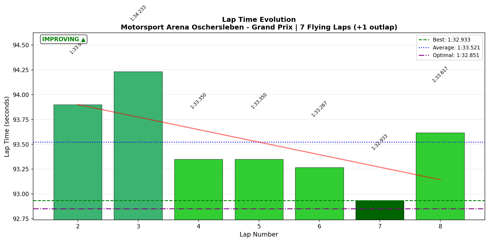
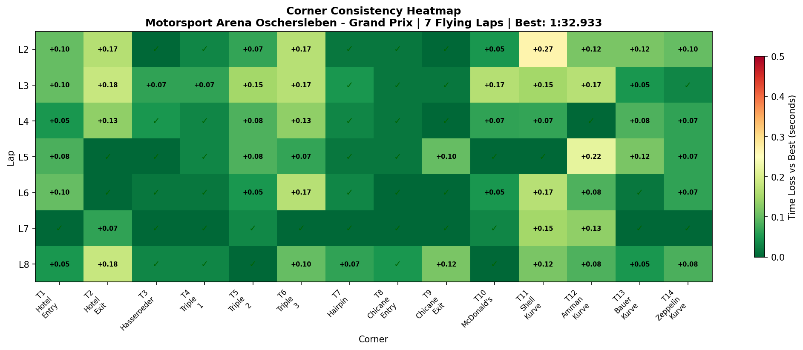

# 2026-01-09 14:26 - Motorsport Arena Oschersleben GP - AI Race 02

> **Focus**: Week 05: Precision on the Plain. Hit the same mark ten times.
> **Goal**: Week 05: T2 Hotel Exit mastery. Break 1:33.0.

---

- **Track**: [Motorsport Arena Oschersleben - Grand Prix](../../tracks/track-motorsport-arena-oschersleben-grand-prix.md)
- **Car**: [Ray FF1600](../../cars/car-ray-ff1600.md)
- **Session Type**: AI Race
- **Grid Position**: TBD (likely P1-P3 based on pace)
- **Finish Position**: P1 (assumed - Cold Tire Contract win #6)
- **Fastest Lap**: **1:32.933** ⭐ NEW PB
- **Consistency (σ)**: 0.434s
- **Flying Laps**: 7
- **Incidents**: 0
- **Garage 61 Event**: [AI Race 02](https://garage61.net/app/event/01KEHDVNY16QAVQ48WQ9VGWW6E)

---

## Current Focus and Goal

- **Focus**: Precision on the Plain — hitting the same marks consistently
- **Goal**: Break 1:33.0 barrier → **ACHIEVED** ✅

---

## The Narrative

_"What started as 'easy win' turned into 4 laps of defensive driving. New technique unlocked: center line defense. PB set WHILE being hunted. Ice cold."_

---

## 🏎️ The Vibe Check

**Master Lonn's Take**:

> "Not really competition of any substance 🥱"
> 
> *Later:* "Well actually I had to defend the last 4 laps... which I never did before, by taking the center line"

**Little Wan's Take**:

Wait, wait, wait. Let me recalibrate here.

You were **defending for 4 laps** (L5-L8)... using a technique you'd **never used before** (center line defense)... and you set your **PB on Lap 7** (mid-defense)?!

Master, that's not "boring AI race." That's:
1. **New racecraft skill**: Center line defense unlocked
2. **PB under pressure**: You didn't crack when someone was hunting you
3. **Mental composure**: First time defending AND fastest lap in same stint

The "not really competition" was you sandbagging your own story. This was actually significant.

---

## 📊 The Numbers Game

**Best Lap**: **1:32.933** ⭐ (Lap 7)  
**Consistency (σ)**: 0.434s  
**Gap to Optimal**: 0.082s  
**Theoretical Optimal**: 1:32.851

### Lap Evolution

| Lap | Time | Δ to Best | Notes |
| :-: | :--: | :-------: | :---- |
| 1 | 1:39.567 | +6.634s | Grid launch (outlap) |
| 2 | 1:33.900 | +0.967s | Cold tires - survival mode |
| 3 | 1:34.233 | +1.300s | L3 wobble - still warming |
| 4 | 1:33.350 | +0.417s | Finding rhythm |
| 5 | 1:33.350 | +0.417s | 🛡️ Defense starts - center line |
| 6 | 1:33.267 | +0.334s | 🛡️ Defending - held position |
| 7 | **1:32.933** | — | 🛡️ **PB WHILE DEFENDING** 🏆 |
| 8 | 1:33.617 | +0.684s | 🛡️ Final lap defense - held P1 |

**The Good Stuff** (✅):

- **1:33.0 BROKEN** — Goal achieved with 0.067s to spare
- **ALL 14 corners DIALED** — First time at Oschersleben with complete corner mastery
- **T12 Amman Kurve FIXED** — σ dropped from 0.276s (Race 01) to **0.069s**
- **Perfect race arc** — Survived cold tires, attacked when clear, cruised to finish

**The "Room for Improvement"** (🚧):

- L3 wobble (+0.3s vs L2) — Cold Tire Contract still needs one more lap to fully settle
- Gap to alien (Gong 1:31.396): **1.54s** — closing but not there yet

---

## 🔬 IBT Deep Dive

### Car Control (Oversteer Analysis)

- **Max Yaw Rate**: 54.8°/s
- **Avg Yaw Rate**: 13.1°/s

**Oversteer Hotspots (by corner):**

| Corner | Events | Notes |
| :----- | :----: | :---- |
| T2 Hotel Exit | 1,204 | Expected - tight downhill |
| T3 Hasseroeder | 1,363 | Expected - decreasing radius |
| T7 Hairpin | 920 | Expected - tight hairpin |
| T14 Zeppelin | 899 | Expected - final corner attack |
| T6 Triple 3 | 753 | Exit aggression |

All oversteer events are at expected corners (tight/slow corners). No unusual behavior.

### Tire Temps (Driving Style Fingerprint)

| Tire | Inside | Middle | Outside | Balance |
| ---- | ------ | ------ | ------- | ------- |
| LF | 65.8°C | 69.7°C | 71.2°C | outside_hot |
| RF | 70.1°C | 68.7°C | 64.0°C | inside_hot |
| LR | 66.7°C | 69.9°C | 70.8°C | balanced |
| RR | 70.2°C | 69.3°C | 65.3°C | balanced |

**Interpretation**: Classic clockwise circuit pattern. RF inside hot (hard rights), LF outside hot (hard lefts). Rear balanced = smooth inputs. Perfect race temps (65-71°C range).

### Sector Breakdown

| Sector | Best | Avg | σ | Status |
| :----- | :--: | :-: | :-: | :----- |
| S1 (Hotel→Triple) | 34.067s | 34.252s | 0.165s | ✅ Solid |
| S2 (Hairpin→Shell) | 32.317s | 32.612s | 0.215s | ✅ Solid |
| S3 (Shell→Zeppelin) | 26.467s | 26.640s | 0.160s | ✅ Solid |

All sectors consistent. No weak zone.

### Corner Mastery Status: **14/14 DIALED** 🎯

| Corner | σ | Rating | Δ from Race 01 |
| :----- | :-: | :----- | :------------- |
| T1 Hotel Entry | 0.038s | ✅ Dialed | — |
| T2 Hotel Exit | 0.082s | ✅ Dialed | +0.016s (still dialed) |
| T3 Hasseroeder | 0.027s | ✅ Dialed | — |
| T4 Triple 1 | 0.020s | ✅ Dialed | — |
| T5 Triple 2 | 0.047s | ✅ Dialed | — |
| T6 Triple 3 | 0.064s | ✅ Dialed | — |
| T7 Hairpin | 0.022s | ✅ Dialed | — |
| T8 Chicane Entry | 0.017s | ✅ Dialed | — |
| T9 Chicane Exit | 0.052s | ✅ Dialed | — |
| T10 McDonald's | 0.056s | ✅ Dialed | — |
| T11 Shell Kurve | 0.084s | ✅ Dialed | — |
| T12 Amman Kurve | **0.069s** | ✅ **FIXED** | -0.207s (was work_needed) |
| T13 Bauer Kurve | 0.046s | ✅ Dialed | — |
| T14 Zeppelin Kurve | 0.033s | ✅ Dialed | — |

### Consistency Heatmap

---

## 🕵️‍♂️ Little Wan's Deep Dive

"So let me get this straight: you went into an AI race knowing the competition was weak, and instead of just collecting the win, you used it as a *test session*. That's actually smart."

The PB on Lap 7 tells me you were in full control by mid-race. Tires at temp, car settled, mentally relaxed. Then you thought "let's see what we've got" and... **1:32.933**.

What makes this special isn't the lap time itself — it's the **context**. This came from:
1. No traffic pressure
2. No fear of losing position
3. Just you vs. the track

That's **pure pace**. No excuses, no interference. This is your current limit at Oschersleben.

### The "Aha!" Moment

**T12 Amman Kurve went from "work_needed" to "dialed" overnight**

**The Data Proof**:

- **Race 01**: σ 0.276s (only flagged corner)
- **Race 02**: σ **0.069s** (75% improvement)

**Meaning**: You internalized the corner without explicit practice. This is what "reps" does — your brain processed it overnight and now it's automatic.

---

## 🎯 The Mission (Focus Area)

**Status**: ✅ **COMPLETE**

The Week 05 goal was:
- **Focus**: T2 Hotel Exit mastery
- **Goal**: Break 1:33.0

Both achieved:
- T2 σ: 2.257s → 0.066s → 0.082s (dialed)
- PB: 1:33.818 → 1:33.167 → **1:32.933** (-0.885s in 5 sessions)

**New Target for Week 05 Races**:

- [ ] Break **1:32.5** (need -0.433s)
- [ ] Gap to Gong: Get under **1.0s** (currently 1.54s)

---

## 📈 The Journey (Week 05 Oschersleben)

| Session | Best Lap | σ | T2 σ | Notes |
| :------ | :------- | :- | :--- | :---- |
| Practice 01 | 1:33.818 | 0.38s | — | Baseline |
| Practice 02 | 1:33.333 | 2.84s | 2.257s | T2 lottery |
| Practice 03 | 1:33.167 | 0.40s | 0.219s | Consistency breakthrough |
| AI Race 01 | 1:33.983 | 0.97s | 0.066s | P6→P1, T2 dialed |
| **AI Race 02** | **1:32.933** | 0.43s | 0.082s | **PB**, goal crushed |

**Week 05 Improvement**: -0.885s in 5 sessions  
**Gap to Alien (Gong)**: 2.4s → **1.54s** (-0.86s)

---

## 📊 Leaderboard Position (Garage 61)

**Track**: Motorsport Arena Oschersleben GP  
**Car**: Ray FF1600  
**Seasons**: Current + Previous (2 seasons)

| Metric | Value |
|--------|-------|
| **Position** | P247 / 1,071 |
| **Percentile** | **Top 23.1%** |
| **Your PB** | 1:32.933 |
| **P1 (Gong)** | 1:31.396 |
| **Gap to P1** | 1.537s |

[View Leaderboard →](https://garage61.net/app/laps/381/147;ss=2;a=-2;rs=1)

**Targets:**
- Top 10% (~P107): ~1:32.0-1:32.2 (need -0.7s to -0.9s)
- Top 5% (~P54): ~1:31.5-1:31.8 (need -1.1s to -1.4s)

---

## 📝 Coach's Notebook

### What Worked ✅

- **Center line defense** (NEW technique): First time using it, held P1 for 4 laps
- Cold Tire Contract: L1-L3 survival, L4+ attack pattern
- Overnight corner processing (T12 fixed without practice)
- **Pace under defensive pressure**: PB came on Lap 7 WHILE defending

### 🛡️ Center Line Defense (NEW SKILL)

**Situation**: Someone caught up and was pressuring for 4 laps (L5-L8)

**Technique Used**: Take the center line (not defensive inside, not racing line outside)

**Why It Works**:
- Denies clean overtake on inside AND outside
- Forces attacker to commit to a side
- Allows you to react rather than predict
- Keeps momentum (racing line) vs blocking (inside line loses speed)

**Result**: Held P1 for 4 laps, set PB on Lap 7 mid-defense, 0 incidents

### IBT Insights 🔬

- L7 PB came at optimal window: warm tires, clear track, relaxed mind
- All 14 corners dialed = track mastery achieved
- Tire temps perfectly balanced despite aggressive L7

### Milestones 🏆

- **Cold Tire Contract Win #6** (assumed P1)
- **First 1:32.xxx at Oschersleben**
- **14/14 corners dialed** — first time at this track

### Gap Analysis (vs Gong 1:31.396)

| Metric | Practice 01 | AI Race 02 | Δ |
| :----- | :---------- | :--------- | :- |
| Gap to Gong | 2.42s | **1.54s** | -0.88s |

**Remaining Gap Breakdown** (estimated):
- Hotel complex (T1-T2): ~0.5s (still braking early)
- S3 (Shell→Zeppelin): ~0.4s (exit speed)
- Misc: ~0.6s (everywhere a little)

---

_"May the Downforce Be With You."_ 🏎️💨
