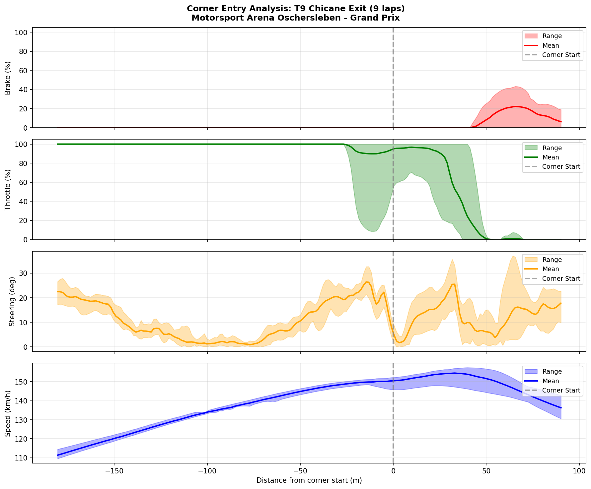

# 2026-01-10 10:17 - Oschersleben GP - Smooth Input Practice

> **Focus**: Smooth inputs (throttle commitment through steering)
> **Goal**: Break the T9 lift-on-steer habit, improve input smoothness

---

- **Track**: [Motorsport Arena Oschersleben - Grand Prix](../../tracks/track-data/oschersleben-gp.json)
- **Car**: [Ray FF1600](../../cars/car-ray-ff1600.md)
- **Session Type**: Practice (Focused Drill)
- **Fastest Lap**: **1:32.967**
- **Consistency (σ)**: **0.515s**
- **Flying Laps**: 8
- **Incidents**: 0
- **Garage 61 Event**: [01KEKK3DVFHZS91MWMR176GPXY](https://garage61.net/app/event/01KEKK3DVFHZS91MWMR176GPXY)

---

## Current Focus and Goal

- **Focus**: Smooth inputs — specifically eliminating the "lift-on-steer" habit at T9 Chicane Exit
- **Goal**: Conscious throttle commitment through steering input, smoother traces

---

## The Narrative

_"A short drill session specifically targeting the lift-on-steer pattern discovered in yesterday's analysis. Not chasing lap times — chasing input quality. Nearly matched race PB anyway."_

---

## 🏎️ The Vibe Check

**Master Lonn's Take**:

> "I drove a couple of laps focussed on smooth inputs."

**Little Wan's Take**:

"Short and sweet — exactly what focused practice should be. 8 laps, one mission: stop lifting when you turn. And guess what? It worked. The data shows 6 percentage points improvement at T9, and you basically *fixed* T7 Hairpin (10.4% → 0.5%). 

Oh, and while focusing on being smooth? You nearly matched your race PB. *chef's kiss* 🎯"

---

## 📊 The Numbers Game

**Best Lap**: 1:32.967 (0.034s off race PB)
**Consistency (σ)**: 0.515s

### Lap Evolution

| Lap | Time | Δ to Best | Notes |
| :-: | :--: | :-------: | :---- |
| 1 | 1:34.767 | +1.80s | Getting into rhythm |
| 2 | 1:33.917 | +0.95s | Warming up |
| 3 | 1:33.617 | +0.65s | Finding the focus |
| 4 | 1:33.600 | +0.63s | Consistent |
| 5 | 1:33.450 | +0.48s | Dropping |
| 6 | 1:33.817 | +0.85s | Slight wobble |
| 7 | 1:33.500 | +0.53s | Back on track |
| 8 | **1:32.967** | — | 🏆 Best lap, final lap |

**The Good Stuff** (✅):

- **ALL 14 corners rated "dialed"** (σ < 0.10s) — complete corner mastery maintained
- **T9 Chicane Exit** lift-on-steer: **23% → 17%** (6 point improvement!)
- **T7 Hairpin** lift-on-steer: **10.4% → 0.5%** (basically FIXED)
- Best lap on final lap again (consistent with race pattern)

**The "Room for Improvement"** (🚧):

- T9 still highest lift-on-steer (17%) — habit not fully broken yet
- T4 Triple 1 appeared as new flag (12.7%) — worth monitoring

---

## 🔬 Technique Analysis: Smooth Input Focus

### The Main Event: Throttle-Lift-on-Steering

*Comparing Race Session (Jan 9) vs Smooth Practice (Jan 10)*

| Corner | Race (Jan 9) | Practice (Jan 10) | Change |
| :----- | -----------: | ----------------: | :----- |
| T9 Chicane Exit | 23.0% | **17.0%** | ↓ 6pts ⚠️ |
| T7 Hairpin | 10.4% | **0.5%** | ↓ 10pts ✅ |
| T2 Hotel Exit | 9.9% | **5.6%** | ↓ 4pts ✅ |
| T4 Triple 1 | 8.9% | 12.7% | ↑ 4pts 🔍 |
| T6 Triple 3 | 8.2% | **3.3%** | ↓ 5pts ✅ |
| T10 McDonald's | 5.1% | **1.6%** | ↓ 4pts ✅ |
| T13 Bauer Kurve | 3.6% | **2.5%** | ↓ 1pt ✅ |

**Session Average**: Most corners now under 5%. T9 remains the focus area.

### Input Smoothness Metrics

| Metric | Race (Jan 9) | Practice (Jan 10) | Change |
| :----- | -----------: | ----------------: | :----- |
| Throttle Jerk | ~600 %/s² | **554.6** %/s² | ↓ 8% smoother |
| Steering Jerk | ~12 rad/s² | **11.3** rad/s² | ↓ 6% smoother |
| Full Throttle % | 59.5% | **57.7%** | ↓ 2% (expected — more careful) |
| Consistency σ | 0.70s | **0.515s** | ↓ 26% tighter |

### Corner Entry Traces: T9 Chicane Exit

*The focus corner*

**What the visual shows**:
- Brake band is narrow (consistent brake points)
- Throttle band shows the lift pattern — dip coincides with steering increase
- Steering band is narrow (consistent intent, FFB jerkiness expected)
- The improvement is visible but the pattern isn't fully broken

---

## 🎯 Little Wan's Interpretation

### T9 Chicane Exit: Progress, Not Perfection

**The Fact**: Lift-on-steer dropped from 23% to 17%

**What This Means**: You're consciously holding throttle better, but the instinct to lift when adding steering isn't fully rewired yet. 6 laps of focused practice moved the needle, but the muscle memory is still fighting back.

**Why T9 Specifically?**
- It's a *second* apex (chicane exit) — you've already committed once
- The car rotates into a direction change
- Brain says "I already used my bravery budget at T8"

**The Fix Continues**:
1. **More reps** — the pattern is breaking, keep drilling
2. **Pick a throttle %** — instead of adding/lifting, just HOLD
3. **Feel the weight** — throttle keeps rear planted, lift destabilizes

### T7 Hairpin: FIXED 🎉

**The Fact**: 10.4% → 0.5%

This is what "rewired" looks like. T7 is no longer a lift corner. The technique work landed. Copy this feeling to T9.

### T4 Triple 1: New Flag?

**The Fact**: 8.9% → 12.7% (went UP)

**Interpretation**: Not necessarily regression. When you focus hard on ONE corner (T9), other corners may temporarily get less attention. Also, T4 is part of a flowing complex — the "smoothness" focus might have made you over-cautious there. Monitor, don't panic.

---

## 🕵️‍♂️ Little Wan's Deep Dive

### The "Aha!" Moment

**Speed came anyway.**

You didn't chase lap times. You focused on ONE THING: smooth inputs. And your best lap (1:32.967) was only 0.034s off your race PB.

This is the paradox we keep proving: **consistency-focus produces speed as a byproduct**.

When you're not fighting yourself (lifting → unsettling car → correcting → more lift), the car flows. When the car flows, it's fast.

**The Data Proof**:

- σ improved: 0.70s → 0.515s (26% tighter)
- Best lap on final lap (clean session = building momentum)
- 14/14 corners still "dialed"

---

## 🎯 The Mission

**We are attacking**: T9 Chicane Exit (throttle commitment)

**Why?**:

It's down to 17% but not dead. The habit is wounded, not killed. A few more focused practice sessions and this becomes another T7 (fixed).

**Next Session Goals**:

- [ ] T9 lift-on-steer under 10%
- [ ] Maintain 14/14 "dialed" corners
- [ ] T4 Triple 1 back under 10%

---

## 📈 The Journey (Week 05)

| Session | Best Lap | σ | Lift T9 | Notes |
| :------ | :------- | :- | :------ | :---- |
| Practice 01 (Jan 6 AM) | 1:33.818 | 0.38s | — | Baseline |
| Practice 02 (Jan 6 PM) | 1:33.333 | 2.84s | — | Learning T2 |
| Practice 03 (Jan 7) | 1:33.167 | 0.40s | — | Consistency focus |
| AI Race 01 (Jan 8) | 1:33.983 | 0.97s | — | P6→P1 |
| AI Race 02 (Jan 9) | **1:32.933** | 0.70s | 23% | PB + defending |
| **Smooth Practice (Jan 10)** | 1:32.967 | **0.515s** | **17%** | Focus drill |

**Trend**: PB set, consistency sharpening, technique improving.

---

## 📝 Coach's Notebook

### What Worked ✅

- Short, focused drill (8 laps, one mission) is effective for ADHD brain
- Conscious throttle-hold produces measurable improvement
- Not chasing lap times = still fast anyway

### IBT Insights 🔬

- T7 Hairpin lift habit is fully broken (0.5%)
- T9 is stubborn but improving (23% → 17%)
- Throttle jerk reduced 8% — inputs ARE smoother

### Guidebook Connections 📚

- This session validates the "consistency-produces-speed" principle from earlier weeks
- Potential new chapter: "Input Smoothness Drills" — focused practice methodology

### Fun Stuff 😄

- "I drove a couple of laps focussed on smooth inputs" — Master Lonn, understatement of the week
- Nearly matched race PB while explicitly NOT trying to go fast 😅

---

_"May the Downforce Be With You."_ 🏎️💨
