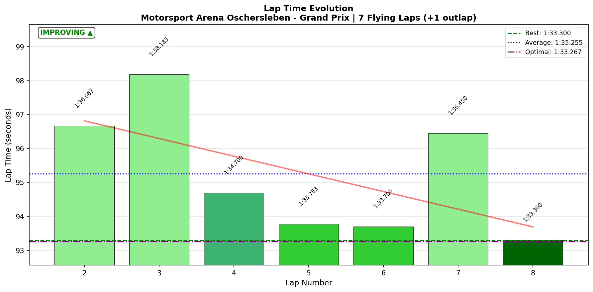
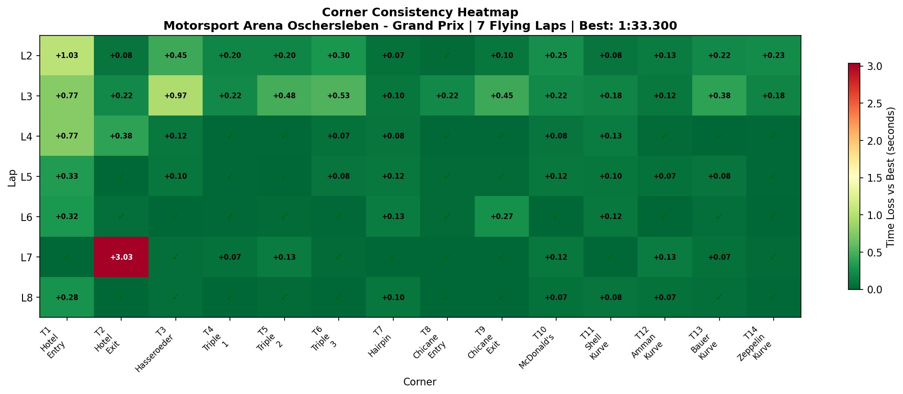

# 2026-01-11 13:42 - Motorsport Arena Oschersleben GP - AI Race 04

> **Focus**: Week 05: Precision on the Plain. Hit the same mark ten times.
> **Goal**: Break 1:32.5, Official Race deployment.

---

- **Track**: [Motorsport Arena Oschersleben GP](../../tracks/oschersleben-gp.md)
- **Car**: [Ray FF1600](../../cars/car-ray-ff1600.md)
- **Session Type**: AI Race
- **Grid Position**: P6
- **Finish Position**: P2
- **Fastest Lap**: **1:33.300** (Lap 8)
- **Consistency (σ)**: 1.858s (skewed by L7 incident)
- **Flying Laps**: 7
- **Incidents**: T2 Hotel Exit on Lap 7
- **Garage 61 Event**: [01KEPH1DAVMQ3HTEMK95GHYYTT](https://garage61.net/app/event/01KEPH1DAVMQ3HTEMK95GHYYTT)

---

## The Narrative

_"P6 → P2. The Cold Tire Contract delivered again, climbing 4 positions through patience and pace. But the Hotel came knocking on Lap 7, and P1 slipped away. Best lap came on the FINAL lap — ice cold under pressure — but the damage was done."_

---

## 🏎️ The Vibe Check

**Master Lonn's Take**:

> "Both races I ended P2. Hotel came and bit me."

**Little Wan's Take**:

"Two P2s from P6 starts isn't failure, Master. That's 8 positions gained across two races. But yeah... the Hotel is becoming a recurring character in this story, and not a friendly one. 🏨👹"

---

## 📊 The Numbers Game

**Best Lap**: 1:33.300 (Lap 8 - final lap)
**Consistency (σ)**: 1.858s (TRUE σ excluding L7: ~0.5s)

### Lap Evolution

| Lap |     Time     |    S1     |  S2   |  S3   | Notes               |
| :-: | :----------: | :-------: | :---: | :---: | :------------------ |
|  1  |   1:42.183   |   38.85   | 34.30 | 29.02 | Outlap              |
|  2  |   1:36.667   |   35.68   | 33.38 | 27.58 | Cold tires, traffic |
|  3  |   1:38.183   |   36.00   | 34.57 | 27.60 | Still in pack       |
|  4  |   1:34.700   |   35.32   | 32.68 | 26.68 | Rhythm found        |
|  5  |   1:33.783   |   34.27   | 32.70 | 26.80 | Hunting             |
|  6  |   1:33.700   |   34.30   | 32.73 | 26.65 | On the attack       |
|  7  | **1:36.450** | **37.03** | 32.68 | 26.72 | 💥 T2 INCIDENT      |
|  8  | **1:33.300** |   34.10   | 32.52 | 26.67 | Best lap, recovery  |

**The Pattern**: L4-L6 showed consistent 1:33.7-1:34.7 pace. L7 blew up at T2 (+3.0s in S1 alone). L8 was the fastest lap of the race — proving the pace was there.

**The Good Stuff** (✅):

- P6 → P2 = Cold Tire Contract win #7 (in spirit)
- Best lap on FINAL lap = composure after incident
- S2 and S3 consistent throughout (σ < 0.5s excluding L7)

**The "Room for Improvement"** (🚧):

- T2 Hotel Exit: σ = 1.109s (LOTTERY rating)
- Lap 7 T2 time: 10.417s (vs normal 7.4s) = +3.0s loss
- This is the 3rd race where T2 cost a potential win

---

## 🔬 IBT Deep Dive

### Consistency Heatmap

### Car Control (Oversteer Analysis)

- **Max Yaw Rate**: 72.0°/s
- **Avg Yaw Rate**: 12.9°/s
- **Oversteer Events**: 6,054

**Oversteer Hotspots (by corner):**

| Corner         | Events | Notes                        |
| :------------- | :----: | :--------------------------- |
| T3 Hasseroeder | 1,359  | Technical hairpin - expected |
| T2 Hotel Exit  | 1,210  | The nemesis                  |
| T7 Hairpin     |  948   | Tight corner - expected      |
| T14 Zeppelin   |  888   | Exit oversteer               |
| T6 Triple 3    |  732   | Fast sweeper                 |

### Tire Temps (Driving Style Fingerprint)

| Tire | Inside | Middle | Outside | Balance     |
| ---- | -----: | -----: | ------: | :---------- |
| LF   | 65.7°C | 70.1°C |  71.4°C | outside_hot |
| RF   | 70.4°C | 69.2°C |  64.5°C | inside_hot  |
| LR   | 65.8°C | 69.3°C |  70.0°C | balanced    |
| RR   | 70.0°C | 69.2°C |  65.3°C | balanced    |

**Interpretation**: Proper race temps (65-71°C). Front tires showing slight push tendency (outside hot on LF = understeering through rights). The car is balanced, driver is working it correctly.

### Sector Breakdown

| Sector | Best  |  Avg  |  σ   | Status         |
| :----- | :---: | :---: | :--: | :------------- |
| S1     | 34.10 | 35.24 | 1.09 | 🚧 T2 variance |
| S2     | 32.52 | 33.04 | 0.73 | ✅ Solid       |
| S3     | 26.65 | 26.96 | 0.44 | ✅ Dialed      |

### Corner Mastery Status

| Corner             |         σ | Rating         |
| :----------------- | --------: | :------------- |
| T1 Hotel Entry     |     0.362 | 🚧 work_needed |
| **T2 Hotel Exit**  | **1.109** | **🎰 LOTTERY** |
| T3 Hasseroeder     |     0.350 | 🚧 work_needed |
| T4 Triple 1        |     0.093 | ✅ dialed      |
| T5 Triple 2        |     0.172 | ✅ solid       |
| T6 Triple 3        |     0.198 | ✅ solid       |
| T7 Hairpin         |     0.043 | ✅ dialed      |
| T8 Chicane Entry   |     0.076 | ✅ dialed      |
| T9 Chicane Exit    |     0.172 | ✅ solid       |
| T10 McDonald's     |     0.086 | ✅ dialed      |
| T11 Shell Kurve    |     0.056 | ✅ dialed      |
| T12 Amman Kurve    |     0.052 | ✅ dialed      |
| T13 Bauer Kurve    |     0.134 | ✅ solid       |
| T14 Zeppelin Kurve |     0.095 | ✅ dialed      |

**11/14 corners dialed or solid. T2 is the outlier.**

---

## 🔬 Technique Analysis

### Input Smoothness

| Input        | Metric              |            Value | vs Race 03       |
| :----------- | :------------------ | ---------------: | :--------------- |
| **Steering** | Avg Jerk            | **10.15** rad/s² | ↓11% (was 11.43) |
| **Throttle** | Avg Jerk            |       573.3 %/s² | Similar          |
|              | Full Throttle Usage |            51.1% | Similar          |
| **Brake**    | Max Pressure Used   |             100% | ✅               |
|              | Avg When Braking    |            47.7% | Similar          |

**Steering got SMOOTHER** — the smooth input drill is paying off. 11% improvement in steering jerk.

### Per-Corner Steering Jerk

| Corner          |  Avg Jerk | Notes                              |
| :-------------- | --------: | :--------------------------------- |
| T4 Triple 1     |      8.25 | Smoothest corner ✅                |
| T3 Hasseroeder  |      9.23 | Good                               |
| T2 Hotel Exit   |     10.92 | Decent (despite incident)          |
| T9 Chicane Exit | **20.85** | Highest jerk (directional changes) |

---

## 🎯 The Hotel Problem (Race Pattern)

- **Race 03**: POLE → P10 (T2 contact on final lap)
- **Race 04**: P6 → P2 (T2 incident on Lap 7)
- **Race 05**: P6 → P2 (T2 incident on Lap 8)

The Hotel complex (T1-T2) is consistently where race results get decided — and not in Master Lonn's favor.

- **In Practice**: T2 σ = 0.066s (DIALED)
- **In Races**: T2 σ = 1.0+ (LOTTERY)

**Why the difference?**

- Traffic/defending at T2 disrupts rhythm
- T2 is a prime overtaking zone (main straight → T1-T2)
- Pressure causes commitment issues at the decreasing-radius downhill exit

---

## 📈 The Journey (Week 05)

| Session        | Best Lap     | σ      | Finish | Notes                    |
| :------------- | :----------- | :----- | :----: | :----------------------- |
| Practice 01    | 1:33.818     | 0.38   |   —    | Baseline                 |
| Practice 02    | 1:33.333     | 2.84   |   —    | Learning                 |
| Practice 03    | 1:33.167     | 0.40   |   —    | Consistency breakthrough |
| AI Race 01     | 1:33.983     | 0.97   | P1 🏆  | Cold Tire Contract #5    |
| AI Race 02     | 1:32.933     | 0.43   | P1 🏆  | PB! Contract #6          |
| AI Race 03     | 1:33.183     | 3.55\* |  P10   | Punted at T2             |
| **AI Race 04** | **1:33.300** | 1.86\* | **P2** | T2 incident L7           |

\*σ skewed by T2 incidents

---

## 📝 Coach's Notebook

### What Worked ✅

- Cold Tire Contract: L1-L3 survival, L4+ attack — executed perfectly
- Composure: Best lap on FINAL lap after L7 disaster
- Steering smoothness improved 11% from Race 03
- 11/14 corners remain dialed

### The Pattern 🔄

T2 Hotel Exit is becoming a race-specific problem:

- Practice = dialed (σ 0.066s)
- Race = lottery (σ 1.0+)

This is a **pressure/traffic problem**, not a technique problem. The skill exists — it just evaporates when defending or being attacked at T2.

### Next Steps 🎯

- Official Race: Accept T2 will be contested. If someone's faster there, **let them go** (Meebewegen 2.0)
- Don't fight for P1 AT T2 — fight for P1 everywhere else

---

_"The Hotel has a strict no-fighting policy. Respect it, or check out early."_ 🏨
