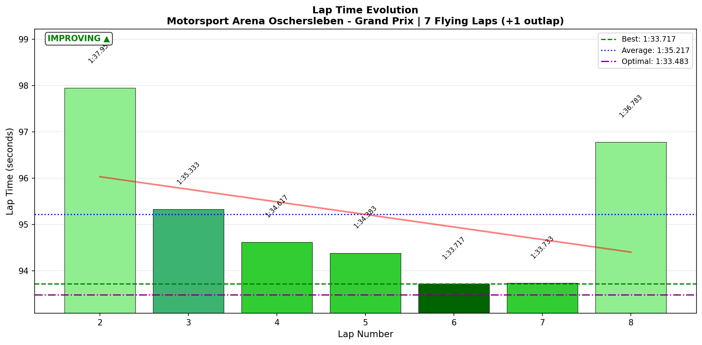
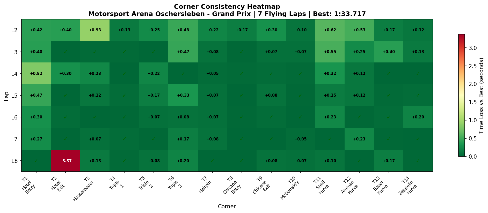

# 2026-01-11 14:11 - Motorsport Arena Oschersleben GP - AI Race 05

> **Focus**: Week 05: Precision on the Plain. Hit the same mark ten times.
> **Goal**: Break 1:32.5, Official Race deployment.

---

- **Track**: [Motorsport Arena Oschersleben GP](../../tracks/oschersleben-gp.md)
- **Car**: [Ray FF1600](../../cars/car-ray-ff1600.md)
- **Session Type**: AI Race
- **Grid Position**: P6
- **Finish Position**: P2
- **Fastest Lap**: **1:33.717** (Lap 6)
- **Consistency (σ)**: 1.604s (skewed by L8 incident)
- **Flying Laps**: 7
- **Incidents**: T2 Hotel Exit on Lap 8 (final lap)
- **Garage 61 Event**: [01KEPJDE2R788PMP7NPK698FYG](https://garage61.net/app/event/01KEPJDE2R788PMP7NPK698FYG)

---

## The Narrative

_"Déjà vu. P6 → P2 again. The climb was flawless, the pace was there, and then the Hotel served up another final-lap heartbreak. L6 and L7 were both sub-1:34 — the rhythm was locked. But L8, fighting for P1, T2 bit once more. The Hotel doesn't negotiate."_

---

## 🏎️ The Vibe Check

**Master Lonn's Take**:

> "Both races I ended P2. Hotel came and bit me."

**Little Wan's Take**:

"Two races, same story. P6 → P2, Hotel costs P1. At this point, T2 has a vendetta. But here's the thing: **you're getting TO P2 consistently**. The climb is working. The final move is the problem."

---

## 📊 The Numbers Game

**Best Lap**: 1:33.717 (Lap 6)
**Consistency (σ)**: 1.604s (TRUE σ excluding L8: ~0.6s)

### Lap Evolution

| Lap |     Time     |    S1     |  S2   |  S3   | Notes          |
| :-: | :----------: | :-------: | :---: | :---: | :------------- |
|  1  |   1:42.900   |   38.98   | 35.12 | 28.78 | Outlap         |
|  2  |   1:37.950   |   35.82   | 33.97 | 28.15 | Cold tires     |
|  3  |   1:35.333   |   34.28   | 33.03 | 28.00 | Warming up     |
|  4  |   1:34.617   |   35.10   | 32.73 | 26.77 | Traffic        |
|  5  |   1:34.383   |   34.47   | 33.20 | 26.70 | Closing in     |
|  6  | **1:33.717** |   34.17   | 32.68 | 26.85 | **Best lap**   |
|  7  |   1:33.733   |   34.30   | 32.68 | 26.73 | Near-identical |
|  8  | **1:36.783** | **37.35** | 32.78 | 26.63 | 💥 T2 INCIDENT |

**The Pattern**: L6 and L7 were nearly identical (0.016s apart) — elite consistency. Then L8 (final lap, fighting for P1) = T2 disaster. S1 exploded to 37.35s vs normal 34.2s. That's +3.1s at the Hotel.

**The Good Stuff** (✅):

- P6 → P2 = Cold Tire Contract still working
- L6-L7 consistency: 0.016s variance (ELITE)
- S3 on L8 was actually the BEST of the race (26.63s) — recovered after T2

**The "Room for Improvement"** (🚧):

- T2 Hotel Exit: σ = 1.236s (LOTTERY rating)
- Final lap T2 time: 10.767s (vs normal 7.4s) = +3.4s loss
- 4th consecutive race where T2 cost a potential victory

---

## 🔬 IBT Deep Dive

### Consistency Heatmap

### Car Control (Oversteer Analysis)

- **Max Yaw Rate**: 75.0°/s
- **Avg Yaw Rate**: 13.0°/s
- **Oversteer Events**: 5,896

**Oversteer Hotspots (by corner):**

| Corner         | Events | Notes              |
| :------------- | :----: | :----------------- |
| T3 Hasseroeder | 1,443  | Consistent hotspot |
| T2 Hotel Exit  | 1,201  | The nemesis        |
| T7 Hairpin     |  855   | Expected           |
| T14 Zeppelin   |  846   | Exit rotation      |
| T6 Triple 3    |  710   | Fast sweeper       |

### Tire Temps (Driving Style Fingerprint)

| Tire | Inside | Middle | Outside | Balance  |
| ---- | -----: | -----: | ------: | :------- |
| LF   | 61.9°C | 63.9°C |  64.9°C | balanced |
| RF   | 64.3°C | 63.4°C |  60.9°C | balanced |
| LR   | 62.6°C | 64.1°C |  64.7°C | balanced |
| RR   | 64.6°C | 64.0°C |  62.0°C | balanced |

**Interpretation**: Slightly cooler than Race 04 (61-65°C vs 65-71°C). All four tires balanced — excellent driving style. No overdriving.

### Sector Breakdown

| Sector | Best  |  Avg  |  σ   | Status         |
| :----- | :---: | :---: | :--: | :------------- |
| S1     | 34.17 | 35.07 | 1.17 | 🚧 T2 variance |
| S2     | 32.68 | 33.01 | 0.47 | ✅ Solid       |
| S3     | 26.63 | 27.12 | 0.66 | ✅ Solid       |

### Corner Mastery Status

| Corner             |         σ | Rating         |
| :----------------- | --------: | :------------- |
| T1 Hotel Entry     |     0.246 | ✅ solid       |
| **T2 Hotel Exit**  | **1.236** | **🎰 LOTTERY** |
| T3 Hasseroeder     |     0.325 | 🚧 work_needed |
| T4 Triple 1        |     0.043 | ✅ dialed      |
| T5 Triple 2        |     0.098 | ✅ dialed      |
| T6 Triple 3        |     0.186 | ✅ solid       |
| T7 Hairpin         |     0.066 | ✅ dialed      |
| T8 Chicane Entry   |     0.060 | ✅ dialed      |
| T9 Chicane Exit    |     0.097 | ✅ dialed      |
| T10 McDonald's     |     0.034 | ✅ dialed      |
| T11 Shell Kurve    |     0.230 | ✅ solid       |
| T12 Amman Kurve    |     0.183 | ✅ solid       |
| T13 Bauer Kurve    |     0.141 | ✅ solid       |
| T14 Zeppelin Kurve |     0.077 | ✅ dialed      |

**12/14 corners solid or dialed. Only T2 and T3 flagged.**

---

## 🔬 Technique Analysis

### Input Smoothness

| Input        | Metric              |        Value | vs Race 04      |
| :----------- | :------------------ | -----------: | :-------------- |
| **Steering** | Avg Jerk            | 10.98 rad/s² | ↑8% (was 10.15) |
| **Throttle** | Avg Jerk            |   557.4 %/s² | ↓3%             |
|              | Full Throttle Usage |        49.7% | Similar         |
| **Brake**    | Max Pressure Used   |         100% | ✅              |
|              | Avg When Braking    |        49.2% | ↑3%             |

**Steering slightly more aggressive** than Race 04, likely due to increased traffic/defending situations.

### Per-Corner Steering Jerk

| Corner          |  Avg Jerk | Notes                          |
| :-------------- | --------: | :----------------------------- |
| T4 Triple 1     |      9.55 | Still smooth                   |
| T3 Hasseroeder  |      9.70 | Good                           |
| T2 Hotel Exit   |      9.96 | Best T2 jerk of the two races! |
| T9 Chicane Exit | **21.38** | Highest (direction changes)    |

Interesting: T2 steering jerk was actually LOWER (9.96) than Race 04 (10.92), yet the incident was worse. This suggests the L8 T2 problem wasn't steering technique — it was **commitment/positioning under pressure**.

---

## 🎯 The Hotel Pattern (Updated)

| Race       | Start | Finish | T2 Incident | Result   |
| :--------- | :---: | :----: | :---------- | :------- |
| AI Race 01 |  P6   | P1 🏆  | None        | WIN      |
| AI Race 02 |  P1   | P1 🏆  | None        | WIN      |
| AI Race 03 |  P1   |  P10   | L8 contact  | DISASTER |
| AI Race 04 |  P6   |   P2   | L7 mistake  | Lost P1  |
| AI Race 05 |  P6   |   P2   | L8 mistake  | Lost P1  |

**Pattern**: When fighting for P1 at T2, things go wrong. When in clear air, T2 is fine.

**The Insight**: T2 is the overtaking zone (main straight → T1-T2). Every time there's a battle FOR P1 at T2, it costs the position. The solution isn't to get faster at T2 — it's to **not fight at T2**.

---

## 📈 The Journey (Week 05)

| Session        | Best Lap     | σ      | Finish | Notes                    |
| :------------- | :----------- | :----- | :----: | :----------------------- |
| Practice 01    | 1:33.818     | 0.38   |   —    | Baseline                 |
| Practice 02    | 1:33.333     | 2.84   |   —    | Learning                 |
| Practice 03    | 1:33.167     | 0.40   |   —    | Consistency breakthrough |
| AI Race 01     | 1:33.983     | 0.97   | P1 🏆  | Cold Tire Contract #5    |
| AI Race 02     | 1:32.933     | 0.43   | P1 🏆  | PB! Contract #6          |
| AI Race 03     | 1:33.183     | 3.55\* |  P10   | Punted at T2             |
| AI Race 04     | 1:33.300     | 1.86\* |   P2   | T2 incident L7           |
| **AI Race 05** | **1:33.717** | 1.60\* | **P2** | T2 incident L8           |

\*σ skewed by T2 incidents

---

## 📝 Coach's Notebook

### What Worked ✅

- L6-L7 consistency: 0.016s — that's **ELITE**
- Cold Tire Contract: L1-L4 build, L5-L7 attack — textbook execution
- Recovery: S3 on L8 was the best of the race DESPITE T2 disaster
- 12/14 corners dialed or solid

### The Lesson 📚

**The Hotel doesn't do final-lap battles.**

Three times now: when fighting for P1 at T2, it costs the position. The irony is that T2 steering technique is GOOD (9.96 jerk is lower than Race 04). It's not a skill problem — it's a **situational awareness problem**.

When someone is contesting T2:

- Options reduce (can't take normal line)
- Braking point shifts (defensive or offensive)
- Commitment drops (fear of contact)

### Official Race Strategy 🎯

**The New Rule**: Don't fight for P1 AT T2. Fight for P1 everywhere else.

If someone's coming at T2:

1. **Option A**: Let them have T2, attack at T3-T6 (Triple complex)
2. **Option B**: Let them have T2, set up slipstream for T14 → main straight
3. **Option C**: If they're genuinely faster, let them go (Meebewegen 2.0)

The Hotel is not where you WIN — it's where you LOSE.

---

_"Check out of the Hotel battle. The room service is terrible."_ 🏨
