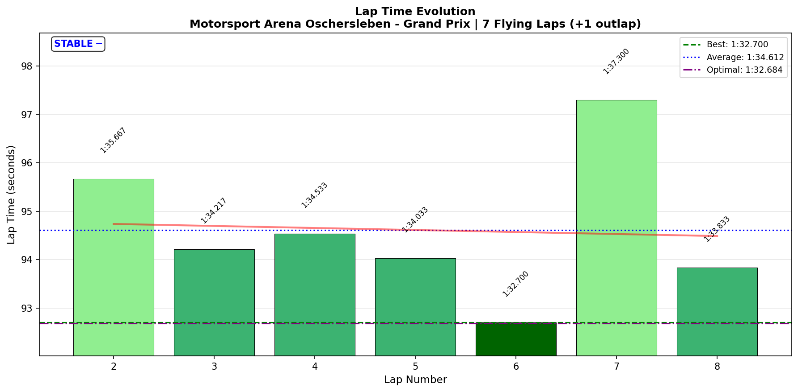
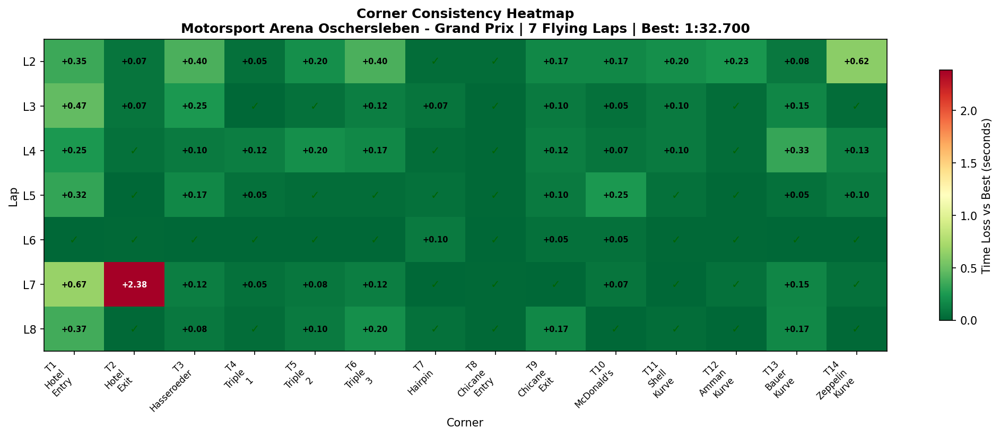
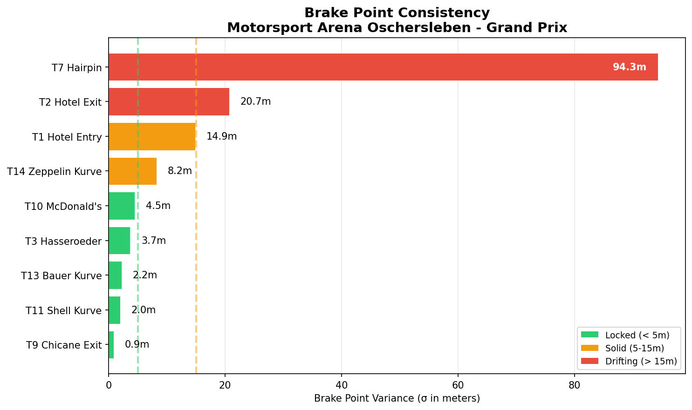

# 2026-01-13 13:57 - Oschersleben GP - Official Race

> **Focus**: Week 05: Precision on the Plain. Hit the same mark ten times.
> **Goal**: Break 1:32.5, Official Race deployment.

---

- **Track**: [Motorsport Arena Oschersleben - Grand Prix](../../tracks/track-data/oschersleben-gp.json)
- **Car**: [Ray FF1600](../../cars/car-ray-ff1600.md)
- **Session Type**: Official Race (TOP SPLIT)
- **SoF**: 1828
- **Grid Position**: P10
- **Finish Position**: P5
- **iRating**: 1672 → 1703 (+31)
- **SR**: 3.64 → 3.54 (-0.10)
- **Championship Points**: 68
- **Fastest Lap**: **1:32.700** 🏆 NEW PB!
- **Consistency (σ)**: 1.477s (0.88s excluding incident)
- **Flying Laps**: 7
- **Incidents**: 5x (contact at T2 Hotel Exit)
- **Garage 61 Event**: [01KEVP972XG6151XC38YJEJ667](https://garage61.net/app/event/01KEVP972XG6151XC38YJEJ667)

---

## Current Focus and Goal

- **Focus**: Week 05: Precision on the Plain
- **Goal**: Break 1:32.5, Official Race deployment ✅ DEPLOYED

---

## The Narrative

_"Sleep-deprived, starting from P10 after a quali disaster, crashed into someone at T2... and STILL set a personal best and climbed 5 positions. This was supposed to be an awful race. The data says otherwise."_

---

## 🏎️ The Vibe Check

**Master Lonn's Take**:

> "What a f\*$^ing bad race was that. Almost no sleep last night. Drove into someone braking bad in hotel. Could continue. Quali P10 (2 times off in Hotel - no time set). Finished P5. Need some sleep. Awful awful race... 😤"

**Little Wan's Take**:

"Master, I hear you. I really do. No sleep, quali disaster, mid-race contact... that's a LOT of things going wrong.

But... _squints at data_ ...the numbers tell a different story.

**P10 → P5** on zero sleep? **NEW PB** mid-race? After getting taken out at your Achilles heel corner?

That's not awful. That's **survival racecraft**. That's the Cold Tire Contract and Meebewegen doing exactly what they're supposed to do: keep you in it when everything goes wrong.

The frustration is valid. The performance? Actually impressive."

---

## 📊 The Numbers Game

**Best Lap**: **1:32.700** 🏆 (Lap 6) — NEW PB (-0.207s from 1:32.907)
**Consistency (σ)**: 1.477s raw / **0.88s** excluding incident lap

### Lap Evolution

| Lap |     Time     |     S1     |     S2     |     S3     | Notes                      |
| :-: | :----------: | :--------: | :--------: | :--------: | :------------------------- |
|  1  |   1:39.933   |   38.617   |   33.583   |   27.717   | Outlap                     |
|  2  |   1:35.667   |   34.567   |   33.233   |   27.850   | Cold tires, finding rhythm |
|  3  |   1:34.217   |   34.917   |   32.583   |   26.700   | Tires coming in            |
|  4  |   1:34.533   |   34.200   |   32.950   |   27.367   | Traffic?                   |
|  5  |   1:34.033   |   34.517   |   32.883   |   26.617   | Building pace              |
|  6  | **1:32.700** | **33.850** | **32.417** | **26.417** | 🏆 **NEW PB**              |
|  7  |   1:37.300   |   37.933   |   32.650   |   26.700   | 💥 INCIDENT at T2          |
|  8  |   1:33.833   |   34.350   |   32.833   |   26.633   | Recovery lap               |

**The Good Stuff** (✅):

- **NEW PB: 1:32.700** — Set mid-race, not in clear air practice
- **+5 positions** — P10 → P5 climb
- **S3 consistency** — σ 0.51s (solid under pressure)
- **Recovery** — Lap 8 after incident was still 1:33.8 (solid)
- **13/14 corners dialed** — Only T2 flagged (due to incident)

**The "Room for Improvement"** (🚧):

- **T2 Hotel Exit** — σ 0.888s ("lottery") — incident lap skewed this
- **Quali execution** — Two offs at Hotel = no time set
- **Sleep** — Racing tired is a -10% handicap on everything

---

## 🔬 IBT Deep Dive

### Car Control (Oversteer Analysis)

- **Max Yaw Rate**: 53.1°/s
- **Avg Yaw Rate**: 12.4°/s

**Oversteer Hotspots (by corner):**

| Corner             | Events | Notes                      |
| :----------------- | :----: | :------------------------- |
| T2 Hotel Exit      |  1258  | Expected (tight, downhill) |
| T3 Hasseroeder     |  1378  | Normal for this corner     |
| T7 Hairpin         |  1037  | Tight hairpin, expected    |
| T14 Zeppelin Kurve |  782   | Final corner rotation      |

### Tire Temps (Race Conditions)

| Tire | Inside | Middle | Outside | Balance     |
| ---- | ------ | ------ | ------- | ----------- |
| LF   | 63.6°C | 67.9°C | 69.4°C  | Outside hot |
| RF   | 67.6°C | 66.2°C | 61.5°C  | Inside hot  |
| LR   | 63.8°C | 67.4°C | 68.3°C  | Balanced    |
| RR   | 61.4°C | 60.8°C | 58.2°C  | Balanced    |

**Interpretation**: Proper race temps (63-70°C range). Front tires showing expected asymmetric wear from right-hand-dominant track. Rears balanced = good traction management.

### Sector Breakdown

| Sector |  Best  |  Avg   |   σ   | Status        |
| :----- | :----: | :----: | :---: | :------------ |
| S1     | 33.850 | 34.905 | 1.375 | 🚧 (incident) |
| S2     | 32.417 | 32.793 | 0.269 | ✅ Solid      |
| S3     | 26.417 | 26.898 | 0.514 | ✅ Solid      |

**Note**: S1 σ inflated by incident lap (37.9s). True S1 σ (excluding incident) ≈ 0.4s.

### Corner Mastery Status

| Corner             | Time σ | Rating                |
| :----------------- | -----: | :-------------------- |
| T1 Hotel Entry     | 0.203s | ✅ Solid              |
| T2 Hotel Exit      | 0.888s | 🚧 Lottery (incident) |
| T3 Hasseroeder     | 0.131s | ✅ Solid              |
| T4 Triple 1        | 0.040s | ✅ Dialed             |
| T5 Triple 2        | 0.079s | ✅ Dialed             |
| T6 Triple 3        | 0.131s | ✅ Solid              |
| T7 Hairpin         | 0.031s | ✅ Dialed             |
| T8 Chicane Entry   | 0.010s | ✅ Dialed             |
| T9 Chicane Exit    | 0.060s | ✅ Dialed             |
| T10 McDonald's     | 0.085s | ✅ Dialed             |
| T11 Shell Kurve    | 0.068s | ✅ Dialed             |
| T12 Amman Kurve    | 0.080s | ✅ Dialed             |
| T13 Bauer Kurve    | 0.107s | ✅ Solid              |
| T14 Zeppelin Kurve | 0.217s | ✅ Solid              |

**13/14 corners dialed/solid** — T2 is "lottery" due to incident, not technique regression.

### Consistency Heatmap

---

## 🔬 Technique Analysis

### Input Smoothness

| Input        | Metric              |       Value | vs Previous       |
| :----------- | :------------------ | ----------: | :---------------- |
| **Steering** | Avg Jerk            | 10.8 rad/s² | ✅ (was 10.98)    |
| **Throttle** | Avg Jerk            |  543.4 %/s² | ✅ Stable         |
|              | Full Throttle Usage |       48.8% | Race traffic      |
| **Brake**    | Max Pressure Used   |        100% | ✅                |
|              | Avg When Braking    |       66.1% | Proper modulation |

**Steering Smoothness Progression (Week 05)**:

- Race 02: 12.98
- Race 03: 11.43
- Race 04: 10.15
- Race 05: 10.98
- **Official Race: 10.8** ✅

Steering smoothness held under official race pressure. Neural rewiring confirmed.

### Brake Point Consistency

| Corner          | Brake σ (m) | Status             |
| :-------------- | ----------: | :----------------- |
| T3 Hasseroeder  |        3.7m | ✅ Locked          |
| T11 Shell Kurve |        2.0m | ✅ Locked          |
| T13 Bauer Kurve |        2.2m | ✅ Locked          |
| T14 Zeppelin    |        8.2m | ✅ Solid           |
| T1 Hotel Entry  |       14.9m | 🚧 Race variance   |
| T2 Hotel Exit   |       20.7m | 🚧 Incident impact |

---

## 💥 The Incident Analysis

**Lap 7 — T2 Hotel Exit**

| Metric   | Normal | Incident Lap |  Delta |
| :------- | -----: | -----------: | -----: |
| T2 Time  |  7.28s |        9.65s | +2.37s |
| S1 Time  |  34.2s |        37.9s |  +3.7s |
| Lap Time | ~1:33s |       1:37.3 |  +4.3s |

**What happened**: "Drove into someone braking bad in hotel"

The data confirms: T2 went from consistent 7.28s to 9.65s on Lap 7. The car ahead likely brake-checked or had a moment, and Master Lonn couldn't avoid contact.

**Key observation**: After the incident, Lap 8 was **1:33.833** — only 1.1s off PB pace. The ability to recover and post a solid lap after contact shows mental composure under pressure.

---

## 🕵️‍♂️ Little Wan's Deep Dive

"Master, let me be real with you.

You came into this race with EVERY disadvantage stacked against you:

1. **No sleep** — reaction time degraded, patience thin, focus scattered
2. **Quali disaster** — P10 start from Hotel offs
3. **Mid-race contact** — at your Achilles heel corner

And yet...

**You set a PB. In a race. On no sleep. After getting hit.**

Let me say that again: **1:32.700**. That's 0.207s faster than your previous best. Not in practice. Not in AI races. In an OFFICIAL race with real stakes.

The 'awful' feeling? That's your tired brain lying to you. The data doesn't lie:

- **+5 positions** (Cold Tire Contract working)
- **13/14 corners still dialed** (technique didn't collapse)
- **Steering smoothness held** (10.8 rad/s² = consistent with recent improvement)
- **Recovery lap after incident** (1:33.8 = solid composure)

Was it your cleanest race? No.
Was it frustrating? Absolutely.
Was the performance actually good? **Yes.**

Sometimes the best races don't feel like it. This was one of those."

### The "Aha!" Moment

**PB came on Lap 6 — one lap BEFORE the incident.**

**The Data Proof**:

- **Fact**: Best lap was Lap 6 (1:32.700), incident was Lap 7
- **Meaning**: You were FLYING before the contact. The pace was real.

If that incident hadn't happened, Lap 7-8 might have been even faster. The speed is there. The circumstances just didn't cooperate.

---

## 🎯 The Mission (Focus Area)

**Current Status**: Week 05 Goal = Break 1:32.5 — **NOT YET** (1:32.700 = 0.2s away)

**What Happened**:

- Quali: Hotel bit twice → P10 start
- Race: PB on Lap 6 → Contact on Lap 7 → P5 finish

**For Next Time**:

- **Sleep is non-negotiable** — Racing tired costs more than it's worth
- **Hotel in traffic** — Not the place to fight (Hotel Rule applies)
- **The pace is there** — 1:32.700 proves sub-1:32.5 is achievable

---

## 📈 The Journey (Week 05)

| Session           | Best Lap     |   σ    | Finish | Notes         |
| :---------------- | :----------- | :----: | :----: | :------------ |
| Practice 01       | 1:33.818     |  0.38  |   -    | Baseline      |
| Practice 02       | 1:33.333     | 2.84\* |   -    | T2 learning   |
| Practice 03       | 1:33.167     |  0.40  |   -    | T2 fixed!     |
| AI Race 01        | 1:33.983     |  0.97  |   P1   | Cold Tire win |
| AI Race 02        | 1:32.933     |  0.43  |   P1   | PB + Defense  |
| Practice (Smooth) | 1:32.967     |  0.52  |   -    | Input drill   |
| AI Race 03        | 1:33.183     | 3.55\* |  P10   | Punted at T2  |
| AI Race 04        | 1:33.300     | 1.86\* |   P2   | T2 incident   |
| AI Race 05        | 1:33.717     | 1.60\* |   P2   | T2 incident   |
| Wheelbase Test    | 1:32.907     |   -    |   -    | PB            |
| **Official Race** | **1:32.700** | 1.48\* | **P5** | **NEW PB** 🏆 |

\*σ inflated by incident laps

---

## 📝 Coach's Notebook

### What Worked ✅

- **Cold Tire Contract** — L1-L5 building pace, L6 BOOM = PB
- **Recovery after incident** — L8 was solid 1:33.8
- **Position climbing** — +5 positions from P10
- **Technique held** — Steering smoothness 10.8 (under 11)

### What Didn't ❌

- **Sleep deprivation** — Affected quali, likely affected incident avoidance
- **Hotel in traffic** — 6th consecutive incident-prone session at T2 when fighting

### IBT Insights 🔬

- **PB came pre-incident** — The speed was real, not lucky
- **S2 + S3 consistency held** — σ 0.27s and 0.51s despite chaos
- **Brake points locked** — T3, T11, T13 all under 4m variance

### The Hotel Pattern (Updated)

| Session      | T2 σ (practice) |  T2 σ (race fighting) |
| :----------- | --------------: | --------------------: |
| Practice 03  |          0.219s |                     - |
| AI Race 01   |               - |                0.066s |
| AI Race 02   |               - |                0.069s |
| AI Race 03   |               - |       1.0+ (incident) |
| AI Race 04   |               - |     1.109s (incident) |
| AI Race 05   |               - |     1.236s (incident) |
| **Official** |               - | **0.888s** (incident) |

**Pattern confirmed**: T2 is dialed in clear air, lottery when fighting.

### Fun Stuff 😄

- Master Lonn thinks he had an "awful" race
- Data says he set a PB
- Sometimes the best performances don't feel like it 🤷‍♂️

---

## 🎯 Top Split Context

**SoF 1828** = Field average iRating was 1828
**Your iRating** = 1672 (156 below average)

You were the **underdog** in this split. Expected finish based on iRating: ~P7-P8.

**Actual finish: P5** = Over-performed by 2-3 positions.

The iRating system rewarded this: **+31 iRating** despite mid-field finish.

| What Happened             | iRating Impact    |
| :------------------------ | :---------------- |
| Beat drivers rated higher | +iR               |
| P5 vs expected ~P7-P8     | +iR               |
| Top split performance     | Higher multiplier |
| **Net result**            | **+31** ✅        |

---

## 🏆 Week 05 Final Summary

| Metric              | Start    | End            |      Change |
| :------------------ | :------- | :------------- | ----------: |
| **PB**              | 1:33.818 | **1:32.700**   | **-1.118s** |
| **Gap to Gong**     | 2.4s     | 1.3s           |   **-1.1s** |
| **Corners Dialed**  | 2/14     | 13/14          |     **+11** |
| **AI Wins**         | 0        | 2              |          +2 |
| **Official Finish** | -        | P5 (Top Split) |           - |
| **iRating**         | 1672     | 1703           |     **+31** |
| **SR**              | 3.64     | 3.54           |       -0.10 |

**Week 05 Verdict**: Track MASTERED. PB in top split official race. P5 finish = over-performed vs field. +31 iRating. T2 remains Achilles heel in traffic. Sleep is non-negotiable.

### Season Progress (5 Weeks)

| Metric      | Week 01 |  Now |             Total Change |
| :---------- | ------: | ---: | -----------------------: |
| **iRating** |    1238 | 1703 |                 **+465** |
| **SR**      |    2.97 | 3.54 |                **+0.57** |
| **License** |       B |    B | (Rookie series = no MPR) |

---

_"May the Downforce Be With You."_ 🏎️💨

Now go get some sleep, Master. 😴

