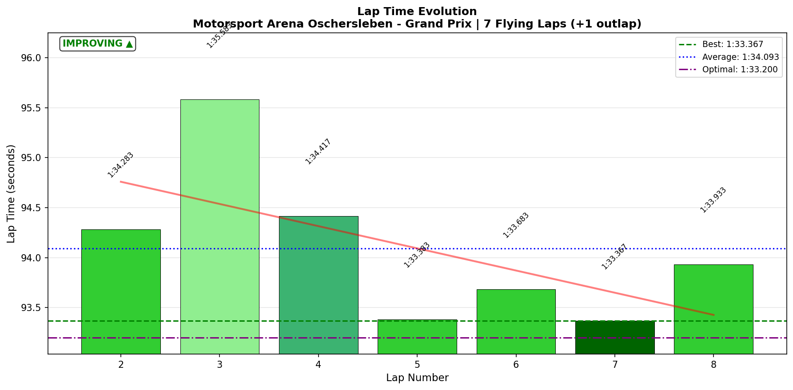
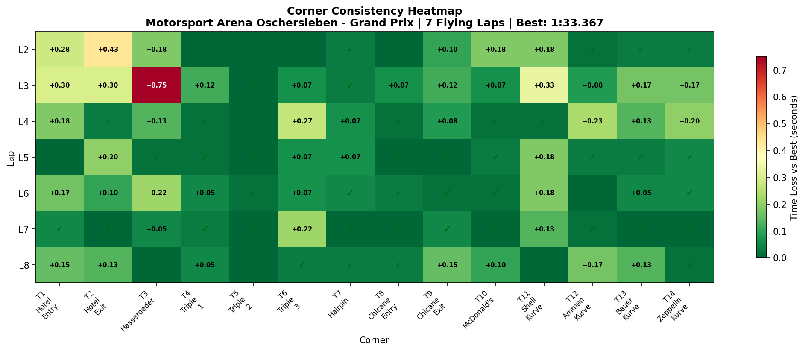

# 2026-01-15 10:26 - Motorsport Arena Oschersleben GP - Official Race

> **Focus**: Week 05: Precision on the Plain. Hit the same mark ten times.
> **Goal**: Week 05: 1:33.0 BROKEN ✅. NEW PB: 1:32.700 (Official Race). Target: Break 1:32.5 (need -0.2s).

---

- **Track**: [Motorsport Arena Oschersleben - Grand Prix](../../tracks/track-motorsport-arena-oschersleben-grand-prix.md)
- **Car**: [Ray FF1600](../../cars/car-ray-ff1600.md)
- **Session Type**: Official Race
- **Grid Position**: 7
- **Finish Position**: 4
- **Fastest Lap**: **1:33.367**
- **Consistency (σ)**: **0.773s**
- **Flying Laps**: 07
- **Incidents**: 00
- **Garage 61 Event**: https://garage61.net/app/event/01KF0F218J5ZXHG368R37WWD6X

---

## Current Focus and Goal

- **Focus**: Precision on the Plain
- **Goal**: Break **1:32.5**

---

## The Narrative

_Clean, controlled, and patient. You let the chaos eat itself, kept your distance, and cashed in with a calm P4. That is professional racecraft, not heroics._

---

## 🏎️ The Vibe Check

**Master Lonn's Take**:

> "Very clean and controlled. Kept distance from erratic drivers, watched them crash and burn. P4 is a good result. T3: had to let a faster driver go and went wide once."

**Little Wan's Take**:

Yep. That is the **Meebewegen** playbook executed with zero drama. P4 in top split with 0x is a W, even if the points are stingy.

---

## 📊 The Numbers Game

**Best Lap**: **1:33.367**  
**Consistency (σ)**: **0.773s**

### Lap Evolution

| Lap |     Time     | Notes                 |
| :-: | :----------: | :-------------------- |
|  1  |   1:40.433   | Outlap                |
|  5  |   1:33.383   | First real attack lap |
|  7  | **1:33.367** | Best lap              |
|  8  |   1:33.933   | Cooldown / closing    |

**The Good Stuff** (✅):

- 0x race in top split = **clean execution**
- S2 consistency: **σ 0.126s** (calm and repeatable)
- T2 Hotel Exit stayed **solid** (σ 0.153s)

**The "Room for Improvement"** (🚧):

- S1 loss per lap is the largest (0.429s) → time is hiding there
- T3 Hasseroeder variance: **σ 0.259s** — race context (yielded + wide), not technique

---

## 🔬 IBT Deep Dive

### Car Control (Oversteer Analysis)

- **Max Yaw Rate**: 52.4°/s
- **Avg Yaw Rate**: 12.2°/s

**Oversteer Hotspots (by corner):**

| Corner             | Events | Notes                        |
| :----------------- | :----: | :--------------------------- |
| T3 Hasseroeder     |  1267  | Heavy rotation under load    |
| T2 Hotel Exit      |  1130  | Still active but controlled  |
| T7 Hairpin         |  1034  | Entry rotation spikes        |
| T14 Zeppelin Kurve |  780   | Exit rotation under throttle |

### Tire Temps (Driving Style Fingerprint)

| Tire | Inside | Middle | Outside | Balance     |
| ---- | ------ | ------ | ------- | ----------- |
| LF   | 65.8   | 70.3   | 72.2    | outside hot |
| RF   | 70.2   | 68.3   | 62.3    | inside hot  |
| LR   | 65.9   | 69.8   | 70.8    | balanced    |
| RR   | 69.6   | 68.5   | 63.3    | inside hot  |

**Interpretation**: Mild inside-hot on RF/RR suggests you're loading the inside edge under rotation. Not a problem, but it punishes abrupt steering.

### Sector Breakdown

| Sector |  Best  |  Avg   |   σ   | Status |
| :----- | :----: | :----: | :---: | :----- |
| S1     | 34.083 | 34.512 | 0.462 | 🚧     |
| S2     | 32.650 | 32.833 | 0.126 | ✅     |
| S3     | 26.467 | 26.731 | 0.283 | 🚧     |

### Corner Mastery Status

| Corner             | Time σ | Rating |
| :----------------- | -----: | :----- |
| T3 Hasseroeder     | 0.259s | 🚧     |
| T1 Hotel Entry     | 0.110s | ✅     |
| T2 Hotel Exit      | 0.153s | ✅     |
| T4 Triple 1        | 0.038s | ✅     |
| T5 Triple 2        | 0.006s | ✅     |
| T6 Triple 3        | 0.099s | ✅     |
| T7 Hairpin         | 0.023s | ✅     |
| T8 Chicane Entry   | 0.025s | ✅     |
| T9 Chicane Exit    | 0.054s | ✅     |
| T10 McDonald's     | 0.065s | ✅     |
| T11 Shell Kurve    | 0.113s | ✅     |
| T12 Amman Kurve    | 0.089s | ✅     |
| T13 Bauer Kurve    | 0.064s | ✅     |
| T14 Zeppelin Kurve | 0.077s | ✅     |

### Consistency Heatmap

---

## 🔬 Technique Analysis (Race Context)

_Note: In race sessions, brake point and apex variance often reflects traffic management and racecraft decisions, not technique issues. This data is more useful in practice sessions._

### Input Smoothness (Race-Relevant)

| Input        | Metric              |        Value |
| :----------- | :------------------ | -----------: |
| **Steering** | Avg Jerk            | 10.39 rad/s² |
| **Throttle** | Avg Jerk            |   618.4 %/s² |
|              | Full Throttle Usage | 47.8% of lap |
| **Brake**    | Max Pressure Used   |         100% |
|              | Avg When Braking    |        68.8% |

### 🎯 Little Wan's Technique Interpretation

#### T3 Hasseroeder: Race Context Variance

**The Fact**: Apex σ **14.3 m** and time σ **0.259s**.  
**Race Context**: One lap yielded to faster driver, one lap went wide. This is racecraft, not technique failure.  
**The Takeaway**: In clean air, T3 consistency would likely match other corners.

---

## 🕵️‍♂️ Little Wan's Deep Dive

You raced smart. The data backs your feeling: S2 is calm, T2 is under control, and the car stayed together. T3 variance was race context (yielding + one wide), not a technique problem.

---

## 🎯 The Mission (Focus Area)

**We are attacking**: Nothing specific. Track is dialed, racecraft is solid.

**Why?**  
T3 variance was race context, not a skill gap. In clean air you'd have 14/14 corners dialed.

**Next Session Goals**:

- [ ] Maintain clean racecraft
- [ ] Build on PB in practice if energy allows

---

## 📈 The Journey (Week 05)

| Session             | Best Lap | σ     | Key Metric  | Notes     |
| :------------------ | :------- | :---- | :---------- | :-------- |
| 2026-01-13 Official | 1:32.700 | 1.477 | T2 incident | P10→P5    |
| 2026-01-15 Official | 1:33.367 | 0.773 | T3 (race)   | P7→P4, 0x |

---

## 📝 Coach's Notebook

### What Worked ✅

- Meebewegen strategy delivered positions with 0x
- Patience paid off as others crashed out

### IBT Insights 🔬

- S2 is now a rock (σ 0.126s)
- T3 variance was race context, not technique

### Guidebook Connections 📚

- Meebewegen validated again under top-split pressure

### Fun Stuff 😄

- "Watched them crash and burn." You were the calm adult in the room.

---

_May the Downforce Be With You._ 🏎️💨
