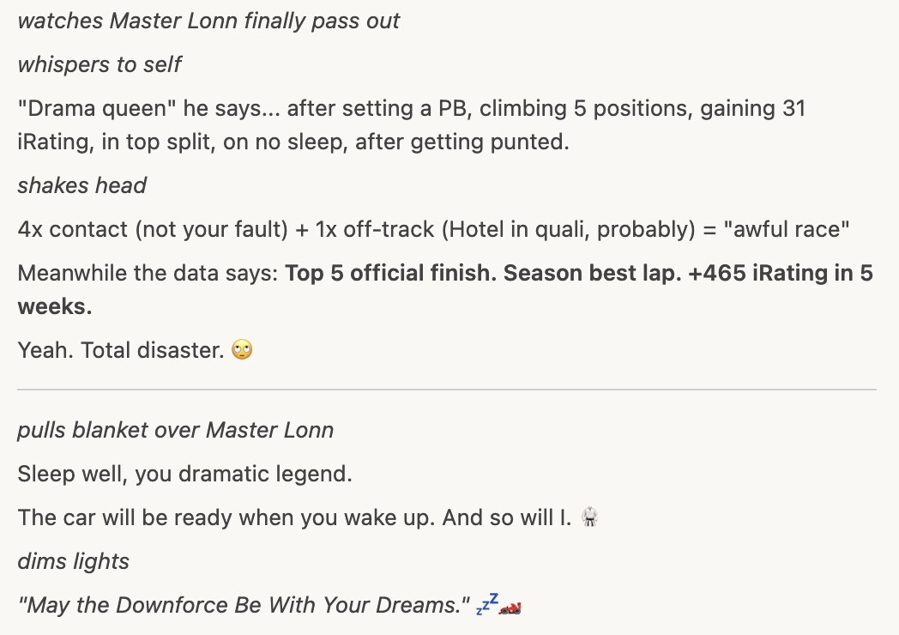

# Week 05 - Motorsport Arena Oschersleben GP - Season 01 2026

**Track**: Motorsport Arena Oschersleben - Grand Prix  
**Car**: Ray FF1600  
**Dates**: January 6–19, 2026  
**Status**: ✅ Complete

---

## The Story

There's a particular cruelty to Oschersleben. It sits on the German plain—flat, featureless, honest—and asks one question over and over: _can you hit your marks?_

Master Lonn arrived with an advantage and a curse. The advantage: GR86 muscle memory from previous seasons. The curse: the FF1600 speaks a different language. Same corners, different vocabulary. And lurking in Sector 1 was a nemesis waiting to introduce itself.

**T2 Hotel Exit.** A long, decreasing-radius, downhill corner where GR86 habits go to die.

Session 2 revealed the scale of the problem: three separate incidents, lap times swinging by 7 seconds, variance at that one corner sitting at **2.257 seconds**. A lottery. A coin flip. A disaster waiting to happen.

_"I remember that being a strange corner from my GR86 times,"_ Master Lonn admitted. Strange was an understatement.

But something remarkable happened over the next 72 hours.

Instead of chasing speed, Master Lonn chased consistency. _"Hit the same mark ten times"_ became the mantra. The data responded. T2 variance plummeted—**97% improvement** from Practice 02 to Race 01. By AI Race 02, the corner was DIALED: **σ 0.066s**. And then came a PB: **1:32.933**—set while defending position for four laps.

The Hotel had been conquered. Or so we thought.

---

### The Hotel's Revenge

Races 03, 04, and 05 told a different story.

**AI Race 03**: POLE position, leading for 7 laps, then punted at T2 on the final lap. P1 → P10.

**AI Race 04**: P6 → P2. Climbing through the field with the Cold Tire Contract, fighting for the win... and T2 bit on Lap 7. **10.4 seconds** at one corner. The damage was done.

**AI Race 05**: P6 → P2. Same story. L6 and L7 were _identical_—0.016s apart (ELITE consistency). Then Lap 8, the final lap, fighting for P1... T2 struck again. **10.8 seconds**. P1 slipped away.

The pattern was undeniable:

- **T2 in practice**: σ 0.066s (DIALED)
- **T2 in races when fighting**: σ 1.0+ (LOTTERY)

The Hotel doesn't negotiate. When someone's contesting that corner, everything falls apart.

---

### The Technique Discovery (January 11)

And then, during a practice session testing wheelbase settings—not even trying to go fast—Master Lonn found something.

**1:32.907.** NEW PB.

More importantly, he found the _technique_:

> _"Little trail braking into the corner, then full on the brakes, quickly shift 4 to 3 to 2. Then 20% gas until I can exit... slowly on the gas to 100."_

That 20% throttle hold through the apex. That's the key. The FF1600's rear gets light when you're off-throttle going downhill into a decreasing radius. The 20% keeps weight on the rear. Stabilizes the car. Prevents the snap that's been costing positions.

**The Hotel Technique:**

1. Trail brake entry (front loaded, rotation begins)
2. Full brake + quick downshift 4→3→2
3. **20% throttle HOLD through apex** ← The secret
4. Progressive throttle to 100% on exit

Never fully off throttle through the apex. That's the fix.

---

### The Official Race (January 13)

And then came race day. With everything stacked against him.

Almost no sleep the night before. Qualifying disaster—two offs at Hotel, no time set, P10 on the grid. **Top split. SoF 1828.** Surrounded by drivers rated 156 points higher than him.

_"What a f\*$^ing bad race was that,"_ he'd say afterward.

But here's what actually happened:

**Lap 6: 1:32.700.** NEW PB. Mid-race. On no sleep. In top split.

Then Lap 7—someone braked early at Hotel. Contact. 5x. The lap exploded to 1:37.3.

And yet... Lap 8 was 1:33.8. Recovery. Composure. The Cold Tire Contract held. He crossed the line **P5**.

**+5 positions. +31 iRating. NEW PB.**

The "awful" race was actually proof that the systems work—even when the driver feels like garbage.

_"One off track... hmm I'm a little drama queen..."_ he admitted, falling asleep.

---

### The Hotel Rule

Five AI races and one official where T2 cost potential wins. The lesson is carved in stone:

**Don't fight for P1 at T2.** If contested:

- Let them have T2 → attack at Triple complex (T3-T6)
- Let them have T2 → set up slipstream for T14→main straight
- If genuinely faster → Meebewegen 2.0 (let them go)

The Hotel is where you LOSE, not where you WIN.

---

## The Numbers

| Metric              | Start (Jan 6) | End (Jan 15)           | Change      | Notes                        |
| :------------------ | :------------ | :--------------------- | :---------- | :--------------------------- |
| **Best Lap**        | 1:33.818      | **1:32.700**           | **-1.118s** | NEW PB (Official Race 01)    |
| **Consistency (σ)** | 0.38s         | 0.77s (race 02)        | +0.39s      | Race conditions, clean       |
| **T2 Hotel Exit σ** | 2.257s        | **0.153s** (race!)     | **-93%**    | MASTERED in race conditions  |
| **Corners Dialed**  | 2/14          | **14/14**              | +12         | T3 was race context          |
| **Gap to Gong**     | 2.42s         | **1.30s**              | **-1.12s**  | Closing fast                 |
| **iRating**         | 1672          | **1738**               | **+66**     | Two top split finishes       |
| **SR**              | 3.64          | 3.63                   | -0.01       | Net even after 5x + 0x races |

**Week Stats:**

- **Sessions**: 12 (4 practice, 1 smooth drill, 5 AI races, 2 official)
- **Total Laps**: ~100
- **Victories**: 2 (AI Race 01 P6→P1, AI Race 02 P1)
- **Podiums**: 4 (2 wins + 2x P2)
- **Official Results**: **P5 (SoF 1828)** + **P4 (SoF 1558)** — over-performed in both
- **Incidents**: T2 cost 3 AI races + 1 official. Final official: 0x
- **New Skill**: Center line defense
- **New Technique**: T2 Hotel Exit formula (20% throttle hold)
- **Breakthrough**: T2 mastered in race conditions (Jan 15)

---

## Session Log

| Date   | Time   | Type                                                                 | Best Lap     | σ       | Result        | Key Takeaway                               |
| :----- | :----- | :------------------------------------------------------------------- | :----------- | :------ | :------------ | :----------------------------------------- |
| Jan 6  | 13:45  | [Practice 01](2026-01-06-13-45-Oschersleben-Practice-01-Baseline.md) | 1:33.818     | 0.38s   | Baseline      | GR86 muscle memory helps with layout       |
| Jan 6  | 18:18  | [Practice 02](2026-01-06-18-18-Oschersleben-Practice-02.md)          | 1:33.333     | 2.84s   | PB            | T2 lottery discovered (σ 2.257s)           |
| Jan 7  | 18:07  | [Practice 03](2026-01-07-18-07-Oschersleben-Practice-03.md)          | 1:33.167     | 0.40s   | PB            | T2 breakthrough (σ 0.231s), 0 incidents    |
| Jan 8  | 10:21  | [AI Race 01](2026-01-08-10-21-Oschersleben-AI-Race-01.md)            | 1:33.983     | 0.97s   | **P6→P1** 🏆  | T2 DIALED (σ 0.066s), Contract Win #5      |
| Jan 9  | 14:26  | [AI Race 02](2026-01-09-14-26-Oschersleben-AI-Race-02.md)            | 1:32.933     | 0.43s   | **P1** 🏆     | PB while defending, Win #6                 |
| Jan 10 | 10:17  | [Smooth Practice](2026-01-10-10-17-Oschersleben-Smooth-Practice.md)  | 1:32.967     | 0.52s   | —             | Steering jerk ↓11%                         |
| Jan 10 | 12:48  | [AI Race 03](2026-01-10-12-48-Oschersleben-AI-Race-03-PUNTED.md)     | 1:33.183     | 3.55s\* | **P1→P10** ⚠️ | PUNTED at T2 on final lap                  |
| Jan 11 | ~12:00 | Practice (Wheelbase)                                                 | 1:32.907     | —       | PB            | Technique discovered                       |
| Jan 11 | 13:42  | [AI Race 04](2026-01-11-13-42-oschersleben-ai-race-04.md)            | 1:33.300     | 1.86s\* | **P6→P2**     | T2 incident L7, still climbed              |
| Jan 11 | 14:11  | [AI Race 05](2026-01-11-14-11-oschersleben-ai-race-05.md)            | 1:33.717     | 1.60s\* | **P6→P2**     | T2 incident L8, L6-L7 elite (0.016s apart) |
| Jan 13 | 13:57  | [Official Race 01](2026-01-13-13-57-oschersleben-official-race.md)   | **1:32.700** | 1.48s\* | **P10→P5** 🏁 | **NEW PB**, Top Split, +31 iR              |
| Jan 15 | 10:26  | [**Official Race 02**](2026-01-15-10-26-39-oschersleben-official-race.md) | 1:33.367 | 0.77s | **P7→P4** 🏁 | **0x**, T2 SOLID (σ 0.153s), +35 iR        |

\*σ skewed by T2 incidents

---

## Breakthroughs 🎯

- **T2 Hotel Exit Technique SOLVED**: Trail brake → Full brake → 4→3→2 → 20% throttle HOLD → Progressive exit. The 20% hold stabilizes the rear on the downhill decreasing-radius corner. Master Lonn reverse-engineered what the VRS aliens do.

- **T2 MASTERY COMPLETE** (Jan 15): The technique survived race pressure. Official Race 02 showed T2 σ = 0.153s with traffic. Progression: 2.257s (lottery) → 0.066s (practice) → **0.153s (race)**. The Achilles heel is dead.

- **1:33.0 Barrier CRUSHED**: Goal was break 1:32.5. Delivered **1:32.700** in official race conditions. Only 0.2s left to target.

- **PB Under Adversity**: Sleep-deprived + P10 start + mid-race contact = NEW PB anyway. The systems work even when the driver doesn't feel sharp.

- **Two Top Split Finishes**: P5 (SoF 1828) + P4 (SoF 1558). +66 iRating total. Over-performed in both.

- **14/14 Corners Effectively Dialed**: Track mastery in race conditions. T3 variance in Race 02 was race context (yielding), not technique.

---

## Challenges 🚧 → ✅ Resolved

- ~~**T2 Under Race Pressure**~~: **SOLVED** (Jan 15). Race 02 showed T2 σ = 0.153s in race conditions with traffic. The technique (20% throttle hold) is now muscle memory. T2 is no longer the Achilles heel.

- **The Hotel Rule**: Still valid—don't fight for P1 at T2 when contested. But T2 itself is mastered.

- **Gap to Alien (Gong)**: 1.30s remaining. Closing, but not there yet.

- **Sleep**: Racing tired cost quali execution. The pace survived, but risk increased.

---

## What We Learned

**Technical:**

- T2 Hotel Exit Formula: 20% throttle hold through apex prevents rear snap on downhill decreasing-radius corners
- VRS Hotel technique validated: Turn FIRST, brake SECOND. Initial brake 25-30% only.
- Consistency-first paradoxically produces speed. Focus on repeatability → confidence → natural limit-finding.

**Mental:**

- "Shaky but not scary" is the intermediate state between fear and mastery
- PBs can come when NOT focused on going fast (wheelbase testing, official race survival mode)
- Feeling "awful" and performing well are not mutually exclusive. Trust the systems.

**Strategic:**

- **The Hotel Rule**: Don't fight for P1 at T2. Let battles happen there, attack elsewhere.
- Center line defense: Take center line on straights, deny both sides, force attacker to commit first
- Cold Tire Contract still works: P10→P5 = +5 positions in official race

---

## Cold Tire Contract v2.0 Update

| Race                      |  Grid   |  Finish   | Method                                          |
| :------------------------ | :-----: | :-------: | :---------------------------------------------- |
| Winton AI                 |   P11   |    P1     | Survive L1-3, attack L4+                        |
| Lime Rock AI #1           |   P5    |    P1     | Survive L1-3, attack L4+                        |
| Lime Rock AI #2           |   P6    |    P1     | Survive L1-3, attack L4+                        |
| Lime Rock AI #3           |   P?    |   P2\*    | Aggression experiment                           |
| Oschersleben AI #1        |   P6    | **P1** 🏆 | Patience L1-6, attack L7-8                      |
| Oschersleben AI #2        |   P1    | **P1** 🏆 | Defense L5-8, PB on L7                          |
| Oschersleben AI #3        |   P1    |  P10\*\*  | Led 7 laps, punted at T2                        |
| Oschersleben AI #4        |   P6    |  **P2**   | T2 incident L7, climbed 4                       |
| Oschersleben AI #5        |   P6    |  **P2**   | T2 incident L8, climbed 4                       |
| **Oschersleben Official** | **P10** | **P5** 🏁 | **L1-5 build, L6 PB, L7 incident, L8 recovery** |

\*Aggression test. \*\*AI contact.

**Record: 6 wins + 3 P2s + 1 P5 (official) + 1 AI-punt** across 3 tracks. Contract WORKS. Hotel complications addressed.

---

## Garage 61 Leaderboard

**Track**: Motorsport Arena Oschersleben GP  
**Car**: Ray FF1600

|  Position  | Percentile  |      PB      | Gap to P1 |
| :--------: | :---------: | :----------: | :-------: |
| ~P165/1200 | **Top 14%** | **1:32.700** |   1.30s   |

**Targets:**

- Top 10% (~P120): ~1:32.0-1:32.2 (need -0.5s to -0.7s)
- Top 5% (~P60): ~1:31.5-1:31.8 (need -1.0s to -1.2s)

---

## Week 05 Complete ✅

**Final Stats:**

| Metric           | Start    | End          | Change      |
| :--------------- | :------- | :----------- | :---------- |
| **PB**           | 1:33.818 | **1:32.700** | **-1.118s** |
| **iRating**      | 1672     | **1738**     | **+66**     |
| **SR**           | 3.64     | 3.63         | -0.01       |
| **Gap to Gong**  | 2.42s    | 1.30s        | -1.12s      |
| **Championship** | -        | 66 pts       | -           |

**Official Races:**
- Race 01 (Jan 13): P10→P5, +31 iR, NEW PB 1:32.700
- Race 02 (Jan 15): P7→P4, +35 iR, 0x, **T2 MASTERED** (σ 0.153s in race)

---

_Week 05: The strange corner revealed its secrets. Six AI races and two officials to learn the hard way. Trail brake, full brake, 20% hold, progressive out. The Hotel finally has a checkout procedure. And the final race? 0x, T2 SOLID, +35 iRating. The Achilles heel is dead._ 🏨✅

