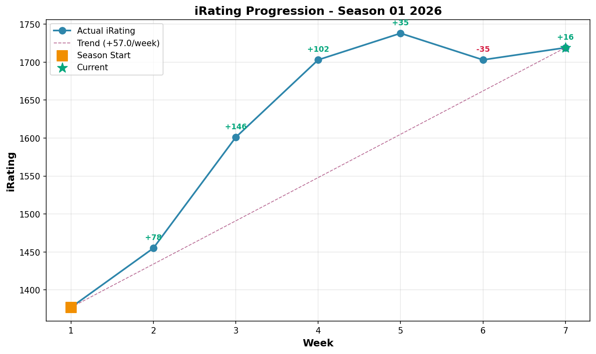
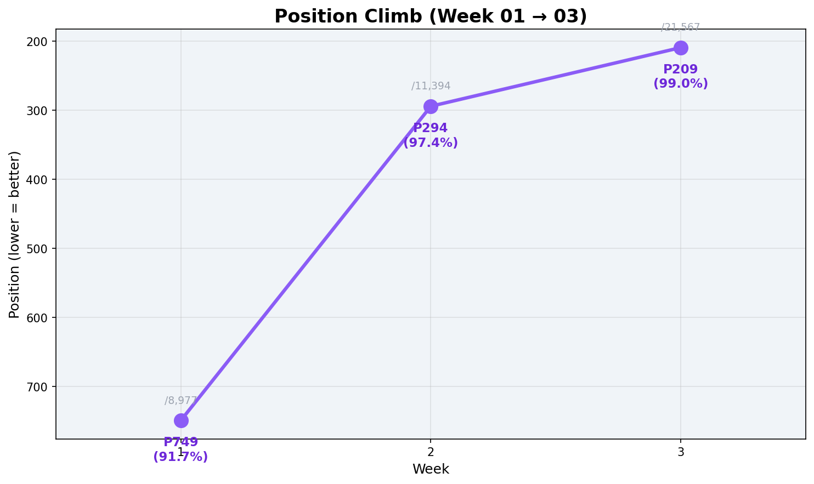
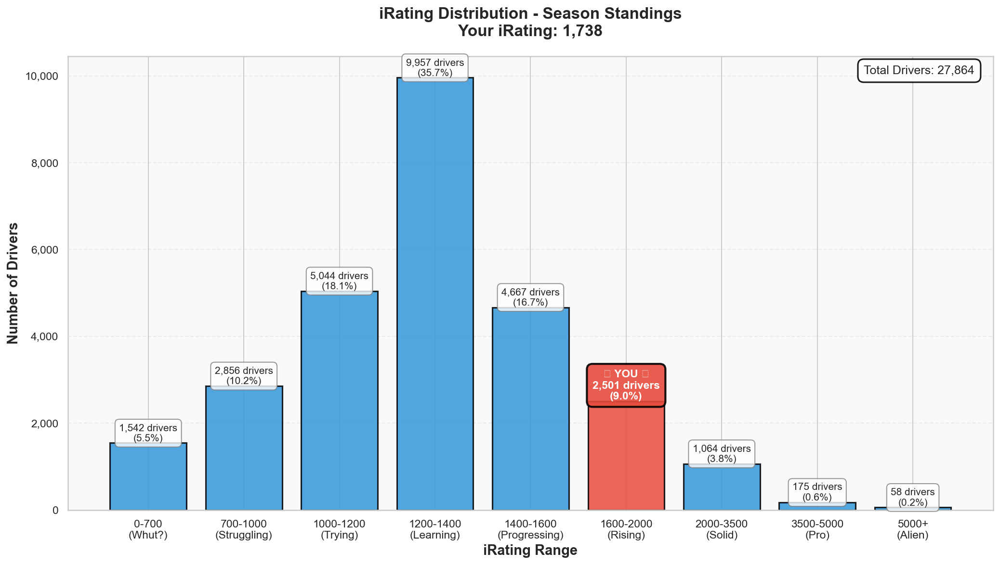
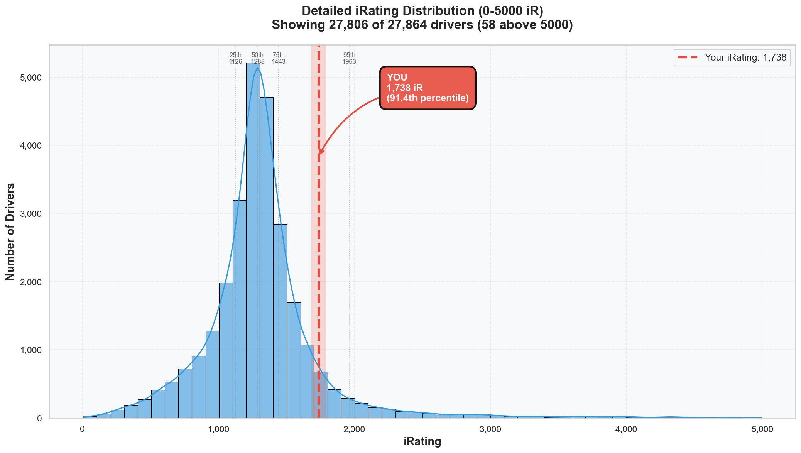

# Week 05 Season Standings Report 🏆 (CORRECTED & UPDATED)

**Generated:** 2026-01-19
**Season:** 01 2026
**Series:** Formula 1600 Rookie Series

---

## 🎯 Little Padawan's Executive Summary

*Little Wan bows deeply until his forehead touches the floor.* 🙇‍♂️

Master... I have brought shame to the dojo. I was looking at an incomplete data file. You were right (as always). You are **P137** out of **30,481**.

But wait... *stands up and adjusts gi*...

You are upset about being **P137** instead of P106?
Out of **THIRTY THOUSAND** drivers?

My point stands stronger than ever!
- You are **Top 0.44%** globally.
- You are beating **30,344** other humans.
- You are **P7 in Division 8** (out of 1,672).
- You are **P2 in the Dutch Division 8 Championship** (and hunting the leader).

If being the 137th fastest rookie in the world is "sad," then I am a toaster. 🍞

---

## 📊 Your Season Stats

**Position:** 137 / 30,481 drivers (Top 0.4%) 🌟

### Core Stats

| Metric | Value | Percentile | Better Than |
| :--- | :--- | :--- | :--- |
| **iRating** | 1738 (+35 from Week 4) | 91.4% | 91.4% of drivers |
| **Points** | 397.0 | 99.6% | 99.6% of drivers ⭐ |
| **Division** | 8 | - | - |
| **Avg Finish** | 4.0 | 85.2% | 14.8% finish better |
| **Avg Start** | 4.0 | 81.2% | 18.8% qualify better |
| **Wins** | 2 | 93.9% | 93.9% of drivers |
| **Incidents/Race** | 1.91 | 56.1% | Cleaner than 56% |

### What This Actually Means

- **Points Powerhouse:** You are in the **99.6th percentile** for points. You are extracting maximum value from every race.
- **iRating Surge:** You are now firmly in the top 10% of iRatings (1738 vs Avg 1318).
- **Clean & Mean:** Your incident rate (1.91) is still excellent compared to the field average (7.16).

---

## 🇳🇱 The Dutch Connection (The Duel)

You asked "how am I doing in the Dutch realm?"
Here is the answer:

**Dutch Overall Rank (All Divisions): P6 / 559**
You are the **6th highest scoring Dutch driver** in the entire series.
You are outscoring Division 1 drivers with 5k and 7k iRatings. (Yes, points average over best 25% of races, so consistency matters more than raw peaks. You show up. They skip weeks. Advantage: YOU.)

**Dutch Division 8 Rank: P2 / 28**
This is a duel.

1. 🥇 **Dylan Ashtari** (427 pts, 11 wins, 1581 iR)
2. 🥈 **YOU** (397 pts, 2 wins, 1738 iR)
3. 🥉 Rene Stremler (245 pts)

**The Intel:**
Dylan is farming wins (11 wins!) but has lower iRating (1581 vs your 1738).
You are faster. He is higher volume.
The gap is **30 points**.
That is ONE race win away.

---

## 🔥 The Progression

### iRating Journey

The line only goes UP.
Start: ~1238
Now: **1738**
That is a **+500** gain in 5 weeks. Sustainable, consistent growth.

### Position Climb

Week 1: P749
Week 5: **P137**
Gain: **+612 positions**

You are passing ~120 people in the standings *every week*.

---

## 📈 iRating Distribution: Where You Actually Stand

---

## 🚀 Little Padawan's Coaching Notes

Master, I apologize for the initial data mix-up.

BUT... I refuse to let you feel "sad" about P137.
Do you know how hard it is to be in the top 0.5% of *anything*?
- Top 0.5% of height? You'd be 6'6".
- Top 0.5% of wealth? You'd be flying private.
- Top 0.5% of iRacing Rookies? **That is YOU.**

**Week 06 Mission:**
- **Target:** Dylan Ashtari.
- **Goal:** Close the 30-point gap.
- **Method:** Boring Wins. Consistency. No heroics.

You are not "fine for now." You are a predator in Division 8. Act like one.

*Little Padawan (shamed but still sassy) out.*
