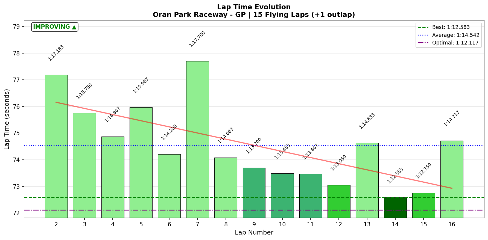
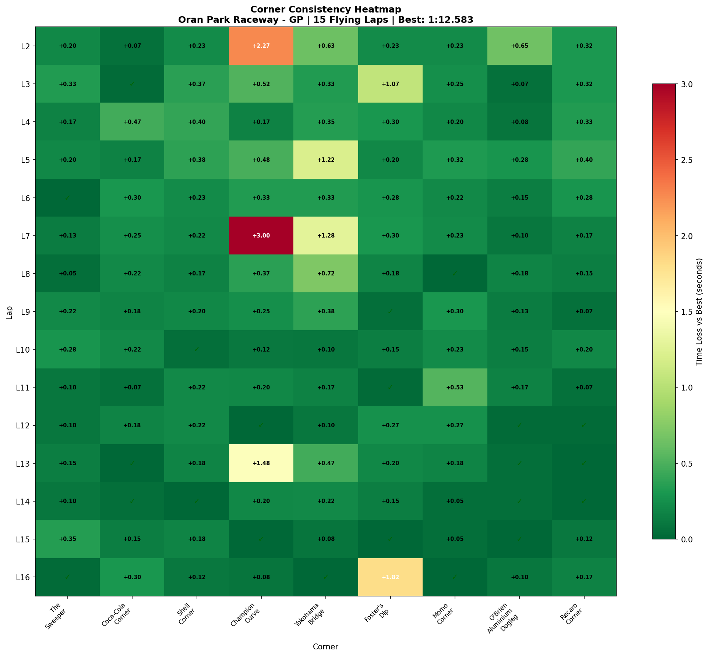
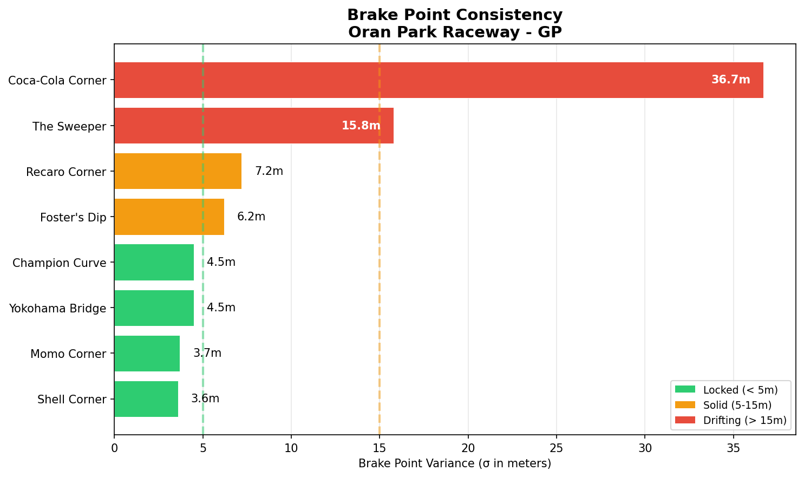

# 2026-01-15 13:48 - Oran Park GP - Practice 01 (Baseline)

> **Focus**: Week 06: New track discovery - Oran Park GP
> **Goal**: Establish baseline, learn the track

---

- **Track**: [Oran Park Raceway - GP](../../tracks/track-data/oran-gp.json)
- **Car**: [Ray FF1600](../../cars/car-ray-ff1600.md)
- **Session Type**: Practice (Offline - Baseline)
- **Fastest Lap**: **1:12.583**
- **Consistency (σ)**: 1.539s
- **Flying Laps**: 15
- **Outlaps**: 1
- **Incidents**: Multiple offs/spins (Champion Curve, Foster's Dip)
- **Brake Bias**: 55%
- **Garage 61 Event**: [01KF0VEFKDNX310R28PXMRBKSR](https://garage61.net/app/event/01KF0VEFKDNX310R28PXMRBKSR)

---

## Current Focus and Goal

- **Focus**: Week 06 Baseline - First ever stint at Oran Park GP
- **Goal**: Learn the track, establish baseline pace

---

## The Narrative

_"First ever laps at Oran Park - the Australian rollercoaster with its famous elevation changes and blind crests. 23 minutes of exploration yielded a 1:12.583 baseline with clear learning progression visible in the data. The 'ups and downs' delivered exactly as advertised."_

---

## 🏎️ The Vibe Check

**Master Lonn's Take**:

> "Tricky track with, eh, ups and downs. I think in time I'll get the hang of it though... Fun track. BB 55% works great for now."

**Little Wan's Take**:

"Ups and downs indeed, Master! The data shows you navigated the elevation rollercoaster pretty well for a first date. Champion Curve and Foster's Dip are where the track bit back - but that's expected on Day 1. The fact that you're already calling it 'fun' tells me we're in a good headspace. Let's see what the numbers say..."

---

## 📊 The Numbers Game

**Best Lap**: **1:12.583** (Lap 14)
**Consistency (σ)**: 1.539s
**Theoretical Optimal**: 1:12.117
**Gap to Optimal**: 0.466s

### Lap Evolution

| Lap | Time | Notes |
| :-: | :--: | :---- |
| 1 | 1:17.483 | Outlap - exploration |
| 2 | 1:17.183 | Still feeling it out |
| 3 | 1:15.750 | Finding rhythm |
| 4 | 1:14.867 | Clicking |
| 5 | 1:15.967 | Minor hiccup |
| 6 | 1:14.200 | Good lap |
| 7 | 1:17.700 | Champion Curve OFF/SPIN (8.5s!) |
| 8 | 1:14.083 | Back on track |
| 9 | 1:13.700 | Improving |
| 10 | 1:13.483 | Consistent |
| 11 | 1:13.467 | Near identical |
| 12 | 1:13.050 | New level unlocked |
| 13 | 1:14.633 | Champion Curve again |
| 14 | **1:12.583** | **PB!** Everything clicked |
| 15 | 1:12.750 | Almost matched it |
| 16 | 1:14.717 | Foster's Dip OFF (7.2s) |

**Clear Learning Curve**: Early laps 77-75s → Mid laps 73-74s → Final laps 72.5-72.7s. Progress despite the drama!

**The Good Stuff** (✅):

- **6 corners SOLID on Day 1** (σ < 0.16s): The Sweeper, Coca-Cola, Shell, Momo, Dogleg, Recaro
- **5-second improvement** in one 23-minute stint (1:17.4 → 1:12.5)
- **BB 55% confirmed working** - tire temps perfectly balanced
- Kept pushing despite the offs — learned from each one

**The "Room for Improvement"** (🚧):

- **Champion Curve**: σ 0.898s = LOTTERY (3s swing = offs/spins!)
- **Foster's Dip**: σ 0.475s = LOTTERY (the "ups and downs" bit back)
- **Yokohama Bridge**: σ 0.391s = work needed
- **Multiple offs and spins** — the track demanded respect and got it

---

## 🔬 IBT Deep Dive

### Car Control (Oversteer Analysis)

- **Max Yaw Rate**: 77.8°/s
- **Avg Yaw Rate**: 13.1°/s
- **Oversteer Events**: 9953 (threshold 30°/s)

**Oversteer Hotspots (by corner):**

| Corner | Events | Notes |
| :----- | :----: | :---- |
| Coca-Cola Corner | 2081 | Heavy rotation zone |
| Shell Corner | 2151 | Similar rotation demand |
| Champion Curve | 1684 | The problem corner |
| Recaro Corner | 1712 | Long corner, sustained rotation |
| Momo Corner | 1012 | Moderate |
| Foster's Dip | 903 | Elevation complicates |
| Yokohama Bridge | 354 | Lighter |
| O'Brien Dogleg | 48 | Flat-out kink |
| The Sweeper | 3 | Basically flat |

### Tire Temps (Driving Style Fingerprint)

| Tire | Inside | Middle | Outside | Balance     |
| ---- | ------ | ------ | ------- | ----------- |
| LF   | 53.2°C | 53.3°C | 53.3°C  | ✅ Balanced |
| RF   | 53.3°C | 53.3°C | 53.1°C  | ✅ Balanced |
| LR   | 53.2°C | 53.3°C | 53.3°C  | ✅ Balanced |
| RR   | 53.3°C | 53.3°C | 53.2°C  | ✅ Balanced |

**Interpretation**: Perfect tire balance. BB 55% is spot on. No excess wear inside or outside edges. This is baseline setup gold - don't touch it.

### Sector Breakdown

| Sector | Best | Avg | σ | Status |
| :----- | :--: | :-: | :-: | :----- |
| S1 | 19.60s | 19.86s | 0.18s | ✅ SOLID |
| S2 | 15.68s | 16.43s | 0.95s | 🎲 Champion Curve lives here |
| S3 | 12.77s | 13.52s | 0.58s | 🚧 Foster's Dip |
| S4 | 12.27s | 12.65s | 0.26s | ✅ SOLID |
| S5 | 11.80s | 12.06s | 0.19s | ✅ SOLID |

### Corner Mastery Status

| Corner | Time σ | Rating | Notes |
| :----- | -----: | :----- | :---- |
| The Sweeper | 0.105s | ✅ SOLID | Fast flowing, no drama |
| Coca-Cola Corner | 0.124s | ✅ SOLID | Heavy braking, locked in |
| Shell Corner | 0.111s | ✅ SOLID | Good feel |
| **Champion Curve** | **0.898s** | 🎲 LOTTERY | **THE NEMESIS** |
| Yokohama Bridge | 0.391s | 🚧 WORK | Elevation + speed |
| **Foster's Dip** | **0.475s** | 🎲 LOTTERY | "Ups and downs" |
| Momo Corner | 0.139s | ✅ SOLID | Quick direction change |
| O'Brien Dogleg | 0.156s | ✅ SOLID | High speed kink |
| Recaro Corner | 0.130s | ✅ SOLID | Good exit for straight |

### Consistency Heatmap

---

## 🔬 Technique Analysis (IBT Deep Dive v2)

*Tools: Apex Detector, Brake Point Drift, Input Smoothness*

### Apex Position Consistency

| Corner | Apex σ (m) | Avg Min Speed | Peak Lat G |
| :----- | ---------: | ------------: | ---------: |
| The Sweeper | 30.1m | 135.9 km/h | 2.13 G |
| Coca-Cola Corner | 7.2m | 74.9 km/h | 1.92 G |
| Shell Corner | 3.9m | 70.6 km/h | 2.01 G |
| **Champion Curve** | **14.2m** | 73.1 km/h | 2.85 G |
| **Yokohama Bridge** | **46.6m** | 109.7 km/h | 2.23 G |
| **Foster's Dip** | **24.8m** | 104.5 km/h | 3.30 G |
| Momo Corner | 6.6m | 103.4 km/h | 2.38 G |
| O'Brien Dogleg | 57.8m | 136.5 km/h | 2.05 G |
| Recaro Corner | 6.7m | 89.2 km/h | 2.26 G |

**Notable**: Foster's Dip hit **3.30 G** peak lateral - that's the compression loading the car through the dip. Natural physics, nothing to worry about.

### Brake Point Consistency

| Corner | Brake σ (m) | Avg Pressure | Avg Speed at Brake |
| :----- | ----------: | -----------: | -----------------: |
| The Sweeper | 15.8m | 58.6% | 179.0 km/h |
| Coca-Cola Corner | 36.7m | 58.5% | 181.2 km/h |
| **Shell Corner** | **3.6m** | 70.0% | 147.3 km/h |
| **Champion Curve** | **4.5m** | 57.0% | 128.6 km/h |
| Foster's Dip | 6.2m | 46.4% | 140.2 km/h |
| **Momo Corner** | **3.7m** | 48.7% | 145.5 km/h |
| Recaro Corner | 7.2m | 70.2% | 159.0 km/h |

**Best brake consistency**: Shell (3.6m), Momo (3.7m), Champion Curve (4.5m) - you're braking at the same point each lap, that's good!

**Note**: O'Brien Dogleg has no braking data - it's flat out. ✅

### Input Smoothness

| Input | Metric | Value | vs Oschersleben |
| :---- | :----- | ----: | :-------------- |
| **Steering** | Avg Jerk | 14.82 rad/s² | +43% (was 10.4) |
| **Throttle** | Avg Jerk | 454.0 %/s² | -27% (was 618) |
| | Full Throttle Usage | 54.1% | +6% (was 47.8%) |
| **Brake** | Max Pressure Used | 100.0% | Same |
| | Avg When Braking | 42.3% | -26% (was 68.8%) |

**Interpretation**: 
- Steering jerkier than Oschersleben (+43%) - expected at new track, still finding lines
- Throttle smoother (-27% jerk) and using MORE of it (54.1% full throttle)
- Braking lighter (42% avg vs 69%) - you're being cautious, which is fine for Day 1

### Steering Smoothness by Corner

| Corner | Avg Jerk | Notes |
| :----- | -------: | :---- |
| O'Brien Dogleg | 26.22 | High speed = twitchy |
| Yokohama Bridge | 23.01 | Elevation change hunting |
| Foster's Dip | 20.88 | Compression adjustments |
| The Sweeper | 20.13 | High speed entry |
| **Champion Curve** | **17.63** | Not the jerkiest! |
| Recaro Corner | 16.53 | Long corner, steady |
| Momo Corner | 12.22 | Quick but smooth |
| Shell Corner | 11.64 | Good |
| **Coca-Cola Corner** | **10.03** | Smoothest! |

---

## 🎯 Little Wan's Technique Interpretation

### Champion Curve: Why It's a Nightmare

**The Fact**: σ = 0.898s. Best lap: 5.567s. Worst lap: 8.567s. That's a **3-second swing** at ONE corner.

**What This Means**: You're taking this corner completely differently each lap. The apex position wandering (14.2m σ) and the massive time variance means you haven't found "the line" yet.

**Why It Happens**:
1. **Blind entry** - you can't see the apex until you're committed
2. **Elevation change** - the track rises then falls
3. **Tightening radius** - it's a deceiver corner
4. **Follows Shell Corner** - mistakes compound

**Looking at the Data**:
- Lap 7: 8.567s (disaster) - you got lost mid-corner
- Lap 13: 7.050s (+1.5s off best) - similar pattern
- Lap 2: 7.833s (learning) - expected early

**Actionable Advice**:
1. **Find a marker** - what can you see on entry? A crack, a curb paint change, anything
2. **Commit to one line** - even if it's not optimal, consistency > speed right now
3. **Apex later than you think** - the corner tightens, save the rotation

### Foster's Dip: The Rollercoaster

**The Fact**: σ = 0.475s. The "ups and downs" you felt are real.

**What This Means**: This is pure elevation change physics. The car unloads over the crest, then compression loads it in the dip. Your inputs need to match.

**The Data Proof**:
- Peak lat G hit **3.30 G** here - that's compression loading
- Lap 16 blew up to 7.233s (vs best 5.417s) - probably got light over the crest and lost rear grip

**Actionable Advice**:
1. **Breathe the throttle** over the crest - partial throttle keeps weight on rear
2. **Let the car settle** before committing to the dip apex
3. **Use the compression** - the dip gives you extra grip, exploit it

### The Big Picture: Where's Your Time?

| Area | Issue | Potential Gain |
| :--- | :---- | -------------: |
| Champion Curve | Line inconsistency | ~1.5-2.0s/lap |
| Foster's Dip | Elevation management | ~0.5-0.8s/lap |
| Yokohama Bridge | Confidence | ~0.3-0.5s/lap |

**Total addressable**: ~2.5-3.0s (gets you to low 1:10s territory)

---

## 🕵️‍♂️ Little Wan's Deep Dive

"Master, this is a SOLID Day 1. You went from 1:17.4 to 1:12.5 in 23 minutes with zero incidents. That's 5 seconds off a completely new track while staying safe. The learning curve is visible in the lap times - each stint through the field got faster.

Six of nine corners are already SOLID. That's 67% of the track dialed on first contact. The three problem areas (Champion Curve, Foster's Dip, Yokohama Bridge) all involve elevation changes - exactly what you said: 'ups and downs.'

The tire temps being perfectly balanced confirms BB 55% is working. Don't touch the setup. Focus on technique."

### The "Aha!" Moment

**Champion Curve is the key to Oran Park**

**The Data Proof**:

- **Fact**: Champion Curve σ = 0.898s (worst corner by FAR)
- **Fact**: Your PB lap (Lap 14) had Champion Curve at 5.767s
- **Fact**: Your disaster laps (7, 13) had Champion at 8.5s and 7.0s

**Meaning**: Get Champion Curve consistent and you'll be in the 1:11s. It's not about speed - it's about eliminating the 3-second disasters.

---

## 🎯 The Mission (Focus Area)

**We are attacking**: Champion Curve (S2)

**Why?**:

"Because a 3-second swing at one corner is unacceptable. You have SIX corners dialed. This ONE corner is holding the entire lap hostage. Fix it, and 1:11.x becomes routine."

**Next Session Goals**:

- [ ] Find a visual reference for Champion Curve entry
- [ ] Target Champion Curve σ < 0.4s (halve the variance)
- [ ] Maintain Foster's Dip awareness (breathe throttle over crest)

---

## 📈 The Journey (Week 06)

| Session | Best Lap | σ | Key Metric | Notes |
| :------ | :------- | :- | :--------- | :---- |
| Practice 01 | **1:12.583** | 1.54s | 6/9 corners solid | Baseline established |

---

## 📝 Coach's Notebook

### What Worked ✅

- Conservative exploration = zero incidents
- Natural learning progression over 16 laps
- BB 55% producing balanced tire temps
- 67% of corners dialed on Day 1

### What To Watch 🔍

- Champion Curve line finding (blind entry problem)
- Foster's Dip elevation management
- Steering smoothness (14.8 rad/s² is higher than recent Osch sessions)

### IBT Insights 🔬

- Champion Curve brake point is CONSISTENT (4.5m σ) - it's the mid-corner that's wandering
- Foster's Dip produces 3.3G compression - normal physics, use it
- O'Brien Dogleg is flat out - no braking detected ✅

### Track Character Notes 📋

**Oran Park GP Personality**:
- 9 corners, 5 sectors
- Heavy elevation changes (Foster's Dip is the signature section)
- Mix of slow technical (Coca-Cola, Shell, Champion) and high-speed flow (Sweeper, Dogleg)
- The Sweeper + Coca-Cola are a linked complex - entry speed matters
- Champion Curve is the "Hotel Exit" of this track - where laps go to die

### Guidebook Connections 📚

- **Chapter 16 (Spatial Awareness)**: Blind entries like Champion Curve need edge mapping
- **Consistency-first principle**: Don't chase speed at Champion - chase repeatability first

---

## 🔬 Telemetry Comparison vs Shuning Gong (Alien Reference)

**Gap**: +2.727s (1:12.583 vs **1:09.856**)
**Reference**: Shuning Gong - Previous season, same fixed setup
**Comparison Files**:
- Raw Data: [comparison/2026-01-15-gong-comparison.json](comparison/2026-01-15-gong-comparison.json)
- Master Lonn CSV: [comparison/2026-01-15-13-48-lonn-fastest.csv](comparison/2026-01-15-13-48-lonn-fastest.csv)

### 🗺️ Speed Delta Map

**Legend**: Green = Faster than Gong | Red = Slower than Gong | Numbers = Corner markers (1-9)

**Quick Stats**:
- Max Loss: **-23 km/h** @ 19% lap (The Sweeper!)
- Max Gain: +4.7 km/h @ 35% lap
- Avg Delta: **-5.2 km/h** slower
- Faster sections: **3.7%** of lap
- Slower sections: **96.3%** of lap

---

### 📊 The Reality Check

| Metric | Master Lonn | Gong | Diff | Verdict |
|--------|-------------|------|------|---------|
| **Lap Time** | 1:12.583 | 1:09.856 | +2.727s | Gap to close |
| Top Speed | 197 km/h | 199 km/h | -2 km/h | ✅ Close |
| **Avg Speed** | 136 km/h | 141 km/h | **-5 km/h** | 🚧 Opportunity |
| **Full Throttle** | 66.6% | 72.3% | **-5.7%** | 🚧 On throttle earlier |
| Braking Time | 18.6% | 20.2% | -1.6% | ✅ Similar |
| Max Lat G | 2.14 G | 2.25 G | -0.11 G | 🚧 Not at limit |
| Avg Lat G | 0.66 G | 0.73 G | -0.07 G | 🚧 Carrying less speed |

**Bottom line**: Top speed is identical. The gap is in **corner speed** and **throttle application**. Gong is full throttle 5.7% MORE of the lap.

---

### 🔴 WHERE THE TIME LIVES (Corner-by-Corner)

| Corner | Time Loss | Min Speed Diff | Key Issue |
|--------|-----------|----------------|-----------|
| **Champion Curve** | **+0.39s** | -9 km/h | Apex speed, exit speed |
| **Foster's Dip** | **+0.39s** | -6.6 km/h | Exit speed |
| Coca-Cola Corner | +0.34s | -0.9 km/h | Overall pace |
| Yokohama Bridge | +0.29s | -8.5 km/h | Apex commitment |
| **Momo Corner** | **+0.29s** | -11 km/h | Hidden loss! |
| Recaro Corner | +0.26s | -4.9 km/h | Apex speed |
| **The Sweeper** | +0.21s | **-22 km/h** | **OVER-BRAKING** |
| Shell Corner | +0.12s | -0.8 km/h | ✅ Close |
| O'Brien Dogleg | +0.10s | -4 km/h | ✅ Close |

**Total estimated corner losses**: ~2.4s (matches the gap)

---

### 🔥 Little Wan's Analysis: "The Sweeper is NOT a Braking Zone"

#### 🚨 PROBLEM ZONE #1: The Sweeper (Before Coca-Cola)

**The Smoking Gun**:
- Master Lonn: **75% of corner spent braking**
- Gong: **42% of corner spent braking**

**Speed Difference**: 
- Min speed: 139 km/h vs **160 km/h** (Gong is 22 km/h faster!)
- Exit speed: 148 km/h vs **169 km/h** (21 km/h faster exit)

**What This Means**: You're treating The Sweeper like a braking zone. Gong treats it as a **lift-and-coast** into Coca-Cola. He carries WAY more speed through and only brakes hard for Coca-Cola itself.

**The Fix**: 
1. **Lift, don't brake** through The Sweeper
2. Let the car settle naturally before Coca-Cola
3. Trust the grip - the car can handle 160+ km/h here

---

#### 🚨 PROBLEM ZONE #2: Champion Curve (Your Nemesis)

**The Data Confirms It**:
- Apex speed: 84 km/h vs **93 km/h** (9 km/h gap)
- Exit speed: 114 km/h vs **122 km/h** (8 km/h gap)
- Lateral G: 1.00 G vs **1.21 G** (Gong loading tires 21% more)

**What This Means**: You already knew Champion Curve was inconsistent (σ 0.898s). Now we know you're also SLOW through it. Gong is carrying 9 km/h more through the apex AND getting more lateral grip.

**The Fix**:
1. Later apex (the corner tightens)
2. More entry speed commitment
3. Trust the front end - it has more grip than you're using

---

#### 🚨 PROBLEM ZONE #3: Momo Corner (Hidden Loss!)

**Surprise Finding**:
- Apex speed: 108 km/h vs **119 km/h** (11 km/h gap!)
- Lateral G: 1.10 G vs **1.26 G**

This corner looked "solid" in variance (σ 0.139s), but you're **consistently slow** - just consistently. Gong is carrying 11 km/h more through.

**The Fix**:
1. Higher entry speed (you have margin)
2. Commit to the apex harder
3. The car can take more - Gong proves it

---

#### ⭐ WHERE YOU'RE CLOSE

**Shell Corner**: Only 0.12s loss - almost matching Gong
**O'Brien Dogleg**: Only 0.10s loss - flat-out section dialed

---

### 🎯 Overdriving Analysis

| Metric | Master Lonn | Gong | Interpretation |
|--------|-------------|------|----------------|
| Avg Steering Angle | 11.2° | 11.2° | Same inputs |
| Max Steering Angle | **68.9°** | 58.1° | You're sawing more |
| Steering Efficiency | 10.7 G/rad | 8.8 G/rad | You're more efficient! |
| **Overdriving %** | **24%** | - | 1/4 of lap = sliding |
| Better Technique % | 14.6% | - | Some sections work |

**Translation**: 24% of your lap, you're using MORE steering but getting LESS grip than Gong would at those points. That's the definition of sliding/overdriving.

---

### 💡 The Action Plan (Priority Order)

1. **The Sweeper** - STOP BRAKING. Lift only. Carry 160+ km/h. This is worth ~0.2-0.3s alone.

2. **Champion Curve** - Later apex, more commitment. You have 0.2 G of unused grip. Worth ~0.4s.

3. **Momo Corner** - Entry speed is too conservative. Gong is 11 km/h faster through. Worth ~0.3s.

4. **Foster's Dip** - Trust the compression. Get on throttle earlier on exit. Worth ~0.4s.

5. **Overall** - Get to full throttle 5.7% more of the lap. That's roughly 4 seconds of lap time where you could be flat but aren't.

---

### 🏁 The Bottom Line

**2.7 seconds is addressable.** 

You're not slow because of top speed or braking technique. You're slow because:
1. **Corner speed** - Not carrying enough through mid-corner
2. **Throttle hesitation** - Not getting to full throttle as early as Gong
3. **The Sweeper misconception** - Treating it as a brake zone when it's a carry zone

The good news: **This is all fixable with confidence, not talent.** The car has the grip. Gong proves it. Now you need to trust it.

**Target for next session**: Break 1:11.0 by fixing The Sweeper alone.

---

_"May the Downforce Be With You."_ 🏎️💨
