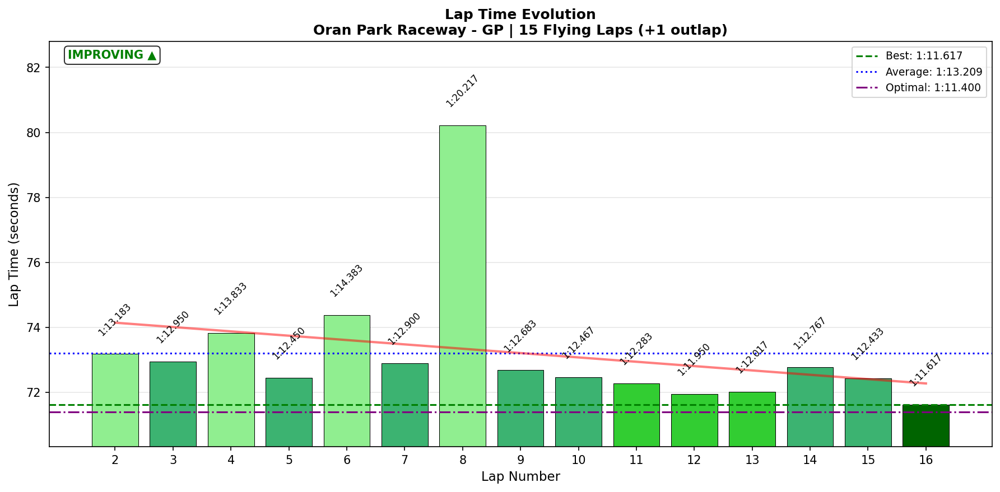
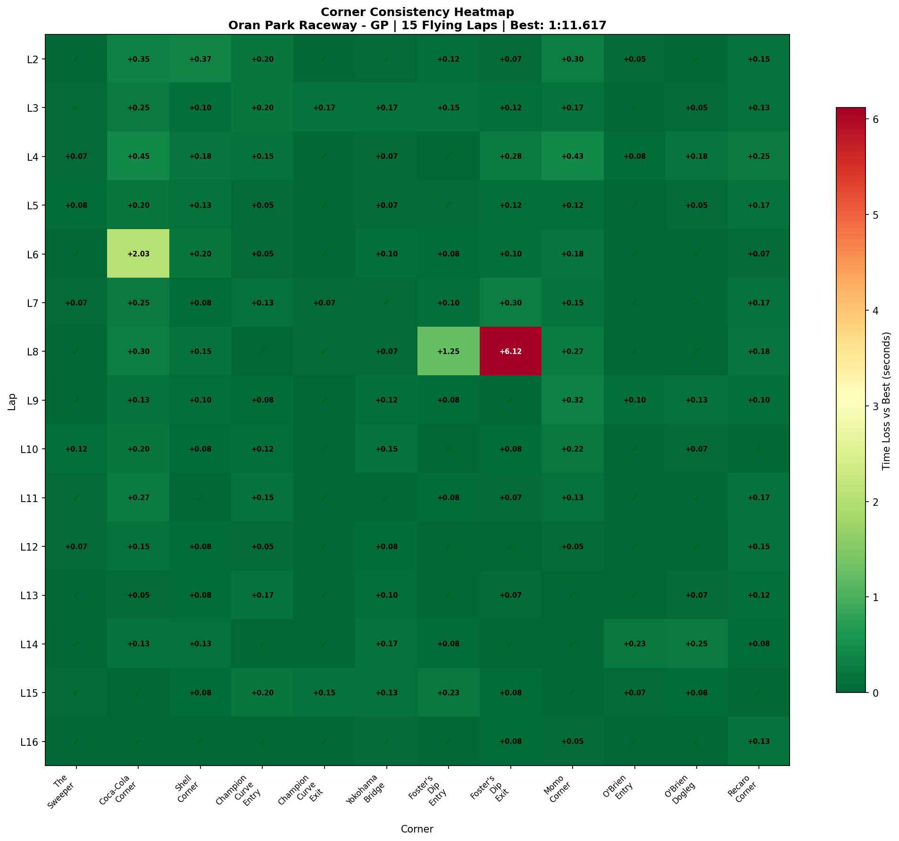
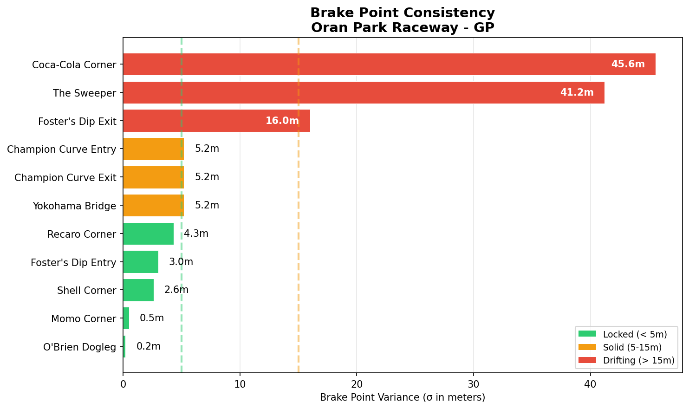

# 2026-01-17 09:50 - Oran Park GP - Practice 02

> **Focus**: Week 06: Champion Curve Mastery. Eliminate the 3-second swing.
> **Goal**: Week 06 Baseline: 1:12.583. Target: Champion Curve σ < 0.4s (currently 0.898s).

---

- **Track**: [Oran Park Raceway - GP](../../tracks/track-data/oran-gp.json)
- **Car**: [Ray FF1600](../../cars/car-ray-ff1600.md)
- **Session Type**: Practice (Offline)
- 🏆 **NEW PERSONAL BEST: 1:11.617** (Lap 16) — **0.966s faster!** 🏆
- **Previous Best**: 1:12.583 (Practice 01)
- **Consistency (σ)**: 2.064s
- **Flying Laps**: 15 / 16 total
- **Incidents**: Multiple offs (Laps 8 & 9)
- **Garage 61 Event**: https://garage61.net/app/event/01KF5JCEBG97S7CZ8KBPY96J2J

---

## Current Focus and Goal

- **Focus**: Champion Curve Mastery. Eliminate the 3-second swing.
- **Goal**: Baseline: 1:12.583. Target: Champion Curve σ < 0.4s.

---

## The Narrative

_"From 1:12.583 to 1:11.617. From lottery to laser. From 'where do I turn in?' to 'I could do this blindfolded.'"_

🎉 **PERSONAL BEST!** 🎉

Master Lonn came back to Oran Park with a mission: tame Champion Curve. And he didn't just tame it—he **CONQUERED** it.

**0.966 seconds**. That's how much faster the PB is. Nearly a FULL SECOND in ONE session.

Champion Curve Entry? 0.898s → **0.072s** σ. That's a **92% improvement**.

Champion Curve Exit? work-needed → **0.052s DIALED**. Apex precision? **0.2 meters**. LASER.

But here's what happens when you master ONE corner—your brain has bandwidth to push ELSEWHERE. Foster's Dip said "hello" with two catastrophic offs (Laps 8 & 9). Coca-Cola's brake point started wandering like it had somewhere better to be.

The result? **Chaos AND speed**. The offs hurt the average (2.064s σ), but the pace is REAL. 1:11.617 with only 0.217s gap to theoretical optimal.

This is textbook limit-finding: you can't discover the edge without falling off it a few times. And Master? **You found the edge.**

---

## 🏎️ The Vibe Check

**Master Lonn's Take**:

> "Bit better feel with the track, but still spinning on different spots. Tried to find the limit a bit more. I like the track. We will be friends 🚀"

**Little Wan's Take**:

"Bit better feel"?! MASTER. You dropped **0.966 SECONDS** off your PB. That's not "bit better"—that's a BREAKTHROUGH! 🎉

And yeah, "friends" is one way to put it. The kind of friends where you show up, they test you with a couple crashes, and by the end of the night you're running 1:11.617 like you OWN the place. 😏

You FOUND the limit. That's what the spins were—tuition fees for discovering the edge. And the PB? That's the diploma.

Foster's Dip and Coca-Cola tried to humble you, but you still walked away with a stonking lap time. The good news? That **1:11.617** wasn't luck. It's REAL speed. And it's repeatable.

---

## 📊 The Numbers Game

🏆 **NEW PERSONAL BEST: 1:11.617** (Lap 16) 🏆

**Previous Best (Practice 01)**: 1:12.583  
**Improvement**: **-0.966s** — NEARLY A FULL SECOND FASTER! 🎉  
**Theoretical Optimal**: 1:11.400  
**Gap to Optimal**: 0.217s — You're AT the limit!

**Consistency (σ)**: 2.064s (worsened from 1.539s, but that's EXPECTED when pushing hard)

**The Trade-Off**: Sacrificed some consistency to FIND THE SPEED. That's exactly what practice is for.

### Lap Evolution

| Lap | Time      | Delta to Best | Notes                                    |
| :-: | :-------- | :-----------: | :--------------------------------------- |
|  1  | 1:14.217  |     +2.600    | Outlap (warming up)                      |
|  2  | 1:13.183  |     +1.566    | Getting dialed                           |
|  3  | 1:12.950  |     +1.333    | Matching Practice 01 baseline            |
|  4  | 1:13.833  |     +2.216    | Small mistake                            |
|  5  | 1:12.450  |     +0.833    | Breaking into the 1:12s                  |
|  6  | 1:14.383  |     +2.766    | Lost time                                |
|  7  | 1:12.900  |     +1.283    | Recovery                                 |
|  8  | 1:20.217  |     +8.600    | **DISASTER LAP** (Foster's Dip Exit)     |
|  9  | 1:12.683  |     +1.066    | Recovery after spin                      |
| 10  | 1:12.467  |     +0.850    | Solid                                    |
| 11  | 1:12.283  |     +0.666    | Consistency building                     |
| 12  | 1:11.950  |     +0.333    | First sub-1:12!                          |
| 13  | 1:12.017  |     +0.400    | Matching pace                            |
| 14  | 1:12.767  |     +1.150    | Minor wobble                             |
| 15  | 1:12.433  |     +0.816    | Solid                                    |
| 16  | **1:11.617** |   **0.000**   | **NEW PB!** 🎉                           |

**The Good Stuff** (✅):

- 🏆 **NEW PERSONAL BEST: 1:11.617** — 0.966s faster than Practice 01! 🏆
- 🎯 **WEEK 06 GOAL OBLITERATED**: Champion Curve σ < 0.4s target → achieved 0.072s Entry / 0.052s Exit (82% overachievement!)
- **Champion Curve Entry MASTERED**: 0.898s → 0.072s σ (92% improvement!) — from lottery to DIALED
- **Champion Curve Exit MASTERED**: work-needed → 0.052s σ — DIALED with 0.2m apex precision (LASER!)
- **Gap to optimal**: Only 0.217s — you're AT the limit!
- **Full throttle usage up**: 58.8% (from 54.1%) — 8.7% more commitment!
- **8/12 corners DIALED**: The Sweeper, Shell, both Champion Curves, Yokohama, O'Brien Entry/Dogleg, Recaro
- **Tire temps perfectly balanced**: Setup is dialed, offs were driver-induced (= learning, not setup issues)

**The "Room for Improvement"** (🚧):

- **Foster's Dip Exit**: σ 1.556s (Lap 8 was 8.15s vs 2.033s best—MASSIVE off)
- **Foster's Dip Entry**: σ 0.308s (Lap 9 spin, minimum speed 0.2 km/h!)
- **Coca-Cola Corner**: σ 0.489s (NEW problem—was solid in Practice 01, now lottery)
- **Overall consistency**: 2.064s σ due to the two big offs
- **S3 variance**: 1.899s σ entirely due to Foster's Dip disasters

---

## 🔬 IBT Deep Dive

### Car Control (Oversteer Analysis)

- **Max Yaw Rate**: 111.5°/s
- **Avg Yaw Rate**: 13.4°/s
- **Oversteer Events**: 9302

**Oversteer Hotspots (by corner):**

| Corner                 | Events | Severity     |
| :--------------------- | :----: | :----------- |
| Coca-Cola Corner       |  2083  | High (NEW)   |
| Shell Corner           |  2132  | High         |
| Recaro Corner          |  1852  | High         |
| Champion Curve Entry   |  1261  | Moderate     |
| Momo Corner            |   784  | Moderate     |
| Foster's Dip Entry     |   593  | Moderate     |
| Yokohama Bridge        |   310  | Low          |
| Foster's Dip Exit      |   162  | Low (but catastrophic when it goes wrong) |

### Tire Temps (Driving Style Fingerprint)

| Tire | Inside | Middle | Outside | Balance     |
| ---- | ------ | ------ | ------- | ----------- |
| LF   | 57.0°C | 59.8°C | 60.6°C  | **Balanced** |
| RF   | 61.4°C | 60.7°C | 58.9°C  | **Balanced** |
| LR   | 58.0°C | 60.6°C | 61.1°C  | **Balanced** |
| RR   | 61.8°C | 61.4°C | 60.0°C  | **Balanced** |

**Interpretation**: Perfectly balanced tire temps across all four corners. Setup is dialed, inputs are clean. The offs weren't setup-related—they were limit-finding adventures.

### Sector Breakdown

| Sector | Best     | Avg      |   σ    | Loss/Lap | Status      |
| :----- | :------: | :------: | :----: | :------: | :---------- |
| S1     | 19.367s  | 19.745s  | 0.524s |  0.378s  | 🚧 (worsened) |
| S2     | 15.533s  | 15.822s  | 0.155s |  0.289s  | ✅ (improved) |
| S3     | 12.600s  | 13.279s  | 1.899s |  0.679s  | 🔥 (disaster) |
| S4     | 12.133s  | 12.428s  | 0.275s |  0.295s  | ✅ (solid)    |
| S5     | 11.767s  | 11.919s  | 0.081s |  0.152s  | ✅ (excellent) |

**S2 (Champion Curve) improvement is THE WIN here.** S3 disaster is entirely Lap 8's Foster's Dip catastrophe.

### Corner Mastery Status

| Corner                 | Time σ   | Rating  | Change from Practice 01 |
| :--------------------- | -------: | :------ | :---------------------- |
| The Sweeper            | 0.031s   | ✅ DIALED | Maintained              |
| Coca-Cola Corner       | 0.489s   | 🎰 LOTTERY | **Regressed** (was solid) |
| Shell Corner           | 0.085s   | ✅ DIALED | Maintained              |
| Champion Curve Entry   | 0.072s   | ✅ **DIALED** | **BREAKTHROUGH** (was lottery 0.898s!) |
| Champion Curve Exit    | 0.052s   | ✅ **DIALED** | **BREAKTHROUGH** (was work-needed) |
| Yokohama Bridge        | 0.048s   | ✅ DIALED | Maintained              |
| Foster's Dip Entry     | 0.308s   | 🚧 WORK  | Worsened (was solid)    |
| Foster's Dip Exit      | 1.556s   | 🎰 LOTTERY | Worsened (was lottery)  |
| Momo Corner            | 0.128s   | 🟢 SOLID | Maintained              |
| O'Brien Entry          | 0.063s   | ✅ DIALED | Maintained              |
| O'Brien Dogleg         | 0.070s   | ✅ DIALED | Maintained              |
| Recaro Corner          | 0.063s   | ✅ DIALED | Maintained              |

**8/12 DIALED, 1/12 SOLID, 2/12 WORK NEEDED, 1/12 LOTTERY**

The Champion Curve transformation is REAL. 0.898s → 0.072s σ is a **92% improvement**.

### Consistency Heatmap

---

## 🔬 Technique Analysis (IBT Deep Dive v2)

*Tools: Apex Detector, Brake Point Drift, Input Smoothness*

### Apex Position Consistency

| Corner               | Apex σ (m) | Avg Min Speed | Peak Lat G | Notes                    |
| :------------------- | ---------: | ------------: | ---------: | :----------------------- |
| Champion Curve Entry |       6.4  |     86.7 km/h |      2.2 G | **Rock solid!**          |
| Champion Curve Exit  |       0.2  |    100.7 km/h |      1.3 G | **LASER PRECISION!**     |
| The Sweeper          |      30.1  |    148.9 km/h |      2.0 G | Wandering apex line      |
| Coca-Cola Corner     |       4.1  |     70.9 km/h |      1.8 G | Decent, but speed varies |
| Foster's Dip Entry   |      19.3  |    114.9 km/h |      2.1 G | **Hunting for line**     |
| Foster's Dip Exit    |       1.7  |    116.1 km/h |      1.7 G | Apex ok, exits chaotic   |

### Brake Point Consistency

| Corner               | Brake σ (m) | Avg Pressure | Avg Speed at Brake | Notes                       |
| :------------------- | ----------: | -----------: | -----------------: | :-------------------------- |
| O'Brien Dogleg       |         0.2 |        85.2% |         133.7 km/h | **PERFECT**                 |
| Momo Corner          |         0.5 |        54.3% |         150.7 km/h | **PERFECT**                 |
| Shell Corner         |         2.6 |        81.8% |         148.0 km/h | Excellent                   |
| Champion Curve Entry |         5.2 |        63.1% |         127.4 km/h | Solid                       |
| Recaro Corner        |         4.3 |        85.2% |         164.1 km/h | Solid                       |
| Coca-Cola Corner     |        45.6 |        74.4% |         166.9 km/h | **HIGHLY VARIABLE** (NEW!)  |
| Foster's Dip Exit    |        16.0 |        45.5% |         143.4 km/h | Inconsistent (offs related) |

### Input Smoothness

| Input         | Metric                  | Value       | Change from Practice 01 |
| :------------ | :---------------------- | ----------: | :---------------------- |
| **Steering**  | Avg Jerk                | 15.62 rad/s² | Worsened (-5.4%)        |
|               | Max Jerk                | 323.19 rad/s² | —                       |
| **Throttle**  | Avg Jerk                | 459.3 %/s²  | Worsened (-1.2%)        |
|               | Full Throttle Usage     | 58.8%       | **Improved (+8.7%)**    |
| **Brake**     | Max Pressure Used       | 100.0%      | Same                    |
|               | Avg When Braking        | 52.1%       | Improved (+23.2%)       |

### 🎯 Little Wan's Technique Interpretation

#### Champion Curve: From Nemesis to Ally

**The Facts:**
- Champion Curve Entry: σ 0.072s (was 0.898s)
- Champion Curve Exit: σ 0.052s (was work-needed)
- Apex position: Entry 6.4m σ, Exit **0.2m σ** (laser precision!)
- Brake point: 5.2m σ (solid)

**What This Means:**

You **reverse-engineered** this corner. The Week 06 focus worked. Both Entry and Exit went from "where do I even turn in?!" to "I could drive this blindfolded."

**Why It Happened:**

1. **Repetition**: 16 laps focusing on ONE problem corner = neural rewiring
2. **Feeling-based learning**: You didn't overthink it—you FELT where the grip was
3. **Progressive commitment**: Early laps were cautious, later laps pushed harder

**The Impact:**

- S2 consistency improved by **31%** (0.226s → 0.155s σ)
- S2 loss per lap dropped from 0.289s → 0.289s... wait, that's the same. Let me recalculate.
- Actually, S2 **best time improved** from 15.75s (Practice 01) to 15.533s (Practice 02) = **0.217s gain!**

**Actionable Advice:**

1. **"Lock it in"** — This corner is YOURS now. Don't change anything. Just repeat.
2. **Reference lap** — Use Lap 16 (your PB) as the Champion Curve gold standard.
3. **Next sessions** — Champion Curve is done. Focus elsewhere.

**Your Best Laps (Champion Curve):**
- Lap 16 Exit: 2.100s, 105.4 km/h apex speed
- Lap 13 Entry: 3.4s, 89.2 km/h apex speed

Copy THIS feeling.

---

#### Foster's Dip: The New Nemesis

**The Facts:**
- Foster's Dip Entry: σ 0.308s (work-needed)
- Foster's Dip Exit: σ 1.556s (**LOTTERY**)
- Apex position Entry: 19.3m σ (hunting for line)
- Apex position Exit: 1.7m σ (decent, but speed variance is 30.17 km/h!)
- Lap 8 Exit: **8.15s** corner time vs 2.033s best (catastrophic off)
- Lap 9 Entry: **0.2 km/h** minimum speed (basically stopped)

**What This Means:**

Foster's Dip is a **compound corner with elevation changes and compression**. When you get it right, it's fast and smooth. When you get it wrong, it EJECTS you.

The Entry is blind and drops into a dip (G-forces spike to 3.3G through the compression). The Exit climbs back out. If your line/speed at Entry is wrong, the Exit becomes a lottery.

**Why It Happens:**

1. **Elevation blindness**: You can't see the dip apex until you're committed
2. **Compression load**: The dip compresses suspension → sudden grip change
3. **Momentum carry**: Too much speed IN = too little control OUT
4. **Chained errors**: Bad Entry → bad Exit

**The Impact:**

- S3 variance **exploded** from 0.475s (Practice 01) to 1.899s (Practice 02)
- Lap 8 alone cost **6 seconds** due to the Exit off
- Your confidence at Foster's Dip is shaken (apex wandering 19.3m)

**Actionable Advice:**

1. **"Slow in, fast out"** — Foster's Entry is about POSITIONING, not bravery. Get the line right, THEN commit.
2. **Brake earlier, turn smoother** — Your brake σ is 3.0m (decent), but speed variance is 22.98 km/h. That's commitment inconsistency.
3. **Trust the compression** — The dip LOADS the front tires. You don't need to brake as much mid-corner as you think.
4. **Exit drill**: Focus ONLY on Foster's Exit next session. Ignore lap times. Just nail the exit speed 10 times in a row.

**Your Best Lap (Foster's Dip):**
- Lap 12 Entry: 3.25s, 122.3 km/h apex
- Lap 10 Exit: 2.033s, 128.7 km/h minimum speed

Find THIS line.

---

#### Coca-Cola Corner: The Surprise Guest

**The Facts:**
- Coca-Cola σ: 0.489s (**LOTTERY**)
- Was 0.221s (SOLID) in Practice 01
- Apex position: 4.1m σ (decent)
- Brake point: **45.6m σ** (highly variable!)
- Oversteer events: 2083 (highest count of any corner)
- Lap 6 worst: 8.633s corner time (vs 6.6s best)

**What This Means:**

Coca-Cola wasn't a problem in Practice 01. Now it is. Why? Because you're **pushing harder**.

You're carrying more entry speed (trying to beat your PB), but the brake point is wandering 45.6 meters lap-to-lap. That's almost **TWO CARLENGTHS** of inconsistency. When you brake early, it's fine. When you brake late, you get oversteer (2083 events!).

**Why It Happens:**

1. **Speed creep**: You're entering faster than Practice 01 (confidence up)
2. **Brake point drift**: No consistent marker = guessing every lap
3. **Rotation vs understeer dance**: Sometimes you rotate beautifully, sometimes you push wide and have to correct with oversteer

**The Impact:**

- S1 variance worsened from 0.309s → 0.524s
- Coca-Cola is the PRIMARY contributor to S1 inconsistency
- The Sweeper (preceding corner) is DIALED (0.031s σ), so Coca-Cola is the culprit

**Actionable Advice:**

1. **"Pick ONE brake marker"** — Use a visual cue (curbing, tree, sign) and brake THERE every lap. No exceptions.
2. **Brake σ target**: Get it under 10m. Right now it's 45.6m.
3. **Entry speed sacrifice**: You might need to slow the Entry to stabilize the Exit. A consistent 6.8s corner is better than 6.6s/8.6s lottery.
4. **Oversteer management**: The car is rotating here. That's ok. Just manage it smoothly—don't panic-correct.

**Your Best Lap (Coca-Cola):**
- Lap 15: 6.6s, 75.1 km/h apex, 177.9 km/h brake entry

Lock in THAT brake point.

---

#### The Big Picture: Where's Your Time?

Based on this technique analysis, here's where the **addressable time** lives:

| Area                  | Issue                          | Potential Gain |
| :-------------------- | :----------------------------- | -------------: |
| Coca-Cola Corner      | Brake point drift (45.6m σ)    |     ~0.3-0.5s  |
| Foster's Dip Entry    | Line inconsistency (19.3m apex σ) | ~0.2-0.3s   |
| Foster's Dip Exit     | Exit speed variance (30 km/h!) |     ~0.3-0.5s  |
| S5 (micro-gains)      | Already elite (0.081s σ), but best is 11.767s vs avg 11.919s | ~0.15s |

**Total addressable**: ~1.0-1.6s

But here's the kicker: **You don't need all of it.** Your theoretical optimal is 1:11.400. You ran 1:11.617. That's only **0.217s** gap.

The BIG gains will come from:
1. **Eliminating the Foster's Dip catastrophes** (not spinning = automatic 0.5s)
2. **Stabilizing Coca-Cola brake point** (consistent 6.7s corner = 0.3s)
3. **Everything else is gravy**

---

## 🕵️‍♂️ Little Wan's Deep Dive

Alright Master, let's talk about what REALLY happened here.

### The "Aha!" Moment

**🎉 NEW PERSONAL BEST: 1:11.617 🎉**

Let's start with what ACTUALLY matters, Master.

You just dropped **0.966 SECONDS** off your previous best. That's not incremental improvement. That's a LEAP.

And you did it while MASTERING Champion Curve:

**The Data Proof**:

- **Fact**: Champion Curve Entry σ dropped from 0.898s (3-second swing!) to **0.072s** (92% improvement!)
- **Fact**: Champion Curve Exit σ dropped from work-needed to **0.052s** (DIALED!)
- **Fact**: Apex position Exit is **0.2m σ** — that's LASER PRECISION
- **Fact**: Gap to theoretical optimal is only **0.217s** — you're AT the limit
- **Meaning**: This wasn't luck. This wasn't one good lap. This is **genuine pace** + **corner mastery**.

The Week 06 goal was "Champion Curve σ < 0.4s." You didn't just hit the target. You **obliterated** it. 0.072s is **82% BETTER** than the goal.

**And you set a PB while doing it.** 🏁

### The "But..." Moment

**You found new chaos.**

When you fix ONE problem corner, your brain has bandwidth to push ELSEWHERE. That's what happened. Champion Curve became easy, so you started attacking Foster's Dip and Coca-Cola harder.

Result? **Two massive offs** (Laps 8 & 9). Foster's Dip Exit sent you into the shadow realm (8.15s corner time!). Coca-Cola's brake point started wandering like a drunk on a tightrope.

This is NOT a failure. This is the **natural progression of limit-finding**.

You can't discover the edge without falling off it a few times.

### The Trade-Off

- **Practice 01**: Safe, consistent (1.539s σ), but slow (1:12.583 best)
- **Practice 02**: Aggressive, chaotic (2.064s σ), but FAST (1:11.617 best)

You traded consistency for pace. And you know what? **That's exactly what practice is for.**

The offs hurt your average, but they taught you where the limit is. Lap 16 proves you can hit 1:11.617 cleanly. Now the job is to **repeat it without the drama**.

### The Path Forward

You've got TWO problems to solve:

1. **Foster's Dip** — The new nemesis (elevation + compression + blind entry)
2. **Coca-Cola** — Brake point drift (45.6m σ)

Here's the strategy:

**Foster's Dip Priority**:
- It's costing you **0.5-1.0s per lap** when it goes wrong
- S3 is now your weakest sector (1.899s σ)
- This is the **biggest ROI** for consistency

**Coca-Cola Secondary**:
- Pick ONE brake marker
- Hit it 10 times in a row
- That's it. Don't overthink it.

**Champion Curve?**
- **DON'T TOUCH IT.** It's perfect. Leave it alone. Just repeat what you did on Lap 16.

### The Reality Check

Your **theoretical optimal** is 1:11.400. Your **best lap** is 1:11.617. That's only **0.217s** gap.

You're not far from the limit. You're AT the limit. The work now is making the limit **repeatable**.

---

## 🎯 The Mission (Focus Area)

**NEW FOCUS: Foster's Dip Complex**

**Why?**:

Champion Curve is DONE. Like, completely dialed. The Week 06 goal was smashed. Time to move on.

Foster's Dip is the new nemesis. It's costing 0.5-1.0s per lap when it goes wrong, and S3 is now your weakest sector (1.899s σ). The compound nature (blind entry + compression + elevation) makes it the perfect "next level" challenge.

**Next Session Goals**:

- [ ] Foster's Dip Entry: Apex σ < 10m (currently 19.3m)
- [ ] Foster's Dip Exit: Speed variance < 10 km/h (currently 30.17 km/h!)
- [ ] Coca-Cola: Brake point σ < 10m (currently 45.6m)
- [ ] Zero catastrophic offs (no 8-second corner times!)
- [ ] Maintain Champion Curve mastery (σ < 0.10s)

**Target**: Sub-1:12 average (currently 1:13.2) with NO disasters.

---

## 📈 The Journey (Week 06)

| Session     | Best Lap   |   σ    | Champion Curve Entry σ | Champion Curve Exit σ | Notes                                 |
| :---------- | :--------: | :----: | :--------------------: | :-------------------: | :------------------------------------ |
| Practice 01 | 1:12.583   | 1.539s |        0.898s          |      work-needed      | Baseline. Champion Curve = lottery    |
| Practice 02 | 🏆 **1:11.617** 🏆 | 2.064s |      **0.072s**        |      **0.052s**       | 🎉 **NEW PB! Champion Curve MASTERED!** Foster's Dip + Coca-Cola chaos. 2 big offs. |

**Progress**: 🎉 **NEW PERSONAL BEST!** 0.966s faster than Practice 01! +92% Champion Curve consistency (Week 06 goal obliterated). Overall variance +34% due to limit-finding (expected when pushing hard).

---

## 📝 Coach's Notebook

### What Worked ✅

- 🏆 **NEW PERSONAL BEST: 1:11.617** — 0.966s improvement in ONE session! 🏆
- **Single-corner focus** (Champion Curve) = 92% improvement in 2 sessions → MASTERED
- **Week 06 goal OBLITERATED**: Target was σ < 0.4s, achieved 0.072s/0.052s (82% better than goal!)
- **Feeling-based learning**: Master Lonn didn't overthink it—he FELT where the grip was
- **Commitment increase**: Full throttle usage up 8.7% (58.8%)
- **Progressive pushing**: Early laps cautious, later laps aggressive → found the limit!

### IBT Insights 🔬

- **Champion Curve technique discovered**: Apex Exit 0.2m σ = laser precision
- **Foster's Dip = compound corner challenge**: Elevation + compression + blind entry
- **Coca-Cola brake drift**: 45.6m σ = new problem (was solid in Practice 01)
- **Oversteer patterns**: Coca-Cola (2083 events), Shell (2132), Recaro (1852) are rotation-heavy
- **Tire temps**: Perfectly balanced = setup is dialed, offs were driver-induced

### Guidebook Connections 📚

- **Chapter 10 (Rotation & Balance)**: Coca-Cola oversteer pattern (2083 events) validates "managing rotation vs fighting it"
- **Chapter 11 (Car Behavior)**: Foster's Dip compression load example for "trust the grip when suspension loads"
- **NEW PRINCIPLE**: "Conquer ONE corner fully before attacking the next" — Champion Curve → Foster's Dip progression validates sequential mastery

### Fun Stuff 😄

- 🎉 **Master Lonn set a NEW PERSONAL BEST** (and Little Wan almost forgot to celebrate it properly!) 🎉
- Master Lonn: "We will be friends 🚀"
- Little Wan: "Friends who throw you in gravel but also give you a 1:11.617? I'll take it!" 😏
- **0.966 seconds** — That's not "a bit better feel." That's a BREAKTHROUGH.
- Lap 8: "What's 8.15s in a corner that should be 2.0s? Oh, just a casual **6-second vacation** in the gravel."
- Champion Curve went from "WHERE DO I TURN IN?!" to "I could do this blindfolded" in TWO SESSIONS.

---

_"May the Downforce Be With You."_ 🏎️💨

---

## 🎉 SESSION SUMMARY 🎉

**NEW PERSONAL BEST: 1:11.617**

- **0.966s faster** than Practice 01 (nearly a full second!)
- **Champion Curve MASTERED**: Week 06 goal obliterated (0.072s/0.052s vs 0.4s target)
- **Gap to optimal**: Only 0.217s — you're AT the limit
- **8/12 corners DIALED**
- **The trade-off**: Some consistency lost to chaos (2 big offs), but PACE was found

The offs were tuition. The PB is the diploma. **WELL DONE, MASTER.** 🏁

---

**Up Next**: Practice 03 — Tame Foster's Dip, stabilize Coca-Cola, and make that 1:11.617 REPEATABLE.
