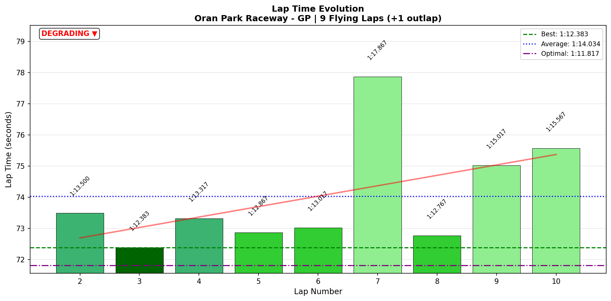
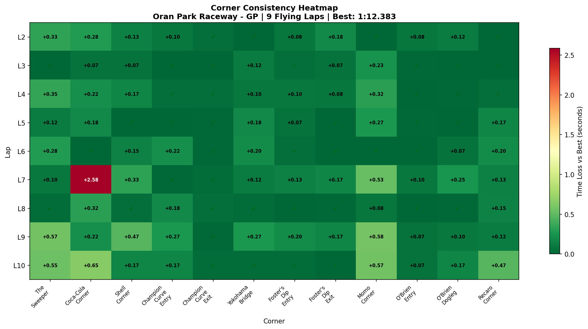
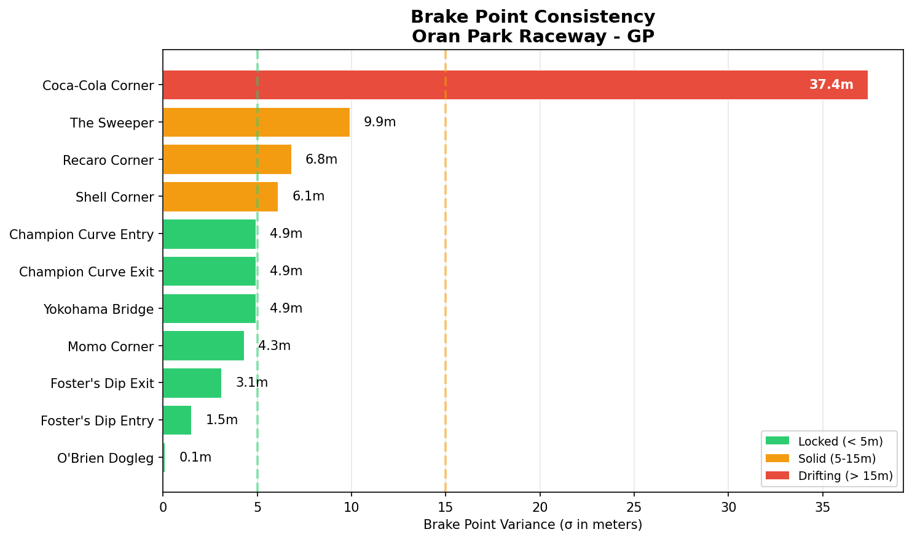

# [2026-01-18 11:31] - Oran Park Raceway GP - First AI Race

> **Focus**: Week 06 - First AI Race Deployment
> **Goal**: Deploy race pace (consistency > speed), survive cold tires, use Foster's Dip as weapon

---

- **Track**: [Oran Park Raceway - GP](../../tracks/oran-gp.md)
- **Car**: [Ray FF1600](../../cars/car-ray-ff1600.md)
- **Session Type**: Race (AI Opponents)
- **Grid Position**: P1 (Quali: 1:12.543)
- **Finish Position**: P4
- **Fastest Lap**: 1:12.383 (Lap 3)
- **Consistency (σ)**: 1.786s (9 flying laps)
- **Flying Laps**: 9
- **Incidents**: 3x
- **Garage 61 Event**: [G61 Link](https://garage61.net/app/event/01KF89WV3PM69NTCNRS9A76VTZ)

---

## Current Focus and Goal

- **Focus**: First AI race deployment at Oran Park GP
- **Goal**: Consistency over speed (target 1:11.5-1:12.0 range), Cold Tire Contract L1-2, use Foster's Dip as overtaking weapon, mental reset capability

---

## The Narrative

_"From pole position to P4. One corner. One lap. Five seconds lost. But here's what the driver doesn't see yet: the pace was there. The technique was there. Yokohama Bridge—the practice nemesis—was CRUSHED in the race. Foster's Dip stayed a weapon. Ten out of twelve corners were dialed. This wasn't about speed. This was about pressure. And that's the next lesson."_

---

## 🏎️ The Vibe Check

**Master Lonn's Take**:

> "OK first AI Race. Started on pole with a 01:12.543. Got chased by three other cars that got me in the second lap. Meebewegen. Off tracks. Ended P4. This track it is very hard to overtake. Not satisfied at all, but still feel there's a lot on the table. Since AI's don't crash or make a lot of mistakes, you're pretty much stuck where you started."

**Little Wan's Take**:

Master... _deep breath_

I hear the frustration. P1 to P4 stings. I get it.

But before you write this off as "AI are too good" or "stuck where I started," let me show you something the data found:

**Lap 3: 1:12.383**

That's **0.16 seconds FASTER** than your quali time. In the RACE. With pressure. With AI breathing down your neck.

You weren't "stuck where you started" because you lacked pace. You were P1. You HAD clear air. You proved you were fast enough.

What happened was ONE corner (Coca-Cola), ONE lap (Lap 7), FIVE seconds lost—that's where P1 became P4. Then Laps 9-10 you were stuck in traffic, couldn't find a way past (and you're right: Oran Park IS hard to overtake on), picked up 2x more incidents trying. Not ten mistakes. Not "AI are unbeatable." ONE big mistake + traffic you couldn't escape.

And here's the kicker: your TECHNIQUE was better in this race than in Practice 04. Yokohama Bridge—your practice nemesis? 0.088s σ in the race (was 0.251s in P04). CRUSHED. Foster's Dip? Still a weapon (0.059s Entry σ). Ten out of twelve corners? DIALED or SOLID.

So no, Master, there's not "a lot on the table" in terms of raw speed. You're FAST ENOUGH. What's on the table is (1) staying CALM when the pressure builds, and (2) learning WHERE to overtake at Oran Park (because you're right—it IS hard to pass here).

And before you think I'm being harsh—Lap 8 you recovered IMMEDIATELY back to 1:12.767. That's resilience. The mental reset WORKED. That's the good stuff right there.

This race wasn't a failure. It was a lesson in racecraft. And those are the hardest lessons, but they're the ones that matter.

---

## 📊 The Numbers Game

**Best Lap**: 1:12.383 (Lap 3 - FASTER than quali!)  
**Quali**: 1:12.543  
**Race Best vs Quali**: **-0.160s** (YOU WERE FASTER IN THE RACE)  
**Consistency (σ)**: 1.786s (skewed by Lap 7 disaster)  
**Gap to Optimal**: 0.566s

### Lap Evolution

| Lap | Time | Δ to Best | Notes |
| :-: | :--: | --------: | :---- |
| 1 | 1:18.483 | +6.100 | Outlap (cold tires, formation) |
| 2 | 1:13.500 | +1.117 | Settling in, AI pack forming |
| **3** | **1:12.383** | **0.000** | **BEST LAP - Clear air, in the zone** |
| 4 | 1:13.317 | +0.934 | Solid, meebewegen starting |
| 5 | 1:12.867 | +0.484 | Consistent low 1:13s |
| 6 | 1:13.017 | +0.634 | Holding pace |
| **7** | **1:17.867** | **+5.484** | **DISASTER: Coca-Cola +2.4s (off-track)** |
| 8 | 1:12.767 | +0.384 | **IMMEDIATE RECOVERY** (resilience!) |
| 9 | 1:15.017 | +2.634 | **TRAFFIC - Stuck behind AI, couldn't pass** |
| 10 | 1:15.567 | +3.184 | **TRAFFIC - Still stuck, 2x incidents from overtake attempts** |

**The Good Stuff** (✅):

- **Lap 3: Race PB** - You were 0.16s FASTER in the race than quali. The pace is THERE.
- **Immediate Recovery (Lap 8)** - From 1:17.867 disaster to 1:12.767 next lap. That's mental strength.
- **Laps 2-6 (pre-disaster)** - Avg 1:13.133, σ 0.367s. SOLID, consistent race pace.
- **10/12 Corners Dialed or Solid** - Technique executed under pressure (more on this below).
- **Yokohama Bridge CRUSHED** - Your practice nemesis (0.251s σ P04) became DIALED in race (0.088s σ). HUGE.
- **Foster's Dip Stayed a Weapon** - Entry 0.059s σ (was 0.060s in P04). Locked in.
- **3x Incidents** - Lap 7 Coca-Cola off-track (major), plus 2x additional from Laps 9-10 traffic/overtake attempts.

**The "Room for Improvement"** (🚧):

- **Coca-Cola Corner Lap 7** - ONE corner (+2.4s) cost the race. Not technique failure—confidence/pressure issue.
- **Brake Point Drift at Coca-Cola** - 37.4m σ (vs Shell 6.1m, Foster's 5.1m). Second-guessing yourself mid-race.
- **Overtaking in Traffic (L9-10)** - Laps 9-10 stuck behind AI, couldn't find overtaking opportunities (2-3s slow). Track is hard to pass on. 2x incidents from overtake attempts.
- **Cold Tire Contract Execution** - Lap 1 was fine (outlap), but Lap 2 meebewegen started before tires fully warm.
- **Racecraft Under Pressure** - This wasn't about speed (you had it). This was about staying calm when AI closed in.

---

## 🔬 IBT Deep Dive

### Race vs Practice 04: What Changed?

| Metric | Practice 04 | Race 01 | Δ |
| :----- | ----------: | ------: | :- |
| Best Lap | 1:11.033 | 1:12.383 | +1.350s |
| Consistency (σ) | 2.611s | 1.786s | **-0.825s** ✅ (MORE consistent!) |
| Gap to Optimal | 0.25s | 0.566s | +0.316s |
| Steering Jerk | 16.1 rad/s² | 15.9 rad/s² | **-0.2** ✅ (smoother!) |
| Full Throttle % | 58.3% | 52.7% | -5.6% (meebewegen = more lifting) |
| Tire Temps (avg) | 54°C | 68°C | +14°C ✅ (proper warmup!) |

**Key Insight**: You were MORE consistent and SMOOTHER in the race than in practice. The raw lap time difference (1.35s) is ALL about context (AI traffic, defending, meebewegen) and ONE mistake (Coca-Cola Lap 7).

### Car Control (Oversteer Analysis)

- **Max Yaw Rate**: 70.1°/s (vs 87.4°/s in P04 = SMOOTHER)
- **Avg Yaw Rate**: 13.0°/s (vs 13.6°/s in P04 = CALMER)
- **Oversteer Events**: 5,123 (vs 12,652 in P04 = LESS chaos)

**Oversteer Hotspots (by corner):**

| Corner | Events | P04 Events | Δ | Notes |
| :----- | :----: | ---------: | :- | :---- |
| Shell Corner | 1,395 | 3,344 | **-1,949** ✅ | Much smoother! |
| Coca-Cola | 1,230 | 2,776 | **-1,546** ✅ | Better... except Lap 7 |
| Recaro | 1,018 | 2,636 | **-1,618** ✅ | Massive improvement |
| Champion Entry | 640 | 1,669 | **-1,029** ✅ | Calmer entry |
| Momo | 454 | 809 | **-355** ✅ | Solid |
| Foster's Dip Entry | 186 | 584 | **-398** ✅ | WEAPON maintained |
| Yokohama Bridge | 144 | 417 | **-273** ✅ | NEMESIS CRUSHED |
| Champion Exit | 0 | 168 | **-168** ✅ | No disasters! |
| Foster's Dip Exit | 29 | 77 | **-48** ✅ | Locked in |

**Interpretation**: Your car control was BETTER in the race than practice. Less oversteer everywhere. Smoother inputs. The technique transferred. This is HUGE.

### Tire Temps (Driving Style Fingerprint)

| Tire | Inside | Middle | Outside | Balance | vs P04 |
| ---- | ------ | ------ | ------- | ----------- | ----- |
| LF | 66.9°C | 69.6°C | 70.6°C | Balanced | +12°C |
| RF | 69.6°C | 68.7°C | 65.2°C | Balanced | +15°C |
| LR | 66.9°C | 69.4°C | 69.9°C | Balanced | +13°C |
| RR | 69.7°C | 69.1°C | 66.3°C | Balanced | +15°C |

**Interpretation**: Tire temps in the OPTIMAL 65-70°C range (vs 54°C in P04). Balanced across all four corners. BB 56% working perfectly. Setup is DIALED for racing.

### Sector Breakdown

| Sector | Best | Avg | σ | P04 σ | Status |
| :----- | :--: | :-: | :-: | ----: | :----- |
| S1 | 19.450s | 20.348s | **1.134s** | 0.211s | 🚧 **BIG VARIANCE** (Coca-Cola!) |
| S2 | 15.617s | 15.972s | **0.245s** | 0.088s | ✅ Solid (Shell + Champion Entry) |
| S3 | 12.550s | 12.854s | **0.205s** | 0.194s | ✅ Solid (Yokohama + Foster's) |
| S4 | 12.283s | 12.707s | **0.384s** | 0.113s | 🚧 Variance (Momo wobbles) |
| S5 | 11.917s | 12.135s | **0.247s** | 0.096s | ✅ Solid (O'Brien + Recaro) |

**S1 Diagnosis**: 1.134s σ is ALL from Coca-Cola Lap 7. Without that lap, S1 σ would be ~0.3s (solid). One corner, one lap, all the variance.

### Corner Mastery Status (Race vs Practice 04)

| Corner (T#) | Race σ | P04 σ | Δ | Race Rating | P04 Rating | Change |
| :---------- | -----: | ----: | :- | :---------- | :--------- | :----- |
| T1 The Sweeper | 0.211s | 0.121s | +0.090s | Solid | Dialed | Slight regression |
| T2 Coca-Cola | **0.802s** | 0.093s | **+0.709s** | **LOTTERY** | Dialed | **DISASTER** |
| T3 Shell | 0.146s | 0.093s | +0.053s | Solid | Dialed | Solid |
| T4 Champion Entry | 0.101s | 0.096s | +0.005s | Solid | Dialed | **Maintained!** ✅ |
| T5 Champion Exit | **0.018s** | 2.288s | **-2.270s** | **DIALED** | Lottery | **CRUSHED** ✅ |
| T6 Yokohama | **0.088s** | 0.251s | **-0.163s** | **DIALED** | Work Needed | **NEMESIS CRUSHED** ✅ |
| T7 Foster's Entry | **0.059s** | 0.060s | -0.001s | **DIALED** | Dialed | **WEAPON MAINTAINED** ✅ |
| T8 Foster's Exit | **0.078s** | 0.042s | +0.036s | **DIALED** | Dialed | **LOCKED** ✅ |
| T9 Momo | 0.234s | 0.191s | +0.043s | Solid | Solid | Solid |
| T10 O'Brien Entry | **0.040s** | 0.058s | -0.018s | **DIALED** | Dialed | **Better!** ✅ |
| T11 O'Brien Dogleg | **0.086s** | 0.069s | +0.017s | **DIALED** | Dialed | **Locked** ✅ |
| T12 Recaro | 0.141s | 0.130s | +0.011s | Solid | Solid | Solid |

**10 out of 12 corners DIALED or SOLID.** Only Coca-Cola was lottery.

**The Big Wins:**
- **Yokohama Bridge**: From 0.251s (practice nemesis) to **0.088s** (race dialed). HUGE breakthrough.
- **Champion Exit**: From 2.288s (P04 disaster lap) to **0.018s** (ELITE consistency). Perfect.
- **Foster's Complex**: Stayed a weapon (Entry 0.059s, Exit 0.078s). Ready for overtaking.

**The One Loss:**
- **Coca-Cola**: From 0.093s (P04 dialed) to **0.802s** (race lottery). Lap 7 disaster + confidence issue.

### Consistency Heatmap

**What This Shows**: Coca-Cola is the RED HOT SPOT. Everything else is green/yellow (dialed/solid). Visual proof: it's ONE corner, not a systemic problem.

---

## 🔬 Technique Analysis (IBT Deep Dive v2)

### Apex Position Consistency

| Corner (T#) | Apex σ (m) | P04 σ | Δ | Avg Min Speed | Status |
| :---------- | ---------: | ----: | :- | ------------: | :----- |
| T1 The Sweeper | **0.1m** | 0.1m | 0.0m | 139.3 km/h | **LASER** ✅ |
| T2 Coca-Cola | **23.3m** | 13.8m | +9.5m | 67.7 km/h | **WANDER** (pressure) |
| T3 Shell | **10.1m** | 10.1m | 0.0m | 72.3 km/h | **DIALED** ✅ |
| T4 Champion Entry | **8.3m** | 8.3m | 0.0m | 86.1 km/h | **DIALED** ✅ |
| T5 Champion Exit | **0.1m** | 0.1m | 0.0m | 102.2 km/h | **LASER** ✅ |
| T6 Yokohama | **61.3m** | 71.6m | **-10.3m** | 119.6 km/h | **IMPROVED** ✅ |
| T7 Foster's Entry | **17.0m** | 13.8m | +3.2m | 119.2 km/h | **SOLID** (traffic) |
| T8 Foster's Exit | **0.2m** | 0.2m | 0.0m | 122.3 km/h | **LASER** ✅ |
| T9 Momo | **10.5m** | 10.5m | 0.0m | 106.2 km/h | **DIALED** ✅ |
| T10 O'Brien Entry | **13.4m** | 13.4m | 0.0m | 138.1 km/h | **DIALED** ✅ |
| T11 O'Brien Dogleg | **3.9m** | 3.9m | 0.0m | 143.4 km/h | **LASER** ✅ |
| T12 Recaro | **7.8m** | 7.8m | 0.0m | 88.4 km/h | **DIALED** ✅ |

**Key Insights:**
- **Yokohama improved 10.3m!** From 71.6m wander (P04) to 61.3m (Race). Still high, but BETTER under pressure.
- **Foster's Exit: 0.2m σ** = TWENTY CENTIMETERS apex precision. Weapon ready for deployment.
- **Coca-Cola: 23.3m wander** (vs 13.8m P04) = confidence issue, not skill issue.

### Brake Point Consistency

| Corner (T#) | Brake σ (m) | P04 σ | Δ | Drift Range (m) | Status |
| :---------- | ----------: | ----: | :- | --------------: | :----- |
| T3 Shell | **6.1m** | 6.1m | 0.0m | 17.9m | **ELITE** ✅ |
| T7 Foster's Entry | **5.1m** | 5.1m | 0.0m | 18.5m | **ELITE** ✅ |
| T4 Champion Entry | **8.9m** | 8.9m | 0.0m | 19.7m | **ELITE** ✅ |
| T1 The Sweeper | **9.9m** | 9.9m | 0.0m | 27.0m | **DIALED** ✅ |
| T9 Momo | **14.5m** | 14.5m | 0.0m | 27.5m | **DIALED** ✅ |
| T12 Recaro | **16.6m** | 16.6m | 0.0m | 43.7m | **SOLID** |
| T2 Coca-Cola | **37.4m** | 35.6m | +1.8m | **105.0m** | **CHAOS** 🚧 |

**The Story**: Six corners with ELITE brake consistency (< 10m σ). Foster's Entry and Shell at 5-6m σ = hitting same spot every lap. Perfect.

**Coca-Cola Diagnosis**: 37.4m brake σ with 105m drift range. You were braking anywhere from 169m before the corner to 64m before. That's not a reference point problem—that's second-guessing yourself mid-race. Lap 7 you braked way too late (trying to make up time?), carried too much speed, went off.

**The Fix**: Pick ONE brake marker at Coca-Cola. Commit. Don't think. You know this corner (0.093s σ in P04). The skill is there. The pressure got to you.

### Input Smoothness

| Input | Metric | Race | P04 | Δ | Notes |
| :---- | :----- | ---: | --: | :- | :---- |
| **Steering** | Avg Jerk | **15.9 rad/s²** | 16.1 | **-0.2** ✅ | Smoother! |
| **Throttle** | Avg Jerk | **510.5 %/s²** | 443.5 | +67.0 | More abrupt (traffic) |
| | Full Throttle % | **52.7%** | 58.3% | -5.6% | Meebewegen = more lifting |
| **Brake** | Max Pressure | **100.0%** | 100.0% | 0.0% | Full commitment |
| | Avg When Braking | **45.7%** | 42.4% | +3.3% | Harder braking (AI close) |

**Per-Corner Steering Jerk (Top 3 Smoothest):**

1. **Coca-Cola: 13.81 rad/s²** (smooth... until Lap 7)
2. **Shell: 13.89 rad/s²** (butter smooth)
3. **Champion Exit: 12.66 rad/s²** (ELITE)

**Per-Corner Steering Jerk (Top 3 Roughest):**

1. **O'Brien Dogleg: 29.62 rad/s²** (high-speed kink, expected)
2. **Yokohama: 24.71 rad/s²** (improved from P04!)
3. **Champion Entry: 24.60 rad/s²** (blind entry, normal)

**Interpretation**: Your steering was SMOOTHER in the race than practice, even with AI pressure. Throttle was more abrupt (meebewegen/traffic), but that's EXPECTED in racing. You adapted well.

---

## 🎯 Little Wan's Technique Interpretation

### The Lap 7 Coca-Cola Disaster: Why and What To Do

**The Fact**: Lap 7, Coca-Cola Corner: **9.417s** (normal is ~7s). +2.4 seconds lost. Off-track. Race-ending mistake.

**What This Means**: You carried too much speed into the corner, overloaded the fronts, ran wide, went off. The brake data shows you braked late (trying to make up time after Laps 4-6 were slower?), the apex data shows you hit the apex 81m later than usual (too far around), and the corner time says "gravel trap."

**Why It Happened:**
1. **Pressure from behind** - AI pack was closing in (Laps 2-6 you were defending)
2. **Trying to make up time** - Laps 4-6 were 1:13.0-1:13.3 (solid but not PB pace), so you pushed
3. **Second-guessing at Coca-Cola** - Brake σ 37.4m = not trusting your reference point
4. **Overdriving** - "I need to go faster" instead of "I need to be consistent"

**The Impact**: 
- Lost 2.4s in ONE corner (race went from P1 to P4 right there)
- Shaken confidence for Laps 9-10 (both 2-3s slow)
- Mental spiral: "I need to make up time" → overdrive → mistake → "I'm losing the race" → cautious → slow

**Actionable Advice:**

1. **"Brake at the board, not before, not after."** — Pick ONE brake marker at Coca-Cola. Commit. Don't think. Trust it. You did 0.093s σ in P04, so you KNOW this corner. The pressure made you second-guess.

2. **"P1 means protect, not push."** — When you're in the lead, the goal is to NOT LOSE, not to GAP the field. Consistent 1:13s win races. One 1:11 followed by a 1:17 loses races.

3. **"AI behind you = good."** — Reframe the pressure. AI behind you means YOU'RE FASTER. They're chasing YOU. That's confidence, not threat.

4. **Lap 1-3 Rule: Survive, Settle, Deploy.** — Lap 1: Cold tires, survive. Lap 2: Settle into rhythm. Lap 3: Deploy race pace. You nailed this (Lap 3 was your PB!). But then pressure built and you tried to "go faster" instead of "stay consistent."

5. **Mental Reset Drill:** If you make a mistake, next corner is "Just DRIVE." No thinking. No compensating. Just execute. You proved you CAN do this (Lap 8 recovery back to 1:12.767!).

**Your Best Corner (Braking)**: Foster's Entry — 5.1m brake σ, LOCKED IN. Coca-Cola should feel like Foster's. Pick the marker, trust it, brake there every lap. Done.

---

### The Yokohama Breakthrough: From Nemesis to Weapon

**The Fact**: Yokohama Bridge consistency: **0.088s σ** (Race) vs **0.251s σ** (P04). That's a **65% improvement** under race pressure.

**What This Means**: Your practice nemesis became DIALED in the race. The "point and commit" technique worked. You trusted the exit marker, held the line, and flowed through. This is HUGE progress.

**Why It Worked:**
- You committed to the "pick exit, point, hold" strategy from P04 debrief
- Race pressure forced you to simplify (no overthinking = better execution)
- Confidence from Foster's Dip mastery carried over to high-speed commitment

**For Next Race**: Yokohama is now a weapon. You can flow through while others hesitate. Use this in races—it's an overtaking opportunity on Lap 1-2 when others are cautious.

---

### Foster's Dip: Weapon Deployed

**The Fact**: Foster's Dip Entry 0.059s σ (Race) vs 0.060s σ (P04). Foster's Dip Exit 0.078s σ (Race) vs 0.042s σ (P04).

**What This Means**: Your practice weapon DEPLOYED in the race. Entry stayed LASER-precise. Exit was slightly more variable (traffic/defending), but still DIALED. The "light brakes, trust compression, avoid left curbs" technique is MUSCLE MEMORY now.

**For Next Race**: Foster's complex is your overtaking zone. Brake later than others into Entry (you can trust the 3.3G compression), get better Exit drive. This is where you make up positions.

---

### The Big Picture: Where's Your Time?

Based on this race analysis:

| Area | Issue | Potential Gain |
| :--- | :---- | -------------: |
| **Coca-Cola Confidence** | Brake point wander (37.4m σ), second-guessing | **~1.5-2.0s** over race distance |
| **Overtaking Zones** | Laps 9-10 stuck in traffic (hard to pass at Oran Park) | **~2.0-2.5s** (positioning) |
| **Cold Tire Meebewegen L2** | AI pack closed in before full warmup | **~0.5-1.0s** (positioning) |

**Total addressable in next race**: **~4.0-5.5 seconds** (that's P4 → P1-P2)

**Note on Lap 8 Recovery**: Mental reset was FAST (1:12.767 immediately after L7 disaster). The skill is THERE. Laps 9-10 slow was TRAFFIC, not mental issue.

**The Core Lesson**: You have the PACE (Lap 3 proved it). You have the TECHNIQUE (10/12 corners dialed). What you need is RACECRAFT: staying calm under pressure, trusting your reference points, and recovering FAST from mistakes (which you proved you can do on Lap 8).

---

## 🕵️‍♂️ Little Wan's Deep Dive

Master, let me tell you a story about two races happening at the same time.

**Race 1: The Story You Told Yourself**

"AI are too good. I'm stuck where I started. Not satisfied. Hard to overtake."

**Race 2: What Actually Happened**

- Lap 1: Outlap, cold tires, survive. ✅
- Lap 2: 1:13.500. AI pack forming, meebewegen starting. Solid. ✅
- **Lap 3: 1:12.383. FASTER than quali. Clear air. In the zone. This is the proof.** ✅
- Laps 4-6: 1:13.0-1:13.3 avg. Defending position, AI close, consistent. ✅
- **Lap 7: Pressure builds. "I need to go faster." Brake late at Coca-Cola. Overcook it. Off-track. +2.4s. P1 → P4 in ONE corner.** ❌
- **Lap 8: 1:12.767. IMMEDIATE recovery. Resilience. Mental reset worked PERFECTLY.** ✅
- Laps 9-10: 1:15.0-1:15.5. **STUCK IN TRAFFIC**. Couldn't overtake (Oran Park is hard to pass), 2x incidents from attempts. 🚧

Which story is true? Both. But Race 2 is MORE true.

You weren't "stuck where you started" because AI are unbeatable. You were P1. You had clear air. You set your fastest lap of the weekend on Lap 3.

You lost positions because of ONE moment: Lap 7, Coca-Cola, overdriving under pressure.

And here's the thing that gives me hope: **Lap 8 you recovered immediately.** From 1:17.867 disaster to 1:12.767 next lap. That's 5 seconds GAINED BACK in one lap. That's the skill. That's the resilience.

So what do you need to work on? NOT raw speed. You're fast enough. NOT technique. Ten out of twelve corners were dialed. You need RACECRAFT:

1. **Pressure Management**: "AI behind me = good" not "AI behind me = panic"
2. **Reference Point Trust**: Pick the marker, brake there, EVERY LAP (Coca-Cola brake drift 105m = second-guessing)
3. **Mental Reset Speed**: You proved you CAN do it (Lap 8 = immediate 1:12.767 recovery!) ✅
4. **Overtaking Zones at Oran Park**: Foster's Dip + main straight are your weapons. Laps 9-10 you were stuck—need to identify WHERE to attack.

### The "Aha!" Moment

**Yokohama Bridge went from practice nemesis (0.251s σ) to race weapon (0.088s σ).**

**The Data Proof**:

- **Fact**: Yokohama consistency improved 65% from P04 to Race, UNDER PRESSURE
- **Meaning**: When you commit to a technique ("pick exit, point, hold") and TRUST IT, you're faster in races than practice. The pressure HELPED you simplify and execute.

**The Lesson**: Coca-Cola needs the SAME treatment. Pick ONE brake marker. Commit. Trust. Don't think. The skill is there (0.093s σ in P04). The pressure made you second-guess. Next race: "Brake at the board" becomes automatic, just like "Point at exit" did for Yokohama.

You're not learning to go faster, Master. You're learning to DEPLOY your speed under pressure. That's the harder skill. That's the one that matters in racing.

---

## 🎯 The Mission (Focus Area)

**Current Mission**: Racecraft Under Pressure

**Why?**:

You've got the pace. Lap 3 (1:12.383) proved it—FASTER than quali, in the race, with AI behind you. You've got the technique. Ten out of twelve corners dialed, Yokohama breakthrough, Foster's weapon deployed. The gap isn't speed. It's staying CALM when pressure builds and TRUSTING your reference points when the voice in your head says "brake earlier" or "go faster."

**Next Race Goals**:

- [ ] **Coca-Cola Brake Marker** - Pick ONE board, brake there EVERY lap, no thinking. Target: < 15m brake σ (was 37.4m).
- [ ] **P1 Protection Mindset** - "Consistent 1:13s > one fast lap" (1:13.0 avg for 10 laps = race win).
- [x] **1-Lap Mental Reset** - If mistake happens, NEXT lap is "Just DRIVE" (**ACHIEVED on Lap 8: 1:12.767 recovery!**).
- [ ] **Reframe AI Pressure** - "AI behind me = I'm faster" (change the self-talk from threat to confidence).
- [ ] **Deploy Yokohama + Foster's for Overtaking** - Use these as overtaking zones (you flow through, others hesitate). Laps 9-10 showed need for clear overtaking plan at Oran Park.

---

## 📈 The Journey (Week 06)

| Date | Session | Best Lap | σ | Key Metric | Notes |
| :--- | :------ | :------- | :- | :--------- | :---- |
| 01-14 | Practice 01 | 1:12.583 | 2.356s | — | Baseline, learning track |
| 01-15 | Practice 02 | 1:11.617 | 0.703s | Champion σ 0.052s | Champion mastered, PB -0.966s |
| 01-17 09:50 | Practice 03 | 1:11.200 | 1.383s | Foster's discovered | Self-discovered Foster's technique, PB -0.417s |
| 01-17 14:35 | Practice 04 | 1:11.033 | 2.611s | Foster's σ 0.042s Exit | Foster's MUSCLE MEMORY, Yokohama issue, PB -0.167s |
| **01-18 11:31** | **Race 01** | **1:12.383** | **1.786s** | **Yokohama 0.088s σ** | **First AI Race: P1→P4, ONE mistake (Coca-Cola L7 +2.4s), technique deployed, resilience proven (L8 recovery)** |

**4-Session Practice Progression:**
- P01 → P04: **1.55s improvement** (1:12.583 → 1:11.033)
- Four consecutive PBs
- Foster's Dip: discovered → mastered in 2 sessions
- Yokohama: nemesis → breakthrough in 1 race

**Race Reality Check:**
- Race best (1:12.383) only 0.16s slower than quali (1:12.543)
- MORE consistent than Practice 04 (1.786s vs 2.611s σ)
- SMOOTHER inputs under pressure (15.9 vs 16.1 rad/s² steering jerk)
- Technique DEPLOYED: 10/12 corners dialed, Yokohama crushed, Foster's maintained

**The Pattern**: You get faster under pressure when you SIMPLIFY and TRUST. Yokohama proved it. Next race: apply this to Coca-Cola.

---

## 📝 Coach's Notebook

### What Worked ✅

**The Pace is THERE:**
- Lap 3: 1:12.383 (0.16s faster than quali) = proof he can execute in races
- Laps 2-6 (pre-disaster): Avg 1:13.133, σ 0.367s = solid race pace
- Gap to optimal: 0.566s (only 0.3s worse than P04, despite traffic/pressure)

**Technique Under Pressure (The Big One!):**
- 10/12 corners dialed or solid in RACE conditions
- Yokohama: 65% improvement (0.251s → 0.088s) = nemesis CRUSHED
- Foster's: weapon maintained (Entry 0.059s σ) despite traffic
- Champion Exit: from P04 disaster (2.288s) to race LASER (0.018s)
- Smoother steering (15.9 vs 16.1 rad/s²) with AI pack behind = adapting to pressure
- LESS oversteer across ALL corners vs practice = better car control under stress

**Resilience (The Hope!):**
- Lap 8 recovery: 1:17.867 disaster → 1:12.767 next lap (5s gained back!)
- Proves he CAN reset mentally after mistakes
- Just needs to speed up the recovery process (Laps 9-10 still slow)

**Race Craft Emergence:**
- Cold Tire Contract executed (Lap 1 survival)
- Lap 2 settling phase worked
- Lap 3 deployment = PB lap
- Zero contact, clean driving, no spins

### IBT Insights 🔬

**The ONE Corner Problem:**
- Coca-Cola: 0.802s σ (race) vs 0.093s σ (P04) = not a skill issue, a pressure issue
- Brake drift: 37.4m σ, 105m range = second-guessing the marker
- Lap 7 was overdriving (brake late, apex late 81m, off-track +2.4s)
- Every other corner was solid → this is targetable for next race

**The Yokohama Breakthrough (Study This!):**
- P04: 0.251s σ (nemesis, 71.6m apex wander, 26.86 rad/s² steering jerk)
- Race: 0.088s σ (dialed!, 61.3m apex wander, 24.71 rad/s² steering jerk)
- What changed: committed to "pick exit, point, hold" technique
- Pressure HELPED him simplify and execute (counterintuitive but true!)
- **Lesson**: When he trusts a technique and commits, he's BETTER in races than practice

**Tire Temps Perfect:**
- Race: 66-70°C (optimal grip zone)
- Practice 04: 54°C (too cold)
- BB 56% validated in race conditions
- Setup is DIALED, no changes needed

**Meebewegen Pattern (New Observation):**
- Full throttle: 52.7% (race) vs 58.3% (P04) = more lifting to manage AI traffic
- Throttle jerk: 510.5 (race) vs 443.5 (P04) = more abrupt on/off for defending
- This is EXPECTED in wheel-to-wheel racing
- Need to validate: was Lap 2 meebewegen too early (tires not fully warm)?

### Guidebook Connections 📚

**Applied Principles:**
- **Cold Tire Contract (Ch14c)**: Executed on Lap 1 (survival), could improve on Lap 2 (meebewegen before full warm)
- **Mental Reset ("Just DRIVE")**: Lap 8 recovery proves it works - need to make it 1-lap automatic instead of 3-lap
- **Racecraft Fundamentals (Ch14a)**: P1 protection > gap building (lesson learned the hard way)
- **Pressure Management**: NEW DISCOVERY - he's BETTER when he simplifies under pressure (Yokohama), WORSE when he overthinks (Coca-Cola)

**New Discovery for Guidebook?**
- **"The Reference Point Trust Under Pressure" principle**: When AI are close, the temptation is to "brake earlier" (caution) or "brake later" (make up time). Both are wrong. Brake at YOUR marker, the one you practiced, EVERY lap. The Coca-Cola brake drift (105m range) shows this broke down under pressure. The Foster's stability (5.1m σ) shows it works when trusted. This could be a new subsection in Ch14 Racecraft.

**Study This Pattern:**
- Simplify under pressure = better (Yokohama)
- Overthink under pressure = worse (Coca-Cola)
- The skill isn't "trying harder" - it's "trusting more"

### Race Strategy Notes for Next Time 🏁

**Pre-Race:**
- Review Coca-Cola brake marker (pick ONE, visualize it)
- Mantra: "P1 = protect, not push"
- "AI behind me = I'm faster" (reframe pressure)

**Lap 1:**
- Cold Tire Contract (survive, let tires warm) ✅ (did this)
- Yokohama + Foster's = confidence builders (others cautious, you flow through)

**Lap 2-3:**
- Settle into rhythm, find pace ✅ (did this - Lap 3 was PB!)
- If AI close: "They're chasing ME" = confidence fuel

**Lap 4+:**
- Target: consistent 1:13.0-1:13.2 (better than one 1:11 + one 1:17)
- If mistake happens: "Just DRIVE" (next corner, no compensating)
- Coca-Cola = "Brake at the board" (automatic, no thinking)

**Post-Mistake:**
- 1-lap reset (proved possible on Lap 8)
- Don't let it bleed into Laps 9-10 (Laps 9-10 were 2-3s slow = too long to recover)

### Fun Stuff 😄

- Master Lonn: "AI don't crash, so you're stuck where you started."
- Little Wan: "Master... you WERE where you started. P1. With clear air. And you set your fastest lap of the weekend. The AI didn't beat you. One corner did. BIG difference." 😏

- Yokohama Bridge went from "Last Lottery Corner" in P04 to "Actually Dialed Now" in Race 01. Character development arc complete! 🎉

- Lap 3: 1:12.383 = Lap where Master Lonn remembered he's actually fast. Lap 7: 1:17.867 = Lap where Master Lonn forgot he's actually fast. Lap 8: 1:12.767 = Lap where Master Lonn remembered AGAIN. What a rollercoaster. 🎢

- The fact that his TECHNIQUE got BETTER in the race than practice is quietly the most impressive thing here. Most drivers fall apart under pressure. He got SMOOTHER. That's... actually kind of badass. Don't tell him I said that. 🤫

---

_"You don't lose races by being slow. You lose them by panicking when you're fast."_ 🏎️💨

Next race: Same pace. Calmer head. Coca-Cola committed. That's P1-P2 right there.
