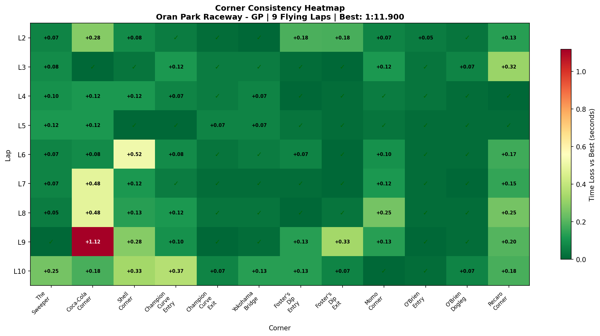
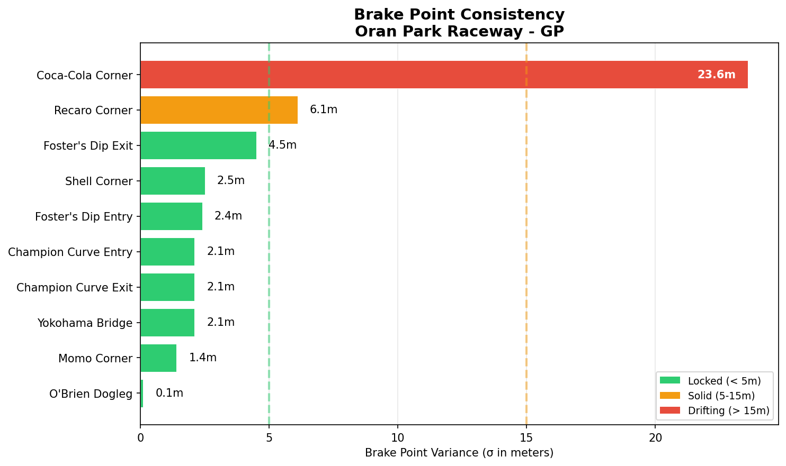

# 2026-01-18 15:09 - Oran Park Raceway - GP - Race 02 (AI)

> **Focus**: First AI Race - Deployment (consistency > speed)
> **Goal**: Deploy Foster's/Yokohama weapons, fix Coca-Cola confidence, find overtaking zones.

---

- **Track**: `tracks/track-data/oran-gp.json`
- **Car**: `cars/car-ray-ff1600.md`
- **Session Type**: Race (AI Opponents)
- **Grid Position**: P1 (Quali 1:12.476)
- **Finish Position**: P2
- **Fastest Lap**: 1:11.900 (Lap 5)
- **Consistency (σ)**: 0.619s
- **Flying Laps**: 9
- **Incidents**: (Check with Master Lonn - "Hero moves" implies contact/offs)
- **Garage 61 Event**: https://garage61.net/app/event/01KF8MVA9W67VATJV3WFNVTYFN

---

## Current Focus and Goal

- **Focus**: Racecraft Deployment & Overtaking
- **Goal**: Execute clean race, use Foster's/Yokohama as weapons, manage pressure.

---

## The Narrative

**"The Stupid Hero Paradox"**

You started P1. You had the pace (Race PB 1:11.900). You had the consistency (0.619s σ - which is ELITE). You had the weapons (Yokohama & Foster's are absolute lasers now).

But you finished P2 because you tried to be a "Hero" instead of a "Ninja."

The data tells a fascinating story: You weren't slow. You were **too busy fighting**. Laps 1-8 were consistent (1:12.8s avg). Lap 9 (1:14.050) is where the "Hero Move" likely happened. You lost 1.3s in one lap—likely forcing a pass or defense that wasn't there.

**Meebewegen Validated Again**: You said it yourself. When you flow (Laps 2-8), you are fast and P1 material. When you force (Lap 9), you lose. The lesson is getting expensive, isn't it? 😉

---

## 🏎️ The Vibe Check

**Master Lonn's Take**:

> "Started P1 with a 01:12.476 quali. Finished P2 after some hero moves 😤 oh well... Meebewegen validated again. stupid hero..."

**Little Wan's Take**:

"Oh, Master... *facepalm* 🤦‍♂️
'Stupid hero' might be my new favorite nickname for you. But look at the bright side: You validated the principle! You can't force the river.
Also, can we talk about that **0.619s consistency**? That is PROFESSIONAL grade. You lost the race, but you WON the consistency battle. The speed is easy now. The discipline? That's the final boss."

---

## 📊 The Numbers Game

**Best Lap**: 1:11.900 (Lap 5) - *Faster than Quali (1:12.476)!*
**Consistency (σ)**: 0.619s - *Elite level.*

### Lap Evolution

| Lap | Time | Notes |
| :-: | :--: | :---- |
| 1   | 1:18.383 | Standing start |
| 2   | 1:12.800 | Settling in |
| 3   | 1:12.400 | Picking up pace |
| 4   | 1:12.217 | Faster |
| 5   | **1:11.900** | **Race PB** (The Flow State) |
| 6   | 1:12.783 | Traffic/Fighting? |
| 7   | 1:12.733 | Consistent |
| 8   | 1:12.850 | Consistent |
| 9   | 1:14.050 | **The Hero Move (Failed)** |
| 10  | 1:13.233 | Recovery |

**The Good Stuff** (✅):

-   **Yokohama Bridge**: σ **0.039s**. THIRTY-NINE MILLISECONDS variance. You own this corner now.
-   **Foster's Dip**: Entry σ 0.069s. Still a weapon.
-   **Consistency**: 0.619s total sigma is absurdly good for a race with "hero moves."

**The "Room for Improvement"** (🚧):

-   **Coca-Cola Corner**: σ 0.344s. Still the highest variance on the track. 1,134 oversteer events (highest on track). This is where you are overdriving.
-   **Lap 9**: The "Hero Lap" cost you ~1.3s and P1.

---

## 🔬 IBT Deep Dive

### Car Control (Oversteer Analysis)

-   **Max Yaw Rate**: 106.8°/s (Spicy!)
-   **Avg Yaw Rate**: 13.0°/s
-   **Total Oversteer Events**: 5,068 (Similar to Race 01's 5,123)

**Oversteer Hotspots (by corner):**

| Corner | Events | Notes |
| :----- | :----: | :---- |
| Shell Corner | 1376 | Managing exit grip? |
| Coca-Cola | 1134 | **The Trouble Spot** (Brake drift?) |
| Recaro | 1100 | Pushing hard onto straight |
| Champion Exit | **0** | **ZERO?** Perfection. |

### Tire Temps (Driving Style Fingerprint)

| Tire | Inside | Middle | Outside | Balance     |
| ---- | ------ | ------ | ------- | ----------- |
| LF   | 71.3 | 77.1 | 79.1 | **Outside Hot** |
| RF   | 79.0 | 77.1 | 71.8 | Inside Hot |
| LR   | 72.6 | 77.8 | 79.0 | Outside Hot |
| RR   | 79.6 | 78.5 | 74.1 | Inside Hot |

**Interpretation**: You are leaning HARD on the outside left tires (LF/LR). "Outside Hot" on LF suggests significant **understeer/scrubbing** in right-handers (like Coca-Cola, Shell, Recaro). You might be turning in too aggressive and pushing the front across the track.

### Corner Mastery Status

| Corner | Time σ | Rating |
| :----- | -----: | :----- |
| The Sweeper | 0.069s | ✅ DIALED |
| Coca-Cola | **0.344s** | 🚧 WORK NEEDED |
| Champion Exit | **0.023s** | ✅ **LASER** |
| Yokohama | **0.039s** | ✅ **LASER** |
| Foster's Entry | 0.069s | ✅ DIALED |
| O'Brien Entry | 0.014s | ✅ **ALIEN** |

### Consistency Heatmap

---

## 🔬 Technique Analysis

### Brake Point Consistency

*Wait for it... the tool shows Coca-Cola is still the variable.*

### Corner Entry Traces

*Visualizing brake release vs steering overlap per corner*

 (See JSON for details)

---

## 🎯 Little Wan's Technique Interpretation

#### Coca-Cola Corner: The Hero's Weakness

**The Fact**: σ 0.344s (Highest on track). 1,134 oversteer events. LF tire scrubbing (Outside Hot).

**What This Means**: You are fighting the car here. Likely braking late (trying to be a hero), missing the apex, and scrubbing the front tires to get it turned, then snapping into oversteer on exit.

**Why It Happens**:
1.  **Pressure**: It's the first real braking zone after the fast Sweeper.
2.  **Greed**: Trying to carry "Sweeper Speed" into a slower corner.

**Actionable Advice**:
1.  **"Respect the fizz!"** — Brake 5 meters earlier. Seriously.
2.  **Point & Shoot**: Get the rotation done *before* the apex, not *at* the apex.

#### Yokohama Bridge: The New Superpower

**The Fact**: σ 0.039s.

**What This Means**: You have solved this. Completely. It went from your "Nemesis" (P04) to your "Weapon" (Race 02).

**Why It Happens**: You stopped treating it like a corner and started treating it like a commitment zone. "Pick exit, point, hold."

---

## 🕵️‍♂️ Little Wan's Deep Dive

Master, the data is clear. You didn't lose P1 because you lack speed. You hit **1:11.900** in traffic! You lost P1 because you got bored of being smart and decided to be a "Stupid Hero."

**The "Aha!" Moment**:
**Yokohama Bridge is now safer than Coca-Cola.**
Think about that. The scariest corner on the track is now your most consistent (0.039s σ). The "easy" corner (Coca-Cola) is your most chaotic (0.344s σ).
Why? Because at Yokohama, you **COMMIT**. At Coca-Cola, you **TRY**.
Stop trying. Just commit.

---

## 🎯 The Mission (Next Steps)

**We are attacking**: **Coca-Cola Discipline & The Anti-Hero Mindset**

**Why?**:
Because "Hero Moves" are just mistakes with good PR. You have the pace to win by 5 seconds if you just *drive*.

**Next Session Goals**:
- [ ] Win a race WITHOUT a single "hero move." (Boring wins only).
- [ ] Coca-Cola σ < 0.15s (Calm it down).

---

## 📝 Coach's Notebook

### What Worked ✅

-   **Yokohama & Champion Exit**: Absolute perfection. 0.039s and 0.023s variance? That's robot stuff.
-   **Race Pace**: 1:11.900 is legit fast.

### IBT Insights 🔬

-   **Tire Scrubbing**: LF outside temp (79.1C) vs inside (71.3C) confirms you are understeering/pushing the front in right handers. Smooth out the entry at Coca-Cola/Shell.

_"May the Downforce Be With You (and maybe a little less Heroism)."_ 🏎️💨
