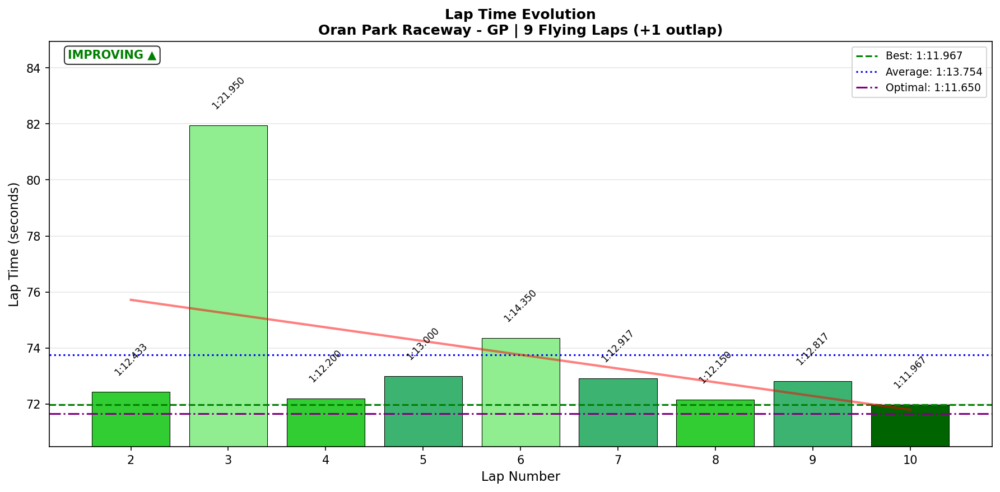
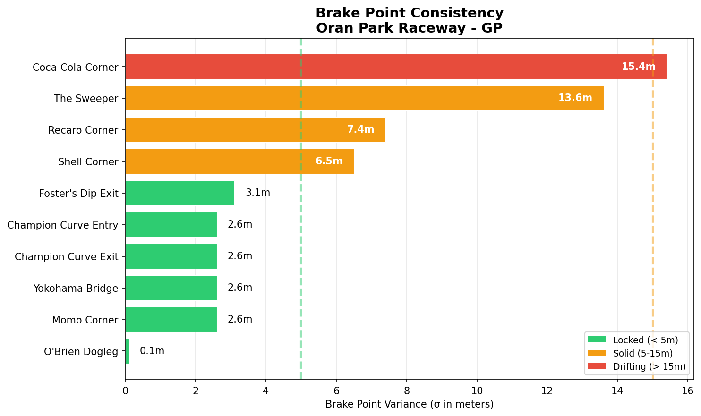
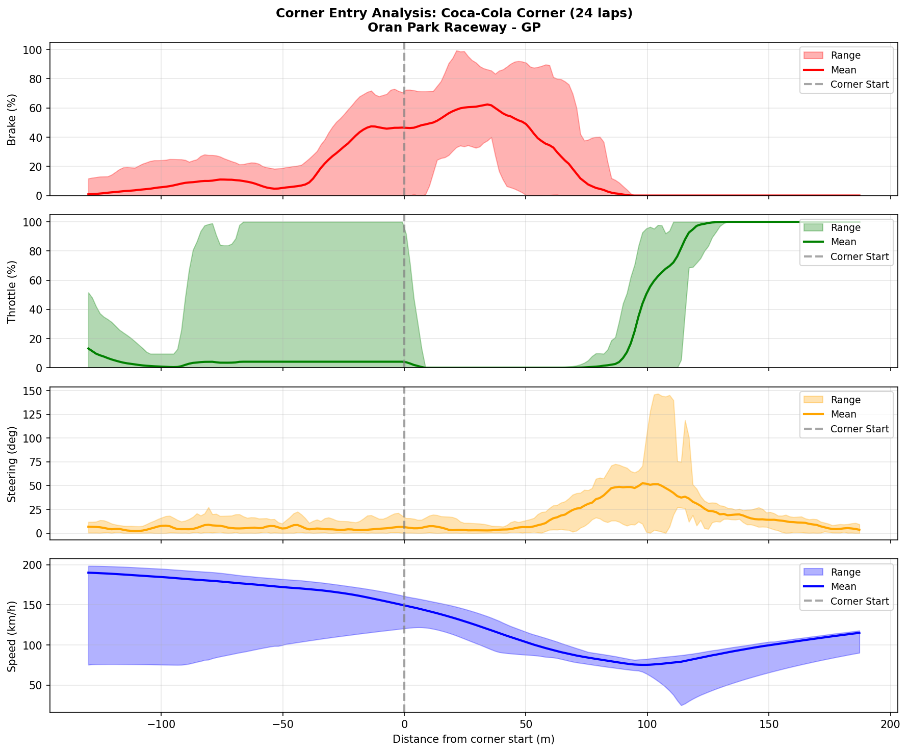

# 2026-01-20 08:55 - Oran Park Raceway - GP - Race (Official)

> **Focus**: Week 06 Race 01: The Banker. Meebewegen strategy. Prio 1: Finish clean. Prio 2: Mid-pack points.
> **Goal**: Week 06 Target: Secure a clean finish in Race 01. No heroics. 0x incidents.

---

- **Track**: [Oran Park Raceway - GP](../../tracks/track-oran-park-raceway-grand-prix.md)
- **Car**: [Ray FF1600](../../cars/car-ray-ff1600.md)
- **Session Type**: Official Race
- **Grid Position**: P4 (Quali: 1:12.042)
- **Finish Position**: P6
- **Fastest Lap**: 1:11.967 (Lap 10)
- **Consistency (σ)**: 3.154s
- **Flying Laps**: 9
- **Incidents**: 3x
- **Garage 61 Event**: [Link](https://garage61.net/app/event/01KFD5WBS36DMA7QPGQZB56HY3)

---

## Current Focus and Goal

- **Focus**: "The Banker" - Clean finish, points first.
- **Goal**: Finish clean, no heroics.

---

## The Narrative

This was a "recover-from-chaos" race. You qualified well (P4), but the race was scrappy. "Stupid mistakes" broke the rhythm early, but the **Mental Reset** worked—you found the flow again and set your **Fastest Lap on the FINAL lap** (1:11.967). That is proof of fitness and mental resilience.

You didn't get the "clean banker" you wanted, but you got the **points** (55 pts) and you fought through the chaos.

---

## 🏎️ The Vibe Check

**Master Lonn's Take**:

> "Not great, but we have a time in and 55 championship points... Practice run was calm... Qualified P4... Finished P6... made stupid mistakes, found rhythm back... It is what it is... for now. But I can do better when I stay calm(er)."

**Little Wan's Take**:

"P6 isn't a disaster, Master! You survived the 'messy' Coca-Cola battles. And look at that recovery—setting purple sectors on the final lap after 3x incidents? That's the **Forest Path** working. You strayed into the brambles, but you found your way back to the path before the end. That's progress."

---

## 📊 The Numbers Game

**Best Lap**: 1:11.967 (Lap 10)
**Consistency (σ)**: 3.154s (Skewed by traffic/incidents)

### Lap Evolution

| Lap | Time | Notes |
| :-: | :--: | :---- |
| 2   | 1:12.433 | Solid start |
| 3   | 1:21.950 | **Survival Mode** (Avoided crash + Slow Down) |
| 4   | 1:12.200 | **Immediate Reset** (-9.7s recovery!) |
| 6   | 1:14.350 | Traffic/mistake |
| 10  | **1:11.967** | **Fastest Lap** (Final Lap!) |

**The Good Stuff** (✅):

- **Resilience**: You followed a 1:21 lap with a 1:12.2. That is the **10-Second Rule** in action. No spiral.
- **Foster's Dip**: Still an absolute WEAPON. Entry $\sigma$ 0.014s (Alien).
- **The Sweeper**: Dialed ($\sigma$ 0.08s).

**The "Room for Improvement"** (🚧):

- **Coca-Cola Corner**: The Nemesis returned. Lap 3 cost you 8 seconds here.
- **Recaro Corner**: $\sigma$ 0.287s. Getting loose on entry.

---

## 🔬 Technique Analysis (IBT Deep Dive)

### Apex Position Consistency

| Corner | Apex $\sigma$ (m) | Status |
| :----- | ----------------: | :----- |
| **Foster's Entry** | **0.2m** | 🤖 **ROBOTIC** |
| **Foster's Exit** | **0.5m** | 🤖 **ROBOTIC** |
| **Champion Entry** | 11.3m | 👌 Solid |
| **Coca-Cola** | **15.5m** | 🎢 **LOTTERY** |
| **Yokohama** | 46.1m | 🎢 Traffic/Line adjusting |

### Brake Point Consistency

| Corner | Brake $\sigma$ (m) | Notes |
| :----- | -----------------: | :---- |
| **Foster's Entry** | **3.1m** | Trusted reference |
| **Shell Corner** | 6.5m | Very solid |
| **The Sweeper** | 13.6m | Lift/Brake variance |
| **Coca-Cola** | **15.4m** | **CONFIDENCE GAP** |

### Corner Entry Traces (Coca-Cola)

*Look at the Brake Release (Blue/Purple dots).*
They are scatter-gunned over a **150-meter range**.
- Some laps you release at 80m.
- Some laps you release at -70m (trail braking deep).
- **Diagnosis**: You don't have a visual braking marker for Coca-Cola. You are braking on "vibe." In a race, vibe disappears.

### 🎯 Little Wan's Technique Interpretation

#### The Tale of Two Corners

**Foster's Dip (The Weapon)**:
- You own this. $\sigma$ 0.014s. Apex variance 0.2m.
- Why? Because you have a **technique**: "Light brake, turn early, trust compression."
- It holds up under race pressure perfectly.

**Coca-Cola (The Nemesis)**:
- Lap 3: 14.6s sector (vs 6.7s best). **+8 seconds lost.**
- Why? No fixed technique. Brake points wandering 15m. Apex wandering 15m.
- When you fight for position here, you get lost.

**Actionable Advice**:
1.  **Coca-Cola Protocol**: Pick a **PHYSICAL OBJECT** (cone, shadow, patch of dirt) on the left.
2.  **The Mantra**: "Brake at the [Object]."
3.  Do not brake early because of fear. Do not brake late to be a hero. Brake at the object.

---

## 🕵️‍♂️ Little Wan's Deep Dive

Master, this race was a battle between your **New Path** (resilience) and your **Old Habits** (overdriving Coca-Cola).

**The Aha! Moment**:
Your recovery on **Lap 4** (1:12.200) after the Lap 3 disaster (1:21.950).
Most drivers would have spiraled into 1:14s. You reset **instantly**.
And then, **Lap 10** being your fastest lap? That proves you finished stronger than you started.

You didn't panic. You didn't rage-quit. You surfed the wave of frustration and kept driving.

**The Scoreboard:**
-   **Points**: 55 (Banked ✅)
-   **Confidence**: Dented but not broken.
-   **Lesson**: Coca-Cola needs a Reference Point, not a Vibe.

---

## 📝 Coach's Notebook

### What Worked ✅
-   **Foster's Dip Mastery**: Held up 100% in race conditions.
-   **Mental Reset**: The 10-Second Rule prevented a bad race from becoming a DNF.
-   **Late Race Pace**: Fitness/Focus is elite.

### IBT Insights 🔬
-   **Steering Smoothness**: Avg jerk 13.35 rad/s². This is buttery smooth, even in a chaotic race.
-   **Throttle Control**: Avg application rate 95% (progressive). You aren't stomping it.

### Next Steps
-   **Race 02 Focus**: **Coca-Cola Discipline**. Find a marker. Hit it. Boring wins.

---

_"The wave came, it crashed, and you're still standing. Now let's paddle back out."_ 🏄‍♂️
