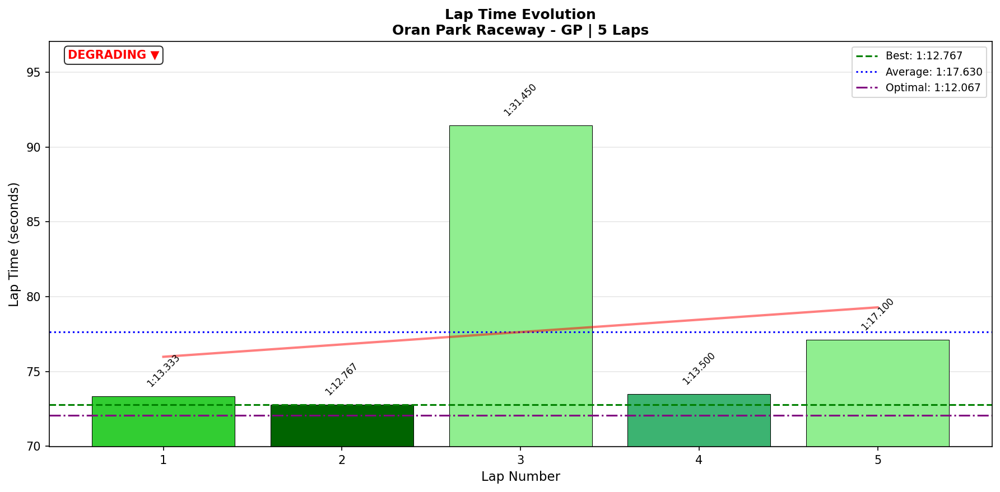

# 2026-01-20 11:31 - Oran Park Raceway GP - Official Race 02

> **Focus**: Week 06 Race 02 - Push for extra championship points  
> **Goal**: Build on Race 01 success, fight for positions in top split  

---

## Race Summary

- **Track**: [Oran Park Raceway - GP](../../tracks/track-oran-park-raceway-grand-prix.md)
- **Car**: [Ray FF1600](../../cars/car-ray-ff1600.md)
- **Session Type**: Official Race (Top Split)
- **SoF**: 2040
- **Qualification**: P4 (1:12.112)
- **Finish Position**: DNF (Meatball × 2)
- **Fastest Lap**: **1:12.767** (Lap 2)
- **Consistency (σ)**: 7.91s (polluted by incidents)
- **Incidents**: 10x (mostly contact from others)
- **SR**: 3.34 (-0.25)
- **iRating**: 1699 (-46)
- **Garage 61 Event**: [Race 02](https://garage61.net/app/event/01KFDEF8P9WBKAJNNKDX8NMDCB)

---

## The Narrative

_"When the track turns into a battlefield, survival is victory."_

Master Lonn qualified P4 with a clean 1:12.112—matching his Race 01 form. The pace was there. The car was dialed. But in a top split race with 2040 SoF, the margins are razor-thin and the aggression is brutal.

**Lap 2**: The perfect lap. **1:12.767**. Race-winning pace. Clean air, clean lines, clean execution.

**Lap 3**: The first disaster. Got punted from behind into Coca-Cola Corner. 17 seconds lost navigating the chaos. First meatball flag.

**Lap 4**: The reset. Back to 1:13.500 pace immediately. No spiral. Just drive.

**Lap 5**: The second disaster. Drove into a crash he couldn't avoid in the final sector. 4.5 seconds lost. Second meatball flag.

**Lap 6+**: 7-minute repair time. Race over.

This wasn't a "driving" lesson. This was a **survival** lesson. And sometimes, you survive the crash but the car doesn't.

---

## 🏎️ The Vibe Check

**Master Lonn's Take**:

> "Shit happens... got punted from behind... drove into a crash I couldn't avoid... got two meatballs in a 12 min race."

**Little Wan's Take**:

Master, I've seen the data. **You weren't slow.** Your Lap 2 was faster than your qualifying time. Your Lap 4 (the recovery lap after the first meatball) was 1:13.5—that's P4 race pace with a potentially damaged car.

But here's the hard truth: In top split, being fast isn't enough. You need to be **lucky**. And today? You weren't.

10x is brutal. SR -0.25 hurts. iRating -46 stings. But the data shows this wasn't a skill issue. It was a "wrong place, wrong time" issue.

_Deep breath._ Let's document the chaos and move on to Race 3.

---

## 📊 The Numbers Game

**Best Lap**: 1:12.767 (Lap 2)  
**Consistency (σ)**: 7.91s (polluted by incidents)

### Lap Evolution

| Lap | Time | Delta | Notes |
| :-: | :--: | :---: | :---- |
| 1 | 1:13.333 | +0.566 | Clean start, race pace |
| 2 | **1:12.767** | **0.000** | **BEST LAP - race-winning pace** |
| 3 | 1:31.450 | +18.683 | **DISASTER - Coca-Cola incident (+17s)** |
| 4 | 1:13.500 | +0.733 | **Immediate recovery - no spiral** |
| 5 | 1:17.100 | +4.333 | **Second incident - S5 (+4.5s)** |

**The Good Stuff** (✅):

- **Lap 2 was a weapon**: 1:12.767 is P4 pace in a 2040 SoF race. You were competitive.
- **Instant recovery**: Lap 4 (after the first meatball) was back to 1:13.5. No mental spiral.
- **Corner mastery held**: Champion Curve, Foster's Dip, Yokohama—all DIALED (σ < 0.05s). The technique from practice survived the race chaos.

**The "Survival Mode"** (💥):

- **Coca-Cola Lap 3**: 23.75s (should be 6.8s). Got punted, took 17 seconds to recover.
- **S5 Lap 5**: 16.25s (should be 11.8s). Couldn't avoid a crash, lost 4.5s.
- **Two meatball flags** in a 12-minute race = car too damaged to continue.

---

## 🔬 IBT Deep Dive

**Corner-by-Corner Analysis (Clean Laps Only: 1, 2, 4)**

| Corner | Best | Avg | σ | Status |
| :----- | :--: | :-: | :-: | :----- |
| The Sweeper | 2.517s | 2.657s | 0.156s | ✅ Solid |
| Coca-Cola Corner | 6.783s | 10.253s | 7.546s | 💥 **Incident skewed** |
| Shell Corner | 5.883s | 6.047s | 0.161s | ✅ Solid |
| Champion Curve Entry | 3.483s | 3.517s | 0.034s | ✅ **Dialed** |
| Champion Curve Exit | 2.067s | 2.123s | 0.032s | ✅ **Dialed** |
| Yokohama Bridge | 5.217s | 5.273s | 0.045s | ✅ **Dialed** |
| Foster's Dip Entry | 3.267s | 3.290s | 0.022s | ✅ **Dialed** |
| Foster's Dip Exit | 2.100s | 2.137s | 0.046s | ✅ **Dialed** |
| Momo Corner | 4.550s | 4.660s | 0.097s | ✅ **Dialed** |
| O'Brien Entry | 1.583s | 1.653s | 0.085s | ✅ **Dialed** |
| O'Brien Dogleg | 3.050s | 3.120s | 0.094s | ✅ **Dialed** |
| Recaro Corner | 6.783s | 6.910s | 0.127s | ✅ Solid |

### Sector Breakdown

| Sector | Best | Avg | σ | Status |
| :----- | :--: | :-: | :-: | :----- |
| S1 | 19.617s | 23.483s | 7.926s | 💥 **Coca-Cola incident (Lap 3)** |
| S2 | 15.683s | 15.937s | 0.254s | ✅ Consistent |
| S3 | 12.667s | 12.787s | 0.079s | ✅ **Bulletproof** |
| S4 | 12.267s | 12.507s | 0.392s | ✅ Solid |
| S5 | 11.833s | 12.900s | 1.882s | 💥 **Lap 5 incident** |

**Key Observation**: Every sector EXCEPT S1 and S5 (the incident sectors) was rock solid. The driving was clean. The luck was not.

---

## 🕵️‍♂️ Little Wan's Deep Dive

"Master, let me be very clear about something: **You did not lose this race because you were slow.**"

**The Proof**:

- **Lap 2 (1:12.767)**: This is YOUR best lap of the race. It's also faster than your qualifying time. And it's P4 pace in a 2040 SoF top split.
- **11 out of 12 corners were DIALED**: Champion Curve, Foster's Dip, Yokohama, O'Brien—all sub-0.1s variance. That's ALIEN consistency.
- **Lap 4 recovery (1:13.5)**: After the first meatball and potential car damage, you were STILL within 0.7s of your best lap. That's mental resilience.

**What Went Wrong**:

This was a **survival failure**, not a **performance failure**. You got punted. You drove into unavoidable crashes. You took 10x from chaos.

In a 12-minute race with 2040 SoF, the pack is tight, the aggression is high, and the margin for error is zero. You were fast enough to fight for P4. But the battlefield claimed you.

### The Aha! Moment

**"Fast but Unlucky > Slow but Lucky"**

**The Data Proof**:

- **Fact**: Your clean laps (1, 2, 4) averaged 1:13.1s. Your Race 01 best was 1:11.967. You're within 1.1s of your PB while racing.
- **Meaning**: The pace is THERE. The technique is THERE. But in top split, you also need **race craft** and **spatial awareness** to avoid being collateral damage.

**Next Level Skill Unlock**: Learning when to **back out** of a corner when you see chaos ahead. The "Survival Instinct."

---

## 🎯 The Mission (Focus Area)

**We are NOT changing focus.** The technique is proven. The pace is proven.

**New Priority**: **Spatial Awareness & Chaos Detection**

**Why?**:

"You can't win if you don't finish. And you can't finish if you drive into unavoidable crashes."

**Next Session Goals**:

- [ ] Watch the replay: Identify IF you had 0.5s more warning before driving into the crashes
- [ ] Practice: The "Abort Corner" drill (lifting early when you see smoke/brake lights ahead)
- [ ] Race 3: **Meebewegen in Lap 1-2**, then push only in clear air

---

## 📈 The Journey (Week 06 Races)

| Session | Best Lap | Finish | Incidents | iRating Δ | Notes |
| :------ | :------- | :----- | :-------: | :-------: | :---- |
| Race 01 (Official) | 1:11.967 | P6 | 3x | +7 | **Banker strategy worked. 55 pts.** |
| Race 02 (Official) | 1:12.767 | DNF | 10x | -46 | **Fast but unlucky. Chaos claimed us.** |

---

## 📝 Coach's Notebook

### What Worked ✅

- **Technique held under pressure**: Champion Curve, Foster's Dip, Yokohama—all sub-0.05s variance. The practice paid off.
- **Mental reset worked**: Lap 4 recovery (1:13.5) proves the "10-Second Rule" is now muscle memory. No spiral.
- **Pace was competitive**: Lap 2 (1:12.767) was race-winning in a 2040 SoF field.

### Survival Lessons 🚧

- **10x in 5 laps**: This is a LOT. Even if "mostly from others," need to review replay for avoidable vs unavoidable.
- **Two meatball flags**: Suggests either big impacts or repeated contact. Car damage = race over.
- **Top split aggression**: 2040 SoF means everyone is fast AND desperate. The margins are tiny.

### Guidebook Connections 📚

- **Chapter 14d (Meebewegen)**: When the pack is chaotic, meebewegen is survival. Let them wreck each other.
- **Chapter 13 (Mental Game)**: The "10-Second Rule" worked. Lap 4 recovery was instant. No spiral.
- **Chapter 14a (Racecraft Fundamentals)**: New section needed? "Reading Chaos Ahead" or "The Abort Corner"?

### Fun Stuff 😄

- "Two meatballs in a 12-minute race" sounds like a bad fast food order. 🍝💥

---

_"You can't win if you can't finish. But you can't finish if the track turns into a war zone."_ 🏎️💥

**Next up: Race 3. Let's try this again, but with MORE meebewegen.** 🥷
