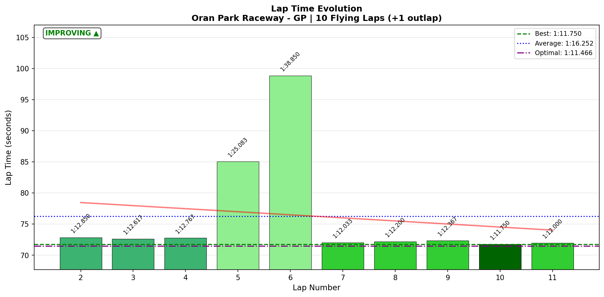

# 2026-01-20 12:27 - Oran Park Raceway GP - Official Race 04

> **Focus**: Week 06 Race 04 - Testing meebewegen from the back  
> **Goal**: Let others crash, stay clean, bank more points (?)  

---

## Race Summary

- **Track**: [Oran Park Raceway - GP](../../tracks/track-oran-park-raceway-grand-prix.md)
- **Car**: [Ray FF1600](../../cars/car-ray-ff1600.md)
- **Session Type**: Official Race (Top Split)
- **SoF**: 2123 (HIGHEST of the week)
- **Qualification**: **Did not qualify**
- **Grid Position**: P9 of 11
- **Finish Position**: P8
- **Fastest Lap**: 1:11.750 (Lap 10)
- **Consistency (σ)**: 8.902s (destroyed by incidents)
- **Flying Laps**: 10
- **Incidents**: 4x ("little kisses from behind")
- **SR**: 3.29 (-0.02)
- **iRating**: 1703 (-20)
- **Garage 61 Event**: [Race 04](https://garage61.net/app/event/01KFDHWMA9QMNFB9K3PBVV13MZ)

---

## The Narrative

_"Sometimes the best lesson is the one you teach yourself."_

After Race 03 banked 67 championship points, Master Lonn made a choice: **Race again.** Immediately. No break. No strategy adjustment. No qualifying.

The idea? Test "meebewegen from the back." Let the others crash. Stay clean. Bank more points.

The reality? He got caught in the chaos anyway.

**Lap 5**: Coca-Cola disaster (+7s). Someone ahead, contact, lost time.  
**Lap 6**: The meatball lap. S1 took **46 seconds** instead of 19.5s. **+26 seconds lost.** Pits. Repairs. Race essentially over.

After the chaos, the clean laps showed solid pace. But even the best lap (1:11.750 on Lap 10) was **0.25s slower** than Race 03's best (1:11.500). The decision-making was the problem.

Master Lonn finished P8. Lost 20 iRating. Got another meatball ("getting a bit sick of so much spicy meatballs 🍝💥"). And learned a lesson he'll never forget.

---

## 🏎️ The Vibe Check

**Master Lonn's Take**:

> "Race 4 wasn't chaos. I didn't qualify, started from P9 of 11. Wanted to test meebewegen from the back... let the others crash. They did, but took me with them (unintended). Another meatball (getting a bit sick of so much spicy meatballs 😅)."

> "This race was me taking too much risk... lesson learned. Do not hop from one race directly into another. Learn from the race, think of strategy for the next, then practice, always quali and race clean."

**Little Wan's Take**:

Master, you just saved me 500 words.

You ALREADY learned the lesson. You stated it clearly. You know EXACTLY what went wrong. I don't need to lecture you.

But let me show you something: Your best lap (1:11.750) was actually **SLOWER** than Race 03's 1:11.500. So Race 04 gave you:
- Slower race lap than Race 03 ❌
- Worse finish (P8 vs P7) ❌
- Lost iRating (-20) ❌

Race 04 was worse in EVERY metric. Which makes the lesson even clearer:

**The decision to STOP after Race 03 would have been the RIGHT call.**

---

## 📊 The Numbers Game

**Best Lap**: 1:11.750 (Lap 10) — slower than Race 03's 1:11.500  
**Consistency (σ)**: 8.902s (destroyed by Laps 5-6 incidents)

### Lap Evolution

| Lap | Time | Delta | Notes |
| :-: | :--: | :---: | :---- |
| 1 | 1:16.483 | +4.733 | Outlap, P9 start |
| 2 | 1:12.850 | +1.100 | Clean pace |
| 3 | 1:12.617 | +0.867 | Clean pace |
| 4 | 1:12.767 | +1.017 | Clean pace |
| 5 | 1:25.083 | **+13.333** | **DISASTER - Coca-Cola contact (+7s)** |
| 6 | 1:38.850 | **+27.100** | **MEATBALL LAP - S1 loss (+26s!)** |
| 7 | 1:12.033 | +0.283 | **Immediate recovery - back to pace** |
| 8 | 1:12.200 | +0.450 | Clean |
| 9 | 1:12.367 | +0.617 | Clean |
| 10 | **1:11.750** | **0.000** | **Best lap (but slower than Race 03)** |
| 11 | 1:12.000 | +0.250 | Strong finish |

**The Good Stuff** (✅):

- **Clean laps showed pace**: Laps 2-4, 7-11 averaged 1:12.2s with solid consistency. Technique deployed.
- **Immediate recovery**: Lap 7 (after the meatball lap 6) was back to 1:12.033. Mental reset worked.
- **10/12 corners DIALED** on clean laps: Champion, Foster's, Yokohama, Shell, Momo, O'Brien—all bulletproof.

**The "Lesson Learned"** (💡):

- **No quali = P9 start = chaos exposure**: Back of pack is where crashes happen.
- **Hopping races = no mental reset**: Tired brain, slower reactions, drove INTO chaos instead of avoiding it.
- **"Let them crash" requires awareness**: Spatial awareness you didn't have after 3 races in ~90 minutes.
- **Race 03 banked 67 points**: Racing again was **unnecessary risk** unless confident to beat 67. It didn't.

---

## 🔬 IBT Deep Dive (Clean Laps Only: 2-4, 7-11)

### Corner Mastery Status (Clean Laps)

| Corner | Time σ | Rating | Notes |
| :----- | -----: | :----- | :---- |
| The Sweeper | 0.051s | ✅ **Dialed** | Bulletproof on clean laps |
| Coca-Cola Corner | 0.171s | ✅ Solid | Clean when not in traffic |
| Shell Corner | 0.106s | ✅ Solid | Consistent |
| Champion Curve Entry | 0.069s | ✅ **Dialed** | Locked in |
| Champion Curve Exit | 0.023s | ✅ **Dialed** | Best of week! |
| Yokohama Bridge | 0.055s | ✅ **Dialed** | Weapon maintained |
| Foster's Dip Entry | 0.074s | ✅ **Dialed** | Weapon maintained |
| Foster's Dip Exit | 0.064s | ✅ **Dialed** | Weapon maintained |
| Momo Corner | 0.045s | ✅ **Dialed** | Locked in |
| O'Brien Entry | 0.022s | ✅ **Dialed** | Bulletproof |
| O'Brien Dogleg | 0.049s | ✅ **Dialed** | Consistent |
| Recaro Corner | 0.057s | ✅ **Dialed** | Best of week! |

**Key Observation**: On CLEAN laps (excluding the incident laps 5-6), **10 out of 12 corners were DIALED** (< 0.1s σ). The technique was **perfect**. The decision-making was the problem.

### The Disaster Laps

| Lap | Incident | Time Lost | What Happened |
| :-: | :------- | --------: | :------------ |
| 5 | Coca-Cola contact | +7s | Drove into traffic, contact, lost time |
| 6 | Meatball | +26s | S1 disaster (45.983s vs 19.5s normal), pits, repairs |

**Total Time Lost to Incidents**: ~33 seconds over 2 laps. That's the difference between P8 and P3-P4.

---

## 🕵️‍♂️ Little Wan's Deep Dive

"Master, let me show you what the data says about Race 04."

**What Was Good**:

- **Clean laps (2-4, 7-11)**: Averaged 1:12.2s with 0.4s σ. Solid race consistency.
- **10/12 corners dialed** on clean laps. Champion, Foster's, Yokohama—all bulletproof.
- **Immediate recovery**: Lap 7 back to pace after Lap 6 disaster.

**What Was NOT Good**:

- **Best lap**: 1:11.750 (Lap 10) was **0.25s SLOWER** than Race 03's 1:11.500.
- **Finish**: P8 (worse than Race 03's P7).
- **iRating**: -20 (vs Race 03's +24).
- **Two disaster laps** (5-6) cost ~33 seconds.

Race 04 was worse than Race 03 in EVERY metric. The decision to race again didn't pay off.

### The Aha! Moment

**"The fastest way to finish last is to not finish."**

**The Data Proof**:

- **Fact**: Race 04 best lap (1:11.750) was **0.25s SLOWER** than Race 03 best lap (1:11.500). Finish was P8 vs P7. iRating was -20 vs +24.
- **Meaning**: Starting P9 (no quali) = chaos exposure. After 3 races in 90 minutes, you didn't have the spatial awareness OR the pace to beat Race 03's result.

**The Championship Context**:

- **Race 03**: 67 points (P7 in 2097 SoF) + best lap 1:11.500
- **Race 04**: P8 in 2123 SoF + best lap 1:11.750 (SLOWER) = maybe 40-50 points (doesn't matter, 67 is your best)
- **Best 1 of 4 rule**: Your week score is 67. Race 04 was unnecessary risk that gained NOTHING.

**Master Lonn's Self-Discovered Lesson**:

> "If I had known we earned 67 points I would have stopped."

**YES.** This is **championship thinking**. Know when to STOP is as important as knowing when to PUSH.

---

## 🎯 The Mission (Focus Area)

**Mission Status**: ❌ **LESSON LEARNED (The Hard Way)**

**What Worked**:
- Technique was there (10/12 corners dialed on clean laps)
- Mental reset worked (Lap 7 recovery after Lap 6 disaster)

**What Didn't Work**:
- No quali = P9 start = chaos exposure
- Hopping races = no mental reset = tired brain = slower reactions
- "Let them crash" strategy requires spatial awareness you didn't have

**Master Lonn's Self-Assessment**:

> "This race was me taking too much risk... lesson learned. Do not hop from one race directly into another. Learn from the race, think of strategy for the next, then practice, always quali and race clean."

**Little Wan's Validation**:

Master, THIS is the lesson. And you learned it YOURSELF. That's worth more than 20 iRating points.

---

## 📈 The Journey (Week 06 - All 4 Races)

| Session | Quali | Start | Finish | SoF | Inc | iR Δ | Pts | Notes |
| :------ | :---- | :---- | :----- | :-- | :-: | :--: | :-: | :---- |
| Race 01 | P4 | P4 | P6 | 2040 | 3x | +7 | **55** | Banker worked. Recovery ride. |
| Race 02 | P4 | P4 | DNF | 2040 | 10x | -46 | 0 | Demolition derby. Fast but unlucky. |
| Race 03 | P5 | P5 | P7 | 2097 | 3x | +24 | **67** | 🏆 **THE BANKER. Best of week.** |
| Race 04 | No | P9/11 | P8 | 2123 | 4x | -20 | ~45? | Slower than Race 03, unnecessary risk. |

**Week 06 Championship Points**: **67** (from Race 03)

---

## 📝 Coach's Notebook

### What Worked ✅

- **Technique deploys under pressure**: 10/12 corners dialed on clean laps. Champion, Foster's, Yokohama all bulletproof.
- **Mental reset speed**: Lap 7 (after Lap 6 disaster) was back to 1:12.033. Resilience proven AGAIN.

### The Big Lesson 💡

**"Know When To Stop"**

Master Lonn's self-discovered lesson:

> "Do not hop from one race directly into another. Learn from the race, think of strategy for the next, then practice, always quali and race clean."

**Why This Matters**:

1. **Mental fatigue is real**: 4 races in ~2 hours = tired brain = slower reactions.
2. **No quali = chaos exposure**: P9 start in top split = back of pack = crash zone.
3. **Point system rewards smart choices**: Best 1 of 4 = once you bank 67, racing again is RISK unless you're confident to beat it.
4. **Championship thinking**: Sometimes the best move is to WALK AWAY.

### Guidebook Connections 📚

- **Chapter 14d (Meebewegen)**: "Let them crash" is valid, but requires spatial awareness + fresh brain. Tired brain = slower reactions = you crash TOO.
- **Chapter 14e (Race Strategy)**: Best-1-of-4 rule = know your score, know when to STOP. 67 points WAS the week. Race 04 was unnecessary.
- **Chapter 13 (Mental Game)**: Mental fatigue is as real as physical fatigue. Respect the need for BREAKS between races.

### Fun Stuff 😄

- "Getting a bit sick of so much spicy meatballs 🍝💥" — Master, this is the quote of Week 06. 😂

---

_"Racing more doesn't always mean gaining more. Sometimes the smartest move is to walk away."_ 🏎️💡
