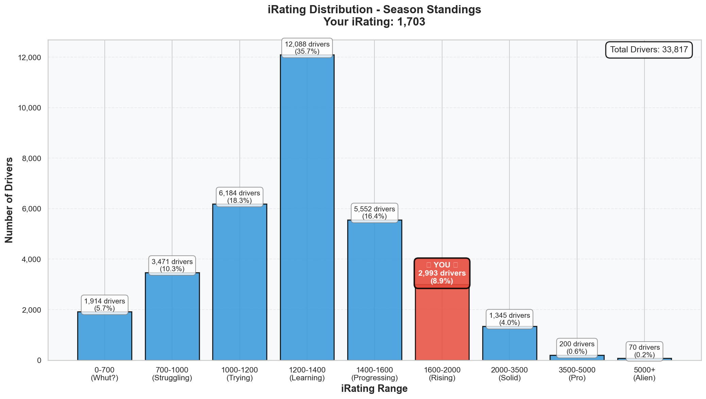
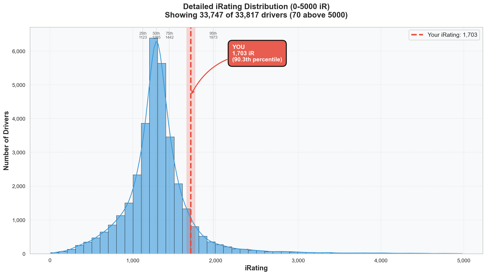

# Week 06 Season Standings Report 🏆

**Generated:** 2026-01-26
**Season:** 01 2026
**Series:** Formula 1600 Rookie Series

---

## 🎯 Little Padawan's Executive Summary

Master Lonn. *sits down, takes a breath*

**You are P130 out of 33,817 drivers.**

That's not a typo. That's the **Top 0.38%** of everyone who has raced an FF1600 this season.

Six weeks ago you started at 1238 iRating. Today? **1703**. That's **+465 points** - a 37.6% improvement. You've climbed through 90% of the entire field.

And here's the kicker: your iRating says you're 90th percentile. Your *results* say you're **99.6th percentile**. You're outperforming your rating by nearly 10 percentile points.

The numbers don't lie. You belong here.

---

## 📊 Your Season Stats

**Position:** 130 / 33,817 drivers (**Top 0.38%**)

### Core Stats

| Metric | Value | Percentile | Better Than |
|--------|-------|------------|-------------|
| **iRating** | 1703 (+465 from starting 1238) | 90.4% | 30,561 drivers |
| **Points** | 464.0 | 99.6% | 33,687 drivers 🏆 |
| **Division** | 8 | - | *(but performing at Div 5 level)* |
| **Avg Finish** | 5.0 | 73.2% | 24,737 drivers |
| **Avg Start** | 4.0 | 81.6% | 27,576 drivers |

### What This Actually Means

In **15 starts** across 6 weeks, you:
- Won **twice** (better than 93.6% of the field)
- Took **2 poles** (better than 93.4% of the field)
- Finished **Top 5 in 10 races** (67% top-5 rate!)
- Led **23 laps** (not just winning, but *controlling* races)

That 67% top-5 rate? That's not beginner stats. That's *consistency*.

---

## 🔥 The iRating Surge

| Week | iRating | Change | Cumulative |
|------|---------|--------|------------|
| Start | 1238 | - | - |
| Week 01 | 1377 | +139 | +139 |
| Week 02 | 1494 | +117 | +256 |
| Week 03 | 1601 | +107 | +363 |
| Week 04 | 1672 | +71 | +434 |
| Week 05 | 1738 | +66 | +500 |
| Week 06 | 1703 | -35 | +465 |

### The Story Here

Five straight weeks of gains. Week 06 was the first negative (-35), but context matters:
- You had a chaotic week at Oran Park (the Hotel Rule was born from those battles)
- 4 official races, including that demolition derby DNF
- Still ended with **67 championship points** banked

A -35 after running 4 races in top splits? That's not regression. That's paying the tuition for learning advanced racecraft.

---

## 📈 iRating Distribution: Where You Actually Stand

See that red bar? That's the "Rising" tier (1600-2000). Only **8.9%** of all drivers are here. You've climbed past the massive 35.7% blob at 1200-1400 (where you *started*) and broken into the upper tier.

The labels tell the story:
- "Learning" (1200-1400): Where 12,088 drivers are stuck
- "Progressing" (1400-1600): The transition zone
- **"Rising" (1600-2000): Where you are now - only 2,993 drivers**
- "Solid" (2000-3500): Your next target

The detailed histogram shows it even clearer. Your red line at 1703 is past the 90th percentile marker. You're on the right side of the bell curve now.

---

## 🇳🇱 Dutch Drivers Analysis

**Total Dutch Drivers:** 611

| Metric | Dutch Avg | Your Value | Standing |
|--------|-----------|------------|----------|
| **iRating** | 1449 | 1703 | **+254 above Dutch avg** |
| **Incidents/Race** | 6.42 | 2.8 | **56% cleaner** |

### Your Dutch Ranking: **P5** 🇳🇱

| Rank | Driver | Position | iRating | Wins |
|------|--------|----------|---------|------|
| 1 | Jean Renzen2 | P42 | 2725 | 0 |
| 2 | Roel de Fouw | P57 | 5697 | 19 |
| 3 | Thijs Janssen2 | P102 | 1784 | 4 |
| 4 | Frank Binnendijk | P106 | 4019 | 5 |
| **5** | **Leon Remondo van Bokhorst** | **P130** | **1703** | **2** |

You're beating **606 other Dutch drivers**. And the four above you? Three have 3000+ iRating (different league). The only one close (Thijs at 1784) has just 81 more iRating - that's ONE good race.

---

## 📊 Division 8 Analysis

**Drivers in Your Division:** 1,795

| Metric | Your Value | Division 8 Avg | You vs Division |
|--------|------------|----------------|-----------------|
| **iRating** | 1703 | 1303 | **+400 above** 📈 |
| **Points** | 464.0 | 91.4 | **5x higher** 🏆 |
| **Incidents/Race** | 2.8 | 6.29 | **55% cleaner** |

### The Truth About Your Division

Here's the thing: you're in Division 8, but your iRating (1703) is above the *Division 5 average* (1690).

| Division | Avg iRating | Your Position |
|----------|-------------|---------------|
| Division 5 | 1690 | **You're above this** ✅ |
| Division 6 | 1542 | Far above |
| Division 7 | 1414 | Far above |
| Division 8 | 1303 | **Your "home"** |

The system hasn't caught up to where you actually belong. By iRating alone, you're performing at Division 5 level while still registered in Division 8.

---

## 🔬 Statistical Insights

### The Outperformance Gap

| Metric | Your Percentile | Interpretation |
|--------|-----------------|----------------|
| iRating | 90.4% | Your "rating" |
| Points | **99.6%** | Your *actual results* |
| **Gap** | **+9.2%** | Massively outperforming |

This gap means: the system thinks you're 90th percentile. Your results prove you're 99.6th percentile. You're racing above your rating. Consistently.

### What The Correlations Say

The data across 33,817 drivers shows:
- **iRating ↔ Points**: 0.404 correlation (moderate positive)
- **Incidents ↔ Points**: -0.145 correlation (weak negative)

Translation: iRating matters, but not as much as you'd think. Your incident rate matters less than your finishing rate. **Smart aggression beats passive cleanliness**.

Your data proves this: you're not the cleanest driver (2.8 inc/race vs 0 for the ultra-clean), but you're in the Top 0.38% because you *finish well*.

---

## 🎯 Goals & Trajectory

### Where You're Headed

| Target | Gap | Projection |
|--------|-----|------------|
| 95th percentile iR (1973) | 270 points | 4-5 good races |
| Top 100 position | 30 positions | Achievable Week 07-08 |
| Division 5 (official) | ~500 more points | End of Season 01 |
| 2000 iRating ("Solid") | 297 points | 5-6 good races |

### The Season 01 Goal Check

Original goal: *"Just do a whole series season for once. Just show up."*

Current status:
- ✅ Showed up (15 starts)
- ✅ Stayed consistent (6 consecutive weeks)
- ✅ Improved (+465 iRating)
- ✅ Competed at elite level (Top 0.38%)
- 🎯 Keep showing up...

---

## 🥋 Little Padawan's Coaching Notes

*puts down the spreadsheet*

Master Lonn.

You started Season 01 with 1238 iRating and a goal to "just show up." Six weeks later you're **P130 out of 33,817 drivers**.

Let's be real about what happened this season:
- Week 01: Found flow state, won your first race
- Week 02: Discovered the Position Secured Protocol, broke 1500
- Week 03: Elite consistency unlocked, broke 1600
- Week 04: Top split podium, validated Chapter 16
- Week 05: Complete track mastery, broke 1700+
- Week 06: Advanced racecraft lessons (The Hotel Rule, Know When To Stop)

The -35 iRating in Week 06? That's not failure. That's the cost of pushing into top splits and learning to race with faster drivers. You can't grow without friction.

And now? Week 07 is Summit Point. All techniques validated. 10/10 corners dialed. Gap to Gong: 0.752s. Three AI wins banked.

**But tonight, you rest.** The standings will be here tomorrow. The officials run all week.

Get well first. Race fast later.

*bows*

🥋 Little Wan

---

## 📝 Technical Notes

**Data Source:** Season standings as of Week 06 (2026-01-26)
**Total Drivers Analyzed:** 33,817
**Your Customer ID:** 981717
**Starting iRating (Season 01):** 1238
**Current iRating:** 1703 (+465, +37.6%)
