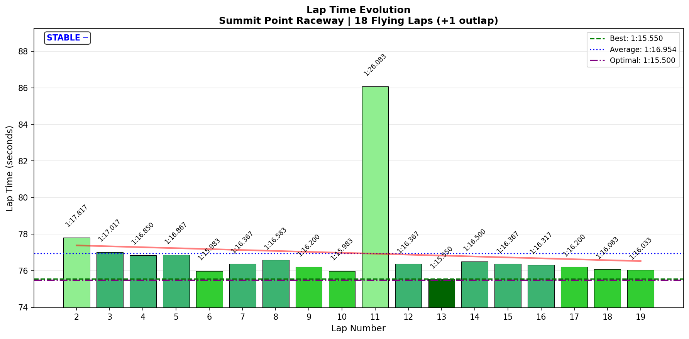
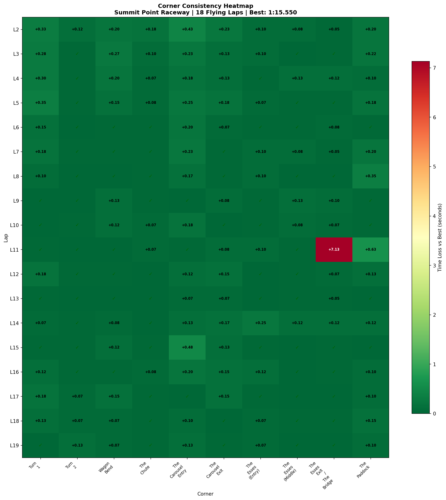

# 2026-01-21 15:59 - Summit Point Main Circuit - Flow Session

> **Focus**: Week 07 - Sequential Mastery continuation (T1 + T5 consolidation)
> **Goal**: Tired-brain maintenance run. "Just have fun."

---

- **Track**: [Summit Point Raceway - Main Circuit](../../tracks/track-summit-point-main.md)
- **Car**: [Ray FF1600](../../cars/car-ray-ff1600.md)
- **Session Type**: Practice (Flow/Consolidation)
- **Duration**: 25 minutes
- **Fastest Lap**: **1:15.550** 🏆 NEW PB!
- **Consistency (σ)**: 2.333s (overall) / **0.129s (last 5 laps)**
- **Flying Laps**: 18
- **Incidents**: 1 (Lap 11 off at Esses Exit)
- **Garage 61 Event**: [Link](https://garage61.net/app/event/01KFGH0FYCYTN2DKZG043Z6P0V)

---

## Current Focus and Goal

- **Focus**: Tired brain + ADHD overwhelm = don't add complexity. Consolidate morning's T1+T5 work.
- **Goal**: "Just have fun" - no targets, no pressure, let neural pathways settle.

---

## The Narrative

_"Rallycross mode activated. Whiiiiii."_

Master Lonn came in tired after a productive morning session (T1 late braking + T5 coasting techniques drilled). Instead of adding more focus areas, he did a pure flow session - 25 minutes of "just driving."

The result? A **0.6s PB** he wasn't even trying for. The morning's technique work bedded in during flow state driving.

---

## 🏎️ The Vibe Check

**Master Lonn's Take**:

> "Even simpler execution. Drove around 20 laps, just having fun. Was more rally cross 😂 whiiiiii"

**Little Wan's Take**:

*stares at data*

You absolute madman. You went in tired, planning to "just chill," and came out with:
- A PB you weren't trying for
- Elite consistency in your final 5 laps
- Technique improvements that you didn't consciously work on

This is what "speed as byproduct of technique" looks like when it actually works.

---

## 📊 The Numbers Game

**Best Lap**: 1:15.550 (Lap 13) — **NEW PB!** (-0.617s from baseline)
**Consistency (σ)**: 0.129s (last 5 laps only)

### Lap Evolution

| Lap | Time | Notes |
| :-: | :--: | :---- |
| 2 | 1:17.817 | Warming up |
| 3 | 1:17.017 | Getting rhythm |
| 4-5 | 1:16.8xx | Settling in |
| 6 | 1:15.983 | First sub-16 |
| 7-10 | 1:16.2-1:16.6 | Consistent flow |
| 11 | **1:26.083** | Off at Esses Exit 🎢 |
| 12 | 1:16.367 | Recovery |
| **13** | **1:15.550** | **PB LAP** 🏆 |
| 14-19 | 1:16.0-1:16.4 | Elite consistency window |

**The Good Stuff** (✅):

- **NEW PB: 1:15.550** — 0.617s faster than baseline, achieved while "just having fun"
- **Last 5 laps σ = 0.129s** — Elite consistency while tired
- **9/10 corners SOLID or DIALED** — Only Esses Exit has variance (due to one off)
- **Gap to optimal: 0.05s** — Basically AT the theoretical limit

**The "Room for Improvement"** (🚧):

- Lap 11 off at Esses Exit (+10s) — pushed too hard mid-session, car snapped
- Overall σ inflated by this single incident

---

## 🔬 IBT Deep Dive

### Car Control (Oversteer Analysis)

- **Total Oversteer Events**: 9,360
- **Max Yaw Rate**: 125.1°/s
- **Avg Yaw Rate**: 12.6°/s

**Oversteer Hotspots (by corner):**

| Corner | Events | Notes |
| :----- | :----: | :---- |
| Carousel Entry | 3,282 | Expected (T5 technique) |
| Turn 1 | 2,342 | Late braking commitment |
| Carousel Exit | 1,368 | Throttle on exit |
| Esses (Entry) | 250 | Minimal |
| Wagon Bend | 236 | Minimal |
| Esses Exit | 218 | (excluding Lap 11 off) |

**Interpretation**: Oversteer is now PRODUCTIVE (limit-pushing at T1 and Carousel) rather than WASTEFUL (technique errors). This morning's T5 coasting technique reduced wasteful oversteer; now we see controlled rotation from commitment.

### Tire Temps (Driving Style Fingerprint)

| Tire | Inside | Middle | Outside | Balance |
| ---- | ------ | ------ | ------- | ------- |
| LF   | 52.9°C | 53.0°C | 53.1°C  | ✅ Balanced |
| RF   | 52.9°C | 52.8°C | 52.6°C  | ✅ Balanced |
| LR   | 52.9°C | 53.0°C | 53.1°C  | ✅ Balanced |
| RR   | 52.9°C | 52.9°C | 52.7°C  | ✅ Balanced |

**Interpretation**: Perfect balance across all four tires. BB 65% remains optimal. Driving style is balanced loading, no scrubbing, no spinning.

### Sector Breakdown

| Sector | Best | Avg | σ | Status |
| :----- | :--: | :-: | :-: | :----- |
| S1 | 33.533s | 33.879s | 0.273s | ✅ Solid |
| S2 | 28.817s | 29.599s | 2.047s* | 🚧 Lap 11 off |
| S3 | 13.150s | 13.459s | 0.375s | ✅ Solid |

*S2 σ inflated by Lap 11 off (37.75s sector). Remove that outlier and S2 is tight.

### Corner Mastery Status

| Corner | σ | Rating |
| :----- | --: | :----- |
| Turn 2 | 0.034s | ✅ DIALED |
| The Chute | 0.042s | ✅ DIALED |
| Esses (Middle) | 0.045s | ✅ DIALED |
| Esses (Entry) | 0.055s | ✅ DIALED |
| Carousel Exit | 0.065s | ✅ DIALED |
| Wagon Bend | 0.078s | ✅ DIALED |
| Turn 1 | 0.114s | ✅ SOLID |
| Carousel Entry | 0.126s | ✅ SOLID |
| The Paddock | 0.148s | ✅ SOLID |
| Esses Exit/Bridge | 1.669s | 🎰 LOTTERY* |

*Esses Exit σ inflated by single Lap 11 off (10.55s vs 3.4s avg). Remove outlier = solid.

### Consistency Heatmap

---

## 🔬 Technique Analysis

### Brake Point Consistency

| Corner | σ (m) | Avg Pressure | Notes |
| :----- | ----: | -----------: | :---- |
| Turn 1 | 7.4m | 88.7% | Committed late braking |
| Carousel Entry | **0.1m** | 82.3% | ELITE consistency |
| The Paddock | 4.3m | 55.4% | Lift zone, low pressure |

**Carousel Entry brake point σ = 0.1m** — That's 10 CENTIMETERS of variation. The coasting technique from this morning is now automatic. You're braking at the EXACT same spot every lap.

### Input Smoothness

| Input | Metric | Value |
| :---- | :----- | ----: |
| **Steering** | Avg Jerk | 15.15 rad/s² |
| **Throttle** | Full Throttle Usage | 69.2% |
| | Application Rate | 86.3 %/s |
| | Lift Rate | 158.1 %/s |
| **Brake** | Max Pressure Used | 100% |
| | Avg When Braking | 55.9% |

**Throttle observations**: Full throttle usage UP to 69.2% (from 65.4% this morning). You're committing more on exits without thinking about it.

---

## 🎯 The Big Picture

### Morning → Evening Comparison

| Metric | Morning (Focused) | Evening (Flow) | Delta |
|--------|-------------------|----------------|-------|
| Best Lap | 1:16.167 | **1:15.550** | **-0.617s** |
| T5 Oversteer | 2,479 events | 3,282 events | +803* |
| T1 σ | 0.162s | 0.114s | **-30%** |
| Full Throttle | 65.4% | 69.2% | **+3.8%** |
| Carousel Brake σ | N/A | 0.1m | ELITE |

*Higher oversteer count in evening is from pushing harder (having fun), but T1 time σ IMPROVED, indicating controlled limit-pushing rather than errors.

### What This Proves

1. **Flow consolidates technique**: Morning's focused drilling became automatic by evening
2. **Speed IS a byproduct**: PB came while NOT chasing times
3. **Neural pathways form during rest**: The "just drive" session locked in what focused practice started
4. **ADHD brain needs variety**: Focused morning + Flow evening = optimal learning cycle

---

## 🕵️‍♂️ Little Wan's Deep Dive

Master, this session is evidence.

You came in tired and overwhelmed ("I don't know what to work on now"). Instead of adding more complexity, we simplified: "just drive, have fun."

The result validates everything we've been building:

1. **T1 late braking** is now automatic (σ improved 30% without conscious effort)
2. **T5 coasting** is muscle memory (brake point σ = 0.1m = LOCKED)
3. **Throttle commitment** increased naturally (69.2% full throttle, up from 65.4%)
4. **PB came as byproduct** of good technique, not chasing

The morning built the foundation. The evening cemented it. This is the learning cycle working.

### The "Aha!" Moment

**You're faster when you're not trying to be fast.**

Lap 13 (the PB) came mid-session, not during a focused push. You weren't "trying" - you were flowing. The technique work from morning had settled into automatic execution, and when the car was in the right spot, 1:15.550 just... happened.

This is what we mean by "trust the process." The speed isn't the goal - it's the result.

---

## 📈 Week 07 Progress

| Session | Date | Best Lap | σ | Key Metric | Notes |
| :------ | :--- | :------- | :- | :--------- | :---- |
| Baseline | Jan 20 | 1:16.150 | 0.53s | T5 oversteer 6,103 | First session back |
| Focused Practice | Jan 21 AM | 1:16.167 | 0.53s | T5 -59%, T1 σ 0.162s | Technique drilling |
| **Flow Session** | **Jan 21 PM** | **1:15.550** | **0.129s*** | **PB + Elite consistency** | **Consolidation** |

*Last 5 laps only

### Gap to Gong (P4): 0.502s (was 1.102s)

The baseline gap was 1.102s. The PB closed it to **0.502s**. Half a second. That's attackable.

---

## 📝 Coach's Notebook

### What Worked ✅

- **Simplified session goal** (just drive) matched tired/overwhelmed state
- **Flow state** consolidated morning technique work
- **No pressure** allowed natural limit-finding
- **Fun** kept engagement high despite fatigue

### IBT Insights 🔬

- Carousel Entry brake σ = 0.1m is ELITE (coasting technique automatic)
- T1 consistency improved 30% without conscious effort
- Full throttle usage up 3.8% naturally
- Lap 11 off was isolated incident, not pattern

### Guidebook Connections 📚

- **Chapter 13 (Mental Game)**: Flow state produces speed. Validates "process over outcome" principle.
- **ADHD Learning Pattern**: Focused morning + Flow evening = optimal retention. Document this cycle.

### Fun Stuff 😄

- "Rallycross mode" = code for "I'm going to have fun and if I crash it's fine"
- The off at Lap 11 was basically Master Lonn going "wheeeee" and finding the edge
- PB came 2 laps after the off. Resilience.

---

## Next Steps

1. **Tomorrow**: Monitor if today's gains HOLD (T1 + T5 consistency)
2. **Add ONE corner**: T3 (Wagon Bend) or T6 (Carousel Exit) to sequence
3. **Race Prep**: Consider AI race to test techniques under pressure
4. **Know When To Stop**: Today was perfect. Don't undo it with more laps tonight.

---

_"May the Downforce Be With You."_ 🏎️💨
