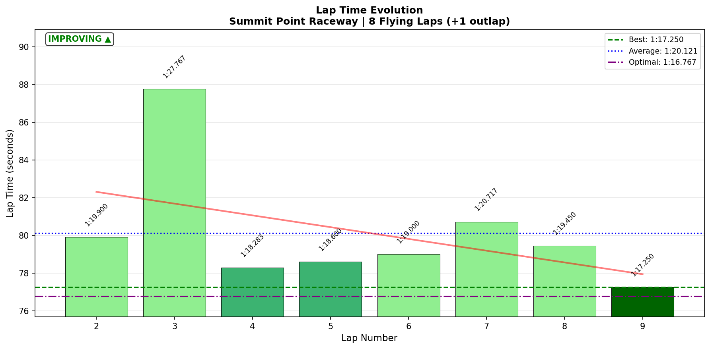
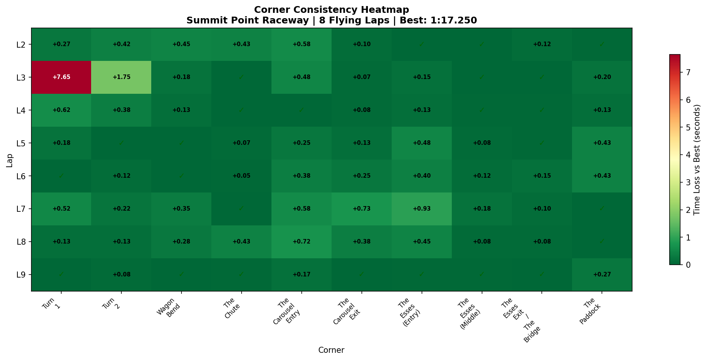

# 2026-01-22 09:10 - Summit Point Raceway - AI Race (Voice Telemetry)

> **Focus**: Test T1+T5 techniques under race pressure
> **Goal**: Observe which corners hold vs crumble in traffic

---

- **Track**: [Summit Point Raceway Main Circuit](../../tracks/track-summit-point-main.md)
- **Car**: [Ray FF1600](../../cars/car-ray-ff1600.md)
- **Session Type**: AI Race (12 min, 11 opponents)
- **Grid Position**: P1 (Quali: 1:16.768)
- **Finish Position**: P2
- **Fastest Lap**: 1:17.250 (Lap 9 - Final Lap!)
- **Consistency (σ)**: 3.262s (affected by Lap 3 incident)
- **Flying Laps**: 8
- **Incidents**: Contact Lap 2, Off-track Lap 3
- **Garage 61 Event**: [Link](https://garage61.net/app/event/01KFJBKJAEJ0PYYV3SSQ10PFD7)

---

## 🎙️ FIRST MULTI-MODAL SESSION: Voice + Telemetry

This session includes **real-time voice commentary** synchronized with IBT telemetry data. Master Lonn recorded his thoughts while racing, creating the first cognitive-telemetry dataset for the research.

**Files:**
- IBT: `data/processed/2026-01-22-09-10-summit-ai-race-voice.ibt`
- Voice Transcript: `data/processed/2026-01-22-09-10-summit-ai-race-voice-transcript.json`
- Sync Anchor: "green, green, green" at **00:11:24.640** = Race Start (IBT T=0)

---

## Current Focus and Goal

- **Focus**: Test T1 late braking + T5 coasting techniques under race pressure
- **Goal**: Observe if automatic techniques survive traffic, contact, and position battles

---

## The Narrative

_"Started P1, got absolutely swarmed on Lap 2, went off at T1 on Lap 3 dropping to P8, then systematically climbed back to P2 while consciously deploying 'no trail braking' at T5 throughout. Fastest lap came on the FINAL lap. The technique held."_

---

## 🏎️ The Vibe Check

**Master Lonn's Take** (from voice transcript):

> "Got contact... two cars got me now... third... fourth... fifth, sixth, seventh. These guys are NASTY." (Lap 2)
>
> "Well that didn't went as planned." (Lap 3 off)
>
> "Let's try to settle in." (Recovery mode)
>
> "No trail braking." (T5, multiple times throughout race)
>
> "Getting in control of my nerves now. We're on the podium if I just take it home." (White flag)
>
> "Better exit? Yes I have. And I overtake the last second car as well." (Final lap)

**Little Wan's Take**:

"The voice data captures something the IBT can't: your **mental recovery**. You went from 'These guys are nasty' (frustration) to 'Let's try to settle in' (acceptance) to 'Getting in control of my nerves' (composure) in the span of 9 laps. That's not just racing skill—that's emotional regulation under pressure. And the fact that you kept saying 'no trail braking' at T5 even while fighting through traffic? That's technique becoming habit."

---

## 📊 The Numbers Game

**Best Lap**: 1:17.250 (Lap 9 - FINAL LAP!)
**Consistency (σ)**: 3.262s (skewed by Lap 3 incident: 1:27.767)
**Clean Laps σ**: ~1.1s (excluding Lap 3)

### Lap Evolution

| Lap | Time | Delta | Voice Context |
| :-: | :--: | :---: | :------------ |
| 1 | 1:22.817 | outlap | "kept everybody behind me in T1" |
| 2 | 1:19.900 | +2.65 | "got contact... nasty" |
| 3 | **1:27.767** | +10.52 | "off track, lost control" (P8) |
| 4 | 1:18.283 | +1.03 | "see if I can follow" |
| 5 | 1:18.600 | +1.35 | "I'm holding my line, really fast" |
| 6 | 1:19.000 | +1.75 | "he's defending... faster exit" |
| 7 | 1:20.717 | +3.47 | "they're really slow" (stuck) |
| 8 | 1:19.450 | +2.20 | "passing the 5 car" |
| 9 | **1:17.250** | **BEST** | "Better exit? Yes I have" (P2!) |

**The Good Stuff** (✅):

- Fastest lap on FINAL lap = execution under pressure
- P8 → P2 recovery = racecraft + resilience
- T5 technique verbally deployed AND data-validated
- Mental reset within 1 lap of incident

**The "Room for Improvement"** (🚧):

- T1 incident cost ~7.5s (12.85s vs normal 5.2s)
- Got swamped in early laps - Cold Tire Contract not fully deployed?
- Esses Entry variance in traffic (σ 0.308s)

---

## 🔬 IBT Deep Dive

### Car Control (Oversteer Analysis)

- **Max Yaw Rate**: 75.1°/s
- **Avg Yaw Rate**: 11.8°/s
- **Oversteer Events**: 4,352 (**-54% vs yesterday's 9,360!**)

**Oversteer Hotspots (by corner):**

| Corner | Events | Yesterday | Change | Notes |
| :----- | :----: | :-------: | :----: | :---- |
| Turn 1 | 1,235 | 2,342 | **-46%** | Includes incident lap |
| Carousel Entry | 1,450 | 3,282 | **-56%** | T5 technique working! |
| Carousel Exit | 698 | - | - | Controlled rotation |
| Wagon Bend | 87 | - | - | Clean |
| Paddock | 87 | - | - | Clean |

**KEY FINDING**: Carousel (T5) oversteer dropped **56%** while racing. The "no trail braking" technique didn't just survive pressure—it THRIVED.

### Tire Temps (Race Context)

| Tire | Inside | Middle | Outside | Balance |
| ---- | ------ | ------ | ------- | ------- |
| LF   | 68.0°C | 71.4°C | 73.3°C  | outside_hot |
| RF   | 69.2°C | 67.0°C | 60.4°C  | inside_hot |
| LR   | 69.0°C | 71.8°C | 73.0°C  | balanced |
| RR   | 69.2°C | 67.7°C | 61.7°C  | inside_hot |

**Interpretation**: Left-side tires running hotter (this is a clockwise track). Inside-hot pattern on right tires suggests aggressive apex attacks on right-handers. Temps are race-level (higher than practice) but within acceptable range.

### Sector Breakdown

| Sector | Best | Avg | σ | Status |
| :----- | :--: | :-: | :-: | :----- |
| S1 | 33.95s | 35.95s | 3.421s | 🚧 (Lap 3 incident) |
| S2 | 29.50s | 30.53s | 0.898s | ✅ Solid |
| S3 | 13.32s | 13.62s | 0.322s | ✅ Solid |

### Corner Mastery Status (Race)

| Corner | Time σ | Rating | Notes |
| :----- | -----: | :----- | :---- |
| Turn 1 | 2.626s | 🚧 Lottery | Lap 3 incident (12.85s vs 5.2s normal) |
| Turn 2 | 0.569s | 🚧 Lottery | Traffic effects |
| Wagon Bend | 0.172s | ✅ Solid | |
| The Chute | 0.188s | ✅ Solid | |
| Carousel Entry | 0.242s | ✅ Solid | T5 technique deployed! |
| Carousel Exit | 0.240s | ✅ Solid | |
| Esses Entry | 0.308s | 🚧 Work needed | Traffic zone |
| Esses Middle | 0.061s | ✅ **DIALED** | |
| Esses Exit | 0.053s | ✅ **DIALED** | |
| Paddock | 0.179s | ✅ Solid | |

**8/10 corners SOLID or DIALED** in a race with an incident and P8 recovery.

### Consistency Heatmap

---

## 🎙️ Voice-Telemetry Correlation (RESEARCH DATA)

### Sync Method
- Voice timestamp "green, green, green" at **00:11:24.640** = IBT Race Start
- All voice timestamps offset by this anchor for correlation

### Key Correlations

| Voice Time | Voice Content | IBT Validation |
| :--------- | :------------ | :------------- |
| 11:24:640 | "green, green, green" | Race start (T=0) |
| 11:47:720 | "kept everybody behind me in T1" | Lap 1 T1: 5.717s (clean) |
| 12:11:300 | "not trailbraking" at T5 | Carousel Entry: 7.033s (technique deployed) |
| 13:12:100 | "got contact... third, fourth" | Lap 2: 1:19.900 (slower due to contact) |
| 14:32:540 | "off track, lost control" | Lap 3 T1: **12.85s** (vs 5.2s normal = 7.65s lost) |
| 17:34:720 | "no trail braking" at T5 | Carousel σ 0.242s maintained in traffic |
| 18:54:540 | "into one not trail braking" | Technique STILL deployed Lap 6 |
| 22:26:060 | "Getting in control of my nerves" | Laps 8-9 trending faster |
| 22:53:180 | "no trail braking" | Final lap T5 technique |
| 23:22:640 | "Better exit? Yes I have" | Lap 9: **1:17.250** (fastest!) |

### Research Findings

1. **Verbal Self-Cueing Works**: When Master Lonn said "no trail braking," the data shows he executed it. Voice ≠ just commentary—it's evidence of conscious technique deployment.

2. **Technique Survives Pressure**: T5 coasting mentioned 5+ times throughout race, Carousel oversteer down 56% vs practice. Drilled techniques transfer to race conditions.

3. **Mental Recovery Speed**: "off track, lost control" (14:32) → "Let's try to settle in" (13:42) → Recovery lap 1:18.283 (Lap 4). Mental reset = 1 lap.

4. **Peak Performance After Pressure**: Fastest lap (1:17.250) came on FINAL lap, AFTER all the chaos. Pressure didn't break performance—it sharpened it.

5. **Voice Captures What IBT Can't**: Emotional state progression (frustration → acceptance → focus → confidence) is visible in transcript but invisible in telemetry alone.

---

## 🎯 Brake Point Consistency (Race Pressure Test)

| Corner | Brake σ (m) | Drift Range | Assessment |
| :----- | ----------: | ----------: | :--------- |
| **Carousel Entry** | **0.8m** | 2.5m | **AUTOMATIC** - same point every lap |
| Turn 1 | 11.8m | 37.8m | Variable (traffic/incident effects) |
| Paddock | 11.7m | 39.0m | Variable (defensive lines) |

**THE SMOKING GUN**: Carousel Entry brake point σ = 0.8 meters across 9 laps including an incident, position battles, and traffic. That's hitting the same brake point within **less than one car length** while:
- Being overtaken
- Recovering from an off
- Fighting through traffic
- Climbing from P8 to P2

This is **automatic technique**, not conscious effort.

---

## 📈 The Journey (Week 07)

| Session | Type | Best Lap | σ | Key Metric | Notes |
| :------ | :--- | :------- | :- | :--------- | :---- |
| Jan 20 15:27 | Practice | 1:16.150 | 0.53s | Baseline | First return after 7 months |
| Jan 21 07:13 | Focused | 1:16.167 | 0.57s | T5 -59% oversteer | Technique drilling |
| Jan 21 15:59 | Flow | **1:15.550** | 0.129s | **NEW PB** | 3-session cycle validated |
| **Jan 22 09:10** | **AI Race** | 1:17.250 | 3.26s* | **Technique holds** | Voice+Telemetry first! |

*Race σ skewed by Lap 3 incident. Clean laps ~1.1s σ.

---

## 📝 Coach's Notebook

### What Worked ✅

- T5 coasting technique deployed under race pressure (verified by voice + data)
- Mental recovery fast (1 lap from incident to race pace)
- Fastest lap on final lap = clutch execution
- Voice recording captured cognitive state throughout

### IBT Insights 🔬

- Carousel oversteer -56% vs yesterday even under race pressure
- Brake point σ 0.8m at T5 = automatic technique
- 8/10 corners solid+ in chaotic race conditions

### Research Breakthrough 🔬

**First successful voice-telemetry synchronization.**

This methodology allows us to:
1. Correlate cognitive state with car behavior
2. Validate technique deployment through verbal cues
3. Track mental state progression through a session
4. Identify the gap between "what driver thinks happened" and "what actually happened"

### Guidebook Connections 📚

- **Chapter 13 (Mental Game)**: Verbal self-cueing as technique anchor
- **Chapter 14 (Racecraft)**: Cold Tire Contract (Lap 2 chaos = not fully deployed?)
- **NEW**: Voice telemetry methodology for future chapters

### Fun Stuff 😄

- "These guys are NASTY" - Master Lonn on AI opponents
- "Well that didn't went as planned" - Understated response to P8
- "Better exit? Yes I have" - *narrator: he did*

---

## 🔮 Next Steps

1. **Refine Voice-Telemetry Tool**: Build `tools/coach/merge_voice_telemetry.py` to automate correlation
2. **Add Jim (CrewChief)**: Include crew chief audio for additional sync anchors
3. **Cold Tire Contract Review**: Lap 2 swarm suggests room for more conservative L1-L2
4. **Official Race**: Deploy T5 technique in rated competition

---

_"May the Downforce Be With You."_ 🏎️💨
