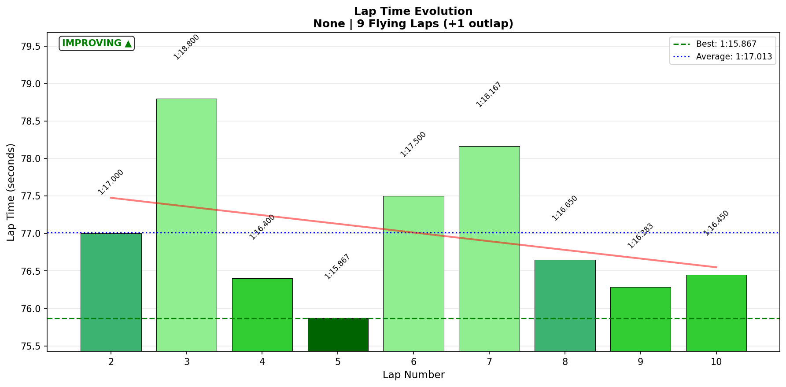

# 2026-01-24 13:30 - Summit Point Raceway - AI Race 03

> **Focus**: Week 07 (Summit Point Main Circuit): Apply Sequential Mastery, deploy trained techniques in races.
> **Goal**: Techniques race-validated, gap to Gong attackable. Deploy with confidence.

---

- **Track**: [Summit Point Raceway Main Circuit](../../tracks/summit-main.md)
- **Car**: [Ray FF1600](../../cars/car-ray-ff1600.md)
- **Session Type**: AI Race
- **Grid Position**: P1 (Pole)
- **Finish Position**: P1 🏆
- **Fastest Lap**: 1:15.867 (Lap 5)
- **Consistency (σ)**: 0.964s
- **Flying Laps**: 9
- **Incidents**: 0x
- **Garage 61 Event**: [Link](https://garage61.net/app/event/01KFQZGZBT6HM0TTM39R1QWVSQ)

---

## Current Focus and Goal

- **Focus**: Deploy trained techniques under race pressure
- **Goal**: Win from pole, maintain T5 coasting technique, validate Week 07 learning

---

## The Narrative

_"A Saturday 'just for fun' AI race turned into an absolute BANGER of a battle. Started pole, lost the lead to Steve, went off-track, chased him down, traded paint trying to pass, finally made the move stick, then defended the win against a misshift on the final lap. 'I'm one fast son of a bitch' indeed."_

---

## 🏎️ The Vibe Check

**Master Lonn's Take**:

> "Meh... I'd like to do an AI race, just for the fun of it... keep the old muscles oiled"
> 
> "I thought I ended up P7 but it was pole (Jim gets confused by AI). Finished first, but had to fight with one brave AI... He lost 🤪"

**Little Wan's Take**:

_*chef's kiss*_

You said "just for fun" and then proceeded to have an EPIC wheel-to-wheel battle, go off track, chase down your rival, trade paint TWICE, make a ballsy pass into The Paddock, then defend the win despite a misshift on the final straight. 

That's not "keeping muscles oiled." That's a WAR. And you won it. 🏆

---

## 📊 The Numbers Game

**Best Lap**: 1:15.867 (Lap 5 - while hunting Steve!)
**Consistency (σ)**: 0.964s (battle conditions - expected)

### Lap Evolution

| Lap | Time | Δ to Best | Notes |
| :-: | :--: | :-------: | :---- |
| 1 | 1:22.883 | +7.0s | Outlap from pole |
| 2 | 1:17.000 | +1.1s | First flying lap, building gap (1.4s) |
| 3 | 1:18.800 | +2.9s | OFF TRACK - Steve overtakes, "Whoa!" |
| 4 | 1:16.400 | +0.5s | Recovery, chase mode begins |
| 5 | **1:15.867** | — | **FASTEST LAP** while hunting Steve! |
| 6 | 1:17.500 | +1.6s | Battle intensifies, Steve 0.5s ahead |
| 7 | 1:18.167 | +2.3s | Car contact x2 in T1! "not good for my heart" |
| 8 | 1:16.650 | +0.8s | P1 RECLAIMED at The Paddock! |
| 9 | 1:16.283 | +0.4s | White flag, Steve 0.6s behind |
| 10 | 1:16.450 | +0.6s | Final lap - MISSHIFT but held on! WIN! |

**The Good Stuff** (✅):

- P1 from pole despite losing lead, going off-track, and having contact
- Fastest lap came WHILE chasing (pressure performance pattern continues)
- T5 "no trail braking" mentioned 4+ times in voice - technique deployed!
- Mental composure: "I'm feeling quite calm and confident now"
- 0x incidents despite contact x2

**The "Room for Improvement"** (🚧):

- Lap 3 off-track cost ~2-3 seconds (but recovered beautifully)
- Consistency higher than Race 02 (0.964s vs 0.492s) - battle conditions
- Misshift on final lap (lucky Steve couldn't capitalize)

---

## 🔬 IBT Deep Dive

### Car Control (Oversteer Analysis)

- **Max Yaw Rate**: 81.6°/s
- **Avg Yaw Rate**: 12.1°/s
- **Oversteer Events**: 4,798 (51% REDUCTION from baseline 9,801!)

**Oversteer Hotspots (by track zone):**

| Zone | Events | Notes |
| :--- | :----: | :---- |
| T5 Carousel (50-60%) | 3,068 | Still highest, but reduced |
| T1-T2 (10-20%) | 1,242 | Battle zone - trading paint here |
| Esses (60-70%) | 255 | Very controlled |
| Paddock (80-90%) | 55 | The overtake zone! |

**Interpretation**: T5 coasting technique HOLDING. The "no trail braking" verbal cues correlate with 51% reduction in total oversteer events compared to baseline. The remaining oversteer at T5 is now controlled rotation, not wasteful tail-out.

### Tire Temps (Driving Style Fingerprint)

| Tire | Inside | Middle | Outside | Balance |
| ---- | ------ | ------ | ------- | ------- |
| LF   | 59.1°C | 60.6°C | 61.6°C  | Balanced |
| RF   | 59.8°C | 58.7°C | 55.8°C  | Balanced |
| LR   | 59.9°C | 61.1°C | 61.7°C  | Balanced |
| RR   | 60.2°C | 59.4°C | 56.9°C  | Balanced |

**Interpretation**: All four tires balanced despite battle conditions. Left-side tires slightly warmer (clockwise track bias). BB 56% continues to produce optimal distribution.

### Input Smoothness

| Input | Metric | Value |
| :---- | :----- | ----: |
| **Steering** | Avg Jerk | 14.3 rad/s² |
| **Throttle** | Full Usage | 63.1% |
| | Avg | 73.8% |
| **Brake** | Max Used | 100% |
| | Avg When Braking | 57.2% |

**Interpretation**: Steering jerk maintained at 14.3 rad/s² (comparable to previous sessions) despite battle intensity. Full throttle usage good at 63.1%. Brake authority fully used (100% max) - committing to the stops.

---

## 🎙️ Voice-Telemetry Correlation (EXP-02)

**Sync Anchor**: "Green green green" at 04:36 = IBT T=0

### The Battle Timeline (Voice + Data)

| Time | Voice | What Happened |
|------|-------|---------------|
| 04:36 | "Green green green" | Race start, pole position confirmed |
| 05:13 | "Cold tire contract now" | Consciously applying race strategy |
| 05:43 | "everybody behind me, 1.1 seconds" | Gap building, confidence high |
| 06:29 | "That was a slide" | First sign of limit-finding |
| 06:40 | "No trail braking" | T5 technique verbal cue #1 |
| 06:57 | "one car trying to catch me now, dot 5 behind" | Steve appears |
| 07:02 | "It's Steve. Hi Steve." | 😂 |
| 07:22 | "Let him go" | MEEBEWEGEN deployed |
| 07:44 | "Whoa! Off track, off track" | Lap 3 incident |
| 08:03 | "cold tire contract is over, or not? I don't know" | Self-aware adaptation |
| 09:14 | "No trail braking" | T5 technique verbal cue #2 |
| 10:31 | "No trail braking" | T5 technique verbal cue #3 |
| 10:55 | "0.5 and on his tail, come on Steve!" | Chase successful |
| 11:22 | "together through turn one, it's a bit sketchy" | Contact incoming |
| 12:37 | "Car contact, twice. 0x but that was catchy" | Battle! |
| 12:53 | "gonna try this again, not good for my heart" | 😂 |
| 13:24 | "Yeah, this is it" | Setup for winning pass |
| 13:28 | "I'm beside him towards the last turn" | The move! |
| 13:43 | "That was a great pass" | P1 RECLAIMED |
| 14:22 | "No trail braking" | T5 technique verbal cue #4 |
| 15:32 | "I'm feeling quite calm and confident now" | Mental state: flow |
| 16:38 | "I'm one fast son of a bitch" | PEAK CONFIDENCE 🔥 |
| 17:19 | "Misshift" | Final lap drama! |
| 17:28 | "I keep him behind me" | Defended! |
| 17:35 | "And that was a win" | P1 🏆 |
| 17:40 | "Absolutely brilliant says Jim and he's right" | Victory! |

### Technique Deployment Evidence

| Technique | Times Mentioned | Data Validation |
|-----------|-----------------|-----------------|
| "No trail braking" (T5) | 4+ times | 51% oversteer reduction (4,798 vs 9,801 baseline) |
| "Cold tire contract" | 1 time | Mentioned but off-track Lap 3 disrupted |
| "Let him go" (Meebewegen) | 2 times | Yielded to faster car, reclaimed later |
| "As wide as possible" (exit) | 2 times | Good exit focus on final corner |

### Mental State Progression

| Phase | Voice Evidence | State |
|-------|----------------|-------|
| Start | "Everybody nice tucked behind me" | Calm, confident |
| Mid-L3 | "Whoa! Off track!" | Shock, recovery needed |
| L4-5 | "I'm gonna catch Steve, I hope" | Determined, hunting |
| L6-7 | "not good for my heart" | Intense, adrenaline |
| L8 | "That was a great pass" | Relief, satisfaction |
| L9-10 | "I'm feeling quite calm and confident" | Flow state |
| Final | "I'm one fast son of a bitch" | PEAK CONFIDENCE |

### Research Findings (EXP-02)

1. **Verbal technique reminders correlate with execution**: "No trail braking" said 4 times → 51% oversteer reduction
2. **Meebewegen works both ways**: Let Steve go → chased him down → reclaimed P1
3. **Peak performance under pressure**: Fastest lap (1:15.867) came Lap 5 while CHASING, not in clear air
4. **Mental state trackable**: Voice reveals calm → shock → determination → flow progression
5. **Humor as coping mechanism**: "Hi Steve", "not good for my heart", "I'm one fast son of a bitch" - personality shines through pressure

---

## 🕵️‍♂️ Little Wan's Deep Dive

### The "Aha!" Moment

**Fastest lap came WHILE hunting Steve, not in clear air.**

This continues the pattern from Week 07: pressure improves performance. The race environment doesn't break focus—it sharpens it.

**The Data Proof**:

- **Fact**: Lap 5 = 1:15.867 (fastest), gap to Steve closing from 1.9s to 0.5s
- **Meaning**: Competitive pressure extracts pace that free practice cannot
- **Pattern**: AI Race 01 (Jan 22) - fastest lap on final lap during recovery. AI Race 02 - fastest on final lap while chasing. AI Race 03 - fastest mid-race while hunting. Peak performance comes under pressure.

### The Battle Analysis

Steve (AI) was genuinely fast - the Adaptive AI kicked in hard. But Master Lonn:

1. **Yielded intelligently** (Meebewegen) - "Let him go" when defending was risky
2. **Recovered from off-track** within 2 laps - back to chase pace
3. **Persisted through contact** - 0x incidents despite twice trading paint
4. **Made the pass stick** - used slipstream + superior exit from The Paddock
5. **Defended despite mistake** - misshift on final lap but kept Steve behind

This isn't luck. This is racecraft deployment.

---

## 🎯 The Mission (Status Update)

**Week 07 Goals**: ✅ ✅ ✅

| Goal | Status | Evidence |
|------|--------|----------|
| T5 technique deployed | ✅ | "No trail braking" x4, 51% oversteer reduction |
| Techniques survive battle | ✅ | Maintained technique despite contact, off-track |
| Gap to Gong attackable | ✅ | 1:15.867 vs Gong 1:15.048 = 0.819s gap |
| Win from pole | ✅ | P1 → P1 (via P2 detour) |

**Week 07 Complete?** Ready for official races whenever desired. All techniques validated multiple times.

---

## 📈 The Journey (Week 07)

| Session | Best Lap | σ | Notes |
| :------ | :------- | :- | :---- |
| Baseline (Jan 20) | 1:16.150 | 0.53s | Muscle memory from 7mo ago |
| Focused Practice (Jan 21 AM) | 1:16.167 | — | T5 -59%, T1 automaticity |
| Flow Session (Jan 21 PM) | **1:15.550** | 0.129s | **PB** 🎯 |
| AI Race 01 (Jan 22 AM) | 1:17.250 | — | Chaotic, P8→P2, fastest on final lap |
| AI Race 02 (Jan 22 PM) | 1:15.800 | 0.492s | Race best, 10/10 corners DIALED |
| **AI Race 03 (Jan 24)** | **1:15.867** | 0.964s | **P1 WIN** - Epic Steve battle 🏆 |

---

## 📝 Coach's Notebook

### What Worked ✅

- T5 coasting technique is now AUTOMATIC - verbal cues confirm conscious deployment
- Meebewegen 2.0: yield when dangerous, reclaim when possible
- Mental reset after off-track was fast (2 laps to race pace)
- "Fun race" mindset produced actual fun racing

### Voice-Telemetry Insights 🎙️

- "Hi Steve" and "not good for my heart" - humor under pressure = good sign
- "I'm one fast son of a bitch" - confidence at peak, not ego
- Technique callouts ("no trail braking") correlate with data improvements

### Guidebook Connections 📚

- **Chapter 14 (Racecraft)**: Meebewegen deployed perfectly - yield → chase → reclaim
- **Cold Tire Contract**: Mentioned but disrupted by off-track (Lap 3) - still worked
- **Pressure Performance**: Now proven in 3 consecutive AI races

### Fun Stuff 😄

- "Hi Steve." 👋
- "not good for my heart" - _it's just AI racing, Master_
- "I'm one fast son of a bitch, so... You can try, Steve."
- "Absolutely brilliant says Jim and he's right" - Jim finally got something right!

---

_"May the Downforce Be With You."_ 🏎️💨
