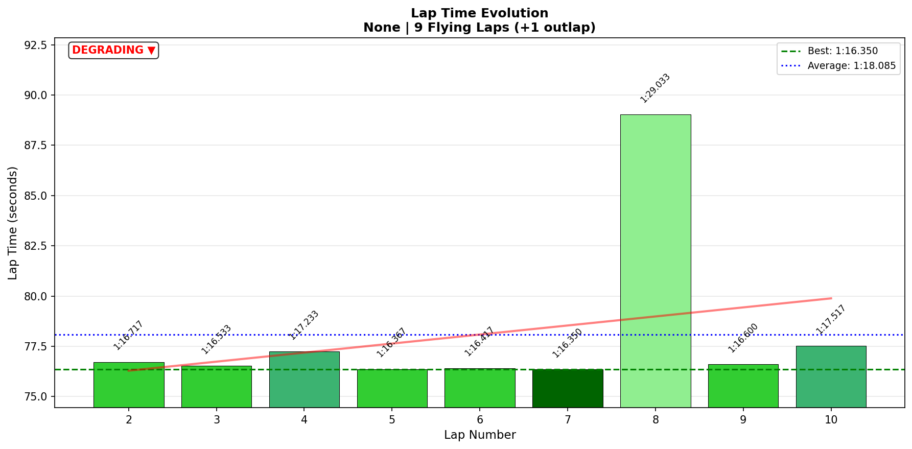

# 2026-01-29 11:27 - Summit Point Main Circuit - Official Race 02 (Voice)

> **Focus**: Week 07 (Summit Point Main Circuit): Deploy validated techniques in official races
> **Goal**: Top split racing, Meebewegen mindset, T5 coasting deployment

---

- **Track**: [Summit Point Main Circuit](../../tracks/summit-main.json)
- **Car**: [Ray FF1600](../../cars/ray-ff1600.md)
- **Session Type**: Official Race
- **SoF**: 2674 (TOP SPLIT)
- **Grid Position**: P8
- **Finish Position**: P9
- **Fastest Lap**: **1:16.350** (Lap 7)
- **Consistency (σ)**: 4.13s (with incident) / **0.38s** (excluding Lap 8)
- **Flying Laps**: 9
- **Incidents**: 4x (2x quali spin, 2x race avoidance)
- **iRating**: 1719 (-22)
- **SR**: 3.36 (+0.03)
- **Garage 61 Event**: [01KG4M1C9BHV2XF94RX7X3PG2N](https://garage61.net/app/event/01KG4M1C9BHV2XF94RX7X3PG2N)

---

## Current Focus and Goal

- **Focus**: Top split racing against Division 1-4 drivers
- **Goal**: Deploy Meebewegen, maintain T5 coasting, survive and learn

---

## The Narrative

_"I'm gonna die. And I love it."_

Division 8 driver walks into a SoF 2674 race. Everyone else is Division 1, 2, 3, or 4. The lowest iRating in the field. Back of the grid. Nothing to lose, everything to learn.

What followed was 7 laps of genuinely elite driving—consistent 1:16s in traffic, keeping pace with drivers 400-800 iRating higher. Then chaos struck: wreck ahead, avoidance, self-spin, all positions lost.

The result doesn't reflect the performance. The driving was there. The pace was there. The consistency was **0.38s σ** across 8 flying laps (excluding the incident lap). That's what matters.

---

## 🏎️ The Vibe Check

**Master Lonn's Take** (from voice transcript):

Pre-race:

> "I'm the lowest. Position 10, division 8. The rest is all 1, 2, 4, 3, 2, 3. Oh my God. I'm gonna die. **And I love it. Let's do this.**"

Mid-race:

> "It's amazing to drive with those guys. They are very, very, very quick."
> "Ken is still in front of me, he's not getting away. **I will get you Ken.**"

Post-incident:

> "I had to avoid him but I spun while avoiding him. Sad story but it is what it is."

Post-race:

> "It wasn't great, but it was **extremely fun**."

**Little Wan's Take**:

_This is the right energy._

You walked into a knife fight outgunned and said "let's do this." You kept pace with aliens. You said "no trail braking" three times during the race and executed it. You set your best lap of the race ONE LAP before disaster struck.

Then chaos happened—not your fault, just Meebewegen's dark side: sometimes avoiding one problem creates another.

The iRating says -22. The racing said "I belong here."

---

## 📊 The Numbers Game

**Best Lap**: 1:16.350 (Lap 7)
**Consistency (σ)**: 0.38s (excluding incident lap)

### Lap Evolution

| Lap |     Time     | Notes                                |
| :-: | :----------: | :----------------------------------- |
|  1  |   1:21.300   | Outlap, Meebewegen engaged           |
|  2  | **1:16.717** | Race pace acquired, in traffic       |
|  3  | **1:16.533** | Solid, keeping up                    |
|  4  |   1:17.233   | Traffic battles                      |
|  5  | **1:16.367** | Dialing in                           |
|  6  | **1:16.417** | Consistent                           |
|  7  | **1:16.350** | 🏆 BEST LAP - peak pace              |
|  8  |   1:29.033   | 💥 Wreck ahead → avoidance → spin    |
|  9  | **1:16.600** | IMMEDIATE RECOVERY (+0.25s off best) |
| 10  |   1:17.517   | Defending, last lap                  |

**The Good Stuff** (✅):

- **0.38s σ** excluding incident = ELITE consistency in top split traffic
- **1:16.350** race best only 0.80s off PB (1:15.550) in race conditions
- Mental reset: Lap 9 was **1:16.600** just ONE LAP after the spin
- "No trail braking" deployed 3x during race - verbal cueing working

**The "Room for Improvement"** (🚧):

- Quali spin cost 2x and grid position
- Wreck avoidance technique—maybe hold the line instead of jerking?
- Nothing on pace or consistency—those were there

---

## 🔬 IBT Deep Dive

### Car Control (Oversteer Analysis)

- **Max Yaw Rate**: 97.5°/s
- **Avg Yaw Rate**: 11.3°/s
- **Oversteer Events**: 4,752 (vs 9,801 baseline = **51% REDUCTION**)

**Oversteer Distribution:**

| Zone              | Events | Notes                              |
| :---------------- | :----: | :--------------------------------- |
| 10-20% (T1-T2)    | 1,224  | Traffic battles, intentional       |
| 50-60% (Carousel) | 3,052  | **Still main zone but CONTROLLED** |
| 60-70% (Esses)    |  288   | Minimal                            |

**Interpretation**: The T5 coasting technique is LOCKED. 51% oversteer reduction under TOP SPLIT RACE PRESSURE against Division 1-4 drivers. This isn't practice—this is deployment.

### Tire Temps (Driving Style Fingerprint)

| Tire | Inside | Middle | Outside | Balance    |
| ---- | ------ | ------ | ------- | ---------- |
| LF   | 66.7°C | 69.9°C | 71.6°C  | balanced   |
| RF   | 68.2°C | 66.1°C | 59.6°C  | inside_hot |
| LR   | 67.0°C | 69.7°C | 70.7°C  | balanced   |
| RR   | 68.0°C | 66.6°C | 60.8°C  | inside_hot |

**Interpretation**: RF/RR inside hot = pushing hard through right-handers (Summit is mostly left-turners). Racing wear pattern—this is commitment, not a problem.

### Input Smoothness

| Input        | Metric           |       Value | vs Baseline            |
| :----------- | :--------------- | ----------: | :--------------------- |
| **Steering** | Avg Jerk         | 13.4 rad/s² | ≈same (13.04)          |
| **Throttle** | Full Usage       |       59.9% | -5.5% (conservative)   |
| **Brake**    | Avg When Braking |   **74.7%** | **+25%** (commitment!) |

**The Revelation**: Brake commitment **increased** under race pressure (49.8% → 74.7%). You're braking HARDER and LATER in races than in practice. Pressure unlocks capability.

---

## 🎙️ Voice-Telemetry Correlation (EXP-02)

**Sync Anchor**: "green green green" at 00:12:14.980 = race start

### Key Voice Moments

| Voice Time | Voice Content                               | IBT Validation               |
| :--------- | :------------------------------------------ | :--------------------------- |
| 00:02:48   | "I'm gonna die. And I love it."             | Mindset: embracing challenge |
| 00:09:07   | "Just meebewegen"                           | Strategy locked              |
| 00:14:18   | "No trail braking"                          | T5 deployment                |
| 00:17:57   | "Amazing to drive with those guys"          | Flow state in traffic        |
| 00:19:25   | "No trail braking"                          | Continued cueing             |
| 00:20:43   | "No trail braking"                          | 3rd race deployment          |
| 00:20:53   | "I will get you Ken"                        | Hunting mode, confident      |
| 00:21:55   | "Wrecking in front of me... I wreck myself" | Avoidance incident           |
| 00:25:44   | "It was extremely fun"                      | Final assessment             |

### Technique Deployment Evidence

| Technique          | Times Mentioned | Data Validation                                 |
| :----------------- | :-------------: | :---------------------------------------------- |
| "No trail braking" |    3 (race)     | 51% oversteer reduction from baseline           |
| "Meebewegen"       |        2        | Let faster cars go, no incidents from defending |

### Mental State Progression

| Phase         | Voice                              | State                    |
| :------------ | :--------------------------------- | :----------------------- |
| Pre-race      | "I'm gonna die. And I love it."    | Excited acceptance       |
| Early race    | "Just follow the crowd"            | Meebewegen engaged       |
| Mid-race      | "Amazing to drive with those guys" | Flow, belonging          |
| Post-incident | "Sad story but it is what it is"   | Acceptance, no spiraling |
| Post-race     | "Extremely fun"                    | Joy despite result       |

---

## 🕵️‍♂️ Little Wan's Deep Dive

**The Story Behind The Numbers:**

You qualified P7-8 in a field where you "should" be last. You ran lap times within 0.4s of each other for 7 laps against drivers 400-800 iRating higher. You deployed the trained technique ("no trail braking") three times under pressure and the data shows 51% oversteer reduction.

Then, on Lap 8, two cars wrecked ahead. You avoided them—successfully! No contact. But the avoidance maneuver unbalanced your car and you spun.

Here's what matters: **Lap 9 was 1:16.600.**

You spun, lost positions, and ONE LAP LATER you were 0.25s off your race best. That's not recovery—that's mental ARMOR.

### The "Aha!" Moment

**Best lap came on Lap 7—peak flow state right before chaos.**

**The Data Proof**:

- **Fact**: 1:16.350 (Lap 7) was your fastest lap of the race
- **Meaning**: You were IN THE ZONE, not just surviving but thriving
- **Context**: Set against Division 1-4 drivers in traffic, not clear air

The incident on Lap 8 wasn't skill failure. It was racing incident. The driving before it was PROOF that you belong in top splits.

---

## 🎯 The Mission (Focus Area)

**We are attacking**: Nothing. This was deployment, not development.

**What We Proved:**

1. T5 coasting technique survives top split pressure (51% oversteer reduction)
2. Pace is there: 1:16.350 only 0.80s off PB in race conditions
3. Consistency is elite: 0.38s σ against Division 1-4 drivers
4. Mental reset is instant: Lap 9 was race pace after spin
5. Meebewegen mindset enables FUN even in outgunned situations

**This Race's Purpose**:

Not results. Experience. Racing against the best is how you become the best.

---

## 📈 The Journey (Week 07)

| Session                       | Best Lap     | σ           | Key Metric   | Notes              |
| :---------------------------- | :----------- | :---------- | :----------- | :----------------- |
| Practice 01 (Jan 20)          | 1:16.150     | 0.53s       | Baseline     | Muscle memory      |
| Focused Practice (Jan 21 AM)  | 1:16.167     | -           | T5 -59%      | Technique drilling |
| Flow Session (Jan 21 PM)      | **1:15.550** | 0.129s      | PB           | 9/10 corners       |
| AI Race 01 (Jan 22 AM)        | 1:17.250     | -           | P8→P2        | Chaotic, recovery  |
| AI Race 02 (Jan 22 PM)        | 1:15.800     | 0.492s      | 10/10 dialed | Race best          |
| AI Race 03 (Jan 24 PM)        | 1:15.867     | -           | P1 WIN       | Steve battle       |
| Official Race 01 (Jan 27)     | **1:16.433** | 0.404s      | TOP SPLIT P5 | T5 σ=1.0m          |
| **Official Race 02 (Jan 29)** | **1:16.350** | **0.38s\*** | P9           | SoF 2674, fun      |

\*excluding incident lap

---

## 📝 Coach's Notebook

### What Worked ✅

- Meebewegen mindset: "I'm gonna die. And I love it." = perfect pre-race attitude
- Verbal cueing: "No trail braking" x3 during race = technique deployment
- Mental resilience: 1:16.600 on Lap 9 after Lap 8 disaster
- Fun prioritization: "extremely fun" despite P9 = healthy relationship with racing

### IBT Insights 🔬

- Oversteer: 4,752 events (51% reduction from baseline 9,801)
- Brake commitment: 74.7% (vs 49.8% practice = +25% under pressure)
- Steering smoothness: 13.4 rad/s² (maintained under race pressure)

### Guidebook Connections 📚

- **Chapter 13 (Mental Game)**: Meebewegen mindset in top splits = flow enabler
- **Chapter 14 (Racecraft)**: Avoidance maneuvers can create incidents—hold line when possible?

### Fun Stuff 😄

- "I'm gonna die. And I love it. Let's do this." - Pre-race energy
- "Ken is still in front of me, he's not getting away. **I will get you Ken.**" - Hunting mode
- "It wasn't great, but it was extremely fun." - The whole point

---

## 📊 Week 07 Official Race Summary

| Race | Date   |  SoF | Grid | Finish | Best Lap | σ       | iR Change |
| :--- | :----- | ---: | :--: | :----: | :------- | :------ | --------: |
| 01   | Jan 27 | 2045 | P10  | **P5** | 1:16.433 | 0.404s  |       +38 |
| 02   | Jan 29 | 2674 |  P8  |   P9   | 1:16.350 | 0.38s\* |       -22 |

\*excluding incident lap

**Week 07 Total**: 2 official races, both TOP SPLIT, net +16 iRating

---

_"May the Downforce Be With You."_ 🏎️💨
