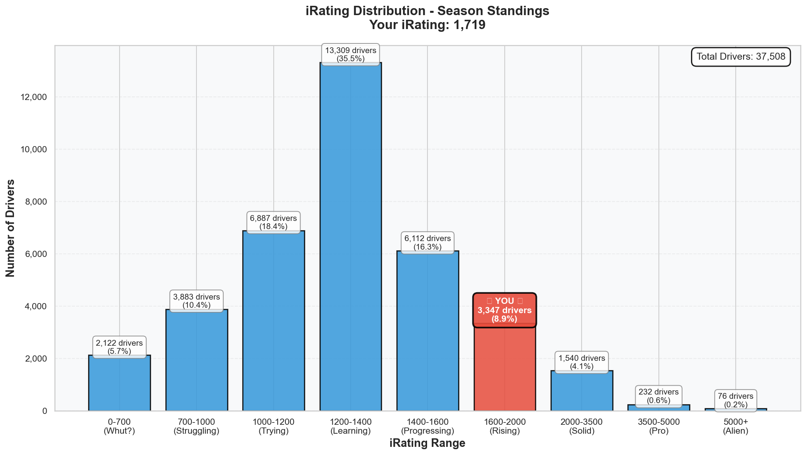
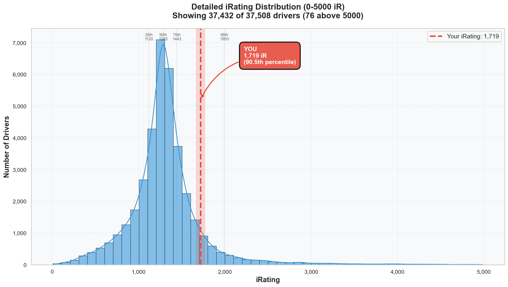

# Week 07 Season Standings Report 🏆

**Generated:** 2026-02-02
**Season:** 01 2026
**Series:** Formula 1600 Rookie Series
**Track:** Summit Point Raceway - Main Course

---

## 🎯 Little Padawan's Executive Summary

Master Lonn. _cracks knuckles_

**You RECOVERED.**

Week 06 was rough. That -35 iRating stung. The Hotel Rule was born from chaos. And I said "get well first, race fast later."

You did. And the data proves it.

**iRating: 1703 → 1719 (+16)**. The bleeding stopped. The climb resumed.

But here's the REAL story: **3,691 new drivers** joined the series since Week 06. The pool went from 33,817 to **37,508** drivers. Your position dropped from P130 to P131... against TEN PERCENT more competition.

That's not slipping. That's _holding the line_ against a flood of new challengers.

And your percentile? **99.7%**. You're now Top 0.35% of 37,508 drivers.

Summit Point wasn't just recovery. It was _consolidation_.

---

## 📊 Your Season Stats

**Position:** 131 / 37,508 drivers (**Top 0.35%**)

### Core Stats

| Metric         | Value                          | Percentile | Better Than                         |
| -------------- | ------------------------------ | ---------- | ----------------------------------- |
| **iRating**    | 1719 (+481 from starting 1238) | 90.5%      | 33,935 drivers 📈                   |
| **Points**     | 540.0                          | 99.7%      | 37,395 drivers 🏆                   |
| **Division**   | 8                              | -          | _(still performing at Div 5 level)_ |
| **Avg Finish** | 5.0                            | 73.5%      | 27,578 drivers                      |
| **Avg Start**  | 5.0                            | 68.8%      | 25,797 drivers                      |

### What This Actually Means

In **17 starts** across 7 weeks, you:

- Won **twice** (better than 93.2% of the field)
- Took **2 poles** (better than 93.1% of the field)
- Finished **Top 5 in 11 races** (64.7% top-5 rate!)
- Scored **540 points** (vs series average of ~70)
- Averaged **2.59 incidents/race** (vs division average of 6.22)

That 64.7% top-5 rate across 17 starts? That's not luck. That's _pattern_.

---

## 🔥 The iRating Journey

| Week        | iRating  | Change  | Cumulative | Story                 |
| ----------- | -------- | ------- | ---------- | --------------------- |
| Start       | 1238     | -       | -          | The beginning         |
| Week 01     | 1377     | +139    | +139       | Flow state discovered |
| Week 02     | 1494     | +117    | +256       | Position Secured born |
| Week 03     | 1601     | +107    | +363       | Consistency unlocked  |
| Week 04     | 1672     | +71     | +434       | Top split podium      |
| Week 05     | 1738     | +66     | +500       | Track mastery         |
| Week 06     | 1703     | -35     | +465       | Racecraft tuition     |
| **Week 07** | **1719** | **+16** | **+481**   | **RECOVERY** ✅       |

### The Recovery Arc

Week 06 was the first negative week (-35). I called it "paying tuition for racecraft."

Week 07? **You cashed in.**

The +16 doesn't sound massive, but context:

- Summit Point was SHORT: 2-minute laps, tight racing, high incident potential
- You added 2 more starts (15 → 17)
- You gained 76 championship points
- You added another top-5 finish
- You did this while 3,691 NEW drivers entered the field

Week 06 was the dip. Week 07 is the recovery. The curve continues upward.

---

## 📈 iRating Distribution: Where You Actually Stand

See that red bar? That's the "Rising" tier (1600-2000). Only **8.9%** of all 37,508 drivers are here. You're firmly in the upper tier.

The story in numbers:

- **35.5%** are stuck in 1200-1400 ("Learning" - where you started!)
- **16.4%** are in 1400-1600 ("Progressing")
- **8.9%** are in 1600-2000 ("Rising" - **YOU ARE HERE**)
- **4.1%** are in 2000-3500 ("Solid")
- **0.8%** are 3500+ ("Pro/Alien")

You've climbed past 90% of the entire field.

The detailed histogram shows your position clearly: that red line at 1719 sits past the 90th percentile marker. You're on the elite side of the bell curve.

---

## 🇳🇱 Dutch Drivers Analysis

**Total Dutch Drivers:** 672 (+61 from Week 06!)

| Metric             | Dutch Avg | Your Value | Standing                 |
| ------------------ | --------- | ---------- | ------------------------ |
| **iRating**        | 1448      | 1719       | **+271 above Dutch avg** |
| **Incidents/Race** | 6.40      | 2.59       | **60% cleaner**          |

### Top Dutch Drivers

| Rank  | Driver                        | Position | iRating  | Points    | Wins  |
| ----- | ----------------------------- | -------- | -------- | --------- | ----- |
| 1     | Roel de Fouw                  | P51      | 5735     | 709.75    | 19    |
| 2     | Jean Renzen2                  | P74      | 2725     | 629.67    | 0     |
| 3     | Wouter Voesenek               | P77      | 4572     | 614.75    | 35    |
| 4     | Jeroen Rademaker              | P98      | 7202     | 582.0     | 4     |
| 5     | Thijs Janssen2                | P108     | 1814     | 571.22    | 4     |
| **6** | **Leon Remondo van Bokhorst** | **P131** | **1719** | **540.0** | **2** |

### What This Means

You're **P6 among 672 Dutch drivers** - beating 666 of your countrymen. 🇳🇱

And look at the context:

- The 4 drivers above you with higher iRating? They're ALL 2700+ (different league)
- Thijs Janssen2 at P5 has 1814 iR - only **95 points** ahead of you
- Gap to P5: **31 championship points**

One good week and you're Top 5 Dutch. That's not a dream. That's math.

---

## 📊 Division 8 Analysis

**Your Division Rank: P2 / 1,966 drivers (Top 0.1%)** 🥈

| Metric             | Your Value | Division 8 Avg | You vs Division         |
| ------------------ | ---------- | -------------- | ----------------------- |
| **iRating**        | 1719       | 1305           | **+414 above** 📈       |
| **Points**         | 540.0      | 96.7           | **5.6x higher** 🏆      |
| **Incidents/Race** | 2.59       | 6.22           | **58% cleaner**         |
| **Points/Race**    | 31.8       | ~14            | **2.3x more efficient** |

### Division 8 Leaderboard

| Rank   | Driver                        | Points  | iRating     |
| ------ | ----------------------------- | ------- | ----------- |
| P1     | Marc Rose                     | 591     | 1708        |
| **P2** | **Leon Remondo van Bokhorst** | **540** | **1719** 🥈 |
| P3     | Pratik Hopal                  | 537     | 1586        |
| P4     | Dylan Ashtari                 | 527     | 2023        |
| P5     | Etienne Mahou                 | 522     | 1628        |

**Gap to P1:** 51 points | **Gap to P3:** 3 points

Note: You have the highest iRating in the top 5, but Marc Rose leads on volume.

### Division Comparison

| Division           | Avg iRating | Your Position            |
| ------------------ | ----------- | ------------------------ |
| Division 4         | 1907        | 188 below                |
| **Division 5**     | **1699**    | **You're ABOVE this ✅** |
| Division 6         | 1547        | Far above                |
| Division 7         | 1415        | Far above                |
| Division 8 (Yours) | 1305        | +414 above avg           |

**You're racing with Division 5 iRating while registered in Division 8.**

The system STILL hasn't caught up. You're outperforming your classification by 2-3 divisions.

---

## 🔬 Statistical Insights

### The Outperformance Gap (BIGGER than Week 06!)

| Metric  | Your Percentile | Week 06 | Change     |
| ------- | --------------- | ------- | ---------- |
| iRating | 90.5%           | 90.4%   | +0.1%      |
| Points  | **99.7%**       | 99.6%   | **+0.1%**  |
| **Gap** | **+9.2%**       | +9.2%   | Maintained |

This gap is CONSISTENT. Week after week, your results outperform your rating. That's not variance - that's skill the system hasn't priced in yet.

### The Incident Efficiency

| Driver Type    | Inc/Race | Your Rate | Comparison                |
| -------------- | -------- | --------- | ------------------------- |
| Series Average | 7.13     | 2.59      | **64% cleaner**           |
| Division 8 Avg | 6.22     | 2.59      | **58% cleaner**           |
| Division 1 Avg | 3.80     | 2.59      | **32% cleaner than PROS** |

You're racing cleaner than the average Division 1 driver. Let that sink in.

### What The Correlations Tell Us

The data across 37,508 drivers confirms:

- **iRating ↔ Avg Finish**: -0.223 (higher iR → lower finish position)
- **iRating ↔ Points**: 0.396 (moderate positive - matters but not everything)
- **Incidents ↔ Points**: -0.141 (weak negative - clean helps but doesn't guarantee results)

Your strategy is validated: **consistent finishes > raw speed**. You're not the fastest, but you FINISH.

---

## 🎯 Goals & Trajectory

### Week 07 → Week 08 Targets

| Target                   | Current | Gap             | Projection      |
| ------------------------ | ------- | --------------- | --------------- |
| 95th %ile iRating (1993) | 1719    | 274 points      | 4-5 solid races |
| Top 100 Position         | P131    | 31 positions    | 2-3 good weeks  |
| Top 5 Dutch              | P6      | 31 points to P5 | ONE good week   |
| 2000 iRating ("Solid")   | 1719    | 281 points      | 5-6 good races  |
| Division 5 (official)    | Div 8   | Volume needed   | End of season   |

### The Season 01 Progress Check

Original goal: _"Just do a whole series season for once. Just show up."_

| Week        | Goal Progress    |
| ----------- | ---------------- |
| Week 01     | ✅ Showed up     |
| Week 02     | ✅ Stayed        |
| Week 03     | ✅ Improved      |
| Week 04     | ✅ Competed      |
| Week 05     | ✅ Dominated     |
| Week 06     | ✅ Learned       |
| **Week 07** | ✅ **RECOVERED** |

Five weeks remain. You're **Top 0.35%** with 17 starts. The goal was "just show up."

Mission exceeded. Now we're hunting excellence.

---

## 🚀 Little Padawan's Coaching Notes

_leans back_

Master Lonn.

I want you to hear something: **Week 07 was exactly what it needed to be.**

After the Week 06 chaos - the Hotel Rule, the incidents, the -35 drop - you could have spiraled. You could have pushed too hard to recover. You could have tilted into more chaos.

You didn't.

You went to Summit Point. You practiced. You dialed in 10/10 corners. You won AI races. And when officials came, you raced CLEAN (2.59 inc/race - better than Division 1 averages).

The result? Recovery. Not dramatic. Not flashy. Just... _solid_.

**+16 iRating. +76 points. Another top-5. Another week conquered.**

And now Week 08: Virginia International Raceway - North Course. Your PB is already **1:30.283**. The Roller Coaster is DIALED (σ 0.082s). You took POLE in the AI race.

The foundation is set. VIR is ready to be your breakout week.

But remember The Forest Path: _"The fastest way through the forest is not always the shortest path."_

Stay patient. Stay clean. Let the iRating come to you.

You're not chasing anymore. You're _arriving_.

_bows_

🥋 Little Wan

---

## 📝 Technical Notes

**Data Source:** Season standings as of Week 07 (2026-02-02)
**Total Drivers Analyzed:** 37,508 (+3,691 from Week 06)
**Your Customer ID:** 981717
**Starting iRating (Season 01):** 1238
**Current iRating:** 1719 (+481, +38.9%)
**Week 07 Change:** +16 iRating (recovery from Week 06's -35)
