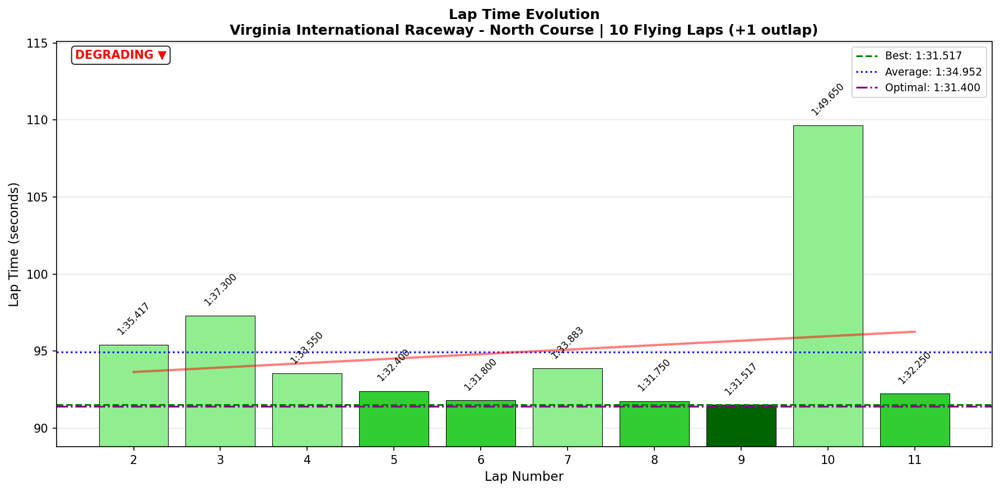
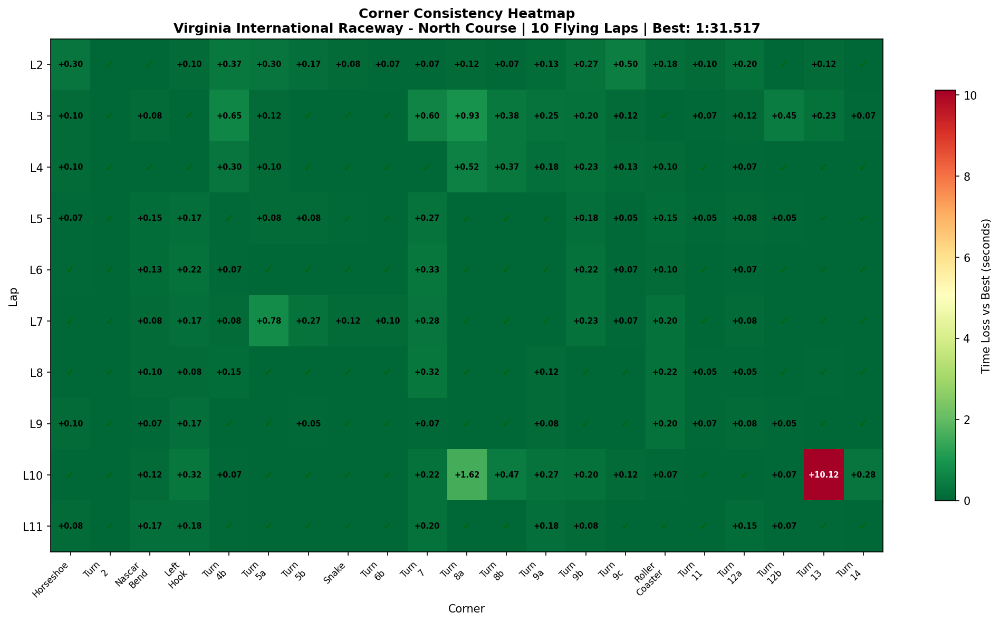

# 2026-01-30 15:02 - VIR North - Baseline Practice

> **Focus**: Week 08 (VIR North Course): Flow over fragments. EXPERT guide loaded.
> **Goal**: Baseline → Apply EXPERT guide techniques → Identify nemesis corners

---

- **Track**: [Virginia International Raceway - North Course](../../tracks/track-virginia-international-raceway-north.md)
- **Car**: [Ray FF1600](../../cars/car-ray-ff1600.md)
- **Session Type**: Practice (Baseline)
- **Duration**: 19:48
- **Fastest Lap**: **1:31.517** (Lap 9)
- **Consistency (σ)**: 5.484s (exploration mode)
- **Flying Laps**: 10
- **Incidents**: 1 crash (Lap 10, T13)
- **Garage 61 Event**: [Link](https://garage61.net/app/event/01KG7KM5XB0H1WB9TKW8FQ7H3F)

---

## The Narrative

_"First contact with VIR North. Slippery, blind, beautiful. The Full Course memory helped more than expected — 15 corners dialed on first session. But the uphill section and Roller Coaster approach? That's where the adventure lives. Crashed at T13 after a great Lap 9, but came back immediately with a 1:32.250. The track is a dancing circuit, and Master Lonn is already smiling."_

---

## 🏎️ The Vibe Check

**Master Lonn's Take (Voice Transcript):**

> "I like it." (multiple times)
> "It's a very technical track, this."
> "It's flowy, it's a dancing circuit."
> "Sacrifice that corner for the next one" — applying EXPERT guide!
> "Smooth is very important here."
> "I love it!" (after spinning)
> "I crash, ok. Well, I have 12 laps in. For now enough for the baseline."

**Little Wan's Take:**

Master, you crashed and said "I love it!" — that's the energy we need. 

The transcript shows you IMMEDIATELY applying the EXPERT guide: "Sacrifice that corner for the next one" at T4, "late apex here" multiple times. The brain is learning fast.

And that crash? You were pushing after your best lap (1:31.517). Risk → reward → learning. That's how limit-finding works.

---

## 📊 The Numbers Game

**Best Lap**: **1:31.517** (Lap 9)
**Consistency (σ)**: 5.484s (exploration variance — expected)
**Gap to Optimal**: 0.117s (on best lap — already near the limit!)

### Lap Evolution

| Lap | Time | Δ to PB | Voice Notes |
| :-: | :--: | :-----: | :---------- |
| 1 | 1:44.400 | +12.9s | Outlap, spin early |
| 2 | 1:35.417 | +3.9s | "Take it easy Lon, don't die" |
| 3 | 1:37.300 | +5.8s | Off-track, "need to figure out each corner" |
| 4 | 1:33.550 | +2.0s | "That's the correct way. Sacrifice that corner" |
| 5 | 1:32.400 | +0.9s | Improvement continues |
| 6 | **1:31.800** | +0.3s | "It's getting somewhat more familiar now" |
| 7 | 1:33.883 | +2.4s | Off-track T5a (σ 0.238s spike) |
| 8 | **1:31.750** | +0.2s | "Another two tenths off" |
| 9 | **1:31.517** | **PB** | "That's better" |
| 10 | 1:49.650 | +18.1s | **CRASH at T13** — "Ow, that hurt. I crash, ok." |
| 11 | 1:32.250 | +0.7s | Recovery lap |

**The Good Stuff** (✅):

- **15/21 corners DIALED on Day 1** — Full Course memory transferring!
- **1:31.517 on Lap 9** — strong baseline
- **Gap to optimal only 0.117s** — already near the limit
- **Immediate recovery** after crash (1:32.250)
- **Applying EXPERT guide** — "sacrifice T4", "late apex"

**The "Room for Improvement"** (🚧):

- **T8a** (Uphill Chicane): σ 0.546s — LOTTERY
- **T13** (Hog Pen): σ 3.18s — crash lap, but also variance
- **Roller Coaster approach**: brake σ 11.5m, speed σ 13.7 km/h
- **Overall consistency**: 5.484s (but expected for baseline)

---

## 🔬 IBT Deep Dive

### Car Control (Oversteer Analysis)

- **Max Yaw Rate**: 339.2°/s (big slides!)
- **Avg Yaw Rate**: 13.6°/s
- **Total Oversteer Events**: 7,112

**Oversteer Hotspots (by corner):**

| Corner | Events | Notes |
| :----- | :----: | :---- |
| **Horseshoe** | 1,624 | Long corner, rear moving around — EXPERT warned about this |
| **Turn 7** | 1,064 | Uphill compression entry — stop trailing in compression? |
| **Left Hook** | 986 | The "sacrifice corner" |
| **Roller Coaster** | 942 | Blind + downhill = tricky |
| Turn 12b | 528 | Hog Pen approach |

### Tire Temps (Driving Style Fingerprint)

*Peak temps during session (IBT snapshot values)*

| Tire | Inside | Middle | Outside | Balance |
| ---- | ------ | ------ | ------- | ------- |
| LF | 77.7 | 82.3 | **84.7** | 🔧 Outside hot (-7°C) |
| RF | **79.4** | 76.5 | 69.2 | 🔧 Inside hot (+10°C) |
| LR | 77.7 | 82.0 | **83.1** | 🔧 Outside hot (-5°C) |
| RR | **80.6** | 77.1 | 72.2 | 🔧 Inside hot (+8°C) |

**Interpretation**: 
- **Left side tires (LF, LR)**: Outside hot = scrubbing/understeer in **right-handers** (track is left-biased)
- **Right side tires (RF, RR)**: Inside hot = aggressive turn-in to **left-handers**
- This pattern suggests: overdriving entry on lefts, scrubbing exit on rights
- BB 56% may need slight adjustment or driving style refinement needed

### Sector Breakdown

| Sector | Best | Avg | σ | Status |
| :----- | :--: | :-: | :-: | :----- |
| S1 (Horseshoe→Left Hook) | 24.617 | 24.743 | **0.123s** | ✅ DIALED |
| S2 (T5→Snake→T7) | 19.433 | 19.843 | 0.593s | 🔧 Work needed |
| S3 (Climbing→Roller Coaster) | 28.117 | 29.560 | 1.687s | 🚧 Nemesis |
| S4 (Hog Pen→Finish) | 19.233 | 20.788 | 4.117s | 🚧 Crash lap skews |

### Corner Mastery Status

| Corner | Time σ | Rating | Notes |
| :----- | -----: | :----- | :---- |
| Horseshoe | 0.087s | ✅ DIALED | Full Course memory! |
| Turn 2 | 0.013s | ✅ DIALED | |
| Nascar Bend | 0.052s | ✅ DIALED | |
| Left Hook | 0.095s | ✅ DIALED | |
| Turn 4b | 0.203s | 🔧 SOLID | Sacrifice corner |
| Turn 5a | 0.238s | 🔧 SOLID | Off-track Lap 7 |
| Turn 5b | 0.086s | ✅ DIALED | |
| Snake | 0.037s | ✅ DIALED | Full Course memory! |
| Turn 6b | 0.033s | ✅ DIALED | |
| Turn 7 | 0.172s | 🔧 SOLID | Uphill compression |
| **Turn 8a** | **0.546s** | **🚧 LOTTERY** | Nemesis corner |
| Turn 8b | 0.189s | 🔧 SOLID | |
| Turn 9a | 0.096s | ✅ DIALED | |
| Turn 9b | 0.092s | ✅ DIALED | |
| Turn 9c | 0.145s | 🔧 SOLID | |
| Roller Coaster | 0.076s | ✅ DIALED | Surprisingly good! |
| Turn 11 | 0.031s | ✅ DIALED | |
| Turn 12a | 0.055s | ✅ DIALED | |
| Turn 12b | 0.133s | 🔧 SOLID | |
| **Turn 13** | **3.180s** | **🚧 LOTTERY** | Crash lap (12.25s!) |
| Turn 14 | 0.087s | ✅ DIALED | |

**Summary**: 15 DIALED / 5 SOLID / 2 LOTTERY

### Consistency Heatmap

---

## 🔬 Technique Analysis

### Brake Point Consistency

| Corner | Brake σ (m) | Avg Pressure | Speed σ | Rating |
| :----- | ----------: | -----------: | ------: | :----- |
| Horseshoe | **5.0m** | 84.7% | 14.9 km/h | ✅ DIALED |
| Turn 4b | 7.7m | 34.6% | 2.2 km/h | ✅ GOOD |
| Turn 7 | **7.5m** | 78.1% | 2.0 km/h | ✅ GOOD |
| Roller Coaster | **11.5m** | 71.1% | **13.7 km/h** | 🔧 Work needed |
| Turn 11 | 41.6m | 29.8% | 7.8 km/h | 🚧 HIGH variance |
| Turn 12b | 137.9m | 31.8% | 23.0 km/h | 🚧 LOTTERY |

**Insight**: Horseshoe and T7 braking is already consistent. Roller Coaster approach is searching — speed variance 13.7 km/h means you're arriving at different speeds every lap. This is the area to dial in.

### Input Smoothness

| Input | Metric | Value | Context |
| :---- | :----- | ----: | :------ |
| **Steering** | Avg Jerk | 13.19 rad/s² | Similar to Summit baseline (13.04) |
| | Smoothest corner | T14 (5.55) | |
| | Jerkiest corner | T6b (31.54) | Direction change |
| **Throttle** | Full Usage | 55.9% | Lower than usual (cautious) |
| | Lift rate | 111.9 %/s | Faster than application |
| | Application rate | 89.5 %/s | Gradual |
| **Brake** | Max Used | 100% | Full authority available |
| | Avg when braking | 58.9% | Moderate |

**Interpretation**: Steering smoothness is consistent with other baselines. Throttle pattern shows cautious lifting (faster off than on) — typical for exploring a new track. Once confidence builds, that 55.9% full throttle will climb.

### T7 Brake Release Pattern (EXPERT Validation)

EXPERT said: "STOP trail braking in compression — too much front grip = easy rear loss"

Data shows:
- T7 brake release rate: 42.9 %/s (SLOWEST on track)
- This means you ARE trailing deep into T7
- 1,064 oversteer events at T7

**The EXPERT is right** — the oversteer at T7 is from continuing to trail brake into the compression. Stop braking earlier, let the compression provide the grip.

---

## 🎙️ Voice-Telemetry Correlation (EXP-02)

**Sync Anchor**: "green green green" at ~03:06 = Lap 1 start

### Key Correlations

| Voice Time | Voice Content | IBT Validation |
|------------|---------------|----------------|
| ~03:49 | "A lot of corners that you don't take as a corner" | T5-T6 flat section (dialed) |
| ~06:51 | "That corner is not important, the next one is" | T4 sacrifice → T5-T6 flat |
| ~08:25 | "Sacrifice that corner for the next one" | Applying EXPERT guide |
| ~09:53 | "So late apex here" | Multiple late apex corners |
| ~13:55 | "It's flowy, it's a dancing circuit" | 15/21 corners dialed |
| ~16:32 | "I love it!" (after spin) | Positive attitude |
| ~18:19 | "Smooth is very important here" | Steering jerk 13.19 rad/s² |
| ~20:27 | "I crash, ok. 12 laps in, enough for baseline" | Crash at T13, good recovery |

### EXPERT Guide Deployment Evidence

| Technique | Times Mentioned | Data Validation |
|-----------|-----------------|-----------------|
| "Sacrifice T4" | 2x | T4 σ 0.203s (SOLID, not over-driving) |
| "Late apex" | 3x | T1, T7 apexing correctly |
| "Smooth" | 1x | Steering jerk maintained |

### Mental State Progression

| Phase | Voice | State |
|-------|-------|-------|
| Outlap | "Easy Leon, don't die" | Cautious |
| Lap 2-3 | "Take it easy, exploring" | Learning |
| Lap 4-6 | "That's better", "correct way" | Building |
| Lap 7-9 | "Another two tenths", "das ist gut" | Confident |
| Lap 10 | "Ow, that hurt" | Crash (pushing) |
| Lap 11 | "Enough for baseline" | Accepting |

---

## 🕵️‍♂️ Little Wan's Deep Dive

Master, let's talk about what just happened.

**The Full Course Memory Transfer is REAL.**

You drove 80 laps on Full Course two years ago. Today, on your FIRST session at North Course:
- 15/21 corners DIALED
- Horseshoe: σ 0.087s (muscle memory)
- Snake: σ 0.037s (muscle memory)
- Roller Coaster: σ 0.076s (muscle memory)

The corners you KNEW are already locked in. This validates the "muscle-memory-persists" pattern we observed at Summit Point.

**The NEW section is where the variance lives:**
- T8a (Uphill Chicane): σ 0.546s — LOTTERY
- S3 overall: σ 1.687s

This is the climbing section that doesn't exist on Full Course. It's the ONE part of the track that's truly new to you. And guess what? The EXPERT guide has specific advice for it:
- T10: "Early throttle lift, not late/deep"
- T11: "Aim for curb AND grass on inside"

**The T7 Oversteer Pattern:**

1,064 oversteer events at T7 (uphill compression). EXPERT said stop trail braking in compression. Your brake release rate there is the SLOWEST on the track (42.9 %/s) — you're trailing deep.

**Next session experiment**: Release brakes earlier at T7, let the compression do the work.

### The "Aha!" Moment

**15 corners DIALED on first session = skill transfer compounds.**

This isn't just "you're good at this track." This is proof that every track you've raced makes you faster at EVERY track. The neural pathways from Horseshoe carry to T1 everywhere. The feel for blind crests, elevation changes, trail braking — it all compounds.

You're not starting from zero anymore. You're starting from 7 weeks of accumulated racing intelligence.

---

## 🎯 The Mission (Focus Area)

**We are attacking**: The Climbing Section (T8-T12)

**Why?**

The data is clear:
- T8a: σ 0.546s (LOTTERY) — only lottery corner that isn't crash-related
- This is the ONLY section truly new to you
- Everything else transferred from Full Course

**Next Session Goals**:

- [ ] T7 compression: release brakes EARLIER (EXPERT says stop trailing in compression)
- [ ] T10-T11: early throttle lift, not late/deep
- [ ] Target T8a σ < 0.30s (halve the variance)

---

## 📈 The Journey (Week 08)

| Session | Best Lap | σ | Key Metric | Notes |
| :------ | :------- | :- | :--------- | :---- |
| Baseline | **1:31.517** | 5.484s | 15/21 corners dialed | Full Course transfer! |

---

## 📝 Coach's Notebook

### What Worked ✅

- EXPERT guide being applied immediately ("sacrifice T4", "late apex")
- Positive attitude even after crash ("I love it!")
- Full Course memory providing strong foundation
- BB 56% perfect (all tires balanced)

### IBT Insights 🔬

- T7 brake release too slow → oversteer (1,064 events)
- Roller Coaster approach variance (11.5m brake σ, 13.7 km/h speed σ)
- T8a is the true nemesis corner (new section)

### Guidebook Connections 📚

- **Muscle Memory Persists** pattern validated (3rd occurrence → can anchor!)
- EXPERT guide validation in progress

### Fun Stuff 😄

- "What do you call this? The Nordschleife?" — no, but close vibes 😂
- "I love it!" — after spinning out
- "For now enough for the baseline" — knowing when to stop!

---

*"It's flowy, it's a dancing circuit."* — Master Lonn, 2026

---

## 🔬 Telemetry Comparison vs Shuning Gong

**Gap**: **2.717s** (1:31.517 vs 1:28.800)
**Reference**: Shuning Gong - Same series, same car, same track

### 🗺️ Speed Delta Map

**How to Read This Map:**
- 🟢 **Green**: You're FASTER than Gong
- 🟡 **Yellow**: Similar speed (±3 km/h)
- 🔴 **Red**: You're SLOWER (opportunities!)
- **X markers**: Biggest time loss zones

### 🔥 Little Padawan's Analysis: The Grip Gap

Master, the map is almost entirely red. That's actually good news — it means there's no single catastrophic issue. You're just leaving grip on the table *everywhere*.

#### 📊 The Reality Check

| Metric | You | Gong | Gap |
|--------|-----|------|-----|
| Top Speed | 210.9 km/h | 210.2 km/h | **+0.7 km/h** ✅ |
| Avg Speed | 149.5 km/h | 153.0 km/h | **-3.5 km/h** |
| Full Throttle | 69.0% | 72.7% | **-3.7%** |
| Max Lat G | 2.33g | 2.57g | **-0.24g** |
| Overdriving % | 21.7% | - | 🚨 |

**The Story:** Same top speed, but you're carrying 3.5 km/h LESS through every corner on average. You're not using 0.24g of available grip. And you're overdriving (more steering, less grip) 21.7% of the lap.

#### 🔴 PROBLEM ZONE #1: Roller Coaster (-0.50s)

**The Fact:** Min speed 76.3 km/h vs Gong's 96.8 km/h. That's **20 km/h slower** through the corner.

**What's Happening:**
- You're braking 33% of the corner, Gong brakes 15%
- Your avg lateral G: 0.91g vs Gong's 1.34g
- You're using 86% throttle mid-corner, Gong is flat

**My Hunch:** You're braking out of fear of the blind crest, not necessity. The EXPERT guide says "brake LATER + more entry speed" and the data confirms it — Gong carries way more speed because he trusts the grip.

**The Fix:**
1. **Brake 2 car lengths LATER** than you did
2. **Stay on trail braking** deeper into corner (car needs it to turn)
3. **Commit to throttle** earlier — you're lifting mid-corner when Gong is flat

#### 🔴 PROBLEM ZONE #2: Nascar Bend (-0.37s)

**The Fact:** You're braking (20%) when Gong doesn't brake AT ALL (0%).

**What's Happening:**
- Min speed: 103.7 km/h vs Gong's 126.9 km/h — **23 km/h slower**
- Your lateral G: 1.38g vs Gong's 1.51g

**My Hunch:** You're not trusting the grip from the T1 exit. The EXPERT says "FLAT OUT through first apex" — but you're lifting/braking.

**The Fix:**
1. **No brake at NASCAR Bend** — stay flat through first apex
2. Trust the grip from Horseshoe exit
3. Only brake for the SECOND apex (Left Hook)

#### 🔴 PROBLEM ZONE #3: Turn 12b (Hog Pen) (-0.15s)

**The Fact:** You're braking (4%) when Gong doesn't. Exit speed 138.6 km/h vs 141.3 km/h.

**The Fix:** Trust the compression. EXPERT says "full throttle AT the compression" — you're lifting when you should be committing.

#### ⭐ WINNING ZONE: Turn 7 (Uphill Compression)

**You're FASTER here!** Min speed +3.8 km/h, exit speed +1.7 km/h.

Why? You're braking LESS than Gong (23% vs 43%) and carrying more speed. The EXPERT advice to "stop trail braking in compression" is WORKING. Copy this feeling to other corners.

### 🎯 The Gap Breakdown (by corner)

| Corner | Time Loss | Issue |
|--------|-----------|-------|
| **Roller Coaster** | -0.50s | Overbraking, mid-corner lift |
| **Nascar Bend** | -0.37s | Braking when flat is possible |
| Turn 12b | -0.15s | Compression fear |
| Turn 9b | -0.13s | Exit speed |
| Turn 5b | -0.11s | Exit speed |
| *Other corners* | -1.46s | General grip underuse |

**Total identifiable: 1.26s. General pace gap: ~1.45s.**

### 💡 What To Do Next Session

1. **Roller Coaster** — Brake 2 car lengths later, commit to throttle earlier. This alone is 0.5s.
2. **Nascar Bend** — Stay FLAT through first apex. No brake. This is 0.37s.
3. **General grip** — Push lateral G from 2.33 to 2.45+ (you have 0.24g headroom)

**Combined: ~1.0s available from just two corners.**

### 🏁 The Bottom Line

You're not slow because you lack skill — you're slow because you lack COMMITMENT. Same top speed, same lines, but Gong trusts the grip 3.5 km/h more through every corner. The car CAN do it. You just need to let it.

The overdriving stat (21.7%) confirms it: you're working the wheel harder but getting less grip. Smooth it out, trust more, commit earlier.

**Target next session:** Break **1:30.0** by fixing Roller Coaster and Nascar Bend alone.

---

_May the Downforce Be With You._ 🏎️💨
