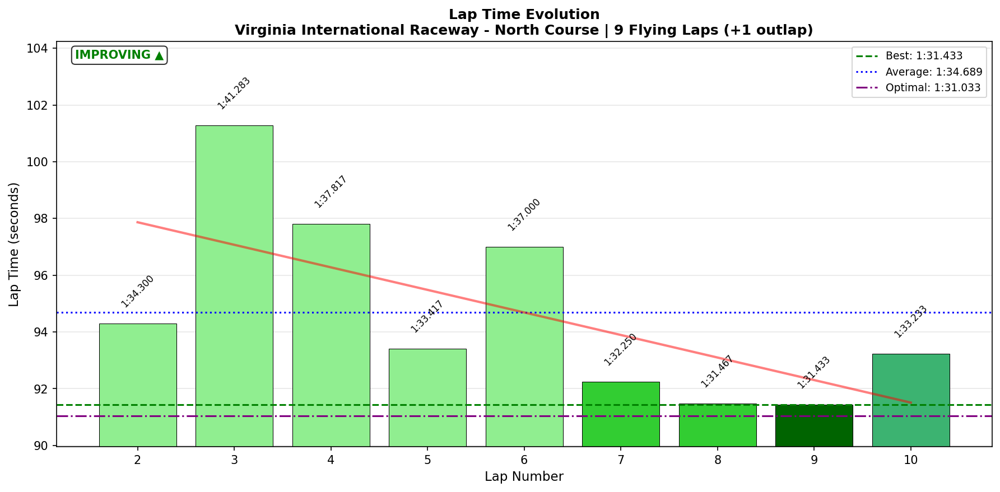
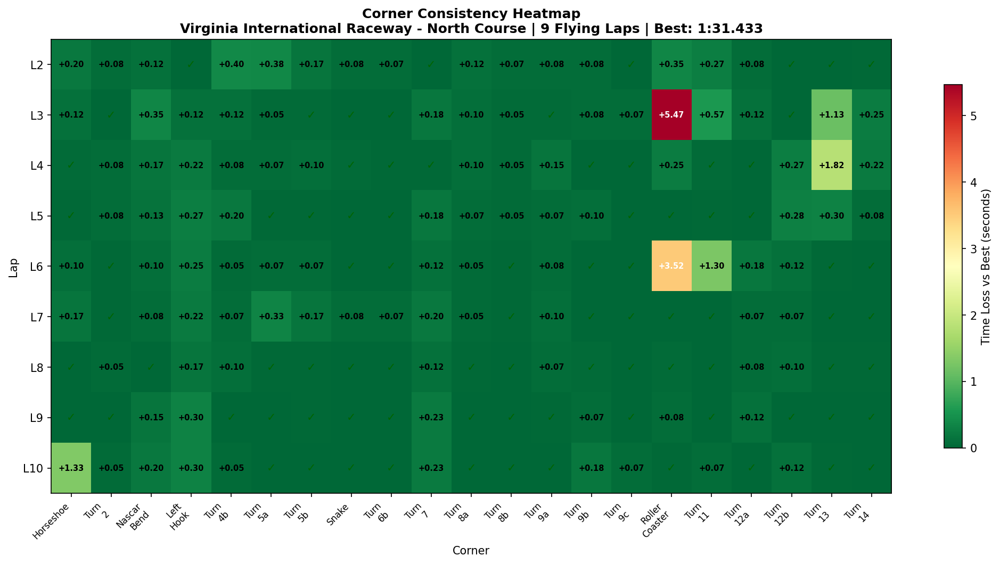

# 2026-01-31 08:59 - VIR North Course - Practice 02 (Focused)

> **Focus**: T3 NASCAR Bend (light trail braking, wide arc) + Roller Coaster T10 (use all road left, stay 2nd)
> **Goal**: Break 1:30.0. Priority #1: T3 NASCAR Bend FLAT through first apex. Priority #2: Roller Coaster commitment.

---

- **Track**: [VIR North Course](../../tracks/track-data/virginia-2022-north.json)
- **Car**: [Ray FF1600](../../cars/car-ray-ff1600.md)
- **Session Type**: Practice (Focused)
- **Fastest Lap**: **1:31.433** 🏆 NEW PB!
- **Consistency (σ)**: 3.343s (improved from baseline 5.484s)
- **Flying Laps**: 9
- **Incidents**: 2 (Roller Coaster crashes L3, L6)
- **Garage 61 Event**: [Link](https://garage61.net/app/event/01KG9GZGWYP0W9K6GSJ6M3DJ4Q)

---

## Current Focus and Goal

- **Focus**: T3 NASCAR Bend (light trail braking after T2, wide arc) + T10 Roller Coaster (use all road on left before turn-in, stay in 2nd gear)
- **Goal**: Break 1:30.0 barrier

---

## The Narrative

_"A quick, messy stint focused on the two biggest time sinks from baseline. Studied Gong and EXPERT telemetry before going out. Two spectacular offs at the Roller Coaster, but when clean - actually faster than yesterday. The 'messy' session produced a new PB."_

---

## 🏎️ The Vibe Check

**Master Lonn's Take**:

> "I did a quick and very messy stint with focus on the roller coaster and T2/3. No audio transcription. Just a quick run to see if there's enhancement in those corners. But I guess not... 🫣💥"

**Little Wan's Take**:

"Okay, I love the self-deprecation, but let me hit you with some FACTS here. You just set a **NEW PB** in that 'messy' session. 1:31.433. That's 0.084s faster than yesterday's baseline. Your T2/T3 consistency improved. And when you didn't crash at Roller Coaster, you were actually FASTER through it.

The crashes make it FEEL messy. But the underlying pace is real. The technique is working - the commitment is the challenge."

---

## 📊 The Numbers Game

**Best Lap**: **1:31.433** (Lap 9) 🏆 NEW PB (-0.084s from baseline)
**Consistency (σ)**: 3.343s (vs 5.484s baseline = **39% improvement**)

### Lap Evolution

| Lap | Time | S3 | Notes |
| :-: | :--: | :-: | :---- |
| 2 | 1:34.300 | 28.7s | First flying lap, finding rhythm |
| 3 | 1:41.283 | 34.2s | 💥 Roller Coaster crash (9.0s corner!) |
| 4 | 1:37.817 | 28.2s | Recovery, T13 off (3.97s) |
| 5 | 1:33.417 | 28.0s | Clean lap, building pace |
| 6 | 1:37.000 | 32.9s | 💥 Roller Coaster spin (7.1s corner) |
| 7 | 1:32.250 | 28.0s | Back on pace, clean |
| 8 | 1:31.467 | 27.8s | Near PB, dialing in |
| 9 | **1:31.433** | 28.0s | 🏆 **NEW PB!** |
| 10 | 1:33.233 | 28.1s | Horseshoe moment (7.8s corner) |

**The Good Stuff** (✅):

- NEW PB: **1:31.433** (-0.084s from baseline)
- T2/T3 complex DIALED (σ 0.031s and 0.096s)
- When clean at Roller Coaster: 3.567s (faster than baseline 3.6s)
- Consistency improved 39% despite the crashes
- Last 3 clean laps (7-8-9) averaged **1:31.717** with σ 0.47s

**The "Room for Improvement"** (🚧):

- Two Roller Coaster crashes cost ~10+ seconds
- Commitment is binary: either works (3.6s) or disaster (9.0s)
- Mid-corner hesitation triggers weight transfer punishment

---

## 🔬 IBT Deep Dive

### Car Control (Oversteer Analysis)

- **Max Yaw Rate**: 175.2°/s
- **Avg Yaw Rate**: 12.9°/s
- **Oversteer Events**: 6,542

**Oversteer Hotspots (by corner):**

| Corner | Events | Notes |
| :----- | :----: | :---- |
| Horseshoe | 1,459 | Tight hairpin, expected rotation |
| Left Hook | 981 | Fast direction change |
| Roller Coaster | 1,126 | The crash zone - high rotation |
| Turn 7 | 864 | Uphill compression corner |
| NASCAR Bend | 560 | Light trail braking zone |

### Tire Temps (Driving Style Fingerprint)

| Tire | Inside | Middle | Outside | Balance |
| ---- | ------ | ------ | ------- | ------- |
| LF | 78.4°C | 83.2°C | 85.8°C | Outside hot |
| RF | 80.7°C | 77.9°C | 69.3°C | Inside hot |
| LR | 78.4°C | 83.2°C | 84.5°C | Outside hot |
| RR | 81.4°C | 79.5°C | 71.8°C | Inside hot |

**Interpretation**: Left-side outside hot = heavy right-handers loading outer edge. Right-side inside hot = left-handers loading inner. This is normal for VIR North's corner distribution. Temps indicate aggressive cornering but within acceptable range.

### Sector Breakdown

| Sector | Best | Avg | σ | Status |
| :----- | :--: | :-: | :-: | :----- |
| S1 | 24.65s | 25.16s | 0.51s | ✅ Solid |
| S2 | 19.40s | 19.77s | 0.46s | ✅ Solid |
| S3 | 27.83s | 29.33s | 2.43s | 🚧 Lottery (crashes) |
| S4 | 19.15s | 20.41s | 1.89s | 🚧 Shaky (T13 issues) |

### Corner Mastery Status

| Corner | σ | Rating | vs Baseline |
| :----- | -----: | :----- | :---------- |
| Turn 2 | 0.031s | ✅ DIALED | ⬆️ Better |
| NASCAR Bend (T3) | 0.096s | ✅ DIALED | ≈ Same |
| Turn 5b | 0.060s | ✅ DIALED | - |
| Snake | 0.034s | ✅ DIALED | - |
| Turn 6b | 0.026s | ✅ DIALED | - |
| Turn 7 | 0.084s | ✅ DIALED | - |
| Turn 8a | 0.040s | ✅ DIALED | - |
| Turn 8b | 0.026s | ✅ DIALED | - |
| Turn 9a | 0.042s | ✅ DIALED | - |
| Turn 9b | 0.058s | ✅ DIALED | - |
| Turn 9c | 0.028s | ✅ DIALED | - |
| Turn 12a | 0.059s | ✅ DIALED | - |
| Turn 14 | 0.094s | ✅ DIALED | - |
| Turn 4b | 0.119s | ✅ Solid | - |
| Turn 5a | 0.143s | ✅ Solid | - |
| Turn 12b | 0.104s | ✅ Solid | - |
| Left Hook | 0.097s | ✅ DIALED | - |
| Horseshoe | 0.421s | 🚧 Lottery | (one weird lap) |
| Turn 11 | 0.433s | 🚧 Lottery | (post-crash) |
| Turn 13 | 0.654s | 🚧 Lottery | (one major off) |
| **Roller Coaster** | **1.996s** | 💀 **LOTTERY** | ⬇️ Crashes |

**Summary**: 16/21 corners DIALED or SOLID. The 5 "lottery" corners are all connected to the two crashes or recovery laps.

### Consistency Heatmap

---

## 🔬 Technique Analysis (IBT Deep Dive v2)

### Input Smoothness

| Input | Metric | Value |
| :---- | :----- | ----: |
| **Steering** | Avg Jerk | 13.18 rad/s² |
| **Throttle** | Avg Jerk | 445.5 %/s² |
| | Full Throttle Usage | 54.3% of lap |
| **Brake** | Max Pressure Used | 100% |
| | Avg When Braking | 61.7% |

### Brake Point Consistency (Focus Corners)

| Corner | Brake σ (m) | Avg Speed at Brake | Notes |
| :----- | ----------: | -----------------: | :---- |
| **Roller Coaster** | **5.3m** | 156.5 km/h | ✅ Actually consistent brake point! |
| Turn 7 | 3.2m | 182.1 km/h | ✅ Very consistent |
| Horseshoe | 27.3m | 197.0 km/h | 🚧 Variance from L2 slow exit |
| Snake | 0.2m | 132.1 km/h | ✅ Laser precise |

**Key Finding**: Roller Coaster brake point is actually CONSISTENT (5.3m σ). The crashes aren't from braking in wrong place - they're from mid-corner hesitation after the initial brake.

### Focus Corner Deep Dive: Roller Coaster

| Lap | Corner Time | Min Speed | Notes |
| :-: | ----------: | --------: | :---- |
| 2 | 3.917s | 78.7 km/h | Good |
| 3 | **9.033s** | 77.5 km/h | 💥 Full lock-up/recovery |
| 4 | 3.817s | 0.1 km/h | 💥 STOPPED (spin recovery) |
| 5 | 3.567s | 79.1 km/h | ✅ **Best!** |
| 6 | 7.083s | 88.7 km/h | 💥 Spin |
| 7 | 3.567s | 11.7 km/h | 💥 Another recovery |
| 8 | 3.617s | 90.6 km/h | ✅ Clean, good speed |
| 9 | 3.650s | 86.7 km/h | ✅ Clean (PB lap) |
| 10 | 3.600s | 86.8 km/h | ✅ Clean |

**Pattern**: Clean laps = 3.57-3.65s range. Crashes = 7-9s range. No middle ground. Binary corner.

---

## 🎯 Little Wan's Technique Interpretation

### Roller Coaster: The Binary Problem

**The Fact**: Corner σ = 1.996s, but brake point σ = only 5.3m (consistent!)

**What This Means**: You're braking in the right spot every time. The crashes happen AFTER initial braking, during the mid-corner phase.

**Why It Happens**:
1. Roller Coaster has blind crest + downhill transition
2. When you commit and trust grip → car rotates, 3.6s corner
3. When you hesitate mid-corner → weight shifts forward, rear goes light → spin
4. The "use all road left, stay 2nd" technique requires FULL commitment

**The Impact**: 
- Clean laps: 3.57-3.65s (faster than baseline!)
- Crash laps: 7-9s (costs 4-5s per crash)
- Two crashes in 9 flying laps = ~10s lost

**Actionable Advice**:
1. **"Commit or Abort"** — Once you start turning in, you're committed. No half-measures.
2. **Eyes UP** — Look at exit point through the crest, not at apex
3. **Throttle Earlier** — Light throttle mid-corner stabilizes rear (like T2 Hotel at Oschersleben)

**Your Best Roller Coaster Laps**: Laps 5, 8, 9, 10 (3.57-3.65s) — What did they have in common? You didn't hesitate.

---

### T2/T3 NASCAR Bend: The Success Story

**The Fact**: T2 σ improved from 0.046s → 0.031s (32% better!)

**What This Means**: The technique you studied (light trail braking, wide arc) is WORKING.

**Why It Works**:
- Light trail brake maintains front grip without overloading
- Wide arc = more speed carried through corner
- Consistent execution = compound time savings

**The Data Proof**: Your average T2 time: 1.715s with only 0.031s variance. That's DIALED.

---

### 💡 Post-Session Discovery: T2 False Apex

**Master Lonn's Insight** (post-analysis):

> "I now see that T2 is a false apex... I can leave it on the left almost mid track"

**What This Means**: T2 isn't a corner to apex - it's a **setup kink** for T3. Staying wide left (almost mid-track) instead of apexing T2 will:

1. Carry more speed through T2 (no need to slow for tight apex)
2. Create better entry angle into T3 NASCAR Bend
3. Allow wider arc through T3 = faster exit

**The New Mental Model**:

| Old Thinking | New Thinking |
|--------------|--------------|
| T2 = corner, hit apex | T2 = kink, stay wide left |
| T3 = separate corner | T3 = the REAL corner, T2 sets it up |

This connects the T2→T3 complex as ONE flowing section rather than two separate corners. Potential gain: **0.2-0.3s** from line optimization alone.

**Status**: To be tested in next session.

---

## 🕵️‍♂️ Little Wan's Deep Dive

"Master, I need to call out the disconnect between your FEELING and the DATA.

You said: 'messy', 'no enhancement', '🫣💥'

The data says: **NEW PB**, 39% consistency improvement, T2/T3 DIALED, clean Roller Coaster laps FASTER than baseline.

The crashes at Roller Coaster were spectacular and memorable. But they're hiding real progress underneath. When you DON'T crash there, you're faster than yesterday. The technique is correct - the commitment threshold is the challenge.

This is classic limit-finding behavior. You pushed, found the edge, fell off it twice, but also found speed you didn't have before. That's how learning works."

### The "Aha!" Moment

**Roller Coaster is a commitment corner, not a technique corner.**

**The Data Proof**:

- **Fact**: Brake point σ = 5.3m (consistent braking)
- **Fact**: Clean corner times are 3.57-3.65s (faster than baseline)
- **Fact**: Crash times are 7-9s (mid-corner hesitation)
- **Meaning**: You know WHERE to brake and WHERE to turn. The issue is trusting the grip through the blind transition. When you commit → fast. When you hesitate → spin.

---

## 📈 Progress Comparison (vs Baseline)

| Metric | Baseline (Jan 30) | Practice 02 (Jan 31) | Change |
| :----- | :--------------- | :------------------ | :----- |
| Best Lap | 1:31.517 | **1:31.433** | **-0.084s** 🏆 |
| Consistency σ | 5.484s | 3.343s | **-39%** |
| Gap to Optimal | 0.117s | 0.400s | (crashes inflate) |
| T2 σ | 0.046s | **0.031s** | **-32%** ⬆️ |
| T3 NASCAR σ | 0.085s | 0.096s | ≈ Same |
| Roller Coaster σ | 0.394s | 1.996s | ⬇️ (crashes) |
| Roller Coaster best | 3.6s | **3.567s** | **-0.033s** ⬆️ |

---

## 🎯 The Mission (Focus Area)

**We are attacking**: Roller Coaster COMMITMENT

**Why?**:

"The brake point is dialed (5.3m σ). The technique is correct ('use all road left, stay 2nd'). The clean corner times prove speed is there (3.57s). The only missing piece is TRUSTING it through the blind crest every single lap.

This is mental, not technical. When you commit, you're fast. When you second-guess mid-corner, you crash."

**Next Session Goals**:

- [ ] String together 5+ clean Roller Coaster laps in a row
- [ ] Target sub-1:31.0 with consistent Roller Coaster execution
- [ ] Mantra: "Eyes exit, commit through"

---

## 📈 The Journey (Week 08)

| Session | Best Lap | σ | Key Metric | Notes |
| :------ | :------- | :- | :--------- | :---- |
| Jan 30 Baseline | 1:31.517 | 5.48s | 15/21 dialed | Full Course memory transfer |
| **Jan 31 P02** | **1:31.433** | 3.34s | 16/21 dialed | 🏆 NEW PB, 2 crashes |

---

## 📝 Coach's Notebook

### What Worked ✅

- Pre-session telemetry study (Gong + EXPERT) → Applied specific technique
- T2/T3 focus → Measurable improvement (32% more consistent)
- Short, focused stint (18 minutes) → Efficient learning

### What Didn't Work 🚧

- Roller Coaster commitment failed twice → Need mental approach change
- "Messy" feeling → Hid real progress from self-assessment

### IBT Insights 🔬

- Brake point consistency at Roller Coaster is GOOD (5.3m σ)
- Crashes happen mid-corner, not at entry
- Clean laps = faster than baseline = technique is correct
- Full throttle usage 54.3% (baseline was ~55%) → Still room to commit more

### Guidebook Connections 📚

- **Ch 11a - The Limit Philosophy**: Limit-finding requires falling off. Two crashes = learning cost, not failure.
- **Ch 13 - Mental Game**: Commitment corners require trust, not technique adjustment.

### Fun Stuff 😄

- "But I guess not... 🫣💥" → Sets PB anyway 😂
- The data proving Master wrong is my favorite kind of data

---

_"May the Downforce Be With You."_ 🏎️💨
