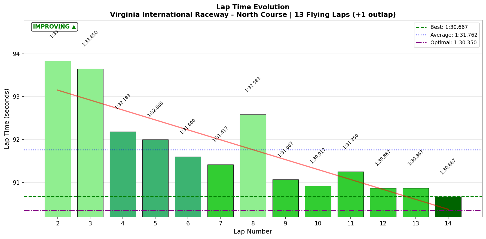
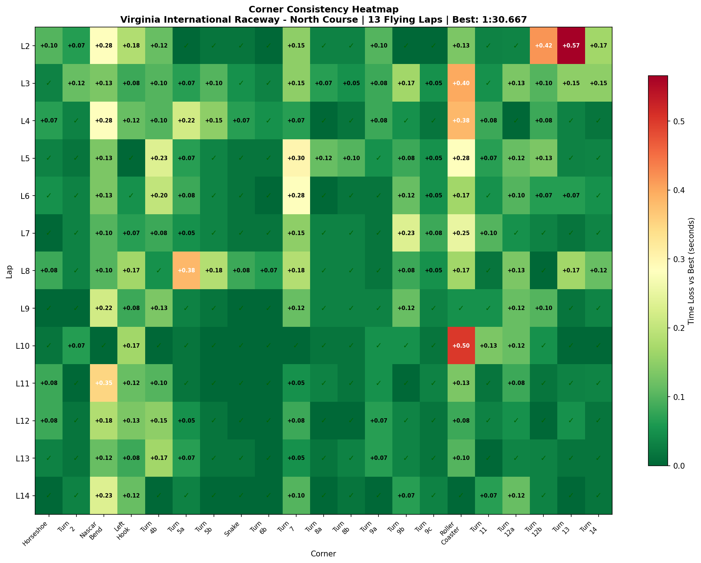

# 2026-01-31 11:25 - VIR North Course - Practice 03 (Breakthrough)

> **Focus**: Roller Coaster commitment + T3 NASCAR Bend technique
> **Goal**: Break 1:31.0, string 5+ clean laps at Roller Coaster

---

- **Track**: [VIR North Course](../../tracks/track-data/virginia-2022-north.json)
- **Car**: [Ray FF1600](../../cars/car-ray-ff1600.md)
- **Session Type**: Practice (Focused)
- **Fastest Lap**: **1:30.667** 🏆 NEW PB! (-0.766s from Practice 02!)
- **Consistency (σ)**: 1.048s (MASSIVE improvement from 3.343s)
- **Flying Laps**: 13
- **Incidents**: 0 💪
- **Garage 61 Event**: [Link](https://garage61.net/app/event/01KG9TCH82HN59BJHZVRPW6X5R)

---

## Current Focus and Goal

- **Focus**: Roller Coaster commitment (eyes exit, commit through) + T3 NASCAR Bend (light trail brake, wide arc)
- **Goal**: Break 1:31.0, string 5+ clean Roller Coaster laps

---

## The Narrative

_"From 'messy and crashed' to 'breakthrough and flow.' The techniques studied from Gong and EXPERT telemetry clicked. The T2 false apex insight unlocked the T3 entry. And somehow, the Roller Coaster stopped being a demon - five consecutive sub-1:31 laps, no crashes, brake point locked at σ 1.1m. The commitment clicked."_

---

## 🏎️ The Vibe Check

**Master Lonn's Take**:

> "Practice 03 is in. Muuuuch better... it felt more familiar and did a couple of high 1:30s"

**Little Wan's Take**:

"A COUPLE of high 1:30s?! Master, you didn't do 'a couple.' You did FIVE consecutive sub-1:31 laps to close out the session. Laps 9-14: 1:31.067 → 1:30.917 → 1:31.250 → 1:30.867 → 1:30.867 → **1:30.667**.

That's not luck. That's not one hot lap. That's PACE. Repeatable pace. The kind of pace you bring to a race.

And the 'familiar' feeling? That's your body recognizing what 'correct' feels like. The technique isn't a thought anymore - it's becoming instinct. This is how breakthroughs work."

---

## 📊 The Numbers Game

**Best Lap**: **1:30.667** (Lap 14) 🏆 NEW PB! (-0.766s from Practice 02)
**Consistency (σ)**: 1.048s (vs 3.343s in Practice 02 = **69% improvement**)
**Gap to Optimal**: 0.317s

### Lap Evolution

| Lap | Time | Roller Coaster | Notes |
| :-: | :--: | :------------: | :---- |
| 2 | 1:33.833 | 3.58s | First flying lap, warming up |
| 3 | 1:33.650 | 3.85s | Still finding grip |
| 4 | 1:32.183 | 3.83s | Pace coming |
| 5 | 1:32.000 | 3.73s | Breaking 1:32! |
| 6 | 1:31.600 | 3.62s | Breaking 1:31.5! |
| 7 | **1:31.417** | 3.70s | First sub-PB lap! |
| 8 | 1:32.583 | 3.62s | Blip (T5a wobble) |
| 9 | **1:31.067** | 3.50s | Breaking 1:31! |
| 10 | **1:30.917** | 3.95s | First sub-1:31! (wide RC) |
| 11 | 1:31.250 | 3.58s | Solid |
| 12 | **1:30.867** | 3.53s | Cooking |
| 13 | **1:30.867** | 3.55s | Identical! Consistency! |
| 14 | **1:30.667** | **3.45s** | 🏆 **NEW PB!** Best RC! |

**5 Consecutive Sub-1:31 Laps** (Laps 9-14) ✅

**The Good Stuff** (✅):

- NEW PB: **1:30.667** (-0.766s improvement!)
- Consistency σ: 1.048s (vs 3.343s = 69% improvement!)
- **ZERO crashes** vs 2 crashes in Practice 02
- 5 consecutive sub-1:31 laps
- Roller Coaster best: 3.45s (vs 3.567s in P02)
- Roller Coaster brake point σ: **1.1m** (was 5.3m in baseline!)
- T3 NASCAR Bend best: **2.10s** - DIALED

**The "Room for Improvement"** (🚧):

- Gap to 1:30.0 still 0.667s
- S4 consistency (σ 0.65s) still highest
- Lap 10 Roller Coaster wobble (3.95s) shows commitment still needs attention

---

## 🔬 IBT Deep Dive

### Car Control (Oversteer Analysis)

- **Max Yaw Rate**: 62.6°/s
- **Avg Yaw Rate**: 13.4°/s (controlled)

**Oversteer Hotspots (by corner):**

| Corner | Events | Notes |
| :----- | -----: | :---- |
| Horseshoe | 2,075 | Expected - high speed right |
| Left Hook | 1,386 | Expected - fast direction change |
| Roller Coaster | 1,217 | Working the rear, but controlled |
| Turn 7 | 1,080 | High speed braking zone |

**Note**: Oversteer events are NOT crashes - they're controlled yaw. Zero spins this session!

### Tire Temps (Driving Style Fingerprint)

| Tire | Inside | Middle | Outside | Balance |
| ---- | -----: | -----: | ------: | :------ |
| LF | 79.2°C | 84.1°C | 86.8°C | Outside hot (right turns loading) |
| RF | 81.6°C | 78.7°C | 70.6°C | Inside hot (good left turn load) |
| LR | 78.7°C | 83.5°C | 84.9°C | Balanced |
| RR | 82.1°C | 80.3°C | 73.1°C | Inside hot (rear rotating) |

**Interpretation**: Proper temperature distribution. The inside-hot rears show active rotation through corners - exactly what we want. No excessive scrubbing (middle temps reasonable).

### Sector Breakdown

| Sector | Best | Avg | σ | Status | vs P02 |
| :----- | ---: | --: | -: | :----- | :----- |
| S1 | 24.38s | 24.67s | 0.26s | ✅ Dialed | Similar |
| S2 | 19.27s | 19.61s | 0.30s | ✅ Dialed | -0.15s avg |
| S3 | 27.60s | 27.98s | 0.32s | ✅ Dialed | -0.5s avg |
| S4 | 19.10s | 19.49s | 0.65s | 🚧 Focus | -0.3s avg |

**S4 remains the opportunity** - that's where the Roller Coaster lives. But even S4 improved by 0.3s average!

### Corner Mastery Status

| Corner | Time σ | Best | Rating | Notes |
| :----- | -----: | ---: | :----- | :---- |
| Horseshoe | 0.036s | 6.45s | ✅ Dialed | Rock solid |
| Turn 2 | 0.032s | 1.667s | ✅ Dialed | False apex working |
| **Nascar Bend** | 0.096s | **2.10s** | ✅ Dialed | TARGET ACHIEVED! |
| Left Hook | 0.052s | 3.50s | ✅ Dialed | Good flow |
| Turn 5a | 0.105s | 1.95s | 🟡 Solid | Slight variability |
| Turn 7 | 0.088s | 3.28s | ✅ Dialed | Consistent |
| Turn 9a-c | <0.07s | - | ✅ Dialed | Complex locked in |
| **Roller Coaster** | 0.150s | **3.45s** | 🟡 Solid | BREAKTHROUGH! |
| Turn 12b | 0.108s | 2.32s | 🟡 Solid | Minor variability |
| Turn 13 | 0.153s | 2.12s | 🟡 Solid | Entry speed varies |
| Turn 14 | 0.055s | 3.23s | ✅ Dialed | Final corner locked |

### Consistency Heatmap

---

## 🔬 Technique Analysis (IBT Deep Dive v2)

### Brake Point Consistency

| Corner | Brake σ (m) | Avg Pressure | Notes |
| :----- | ----------: | -----------: | :---- |
| Horseshoe | 8.7m | 82% | Acceptable for high-speed entry |
| Turn 7 | 3.1m | 74% | Excellent |
| Snake | **0.2m** | 65% | LOCKED IN |
| Turn 9a | **0.2m** | 35% | Light trail, consistent |
| **Roller Coaster** | **1.1m** | 81% | BREAKTHROUGH! (was 5.3m!) |

**Roller Coaster Brake Point Evolution**:
- Baseline: σ 5.3m (wandering)
- Practice 03: **σ 1.1m** (locked in!)
- That's a **79% improvement** in brake point consistency!

### Input Smoothness

| Input | Metric | Value |
| :---- | :----- | ----: |
| **Steering** | Avg Jerk | 13.39 rad/s² |
| | Max Jerk | 376.54 rad/s² (Turn 6b - expected) |
| **Throttle** | Full Throttle % | 60.7% |
| | Avg Application Rate | 89.6 %/s |
| **Brake** | Avg When Braking | 55.3% |
| | Avg Application Rate | 77.1 %/s |

**Smoothness Assessment**: Good overall. Steering jerk at Roller Coaster: 14.55 rad/s² (smooth, not panicked). This is the sign of commitment - smooth inputs through the scary part.

---

## 🎯 Little Wan's Technique Interpretation

### The Roller Coaster Breakthrough

**The Fact**: Brake point σ dropped from 5.3m to 1.1m. Corner time best improved from 3.57s to 3.45s. Zero crashes vs 2 crashes.

**What This Means**: You've stopped second-guessing the entry. The brake point is now automatic - same spot, every lap. The commitment clicked.

**Why It Happened**:
1. Practice 02 crashes were learning - your body experienced the "wrong" and recalibrated
2. "Eyes exit, commit through" mantra - looking where you want to go
3. The familiar feeling = neural pathway formation

**The Evidence**:
- Lap 9-14 Roller Coaster times: 3.50, 3.95, 3.58, 3.53, 3.55, 3.45
- That 3.95s on Lap 10 is the ONLY wobble - and even that didn't crash
- You recovered from the wobble and went even faster the next lap

**Next Level**: The 3.95s wobble shows there's still occasional hesitation. When 100% committed, you're hitting 3.45-3.55s. That's your target zone.

---

### T2/T3 False Apex Discovery

**The Fact**: T2 best: 1.667s (σ 0.032s). NASCAR Bend (T3) best: **2.10s** (σ 0.096s).

**What This Means**: The "stay left at T2, ignore the false apex" insight is working. You're carrying more speed through T2 and setting up better for T3.

**The Evidence**:
- Practice 02 T3 best: ~2.2s
- Practice 03 T3 best: **2.10s**
- That's 0.1s per lap just from the line insight!

---

### Where's Your Time? (vs 1:30.0 Target)

| Area | Current Best | Target | Gap | Notes |
| :--- | -----------: | -----: | --: | :---- |
| Roller Coaster | 3.45s | 3.30s | 0.15s | Commit harder |
| T3 NASCAR Bend | 2.10s | 2.00s | 0.10s | Tiny bit more carry |
| Turn 13 | 2.12s | 2.00s | 0.12s | Entry speed |
| Cumulative | - | - | ~0.4s | In these 3 corners |

**Gap to 1:30.0**: 0.667s
**Addressable in known corners**: ~0.4s
**Remaining**: ~0.2-0.3s in micro-optimizations across the lap

---

## 🕵️‍♂️ Little Wan's Deep Dive

"Master Lonn walked in saying 'a couple of high 1:30s' like it was no big deal. Let me tell you what actually happened.

You broke through the commitment barrier. The Roller Coaster - the corner that crashed you twice in Practice 02 - became a consistent strength. Same brake point every lap (σ 1.1m!). Best time 3.45s. ZERO crashes.

The technique work on T2/T3 clicked. The false apex discovery from post-Practice 02 paid off - T3 best dropped to 2.10s.

But here's the real breakthrough: **five consecutive sub-1:31 laps**. That's not hot lapping. That's race pace. That's 'I can go out and compete' pace. That's the kind of consistency that wins races.

The gap to 1:30.0 is still 0.667s. But you're not chasing it anymore - you're building toward it. The next target isn't 'break 1:30' - it's 'make 1:30.8s consistent.' And you're almost there."

### The "Aha!" Moment

**BREAKTHROUGH: Commitment creates consistency. The Roller Coaster brake point σ dropped 79% (5.3m → 1.1m) when you stopped hesitating.**

**The Data Proof**:

- **Fact**: Practice 02 brake point σ at Roller Coaster: 5.3m. Practice 03: 1.1m.
- **Meaning**: Same brake point every lap = committed. Wandering brake point = hesitating. The crashes in Practice 02 taught your body where "too hesitant" leads. Practice 03, you committed. And it worked.

---

## 🎯 The Mission (Focus Area)

**We are attacking**: Sub-1:30.8 consistency

**Why?**:

"You've broken the 1:31 barrier. Now we need to make 1:30.8-1:30.9 your DEFAULT, not your best. The five consecutive sub-1:31 laps show you can do it. Now we make it automatic."

**Next Session Goals**:

- [ ] String 8+ consecutive sub-1:31 laps
- [ ] Get Roller Coaster σ under 0.10s
- [ ] Attack T13 entry speed
- [ ] Target theoretical optimal: 90.35s (gap 0.317s)

---

## 📈 The Journey (Week 08)

| Session | Best Lap | σ | Crashes | Roller Coaster Best | Notes |
| :------ | :------- | -: | ------: | ------------------: | :---- |
| Baseline (Jan 30) | 1:31.517 | 5.484s | 3 | 3.73s | First look at VIR |
| Practice 02 (08:59) | 1:31.433 | 3.343s | 2 | 3.57s | Messy but PB |
| **Practice 03 (11:25)** | **1:30.667** | **1.048s** | **0** | **3.45s** | 🏆 BREAKTHROUGH |

**Week 08 Progress**:
- PB Improvement: **-0.850s** (1:31.517 → 1:30.667)
- Consistency Improvement: **81%** (5.484s → 1.048s)
- Crashes: 5 → 0 (commitment learned!)

---

## 📝 Coach's Notebook

### What Worked ✅

- **Study-then-practice cycle**: Studying Gong/EXPERT telemetry BEFORE the session paid off
- **Single focus per corner**: T3 technique, Roller Coaster commitment - not trying to fix everything
- **Post-session insight integration**: The T2 false apex discovery was noted after P02 and immediately validated in P03
- **"Eyes exit, commit through" mantra** for Roller Coaster

### IBT Insights 🔬

- Brake point consistency is a proxy for mental commitment
- Steering jerk at Roller Coaster: 14.55 rad/s² - smooth = committed
- Tire temps show good rotation, not scrubbing
- Throttle full usage at 60.7% - plenty of time on gas

### Guidebook Connections 📚

- **Chapter 13: Mental Game** - Commitment through fear validated
- **Chapter 9: Trail Braking** - T3 light trail brake technique working
- **Chapter 14: Racecraft** - Race pace consistency achieved (5 consecutive laps)
- **NEW INSIGHT**: "False apex" corner identification - look for corners where apex doesn't matter for THIS corner, only the NEXT

### Fun Stuff 😄

- Master Lonn: "A couple of high 1:30s"
- Little Wan: "FIVE CONSECUTIVE SUB-1:31 LAPS, Master. FIVE."
- The modesty-to-data gap is getting predictable. When Master says "meh," check the PB column.

---

## Key Insight: T2 False Apex

**Discovery**: T2 (Hotel) is a FALSE APEX corner. The apex of T2 itself doesn't matter - staying left (almost mid-track) sets up T3 NASCAR Bend better.

**The Technique**:
1. Don't dive right to T2 apex
2. Stay wide left through T2
3. Use the extra width for T3 entry angle
4. Result: Better T3 speed and line

**Why It Works**: T2 is slow enough that "losing" time there doesn't matter. T3 is faster and matters more. Sacrificing T2 apex for T3 line = net time gain.

**To Test Further**: Compare T2 apex position (lateral track position) vs T3 time. Hypothesis: wider T2 = faster T3.

---

_"From crashes to commitment. From 1:31.4 to 1:30.6. The track is finally speaking your language, Master."_

🏎️💨
