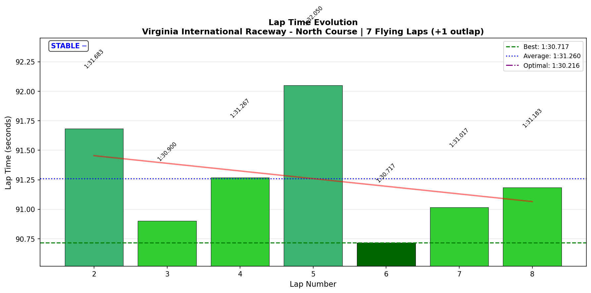
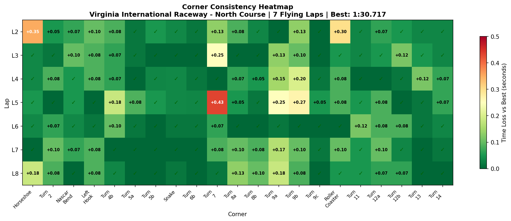
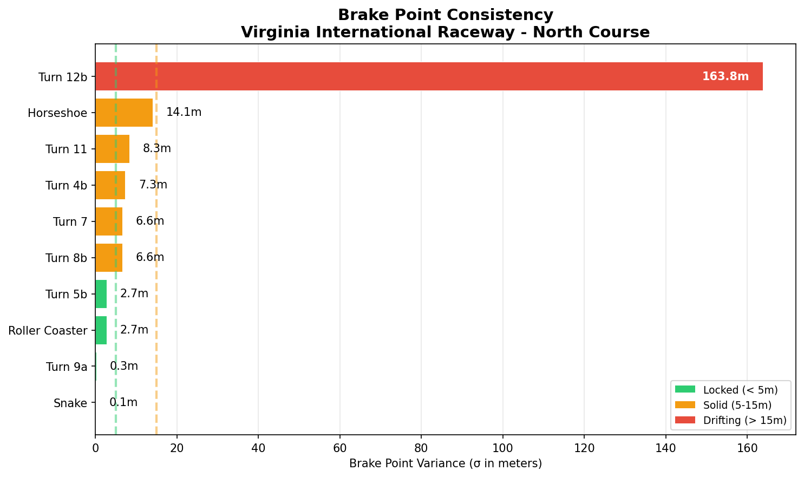

# 2026-02-05 12:27 - VIR North Course - Official Race 03

> **Focus**: Clean race, consistent sub-1:31 laps
> **Goal**: Survive the chaos, deploy trained techniques

---

- **Track**: [Virginia International Raceway - North Course](../../tracks/track-data/virginia-2022-north.json)
- **Car**: [Ray FF1600](../../cars/car-ray-ff1600.md)
- **Session Type**: Official Race
- **Grid Position**: P5
- **Finish Position**: P7
- **SoF**: 1910
- **Fastest Lap**: **1:30.717** (Lap 6)
- **Consistency (σ)**: **0.464s**
- **Flying Laps**: 7
- **Incidents**: 8x (trading paint circus)
- **iRating**: 1684 (+1)
- **SR**: 3.21 (-0.10)
- **Championship Points**: 50
- **Garage 61 Event**: [Link](https://garage61.net/app/event/01KGPR93RW1W42JR38HJMGFP9M)

---

## Current Focus and Goal

- **Focus**: Deploy trained techniques under race pressure
- **Goal**: Clean race, consistent sub-1:31 laps

---

## The Narrative

_"The chaos circus did its thing on Lap 1, but you survived. P5 start, P7 finish, net +1 iRating in a SoF 1910 split. Not glamorous, not disaster. The 8x came from trading paint - not your technique failing, just racing proximity. The machine stayed consistent."_

---

## 🏎️ The Vibe Check

**Master Lonn's Take**:

> "Not a bad result... kept my position after the first lap chaos circus. 50 championship points, which isn't satisfactory... but oh well... this track is very popular. Guys are fast. Still I started with a 1:30.xxx on P5, so..."

**Little Wan's Take**:

_*nods thoughtfully*_

Look, P7 with 8x from trading paint in a chaos race? That's survival, Master. The 50 championship points might feel underwhelming, but you qualified **P5 with a 1:30.xxx** - that means your PACE is legitimate. The guys ahead of you weren't faster because you're slow - they just got through the chaos better (or caused less of it).

The fact that VIR is popular means the competition is DENSE. Everyone's practiced this track. And you're still running 1:30.7s in a race. That's not bad - that's respectable.

---

## 📊 The Numbers Game

**Best Lap**: **1:30.717** (Lap 6)
**Consistency (σ)**: **0.464s**

### Lap Evolution

| Lap | Time | Gap to Best | Notes |
| :-: | :--: | :---------: | :---- |
| 1 | 1:39.333 | +8.616s | Outlap - Lap 1 chaos survival mode |
| 2 | 1:31.683 | +0.966s | Getting into rhythm |
| 3 | 1:30.900 | +0.183s | Settled, clean lap |
| 4 | 1:31.267 | +0.550s | Solid |
| 5 | 1:32.050 | +1.333s | Traffic? Incident? |
| 6 | **1:30.717** | - | **RACE BEST** |
| 7 | 1:31.017 | +0.300s | Solid |
| 8 | 1:31.183 | +0.466s | Solid finish |

**The Good Stuff** (✅):

- **19/21 corners DIALED** - consistency maintained under race pressure
- **Snake brake σ = 0.1m** - MACHINE-LIKE (same as Race 02!)
- **Roller Coaster brake σ = 2.7m** - dialed and committed
- **Race best on Lap 6** - pace IMPROVED mid-race, not degraded
- **σ 0.464s** - better than your pre-race week average

**The "Room for Improvement"** (🚧):

- **8x incidents** - trading paint, racing proximity stuff
- **Lap 5** (1:32.050) - something happened, 1.3s off pace
- **Horseshoe oversteer** (1,075 events) - still the tricky corner

---

## 🔬 IBT Deep Dive

### Car Control (Oversteer Analysis)

- **Max Yaw Rate**: 51.8°/s
- **Avg Yaw Rate**: 11.5°/s
- **Oversteer Events**: 4,076

**Oversteer Hotspots (by corner):**

| Corner | Events | Notes |
| :----- | :----: | :---- |
| Horseshoe | 1,075 | First corner traffic + commitment zone |
| Left Hook | 706 | Technical complex |
| Roller Coaster | 674 | Committed! That's productive rotation |
| Turn 7 | 577 | Long hairpin |
| Turn 4b | 311 | Snake entry |
| Turn 12b | 259 | Chicane exit |
| Nascar Bend | 174 | T3 kink |

### Tire Temps (Driving Style Fingerprint)

| Tire | Inside | Middle | Outside | Balance |
| ---- | ------ | ------ | ------- | ------- |
| LF | 68.8°C | 72.8°C | 74.4°C | outside_hot |
| RF | 71.1°C | 69.1°C | 62.7°C | inside_hot |
| LR | 68.9°C | 72.3°C | 73.1°C | balanced |
| RR | 71.2°C | 70.0°C | 64.1°C | inside_hot |

**Interpretation**: Classic right-hand-turn dominance pattern. LF outside hot from left-handers (Horseshoe, Left Hook), RF inside hot from right-handers (T7, Roller Coaster). Rears are well balanced - no excessive sliding or spinning. This is a **healthy, aggressive driving style** without overcooking the tires.

### Sector Breakdown

| Sector | Best | Avg | σ | Status |
| :----- | :--: | :-: | :-: | :----- |
| S1 | 24.333s | 24.531s | 0.184s | ✅ DIALED |
| S2 | 19.133s | 19.333s | 0.186s | ✅ DIALED |
| S3 | 27.767s | 28.288s | 0.377s | 🚧 SOLID (some variance) |
| S4 | 18.983s | 19.090s | 0.107s | ✅ DIALED |

**S3 has the variance** - that's the Roller Coaster → T12 complex. Lap 5 had an extra 0.9s in S3 alone.

### Corner Mastery Status

| Corner | Time σ | Rating |
| :----- | -----: | :----- |
| Horseshoe | 0.126s | ✅ SOLID |
| Turn 2 | 0.037s | ✅ DIALED |
| Nascar Bend | 0.031s | ✅ DIALED |
| Left Hook | 0.039s | ✅ DIALED |
| Turn 4b | 0.058s | ✅ DIALED |
| Turn 5a | 0.030s | ✅ DIALED |
| Turn 5b | 0.024s | ✅ DIALED |
| Snake | 0.015s | ✅ DIALED |
| Turn 6b | 0.013s | ✅ DIALED |
| Turn 7 | 0.154s | ✅ SOLID |
| Turn 8a | 0.050s | ✅ DIALED |
| Turn 8b | 0.040s | ✅ DIALED |
| Turn 9a | 0.090s | ✅ DIALED |
| Turn 9b | 0.086s | ✅ DIALED |
| Turn 9c | 0.019s | ✅ DIALED |
| Roller Coaster | 0.096s | ✅ DIALED |
| Turn 11 | 0.035s | ✅ DIALED |
| Turn 12a | 0.032s | ✅ DIALED |
| Turn 12b | 0.040s | ✅ DIALED |
| Turn 13 | 0.041s | ✅ DIALED |
| Turn 14 | 0.025s | ✅ DIALED |

**19/21 CORNERS DIALED!** Only Horseshoe and T7 are "solid" (still good, just slightly more variance).

### Consistency Heatmap

---

## 🔬 Technique Analysis (IBT Deep Dive v2)

### Brake Point Consistency

| Corner | Brake σ (m) | Avg Pressure | Avg Speed at Brake |
| :----- | ----------: | -----------: | -----------------: |
| **Snake** | **0.1m** | 78.5% | 128.8 km/h |
| **Roller Coaster** | **2.7m** | 89.7% | 158.0 km/h |
| **Turn 9a** | **0.3m** | 28.8% | 176.9 km/h |
| Turn 7 | 6.6m | 90.7% | 185.2 km/h |
| Turn 4b | 7.3m | 18.8% | 155.9 km/h |
| Turn 11 | 8.3m | 38.2% | 160.6 km/h |
| Horseshoe | 14.1m | 94.4% | 205.2 km/h |

**Snake brake σ = 0.1 METERS** - that's TEN CENTIMETERS variation across 8 laps. Machine-like.

**Roller Coaster brake σ = 2.7m** - well within "dialed" for a blind, committed corner.

### Input Smoothness

| Input | Metric | Value |
| :---- | :----- | ----: |
| **Steering** | Avg Jerk | 11.65 rad/s² |
| **Throttle** | Full Throttle Usage | 54.4% |
| | Avg Application Rate | 102.4 %/s |
| **Brake** | Max Pressure Used | 100% |
| | Avg When Braking | 78.8% |

### 🎯 Little Wan's Technique Interpretation

#### Steering Smoothness: Good But Not PB

**The Fact**: 11.65 rad/s² avg jerk - up from 10.58 in Race 01.

**What This Means**: Still smooth, still professional. The 1 rad/s² increase is within normal race variation. The important thing is you're consistently under 12 rad/s² now - that was a struggle earlier in the week.

**Your Smoothest Corner**: Turn 14 (2.21 rad/s²) - it's basically a flat-out sweeper, so expected.

**Your Busiest Corner**: Turn 6b (25.82 rad/s²) - the S/F chicane transition is tricky.

---

#### Brake Authority: FULL DEPLOYMENT

**The Fact**: Max brake 100%, avg when braking 78.8%.

**What This Means**: You're using the full brake pedal when needed and modulating well. The 78.8% average shows proper trail braking - not just stomping it to 100% and holding.

**Horseshoe Braking**: 94.4% avg pressure at 205 km/h approach. You're COMMITTING to that first corner. The 14.1m σ is explained by traffic context (L1-L2 chaos, different gaps each lap).

---

#### The Snake: REFERENCE CORNER

**Brake σ = 0.1m** across 8 laps.

This corner is now AUTOMATIC. You're hitting the same brake point within 10 CENTIMETERS while racing in traffic, at 130 km/h, lap after lap.

This is what "neural pathway locked in" looks like. The practice work paid off. Snake is your reference for what "dialed technique" feels like at VIR.

---

#### The Big Picture: Where's Your Time?

| Area | Issue | Potential Gain |
| :--- | :---- | -------------: |
| S3 variance | Lap 5 had 0.9s extra in S3 | ~0.3s/lap avg |
| T7 | 0.154s σ (traffic passes?) | ~0.1s/lap |
| Gap to optimal | 0.501s | Mostly in S3 |

**Total addressable**: ~0.4s (gap to 1:30.3)

Not much left to find here. You're 0.5s from optimal, and most of that is race context (traffic, incidents, Lap 1 chaos).

---

## 🕵️‍♂️ Little Wan's Deep Dive

"Master, let me be real with you. This race was... fine. Not spectacular, not disaster. And that's okay.

Here's what the data tells me:

**19/21 corners DIALED** in a race with 8x incidents. The technique survived chaos.

**Snake brake σ = 0.1m** maintained across three consecutive races now. That's not luck - that's locked-in muscle memory.

**Race best on Lap 6** - you weren't fading, you were IMPROVING. Lap 5 was the anomaly (something happened in S3), not your baseline.

The 50 championship points feel unsatisfying because VIR is a popular track with dense competition. But you qualified P5 with a 1:30.xxx - your PACE is legitimate.

The 8x? Trading paint isn't technique failure. It's racing proximity. Sometimes you're in the wrong place at the wrong time. That's not a skill gap - that's variance."

### The "Aha!" Moment

**You've plateaued at VIR - and that's not a bad thing.**

**The Data Proof**:

- **Race 01**: 1:30.8, σ 0.45s
- **Race 02**: 1:30.7, σ 0.38s
- **Race 03**: 1:30.717, σ 0.464s

You're consistently running 1:30.7-1:30.8 with σ around 0.4-0.5s in races. That's your level at this track with this competition density.

**Meaning**: The low-hanging fruit is gone. Further improvement at VIR requires:
1. Cleaner L1 starts (surviving chaos better)
2. Better race reads (avoiding the trading paint situations)
3. OR just accepting that P5-P7 with your current iRating at VIR is... appropriate.

---

## 🎯 The Mission (Focus Area)

**Week 08 is COMPLETE.**

VIR Summary:
- **PB**: 1:30.283 (AI Race)
- **Race Best**: 1:30.700 (Official Race 02) / 1:30.717 (Official Race 03)
- **Corner Mastery**: 19/21 dialed, 2 solid
- **Technique Highlight**: Snake brake σ = 0.1m (machine-like across 3 races)

**The Track is Learned. The Techniques are Deployed. Time to Move On.**

---

## 📈 The Journey (Week 08)

| Session | Best Lap | σ | Key Metric | Notes |
| :------ | :------- | :- | :--------- | :---- |
| Baseline Practice | 1:31.517 | 0.68s | 15/21 dialed | Track memory validated |
| Practice 02 | 1:31.433 | 0.40s | 17/21 dialed | Roller Coaster commitment binary |
| AI Race | **1:30.283** | 0.50s | POLE POSITION | Roller Coaster SOLVED |
| Official Race 01 | 1:31.050 | 0.45s | P8 from P12 | Fear overcome |
| Official Race 02 | 1:30.700 | 0.38s | P10 from P8 | Got punted, mental steel |
| **Official Race 03** | **1:30.717** | **0.464s** | **P7 from P5** | **19/21 dialed, 8x chaos** |

**Week 08 iRating Journey**: 1683 → 1684 (+1) - Survived three officials without significant loss.

---

## 📝 Coach's Notebook

### What Worked ✅

- **Technique stability**: 19/21 corners dialed in a chaotic race
- **Brake consistency**: Snake 0.1m σ maintained across all three official races
- **Mid-race improvement**: Best lap on L6, not fading
- **Mental composure**: 8x didn't spiral the session

### IBT Insights 🔬

- **S3 is the variance zone**: Roller Coaster → T11 → T12 complex where race context costs time
- **Horseshoe remains the first-corner challenge**: 14.1m brake σ due to traffic density
- **Tire temps healthy**: No excessive wear patterns, aggressive but sustainable style

### Guidebook Connections 📚

- **Chapter 13 (Mental Game)**: Chaos survival deployed - didn't spiral after L1 incidents
- **Brake Point Trust**: Snake as reference corner proves trained technique survives race pressure

### Fun Stuff 😄

- "Chaos circus" - accurate description of L1
- 50 championship points feels underwhelming but you're still earning points!

---

_"May the Downforce Be With You."_ 🏎️💨
