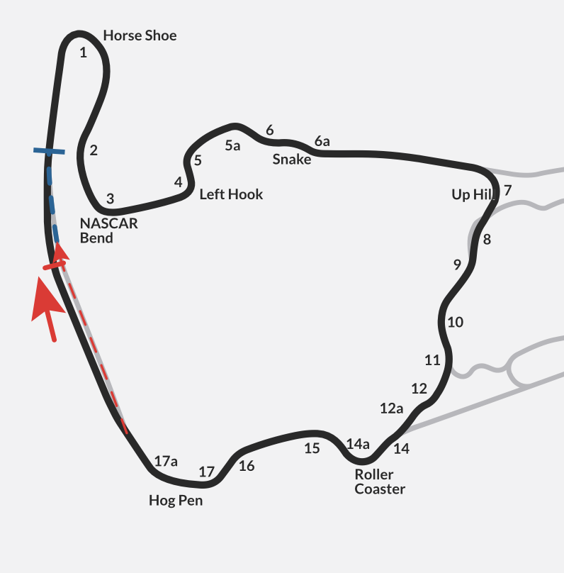

# Week 08: Virginia International Raceway - North Course

- **Track**: [Virginia International Raceway](../../tracks/track-virginia-international-raceway-north.md)  
- **Car**: [Ray FF1600](../../cars/car-ray-ff1600.md) 
- **Length**: 3.621 km (2.25 mi)  
- **Corners**: 21 (including sub-corners)  
- **Sectors**: 4  
- **Character**: High-speed trust exercise with 100+ ft elevation changes

---

## Track Character

VIR North is the "greatest hits" of Virginia International Raceway. Key corners—Horseshoe, Left Hook, Snake, Up Hill section, Roller Coaster, Hog Pen—compressed into one intense loop.

**Key challenges:**

- **Elevation as drama** — The car is constantly either digging into the hill or going light over a crest
- **Flow over fragments** — Snake into Up Hill, Roller Coaster into Hog Pen must be driven as sequences, not individual corners
- **No relax sectors** — If you're not mentally ahead of the car, the track will put you there physically
- **Old-school edges** — Grass, walls, earth banks. 1950s-era consequences for mistakes

---

## Ray FF1600 Key Corners

### Horseshoe (T1)

- Opening right-hander, sets up the whole first sector
- Gentle committed brake, long release arcing through
- Earlier steering unwound = more alive through NASCAR Bend

### NASCAR Bend (T3) + Left Hook (T4)

- Quick left-right sequence after Horseshoe
- Setup for the Snake — arrive tidy, no drama

### Snake (T5-6a)

- The signature flowing section
- Small steering, small lifts, NO heroics
- **Tiny inputs, stable throttle, REFUSE last-second corrections**
- Mid-section lift = upsets car more than controlled slide

### Up Hill / Climbing Section (T7-12)

- Uphill slalom on right side of track
- One continuous flow — pick taller gear
- Trust the grip as track loads the car going uphill
- Prepare mentally for Roller Coaster at the top

### Roller Coaster (T14) — EXPERT CORRECTED

- **CRITICAL**: Completely blind + downhill entry AND exit = no grip
- **OPPOSITE of Summit Point T5** — here you **NEED to trail brake** (otherwise car doesn't turn!)
- Reverse engineer: exit understeer → brake later + more entry speed → understeer feels less severe
- Brake **4 car lengths** before end of entry curb
- Turn in **early** (anticipate understeer)
- **Continue trail braking** through corner
- Gradual, patient throttle on exit (downhill = instant understeer if aggressive)
- Don't touch elevated green/yellow curb — stay on flat concrete

### Hog Pen (T16-T17) — EXPERT CORRECTED

**T16:**
- **Subtle throttle lift** to rotate car (don't stay flat!)
- Lift until nose points parallel to curb (far left)
- At end of painted curb: turn in + brush brakes simultaneously
- Stay in 3rd, no downshift

**T17:**
- Cut grass on inside (limit: half car beyond curb = off track)
- **Compression at apex** — use it! Full throttle AT the compression
- Let car run wide — **don't fight understeer** (kills acceleration)
- Keep steering straight, use flat concrete curb

> **Full EXPERT guide:** [Track File](../../tracks/track-virginia-international-raceway-north.md)

---

## Brake Bias Strategy (EXPERT: 55-56%)

- **EXPERT recommendation**: **55-56%** — prevents front lockups at T1 (critical)
- Start at **56%**, drop to **55%** if still locking fronts
- Same range as recent weeks (Oran Park 56%, Summit Point 56%)
- **Warning**: VIR crests punish jabby pedal work

---

## Week 08 Drill Plan

See [Track File](../../tracks/track-virginia-international-raceway-north.md) for detailed EXPERT drills.

**Quick reference:**
1. **T4 Sacrifice** → T5-T6 flat out
2. **T7 Compression** → stop trailing when grip arrives
3. **T14 Reverse Engineer** → brake later + entry speed, continue trailing
4. **T16-T17 Rotation** → throttle lift to rotate, use T17 compression

---

## Session Log

| Date | Type | PB  | Notes |
| ---- | ---- | --- | ----- |
|      |      |     |       |

---

## Key Lessons Applied from Week 07

1. ~~**No trail braking on elevation drops**~~ → **WRONG for Roller Coaster!** (downhill = NEED trail brake, opposite of Summit Point T5)
2. **Verbal self-cueing works** — try "continue trailing" or "patient throttle" at Roller Coaster
3. **Flow sessions consolidate focused practice** (Focus AM → Flow PM → Deploy)
4. **Pressure improves performance** (σ = 0.38s in SoF 2674 > 0.40s in SoF 2045)
5. **Fun despite results** ("I'm gonna die. And I love it.")
6. **NEW: T7 compression** — here "no trail braking" DOES apply (uphill compression = too much front grip)

---

## Alien Target (TBD)

Will identify comparison lap once baseline established.
