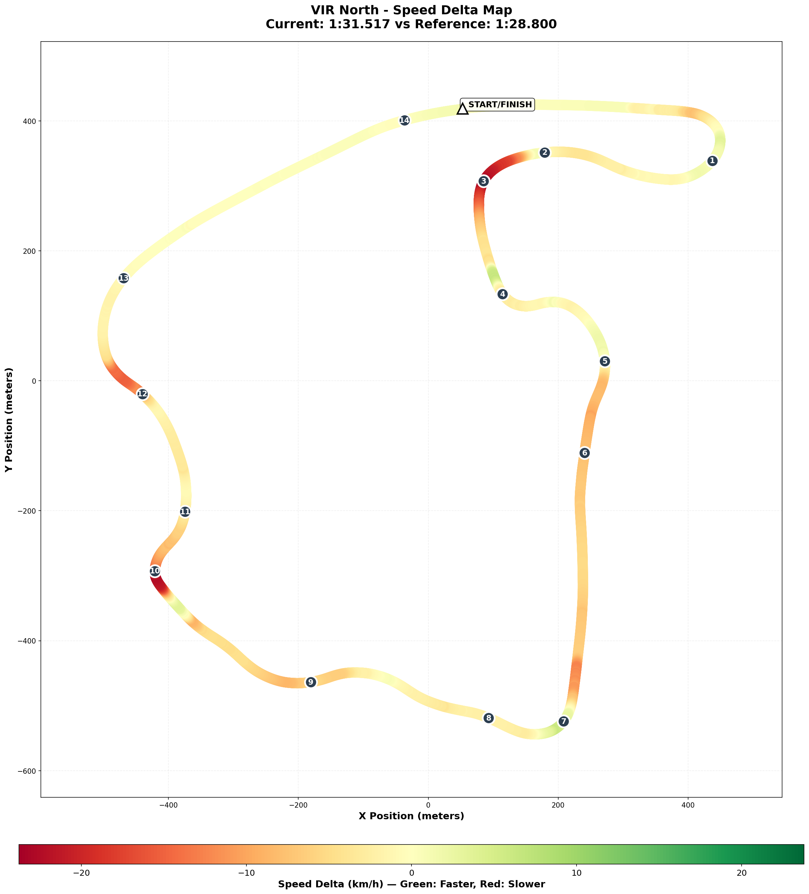

# Week 08 - Virginia International Raceway (North Course) - Season 01 2026

**Track**: Virginia International Raceway - North Course  
**Car**: Ray FF1600  
**Dates**: Jan 30 → In Progress  
**Status**: Practice (Day 2 Complete)

---

## The Story

There's a specific kind of confidence that comes from returning to familiar corners after years away. Master Lonn arrived at VIR North expecting a fight—the Full Course had been two years and 80 laps ago. Instead, he found his hands already knew the way. Fifteen of twenty-one corners clicked before he'd even started pushing. "It's flowy," he said, the car dancing through blind crests and elevation swings. "It's a dancing circuit."

Day two brought focus. He'd studied Gong's telemetry overnight, identified the two biggest time sinks: T3 NASCAR Bend and T10 Roller Coaster. He went out with specific intent—light trail braking through T2/T3, commit at the Roller Coaster with all the road on the left.

The session felt "messy." Two spectacular crashes at the Roller Coaster, the car spinning into the gravel with that particular violence only blind crests can deliver. "But I guess not..." he said afterward, assuming he'd learned nothing.

The data told a different story. **NEW PB: 1:31.433.** T2 consistency improved 32%. And those Roller Coaster laps that didn't crash? Faster than baseline. The technique was right. The crashes weren't from wrong braking—the brake point variance was only 5.3 meters. They happened mid-corner, when hesitation met physics and physics won.

Then came the insight. Reviewing telemetry, Master Lonn saw it: "T2 is a false apex. I can leave it on the left almost mid-track." The corner he'd been apexing wasn't a corner at all—just a setup kink for T3. A mental model shift worth 0.2-0.3 seconds waiting to be tested.

The Roller Coaster remains binary. Commit = 3.57s. Hesitate = 9.0s. No middle ground. The mantra for tomorrow: *"Eyes exit, commit through."*

---

## The Numbers

| Metric | Day 1 (Jan 30) | Day 2 (Jan 31) | Change | Notes |
|--------|----------------|----------------|--------|-------|
| **Best Lap** | 1:31.517 | **1:31.433** | **-0.084s** 🏆 | NEW PB |
| **Consistency (σ)** | 5.484s | 3.343s | **-39%** | Despite crashes |
| **Gap to 1:30.0** | 1.517s | 1.433s | -0.084s | Getting closer |
| **Corners Dialed** | 15/21 | 16/21 | +1 | T2 now dialed |
| **T2 σ** | 0.046s | **0.031s** | **-32%** | Focus paid off |
| **Roller Coaster Best** | 3.6s | **3.567s** | -0.033s | Faster when clean! |

**Week Stats:**
- **Sessions**: 2 (baseline + focused practice)
- **Flying Laps**: 19
- **Crashes**: 3 (1x T13, 2x Roller Coaster)
- **Breakthrough**: T2 False Apex discovery — mental model shift pending validation

---

## Session Log

| Date | Time | Type | Best Lap | σ | Result | Key Takeaway |
|:-----|:-----|:-----|:---------|:--|:-------|:-------------|
| Jan 30 | 15:02 | Baseline | 1:31.517 | 5.48s | [Report](2026-01-30-15-02-vir-baseline-practice-voice.md) | 15/21 dialed, Full Course transfer |
| Jan 31 | 08:59 | Focused | **1:31.433** | 3.34s | [Report](2026-01-31-08-59-vir-practice-02.md) | 🏆 NEW PB, T2 +32%, Roller Coaster binary |

---

## Breakthroughs 🎯

- **Full Course Memory Transfer**: 80 laps from 2 years ago = 15 corners dialed on Day 1. Muscle memory persists across years.
- **T2/T3 Technique Validated**: Pre-session Gong/EXPERT study → applied light trail braking → 32% consistency improvement measured.
- **T2 False Apex Discovery**: Post-session insight that T2 isn't a corner to apex—it's a setup kink for T3. Stay wide left. Potential 0.2-0.3s pending validation.
- **Roller Coaster = Commitment Corner**: Brake point is consistent (5.3m σ). Crashes happen mid-corner from hesitation, not wrong entry. When committed = faster than baseline.

---

## Challenges 🚧

### T10 Roller Coaster (COMMITMENT)

**The Problem**: σ = 1.996s, but brake point σ = only 5.3m. Clean laps = 3.57s. Crash laps = 9.0s. Binary outcome.

**Root Cause**: Mid-corner hesitation through blind crest → weight forward → rear light → spin.

**The Fix**: "Eyes exit, commit through." No half-measures. Once turning in, you're committed.

### Gap to 1:30.0 (1.433s)

**The Problem**: Still 1.4s away from target.

**The Path**: Roller Coaster consistency (~0.5s available) + T2 false apex line (~0.2-0.3s) + general commitment = break 1:30.0

---

## What We Learned

**Technical:**
- Brake point consistency doesn't guarantee corner consistency. Mid-corner commitment matters more.
- "False apex" corners exist—some corners shouldn't be apexed, they're setup kinks for the next corner.
- Clean Roller Coaster times (3.57s) are faster than baseline (3.6s). The technique is correct.

**Mental:**
- Spectacular crashes create FEELING of failure that hides real progress. Always validate with data.
- "Messy" sessions can produce PBs. The emotional memory of crashes overshadows factual improvement.
- Commitment corners require trust, not technique refinement. The difference is psychological.

**Strategic:**
- Pre-session telemetry study (Gong comparison) → specific technique focus → measurable improvement. This workflow works.
- Short focused stints (18 min) with clear goals > long scattered sessions.

---

## Track Character

VIR North is the "greatest hits" of Virginia International Raceway—Horseshoe, Snake, Roller Coaster, Hog Pen compressed into one intense loop.

**Key challenges:**
- **Elevation as drama** — 100+ ft changes, car constantly loading/unloading
- **Flow over fragments** — Sequences, not individual corners (T2→T3 is ONE section)
- **Blind commitment** — Roller Coaster, Hog Pen require trust
- **Old-school consequences** — 1950s edges for 2026 mistakes

---

## Alien Target

**EXPERT pace:** ~1:28.5  
**Gong comparison:** 1:28.800 (Gap: 2.633s from current PB)

| Metric | Master Lonn | Gong | Gap |
|--------|-------------|------|-----|
| Top Speed | 210.9 km/h | 210.2 km/h | ✅ Same |
| Avg Speed | 149.5 km/h | 153.0 km/h | **-3.5 km/h** |
| Full Throttle | 69.0% | 72.7% | **-3.7%** |
| Max Lat G | 2.33g | 2.57g | **-0.24g headroom** |

**Top Loss Zones:**

| Corner | Time Loss | Status |
|--------|-----------|--------|
| **T10 Roller Coaster** | -0.50s | Technique correct, commitment needed |
| **T3 NASCAR Bend** | -0.37s | ✅ Technique validated, T2 false apex discovered |
| T12b | -0.15s | Trust compression |

---

## Next Session Focus

**Target: Break 1:31.0 → then 1:30.0**

1. **T2 False Apex** — Stay wide left (almost mid-track), treat T2→T3 as one section
2. **Roller Coaster** — "Eyes exit, commit through." String 5+ clean laps.

**Combined potential**: ~0.7-0.9s = sub-1:31.0 achievable

---

## Key Insights (Week 08)

| Insight | Evidence |
|---------|----------|
| **Roller Coaster is commitment, not technique** | Brake σ = 5.3m (consistent), corner σ = 1.996s (crashes). Crashes happen mid-corner. |
| **T2 is a false apex** | Post-session discovery: stay wide left, don't apex, set up T3 instead. |
| **Feeling vs Data disconnect** | "Messy, no enhancement" feeling → actually NEW PB + 39% consistency improvement. |
| **Pre-session telemetry study works** | Gong study → T2/T3 focus → 32% σ improvement measured. |

---

_"It's flowy, it's a dancing circuit."_ — Master Lonn, 2026 🏎️💨
