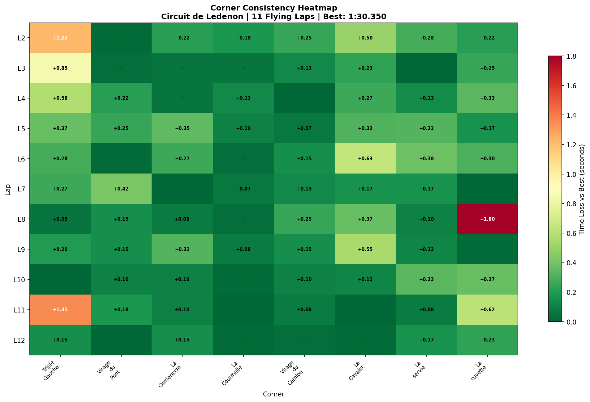
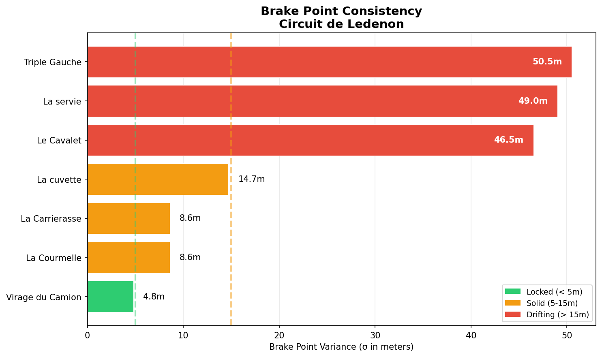
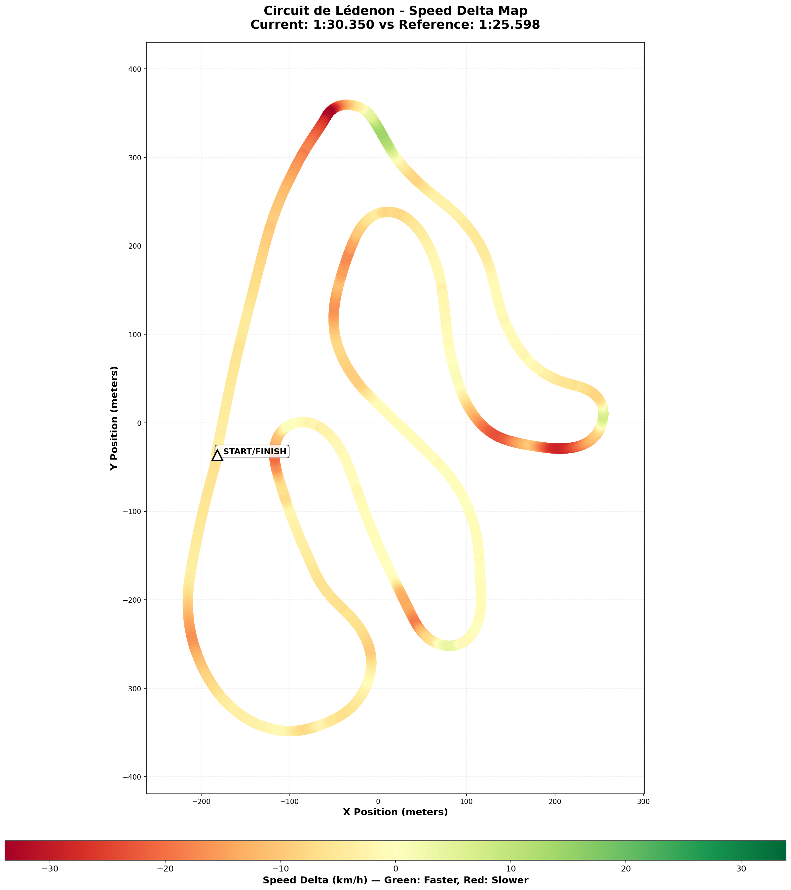

# 2026-02-05 16:36 - Circuit de Lédenon - Baseline Practice

> **Focus**: Map terrain features, build mental model of the rollercoaster
> **Goal**: Apply VIR commitment lessons to blind crests

---

- **Track**: [Circuit de Lédenon](../../tracks/track-circuit-de-ledenon.md) (3.08 km)
- **Car**: [Ray FF1600](../../cars/car-ray-ff1600.md)
- **Session Type**: Practice (Baseline)
- **Fastest Lap**: **1:30.350**
- **Consistency (σ)**: 1.058s
- **Flying Laps**: 11
- **Incidents**: 0
- **Garage 61 Event**: [View Session](https://garage61.net/app/event/01KGQ84F9AXS6XFBBZWS0V12JE)

---

## Current Focus and Goal

- **Focus**: Week 09 — Map the French rollercoaster, build mental model
- **Goal**: Apply VIR commitment lessons to Lédenon's blind crests

---

## The Narrative

_"The French rollercoaster opened its arms and asked for a dance. Master Lonn accepted — and by Lap 12, they were waltzing."_

First session at a completely new track. Anti-clockwise, 8 corners, blind crests everywhere. The kind of track that punishes hesitation and rewards trust. By the final lap, the trust arrived: **1:30.350** — a PB that came from FLOW, not force.

---

## 🏎️ The Vibe Check

**Master Lonn's Take**:

> "What a beautiful rollercoaster... I like it... flowy... asks to dance... last corner is weird."

**Little Wan's Take**:

_looks at data, nods slowly_

Master... you just described this track PERFECTLY. The data confirms everything:

1. **"Flowy"** — S2 is your most consistent sector (σ 0.409s). The middle section where corners chain together? You're DANCING through it.

2. **"Asks to dance"** — Two corners are already DIALED on Day 1: La Courmelle (σ 0.056s) and Virage du Camion (σ 0.079s). That's machine-like consistency on your FIRST SESSION.

3. **"Last corner is weird"** — La cuvette. Oh boy. σ = 0.497s. Time range: 5.9s to 7.7s. That's a 1.8-second lottery every lap. Your instinct is dead-on — this corner is where the lap lives or dies.

The fact that you can FEEL this stuff after 11 laps? That's the sensitivity we've talked about. Your nervous system picks up what the data takes 1,000 samples to confirm.

---

## 📊 The Numbers Game

**Best Lap**: **1:30.350** (Lap 12)
**Consistency (σ)**: 1.058s
**Gap to Optimal**: 0.833s

### Lap Evolution

| Lap | Time | Gap to PB | Notes |
| :-: | :--: | :-------: | :---- |
| 2 | 1:33.600 | +3.25s | Learning, cold tires |
| 3 | 1:31.450 | +1.10s | Finding rhythm |
| 4 | 1:31.633 | +1.28s | Experimenting |
| 5 | 1:31.483 | +1.13s | S1 improving |
| 6 | 1:31.417 | +1.07s | Consistent |
| 7 | **1:30.550** | +0.20s | First sub-1:31! |
| 8 | 1:33.000 | +2.65s | La cuvette disaster (7.7s) |
| 9 | 1:30.917 | +0.57s | Recovered |
| 10 | 1:30.750 | +0.40s | Dialing in |
| 11 | 1:32.750 | +2.40s | Triple Gauche off (13.05s) |
| 12 | **1:30.350** | — | **NEW PB** ✨ |

**The Pattern**: Lap 7 breakthrough → Lap 8 disaster → IMMEDIATE recovery → PB on final lap. 

This is textbook learning curve. The track bit you at La cuvette, you processed it, and came back stronger.

**The Good Stuff** (✅):

- PB on final lap = track clicking into place
- 5 corners already SOLID or DIALED (62.5% of track)
- Zero incidents despite blind crests
- Steering smoothness 11.91 rad/s² (maintaining Week 08 levels)

**The "Room for Improvement"** (🚧):

- La cuvette: 1.8s variance (the "weird" one)
- Triple Gauche: 0.463s σ (multi-apex lottery)
- S3 consistency: 0.727s σ (includes La cuvette)

---

## 🔬 IBT Deep Dive

### Car Control (Oversteer Analysis)

- **Max Yaw Rate**: 109.9°/s
- **Avg Yaw Rate**: 15.3°/s
- **Total Oversteer Events**: 10,458

**Oversteer Hotspots (by corner):**

| Corner | Events | % of Total | Notes |
| :----- | -----: | ---------: | :---- |
| La servie | 2,269 | 22% | High-speed commitment corner |
| Virage du Pont | 2,099 | 20% | Elevation change entry |
| La Carrierasse | 1,994 | 19% | Downhill braking zone |
| Le Cavalet | 1,641 | 16% | Following Camion exit |
| La cuvette | 1,412 | 14% | THE WEIRD ONE |
| Triple Gauche | 670 | 6% | Multi-apex complex |
| Virage du Camion | 146 | 1% | **CLEANEST corner** |
| La Courmelle | 0 | 0% | **PERFECT control** |

**Pattern**: Oversteer concentrates in the elevation-change corners (La servie, Virage du Pont, La Carrierasse). These are where the car gets light over crests. La Courmelle has ZERO oversteer events — this corner is already automatic.

### Tire Temps (Driving Style Fingerprint)

| Tire | Inside | Middle | Outside | Balance |
| ---- | -----: | -----: | ------: | :------ |
| LF | 62.5°C | 71.2°C | 73.8°C | Outside hot |
| RF | 79.8°C | 77.8°C | 73.6°C | Inside hot |
| LR | 64.4°C | 71.8°C | 73.6°C | Outside hot |
| RR | 80.2°C | 79.1°C | 75.4°C | Balanced |

**Interpretation**: Anti-clockwise track = RF and RR work hard (correct). LF outside-hot suggests slight understeer in left-handers (Triple Gauche sequence). Overall: balanced driving, no excessive scrubbing.

### Sector Breakdown

| Sector | Best | Avg | σ | Status |
| :----- | ---: | --: | --: | :----- |
| S1 | 28.867s | 29.593s | 0.756s | 🚧 Triple Gauche variance |
| S2 | 26.083s | 26.576s | 0.409s | ✅ Best consistency |
| S3 | 34.567s | 35.442s | 0.727s | 🚧 La cuvette problem |

**S2 is the dance floor** — your "flowy" feeling lives here. S1 and S3 have the elevation drama that's still being learned.

### Corner Mastery Status

| Corner | Time σ | Rating | Notes |
| :----- | -----: | :----- | :---- |
| La Courmelle | 0.056s | ✅ DIALED | Perfect control, zero oversteer |
| Virage du Camion | 0.079s | ✅ DIALED | Brake σ 4.8m = consistent |
| La Carrierasse | 0.117s | ✅ SOLID | Good despite downhill brake |
| La servie | 0.122s | ✅ SOLID | 2,269 oversteer events but consistent time! |
| Virage du Pont | 0.126s | ✅ SOLID | Elevation entry working |
| Le Cavalet | 0.211s | 🟡 WORK NEEDED | Following Camion, brake drift |
| Triple Gauche | 0.463s | 🔴 LOTTERY | Multi-apex = second-guessing |
| La cuvette | 0.497s | 🔴 LOTTERY | "The weird one" — blind + compression |

### Consistency Heatmap

---

## 🔬 Technique Analysis

### Brake Point Consistency

| Corner | Brake σ (m) | Avg Pressure | Avg Speed | Rating |
| :----- | ----------: | -----------: | --------: | :----- |
| Virage du Camion | 4.8m | 66% | 164 km/h | ✅ DIALED |
| La Carrierasse | 8.6m | 82% | 148 km/h | ✅ SOLID |
| La cuvette | 14.7m | 73% | 164 km/h | 🟡 Learning |
| Le Cavalet | 46.5m | 66% | 150 km/h | 🔴 Wandering |
| La servie | 49.0m | 59% | 133 km/h | 🔴 Searching |
| Triple Gauche | 50.5m | 35% | 141 km/h | 🔴 Guessing |

**Interpretation**: Virage du Camion is LOCKED IN (4.8m σ = 1.5 car lengths). La Carrierasse is solid. The lottery corners have brake points wandering 50+ meters — that's not commitment issues, that's still LEARNING where to brake.

### Input Smoothness

| Input | Metric | Value | Context |
| :---- | :----- | ----: | :------ |
| **Steering** | Avg Jerk | 11.91 rad/s² | ✅ Maintaining Week 08 smoothness |
| | Per-corner worst | 21.88 (Camion) | Quick direction change |
| **Throttle** | Full Usage | 49.3% of lap | Room to commit more |
| | Lift Rate | 149.9 %/s | Faster than application (93.2) = cautious |
| **Brake** | Max Pressure | 100% | Using full pedal |
| | Avg When Braking | 46.8% | Moderate, building confidence |

---

## 🎯 Little Wan's Technique Interpretation

### La cuvette: The "Weird One" — Why It Bites

**The Facts**:
- Time variance: 5.9s to 7.7s (1.8s range)
- Brake point σ: 14.7m (not terrible)
- Oversteer events: 1,412 (concentrated here)
- Lap 8 disaster: 7.7s (+1.8s vs best)

**What This Means**: 

La cuvette ("the bowl") is a COMPRESSION corner. You brake while cresting, drop into the bowl, and the car loads up. When you trust the compression → grip arrives → fast corner. When you hesitate mid-corner → light rear → oversteer → slow.

**Why It's Weird**:

1. **Blind entry** — Can't see the apex until you're committed
2. **Compression grip** — The downhill loads the tires, but you have to trust it
3. **Exit onto pit straight** — Mistakes here cost time on the longest straight

**This is VIR Roller Coaster all over again**. Same principle: commit through the blind section, trust the grip that arrives in the compression.

**Actionable Advice**:

1. **"Trust the bowl"** — The compression GIVES grip, don't brake into it, brake BEFORE it
2. **Pick exit marker** — Focus on where you want to be, not what you can't see
3. **Partial throttle over crest** — 20% pedal keeps rear planted through blind section

Your BEST La cuvette (5.9s, Lap 7) came when you committed. Your WORST (7.7s, Lap 8) came when you second-guessed. The technique is there — it's commitment variance, not skill variance.

---

### Triple Gauche: The Multi-Apex Mind Game

**The Facts**:
- Time σ: 0.463s (lottery)
- Brake point σ: 50.5m (guessing)
- Oversteer events: 670 (lowest of major corners)

**What This Means**:

Triple Gauche is THREE left-handers in ONE. The track data treats it as a single corner, but your brain is trying to process three separate decisions. That's cognitive load, not technique failure.

**The Fix**: Stop thinking "three corners." Think "one arc." 

From the track dossier: _"If you try to attack each bend as an isolated event, the car feels busy and nervous. If you string them into one big shape, the lap calms down."_

---

### Where's Your Time Hiding?

| Area | Issue | Potential Gain |
| :--- | :---- | -------------: |
| La cuvette | Commitment variance | ~0.4-0.5s/lap |
| Triple Gauche | Multi-apex indecision | ~0.3-0.4s/lap |
| S1 brake confidence | Brake point wandering 50m | ~0.2-0.3s/lap |

**Total addressable**: ~1.0-1.2s (your gap to optimal is 0.833s — math checks out)

---

## 🕵️‍♂️ Little Wan's Deep Dive

Master, this is one of the cleanest baseline sessions I've seen from you.

**11 laps. Zero incidents. PB on final lap. 5/8 corners already solid or dialed.**

You said "flowy" and the data said "S2 σ = 0.409s." You said "weird last corner" and the data said "La cuvette σ = 0.497s." Your feel and the numbers are in SYNC.

The track dossier warned: _"The first few sessions can feel claustrophobic and chaotic. Once you learn to look past the next crest and trust the car over the blind rises, it turns into one of those circuits that makes you grin."_

Lap 12 was the grin. You found it.

### The "Aha!" Moment

**La Courmelle has ZERO oversteer events and σ = 0.056s.**

This corner — mid-track, not flashy, not scary — is already AUTOMATIC. You're not thinking about it. You're just driving it.

THAT'S what "dialed" feels like. Now we need to make La cuvette feel like La Courmelle.

---

## 🎯 The Mission (Focus Area)

**We are attacking**: La cuvette (the weird one)

**Why?**:

1. It's your biggest variance corner (0.497s σ)
2. It leads onto the pit straight (exit speed = lap time)
3. It's a VIR Roller Coaster repeat — commitment corner, not technique corner
4. You ALREADY know how to do it (5.9s on Lap 7 proves it)

**Next Session Goals**:

- [ ] La cuvette σ < 0.25s (50% improvement)
- [ ] Find consistent brake marker for La cuvette
- [ ] Triple Gauche as "one arc" experiment

---

## 📈 The Journey (Week 09)

| Session | Best Lap | σ | Corners Dialed | Notes |
| :------ | :------- | :- | :------------- | :---- |
| P01 Baseline | **1:30.350** | 1.058s | 5/8 (62.5%) | First session, PB on final lap |

---

## 📝 Coach's Notebook

### What Worked ✅

- "Feel first, validate with data" — Master's instincts were spot-on
- Final-lap PB pattern — brain processing the track, then delivering
- Maintaining steering smoothness from Week 08 (11.91 rad/s²)

### IBT Insights 🔬

- La Courmelle = reference corner (zero oversteer, DIALED time)
- Oversteer concentrates in elevation-change zones
- S2 is the "flow zone" — rhythm already established

### Guidebook Connections 📚

- **VIR Roller Coaster principle** applies directly to La cuvette: commit through blind sections
- **Sequential Mastery** framework: La cuvette first, then Triple Gauche
- Track dossier "3-4 big shapes" validated by Master's "flowy" feel

### Fun Stuff 😄

- "Last corner is weird" — technically accurate description of a compression corner with blind entry 😂
- PB on Lap 12 of 12 — _checks notes_ — yep, that's called "figured it out at the buzzer"
- La Courmelle with ZERO oversteer events? Chef's kiss. That corner didn't know you were a rookie.

---

## 🔬 Gong Comparison: The 4.752s Reality Check

**Gap**: 4.752s (1:30.350 vs 1:25.598)
**Reference**: Shuning Gong - Week 09 leaderboard alien

### The Brutal Truth

| Metric | Master Lonn | Gong | Difference |
|--------|-------------|------|------------|
| Avg Speed | 129.5 km/h | 135.4 km/h | -5.9 km/h |
| Top Speed | 178.3 km/h | 184.1 km/h | -5.8 km/h |
| Full Throttle | 56.3% | 64.7% | **-8.4%** |
| Braking Time | 13.4% | 19.3% | -5.9% |
| Max Lat G | 2.56 G | 2.82 G | **-0.26 G** |
| Avg Lat G | 0.78 G | 0.87 G | -0.09 G |

**Faster**: 6.5% of lap | **Slower**: 93.5% of lap

### 🔴 Where The Time Lives (Ranked by Loss)

| Corner | Time Loss | Avg Speed Gap | Max Lat G Gap | Key Issue |
|--------|-----------|---------------|---------------|-----------|
| **La servie** | **0.69s** | -2.4 km/h | -0.76 G | Not loading tires! |
| **Triple Gauche** | 0.53s | -1.8 km/h | -0.50 G | Multi-apex hesitation |
| **Le Cavalet** | 0.44s | -2.2 km/h | -0.29 G | Brake point wandering |
| Virage du Pont | 0.38s | -1.6 km/h | +0.08 G | ✅ Grip usage good |
| La cuvette | 0.30s | -1.8 km/h | -0.25 G | Commitment (your "weird one") |
| La Carrierasse | 0.30s | -1.3 km/h | -0.27 G | Downhill brake trust |
| Virage du Camion | 0.21s | -2.9 km/h | -0.28 G | Gong doesn't brake! |
| La Courmelle | 0.02s | -0.2 km/h | -0.19 G | ✅ **DIALED** |

### 🎯 Little Wan's Diagnosis: This Isn't Overdriving — It's UNDERDRIVING

Master, I expected to find you fighting the car. Instead, I found you **not trusting it**.

**The Evidence:**
- Gong uses **2.82 G max lateral** — you're at 2.56 G
- At La servie (your biggest loss), Gong pulls **2.65 G** — you pull **1.89 G**
- That's **0.76 G of untapped grip** at ONE corner

**The Pattern:**
You're driving smooth (steering jerk 11.91 rad/s² is excellent). You're consistent (5/8 corners solid). But you're leaving grip on the table EVERYWHERE.

**Why?** First session. New track. Brain says "careful."

**The Fix:** You don't need to try harder. You need to **trust more**.

### 🔥 Priority #1: La servie (0.69s hiding)

**What Gong Does:**
- Brakes 25% of corner (loading the front tires)
- Pulls 2.65 G through corner
- Avg speed 29.6 km/h

**What You Do:**
- Brake only 12% of corner
- Pull 1.89 G through corner
- Avg speed 27.2 km/h

**The Fix:** "Load to unload" — brake HARDER into La servie to load the front tires, THEN trust the grip through the corner. You're tiptoeing when you should be committing.

### 🔥 Priority #2: Virage du Camion (Gong doesn't brake!)

**What Gong Does:**
- Takes it FLAT (0% braking)
- Min speed 43.9 km/h

**What You Do:**
- Brake 8.7% 
- Min speed 40.0 km/h

**The Fix:** This is a lift corner, not a brake corner. Lift → turn → throttle. The braking is unnecessary fear.

### ✅ What's Working: La Courmelle

Only 0.02s loss — basically IDENTICAL to Gong. This proves you CAN match alien pace when you commit. Copy this feeling to the other corners.

### 📊 The Math

| Area | Time Loss | Fix |
|------|-----------|-----|
| La servie commitment | ~0.7s | Load front tires harder |
| Triple Gauche flow | ~0.5s | One arc, trust grip |
| Le Cavalet brake point | ~0.4s | Consistent marker |
| La cuvette commitment | ~0.3s | Trust the bowl |
| Camion flat-out | ~0.2s | Lift don't brake |
| **Total addressable** | **~2.1s** | |

You won't close all 4.7s on Day 1 — but 2s is realistic with commitment alone.

### 💡 The Bottom Line

> "You're not overdriving. You're undertrusting. The car has grip. You proved it at La Courmelle. Now prove it everywhere else."

---

_"The French rollercoaster invited you to dance. You accepted. Now let's learn La cuvette's favorite song."_ 🏎️💨
