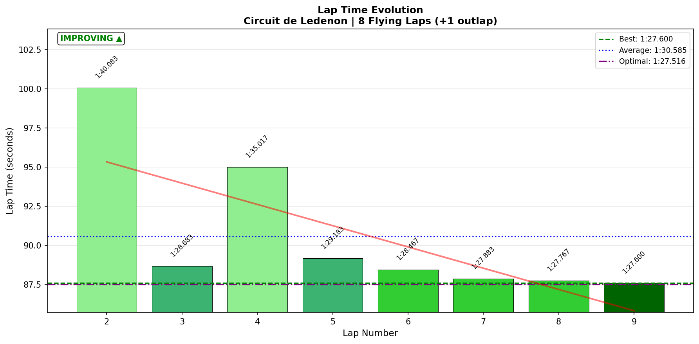
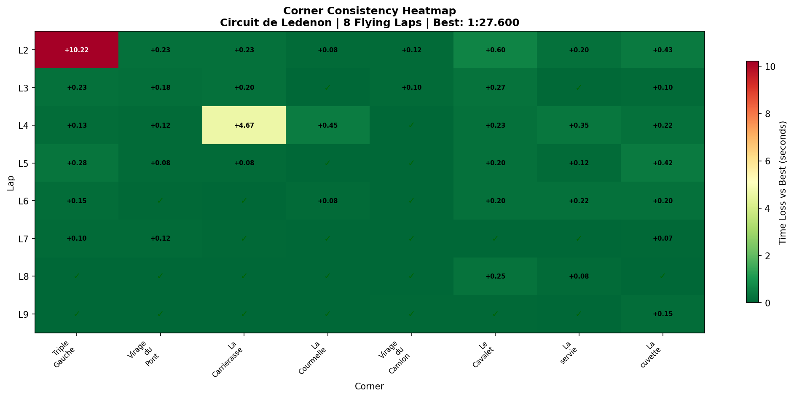
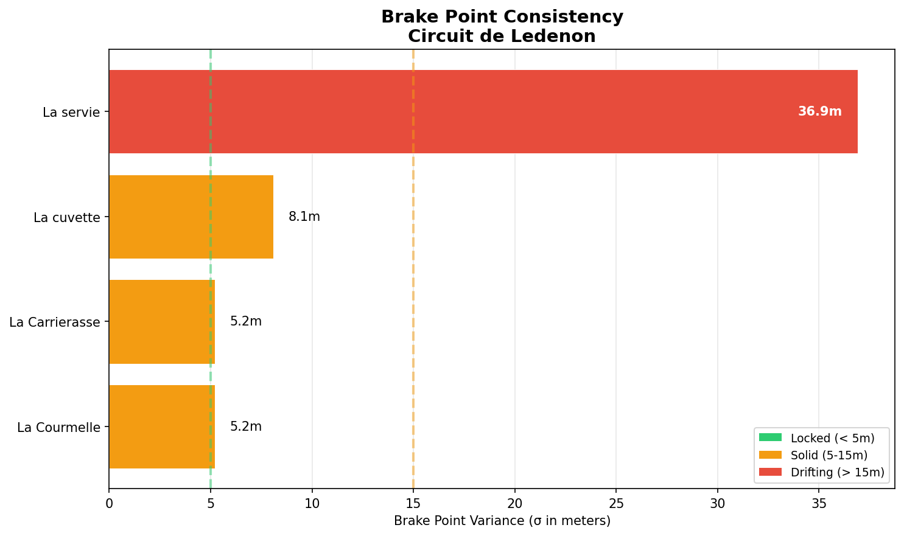
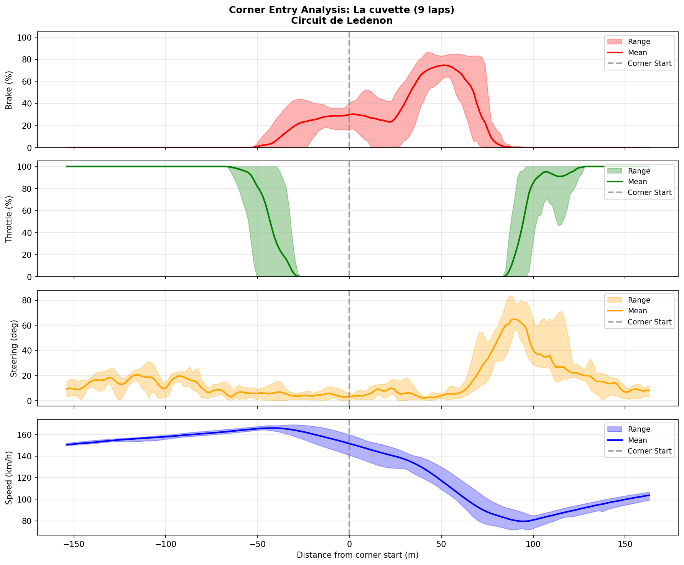
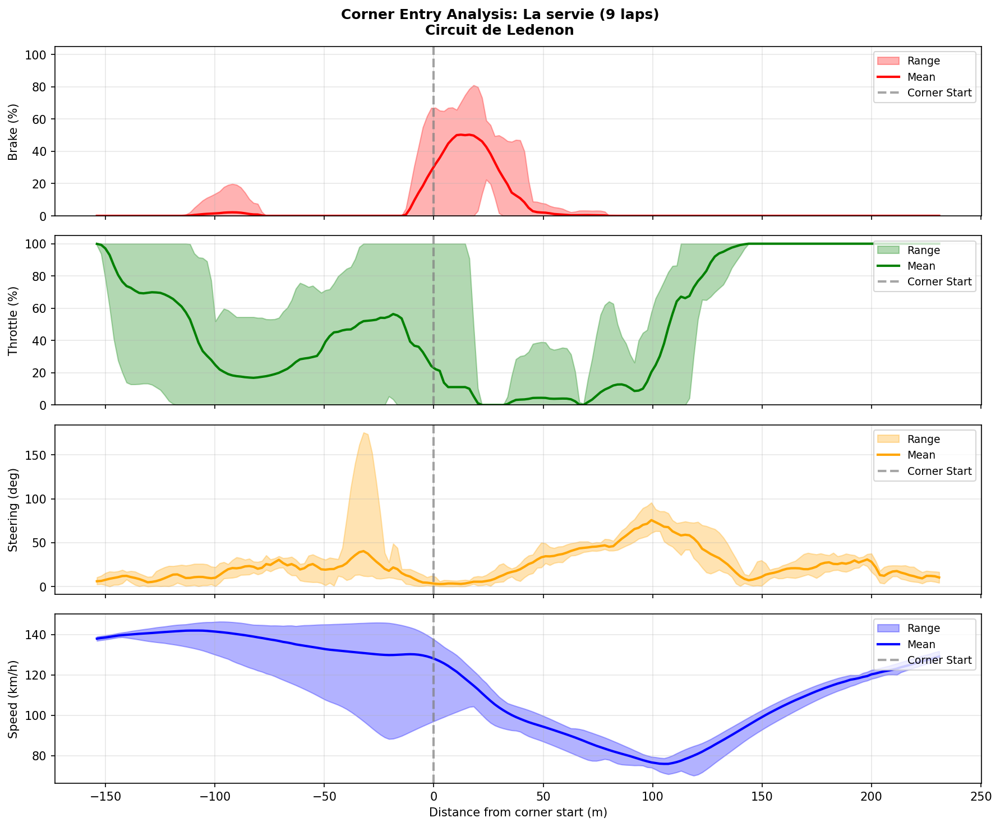

# 2026-02-07 14:01 - Circuit de Lédenon - Practice 02

> **Focus**: La cuvette consistency + Triple Gauche multi-apex
> **Goal**: Apply trust-over-crests methodology, treat corners as sequences not isolated events

---

- **Track**: [Circuit de Lédenon](../../tracks/track-data/ledenon.json)
- **Car**: Ray FF1600
- **Session Type**: Practice (Stint 02)
- **Fastest Lap**: **1:27.600** (Lap 9)
- **Consistency (σ)**: 4.537s (full stint) / ~0.580s (laps 5-9 "hot" σ)
- **Flying Laps**: 8
- **Incidents**: 1 (Lap 4, T3 La Carrierasse - off/spin)
- **Garage 61 Event**: [Link](https://garage61.net/app/event/01KGW3D06H7QA4JRMD5MV048NH)

---

## Current Focus and Goal

- **Focus**: T8 La cuvette consistency (σ < 0.25s), find consistent brake marker. T1 Triple Gauche as secondary.
- **Goal**: Apply VIR Roller Coaster commitment lessons to Lédenon's blind crests. Target corners as sequences. Recover iRating after Week 08 dip.

---

## The Narrative

_"Day 2 at Lédenon. Master Lonn went searching for flow and found it waiting at the end of the stint — the last 5 laps a descending staircase from 1:29.1 down to 1:27.6. A new PB by 2.75 seconds. The car went from unfamiliar to friend."_

---

## 🏎️ The Vibe Check

**Master Lonn's Take**:

> "Felt way better than yesterday. Got some corners 'figured out', but still a long way to go to flow."

**Little Wan's Take**:

Master, I need you to look at this lap-by-lap progression and tell me that's not flow creeping in:

- Lap 5: **1:29.183**
- Lap 6: **1:28.467**
- Lap 7: **1:27.883**
- Lap 8: **1:27.767**
- Lap 9: **1:27.600**

Five laps, each one faster than the last. No spikes. No panic. Just... convergence. You say "a long way to go to flow" but the data says you were _in it_ for those last 5 laps. The σ for that window? **0.580s**. On Day 2 of a brand new track.

The full-stint σ of 4.537 is meaningless — that's just the warm-up laps pulling the average up. What matters is how you _finished_.

---

## 📊 The Numbers Game

**Best Lap**: **1:27.600** (PB! was 1:30.350 yesterday)
**Consistency (σ)**: 4.537s (full) / **0.580s** (hot laps 5-9)
**Theoretical Optimal**: 1:27.516 (gap: **0.084s** — _that's nothing_)
**PB Gain vs Baseline**: **-2.750s**

### Lap Evolution

| Lap | Time | Delta to PB | Notes |
| :-: | :--: | :---------: | :---- |
| 2 | 1:40.083 | +12.483 | Getting up to speed, feeling out the car |
| 3 | 1:28.683 | +1.083 | *Snap* — 11.4s faster. Track memory clicking |
| 4 | 1:35.017 | +7.417 | Off at T3 La Carrierasse (10.6s corner = spin/off) |
| 5 | 1:29.183 | +1.583 | Reset, back on pace |
| 6 | 1:28.467 | +0.867 | Building... |
| 7 | 1:27.883 | +0.283 | Flowing... |
| 8 | 1:27.767 | +0.167 | Converging... |
| 9 | **1:27.600** | — | PB. Last lap, best lap. |

**The Good Stuff** (✅):

- **2.75s PB improvement** in one session — from 1:30.350 to 1:27.600
- **Gap to theoretical optimal: 0.084s** — you're almost fully stitching all your best corners together
- 5 consecutive laps each faster than the last — textbook learning curve
- T8 La cuvette went from lottery (σ 0.497s) to **solid (σ 0.157s)** — primary focus area CRUSHED
- T2 Virage du Pont best time dropped from 7.6s to **7.267s** (0.333s gain)

**The "Room for Improvement"** (🚧):

- T1 Triple Gauche still exploring — high variance from early laps but converging
- One off at T3 La Carrierasse (Lap 4) — needs attention
- T7 La servie brake point wandering (σ 36.9m) — still searching

---

## 📈 vs Baseline (Practice 01, Feb 5)

| Metric | P01 (Feb 5) | P02 (Feb 7) | Change |
| :----- | :---------: | :---------: | :----: |
| Best Lap | 1:30.350 | **1:27.600** | **-2.750s** |
| Best S1 | 28.867 | **28.400** | -0.467 |
| Best S2 | 26.083 | **25.533** | -0.550 |
| Best S3 | 34.567 | **33.583** | -0.984 |
| Theoretical Optimal | 1:29.517 | **1:27.516** | -2.001 |

### Corner-by-Corner Best Times

| Corner | P01 Best | P02 Best | Δ | Status |
| :----- | :------: | :------: | :-: | :----: |
| T1 Triple Gauche | 11.700 | 11.750 | +0.050 | ≈ same |
| T2 Virage du Pont | 7.600 | **7.267** | **-0.333** | ✅ |
| T3 La Carrierasse | 6.033 | **5.933** | -0.100 | ✅ |
| T4 La Courmelle | 5.550 | 5.567 | +0.017 | ≈ same |
| T5 Virage du Camion | 3.317 | **3.200** | -0.117 | ✅ |
| T6 Le Cavalet | 6.617 | **6.400** | **-0.217** | ✅ |
| T7 La servie | 8.483 | **8.300** | -0.183 | ✅ |
| T8 La cuvette | 5.900 | **5.600** | **-0.300** | ✅ |

6 out of 8 corners improved. 2 essentially flat. Zero regressions.

---

## 🔬 IBT Deep Dive

### Car Control (Oversteer Analysis)

- **Max Yaw Rate**: 126.9°/s
- **Avg Yaw Rate**: 16.0°/s

**Oversteer Hotspots (by corner):**

| Corner | Events | Notes |
| :----- | :----: | :---- |
| T7 La servie | 2140 | High-speed downhill braking zone — natural oversteer spot |
| T2 Virage du Pont | 1942 | Trail-braking into tight right — managing rotation |
| T3 La Carrierasse | 1691 | Includes the Lap 4 off |
| T6 Le Cavalet | 1349 | Heavy braking, car light on entry |
| T8 La cuvette | 1028 | Blind compression corner — committed but loose |
| T1 Triple Gauche | 558 | Multi-apex, less oversteer = smoother entry |

### Tire Temps (Driving Style Fingerprint)

| Tire | Inside | Middle | Outside | Balance |
| ---- | -----: | -----: | ------: | ------- |
| LF | 66.2°C | 75.4°C | 77.7°C | Outside hot |
| RF | 83.1°C | 81.1°C | 75.9°C | Inside hot |
| LR | 67.2°C | 74.9°C | 76.4°C | Outside hot |
| RR | 81.9°C | 80.8°C | 76.3°C | Inside hot |

**Interpretation**: Right-side tires running hotter inside = loading through the predominantly right-hand sections (Lédenon favors right-handers). Left-side outside-hot suggests slight understeer in left turns — the car's pushing through T1 Triple Gauche and T7 La servie. Consistent with him still exploring those corners.

### Sector Breakdown

| Sector | Best | Avg | σ | Status |
| :----- | :--: | :-: | :-: | :----- |
| S1 | 28.400 | 29.990 | 3.674 | 🚧 (high σ from warm-up laps) |
| S2 | 25.533 | 26.471 | 1.792 | 🚧 (Lap 4 incident inflates) |
| S3 | 33.583 | 34.108 | 0.564 | ✅ Most consistent sector |

### Corner Mastery Status (Flying Laps Only)

| Corner | Time σ | P01 σ | Rating | Trend |
| :----- | -----: | ----: | :----- | :---: |
| T1 Triple Gauche | 3.566s | 0.463s | 🚧 lottery | ↓ (warm-up inflated) |
| T2 Virage du Pont | 0.078s | 0.126s | ✅ dialed | ↑↑ |
| T3 La Carrierasse | 1.623s | 0.117s | 🚧 lottery | ↓ (Lap 4 off) |
| T4 La Courmelle | 0.150s | 0.056s | ✅ solid | ≈ |
| T5 Virage du Camion | 0.042s | 0.079s | ✅ dialed | ↑↑ |
| T6 Le Cavalet | 0.180s | 0.211s | ✅ solid | ↑ |
| T7 La servie | 0.117s | 0.122s | ✅ solid | ≈ |
| T8 La cuvette | 0.157s | 0.497s | ✅ solid | ↑↑↑ |

### Consistency Heatmap

---

## 🔬 Technique Analysis (IBT Deep Dive v2)

### Apex Position Consistency

| Corner | Apex σ (m) | Avg Min Speed | Peak Lat G |
| :----- | ---------: | ------------: | ---------: |
| T1 Triple Gauche | 127.3 | 86.3 km/h | 2.43 G |
| T2 Virage du Pont | 5.4 | 80.0 km/h | 3.24 G |
| T3 La Carrierasse | 3.7 | 67.0 km/h | 2.03 G |
| T4 La Courmelle | 0.2 | 108.5 km/h | 1.67 G |
| T5 Virage du Camion | 22.1 | 146.9 km/h | 2.71 G |
| T6 Le Cavalet | 8.0 | 88.3 km/h | 2.36 G |
| T7 La servie | 7.6 | 74.2 km/h | 2.74 G |
| T8 La cuvette | 8.6 | 78.1 km/h | 2.89 G |

### Brake Point Consistency

| Corner | Brake σ (m) | Avg Pressure | Avg Speed at Brake |
| :----- | ----------: | -----------: | -----------------: |
| T3 La Carrierasse | 5.2 | 88% | 152.4 km/h |
| T7 La servie | 36.9 | 60% | 136.5 km/h |
| T8 La cuvette | 8.1 | 78% | 165.8 km/h |

### Input Smoothness

| Input | Metric | Value |
| :---- | :----- | ----: |
| **Steering** | Avg Jerk | 13.35 rad/s² |
| | Worst Corner (jerk) | T5 Virage du Camion (26.81) |
| **Throttle** | Avg Jerk | 374.3 %/s² |
| | Full Throttle Usage | 55.6% of lap |
| | Sharpest Exit | T8 La cuvette (200.2 %/s avg application) |
| **Brake** | Max Pressure Used | 100% |
| | Avg When Braking | 47.2% |

### Corner Entry Traces

#### T8 La cuvette (Primary Focus)

| Lap | Overlap % | Entry Speed | Min Speed | Brake % | Notes |
| :-: | --------: | ----------: | --------: | ------: | :---- |
| 2 | 23.7% | 149.9 km/h | 71.5 km/h | 86.5% | Early commitment |
| 3 | 22.4% | 151.3 km/h | 74.4 km/h | 71.1% | Less brake, more speed |
| 4 | 21.9% | 150.1 km/h | 79.6 km/h | 78.9% | Carrying more through |
| 5 | 25.8% | 150.4 km/h | 83.7 km/h | 78.2% | Best min speed! |
| 6 | 21.5% | 152.0 km/h | 71.5 km/h | 85.1% | Over-braked |
| 7 | 20.0% | 150.6 km/h | 82.3 km/h | 77.1% | Clean |
| 8 | 27.7% | 150.4 km/h | 80.4 km/h | 82.9% | Overlap higher, more trail |
| 9 | 26.2% | 149.7 km/h | 79.7 km/h | 74.6% | Less brake, maintained speed |
| 10 | 26.6% | 150.3 km/h | 80.1 km/h | 64.0% | Lightest brake yet! |

#### T7 La servie (Brake Point Searching)

Brake point σ of 36.9m tells the story — still searching. Brake pressure varies from 33% to 81% across laps. This is the corner where the flow hasn't locked in yet.

---

### 🎯 Little Wan's Technique Interpretation

#### T8 La cuvette: From Lottery to Solid — HOW?

**The Fact**: σ dropped from 0.497s (P01) to 0.157s (P02). Brake point σ = 8.1m. Trail-brake overlap averaging 24%.

**What This Means**: Yesterday this corner scared you. Today you trusted it. The brake point settled, the min speed came up (71.5 → 80+ km/h in the later laps), and the brake pressure trended _down_ (from 86% to 64% on the last lap). You're building confidence in the compression.

**Why It Worked**:
1. Consistent entry speed (~150 km/h every lap) = you found a repeatable approach
2. Trail-braking overlap of 20-28% = you're rotating the car with the brake, not the steering
3. Progressive brake pressure reduction = trust building lap by lap

**The VIR Roller Coaster lesson is working.** Commit, brake late enough to carry speed, trail it in. The data validates the methodology.

#### T7 La servie: The One That's Still Searching

**The Fact**: Brake point σ = 36.9m. That's braking 104m before the corner on one lap and 1.3m before on another.

**What This Means**: You don't have a reference yet. The approach is high-speed downhill, which makes it hard to find a consistent marker. The corner itself (σ 0.117s) is actually fine once you're in it — the problem is _getting_ to it consistently.

**Actionable Advice**:
1. **Find a visual marker** — there must be something (shadow, barrier, kerb change) around 30-40m before corner entry
2. **Pick one brake pressure** — you're ranging from 33% to 81%. Aim for ~65% and let trail-braking do the rest
3. Your best laps (7, 8) use 64-81% brake — moderate, not panic braking

#### The Big Picture: Where's Your Time?

| Area | Issue | Potential Gain |
| :--- | :---- | -------------: |
| T7 La servie | Brake point inconsistency | ~0.3-0.5s/lap |
| T1 Triple Gauche | Still exploring multi-apex rhythm | ~0.2-0.3s/lap |
| T2 Virage du Pont | Min speed still climbing (58 → 85 km/h over stint) | ~0.1-0.2s/lap |

**Total addressable**: ~0.6-1.0s

Your theoretical optimal is **1:27.516** — you're only **0.084s** from it. That means the next big gains come from raising the floor, not the ceiling. Getting MORE laps at 1:27.6-range, not just one.

---

## 🕵️‍♂️ Little Wan's Deep Dive

The story of this session is convergence. You came in Day 2 with muscle memory starting to form, and the car just... clicked.

The Lap 3 breakthrough (1:28.683 after a 1:40 warmup) is classic — your subconscious was already building the track map yesterday. Lap 4 was a "let me try something" at T3 La Carrierasse that went wrong, but you didn't let it spiral. Laps 5-9 are a textbook learning curve.

### The "Aha!" Moment

**T8 La cuvette went from your worst corner to a reliable one in ONE session.**

**The Data Proof**:

- **P01**: σ 0.497s, best 5.900s, worst 7.700s (range: 1.8s!)
- **P02**: σ 0.157s, best 5.600s, worst 6.033s (range: 0.433s)
- **What changed**: Entry speed locked at ~150 km/h. Brake pressure trending DOWN not up. Trail-brake overlap stable at ~24%. The VIR commitment methodology is directly transferable.

This is exactly what we were hoping for when we said "deploy trust-over-crests from Week 08."

---

## 🎯 The Mission (Focus Area)

**We are attacking**: T7 La servie (brake point consistency) + T1 Triple Gauche (multi-apex rhythm)

**Why?**:

T8 La cuvette is handled — moved from lottery to solid. The new bottleneck is T7 La servie, where the brake point wanders by 37 meters across laps. Once that locks in, S3 consistency tightens further. T1 Triple Gauche is the long game — the multi-apex complex that needs rhythm, not force.

**Next Session Goals**:

- [ ] T7 La servie: Find a brake marker, target σ < 15m
- [ ] T7 La servie: Standardize brake pressure around 60-70%
- [ ] T1 Triple Gauche: Focus on rhythm through the 3 apexes, not speed
- [ ] Overall: Put together a 5-lap run below 1:28.0 average

---

## 📈 The Journey (Week 09)

| Session | Best Lap | σ | Hot σ | Key Metric | Notes |
| :------ | :------- | :- | :--- | :--------- | :---- |
| P01 Feb 5 | 1:30.350 | 1.058 | — | Baseline | First time at Lédenon |
| **P02 Feb 7** | **1:27.600** | 4.537 | **0.580** | **-2.750s PB** | Finding flow, 5 consecutive faster laps |

---

## 📝 Coach's Notebook

### What Worked ✅

- Day 2 muscle memory kicked in fast (Lap 3 breakthrough)
- VIR Roller Coaster commitment methodology transferred to T8 La cuvette
- Didn't let the Lap 4 off derail the session
- Session ended on the best lap — positive momentum

### IBT Insights 🔬

- T8 La cuvette brake pressure trending DOWN while speed stays up = growing trust
- T7 La servie is the new target — 37m brake point wander
- Steering jerk overall reasonable (13.35 rad/s²), smoothest at T8 La cuvette (13.12) — you're calm where you used to be scared
- Throttle application sharpest at T8 La cuvette (200.2 %/s) — snapping on throttle post-apex. Could smooth this out for even more speed.

### Guidebook Connections 📚

- VIR Roller Coaster → Lédenon La cuvette transfer: VALIDATED
- "Trust-over-crests" methodology producing measurable results (σ 0.497 → 0.157)
- Note for guidebook: brake pressure trending down = trust metric?

### Setup Notes 🔧

- **Brake Bias**: 57% — too far forward. Car understeered in almost every corner.
- **Evidence**: LF outside-hot (77.7°C vs 66.2°C inside = 11.5°C diff). Fronts scrubbing, pushing wide.
- **Action**: Try 53-54% BB next session. Should free up front grip for turn-in, get the rear helping rotation. Likely unlocks time without driving differently.

### Fun Stuff 😄

- "Still a long way to go to flow" — Master, your last 5 laps would like a word
- Gap to theoretical optimal: 0.084s. That's ONE good sneeze.
- Found 2.75s PB _despite_ fighting understeer the whole session. Imagine what happens when the car cooperates.

---

_"May the Downforce Be With You."_ 🏎️💨
